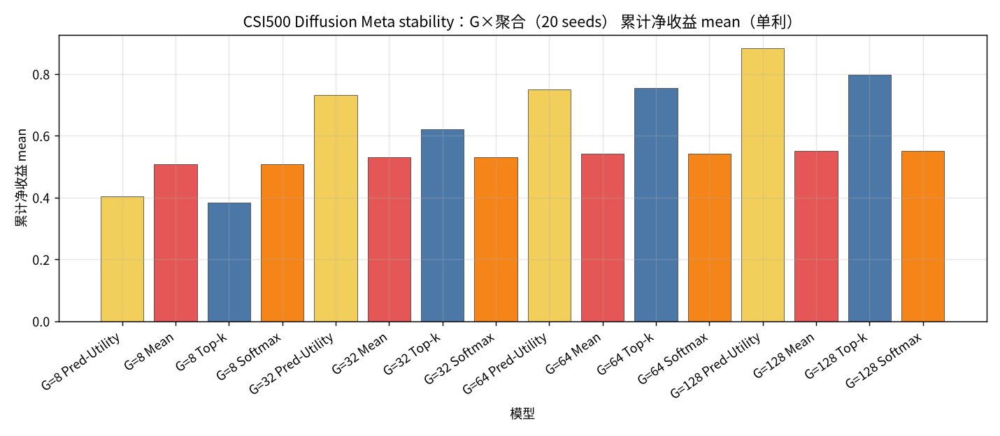
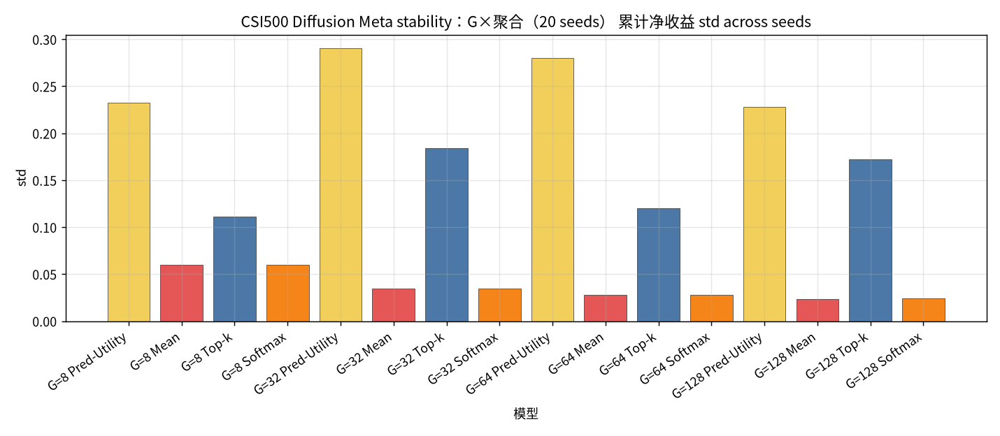
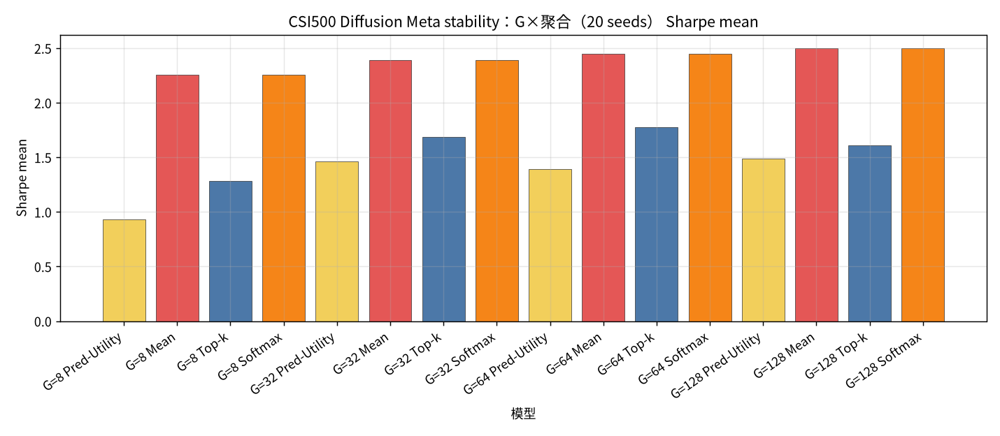
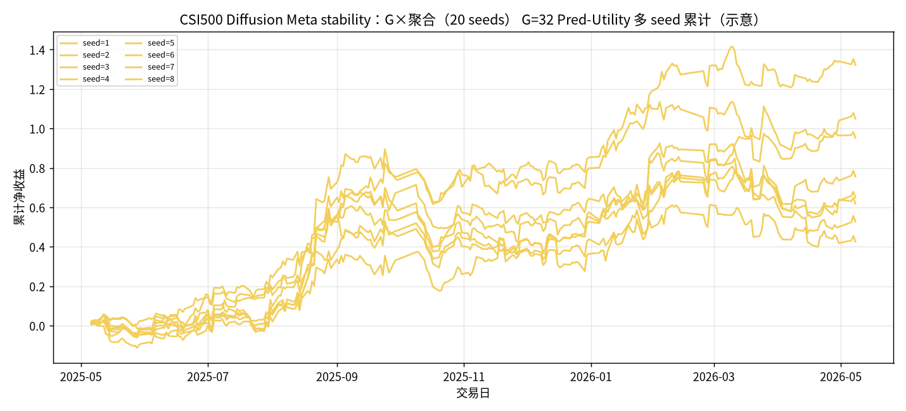

# CSI500 Diffusion Meta stability：G×聚合（20 seeds）

设定：冻结 CSI500 Top30 最新 Alpha+Diffusion（**不训练**）；**Meta 候选 = G 条 Diffusion ∪ Teacher（MVO/MaxSharpe/RP）**；**G ∈ {8, 32, 64, 128}**；**seed ∈ {1..20}**；每日 `noise = hash(date, seed)`。同 (日,G,seed) 只建一次 Meta 池，四种聚合共享。

聚合：Pred-Utility / Mean / Top-k=3 / Softmax(τ=1.0)。下表为 **across seeds 的 mean±std（单利）**。

产物：`results/CSI500/strict_fixed_oos_diff_stability_meta_seeds/`。约 **245** 日 × 20 seeds。

| G | Pred-Utility | Mean | Top-k | Softmax |
| --- | --- | --- | --- | --- |
| G=8 | 0.4039±0.2325 | 0.5085±0.0602 | 0.3826±0.1110 | 0.5086±0.0602 |
| G=32 | 0.7319±0.2903 | 0.5300±0.0345 | 0.6202±0.1842 | 0.5302±0.0345 |
| G=64 | 0.7499±0.2798 | 0.5409±0.0278 | 0.7534±0.1205 | 0.5411±0.0279 |
| G=128 | 0.8828±0.2281 | 0.5510±0.0238 | 0.7984±0.1722 | 0.5513±0.0239 |

| G | agg | n | total mean±std | min | max | sharpe mean±std | turnover mean |
| --- | --- | --- | --- | --- | --- | --- | --- |
| 8 | Pred-Utility | 20 | 0.4039±0.2325 | -0.2386 | 0.7656 | 0.9344±0.5562 | 0.7953 |
| 8 | Mean | 20 | 0.5085±0.0602 | 0.4078 | 0.6544 | 2.2592±0.2642 | 0.5110 |
| 8 | Top-k | 20 | 0.3826±0.1110 | 0.1397 | 0.5600 | 1.2864±0.3769 | 0.6609 |
| 8 | Softmax | 20 | 0.5086±0.0602 | 0.4079 | 0.6541 | 2.2587±0.2640 | 0.5110 |
| 32 | Pred-Utility | 20 | 0.7319±0.2903 | 0.0920 | 1.3225 | 1.4626±0.5755 | 0.6423 |
| 32 | Mean | 20 | 0.5300±0.0345 | 0.4598 | 0.5886 | 2.3922±0.1435 | 0.3158 |
| 32 | Top-k | 20 | 0.6202±0.1842 | 0.2848 | 0.9237 | 1.6900±0.5032 | 0.5899 |
| 32 | Softmax | 20 | 0.5302±0.0345 | 0.4597 | 0.5886 | 2.3921±0.1437 | 0.3158 |
| 64 | Pred-Utility | 20 | 0.7499±0.2798 | 0.3435 | 1.5396 | 1.3917±0.5130 | 0.5181 |
| 64 | Mean | 20 | 0.5409±0.0278 | 0.4868 | 0.6144 | 2.4479±0.1204 | 0.2400 |
| 64 | Top-k | 20 | 0.7534±0.1205 | 0.5766 | 1.0248 | 1.7774±0.3111 | 0.5181 |
| 64 | Softmax | 20 | 0.5411±0.0279 | 0.4869 | 0.6145 | 2.4481±0.1205 | 0.2400 |
| 128 | Pred-Utility | 20 | 0.8828±0.2281 | 0.3608 | 1.3845 | 1.4872±0.3641 | 0.3811 |
| 128 | Mean | 20 | 0.5510±0.0238 | 0.4996 | 0.5907 | 2.4985±0.1094 | 0.1864 |
| 128 | Top-k | 20 | 0.7984±0.1722 | 0.4596 | 1.1033 | 1.6129±0.3512 | 0.4244 |
| 128 | Softmax | 20 | 0.5513±0.0239 | 0.4997 | 0.5910 | 2.4986±0.1095 | 0.1863 |

### 累计净收益 mean

### 累计净收益 std

### Sharpe mean

### G=32 Pred-Utility 多seed累计

### 结论

- across-seed 均值最高：`G=128 Pred-Utility` = `0.8828±0.2281`（range [0.3608, 1.3845]）。
