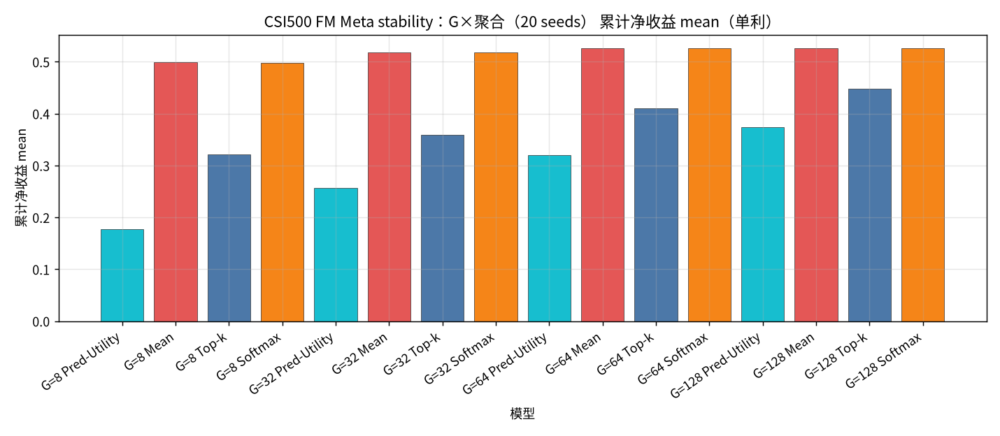
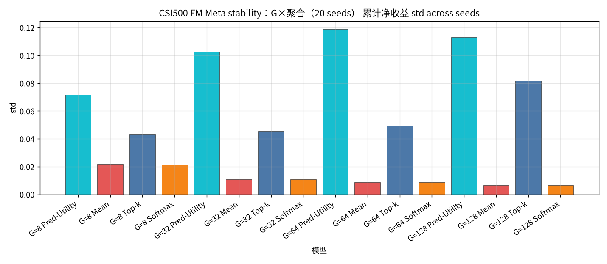
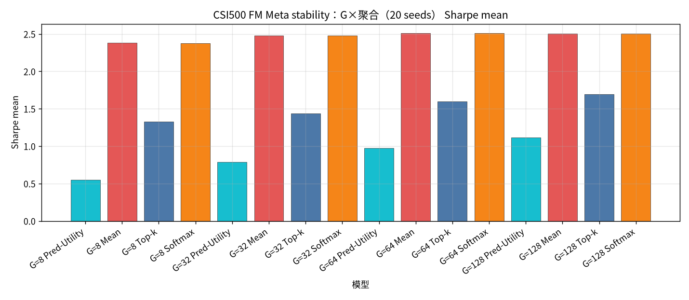
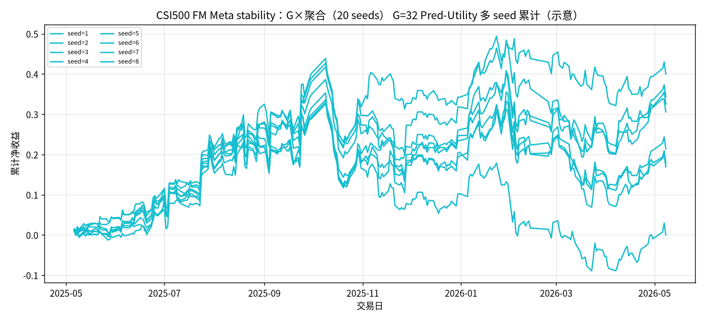

# CSI500 FM Meta stability：G×聚合（20 seeds）

设定：冻结 CSI500 Top30 最新 Alpha+FM（**不训练**）；**Meta 候选 = G 条 FM ∪ Teacher（MVO/MaxSharpe/RP）**；**G ∈ {8, 32, 64, 128}**；**seed ∈ {1..20}**；每日 `noise = hash(date, seed)`。同 (日,G,seed) 只建一次 Meta 池，四种聚合共享。

聚合：Pred-Utility / Mean / Top-k=3 / Softmax(τ=1.0)。下表为 **across seeds 的 mean±std（单利）**。

产物：`results/CSI500/strict_fixed_oos_fm_stability_meta_seeds/`。约 **245** 日 × 20 seeds。

| G | Pred-Utility | Mean | Top-k | Softmax |
| --- | --- | --- | --- | --- |
| G=8 | 0.1772±0.0718 | 0.4987±0.0216 | 0.3211±0.0434 | 0.4985±0.0216 |
| G=32 | 0.2570±0.1027 | 0.5184±0.0110 | 0.3597±0.0456 | 0.5183±0.0110 |
| G=64 | 0.3194±0.1188 | 0.5259±0.0087 | 0.4098±0.0491 | 0.5259±0.0087 |
| G=128 | 0.3735±0.1131 | 0.5257±0.0065 | 0.4478±0.0818 | 0.5257±0.0065 |

| G | agg | n | total mean±std | min | max | sharpe mean±std | turnover mean |
| --- | --- | --- | --- | --- | --- | --- | --- |
| 8 | Pred-Utility | 20 | 0.1772±0.0718 | 0.0365 | 0.2933 | 0.5523±0.2273 | 0.7126 |
| 8 | Mean | 20 | 0.4987±0.0216 | 0.4602 | 0.5349 | 2.3793±0.1007 | 0.3225 |
| 8 | Top-k | 20 | 0.3211±0.0434 | 0.2458 | 0.3922 | 1.3292±0.1702 | 0.4742 |
| 8 | Softmax | 20 | 0.4985±0.0216 | 0.4600 | 0.5347 | 2.3780±0.1006 | 0.3225 |
| 32 | Pred-Utility | 20 | 0.2570±0.1027 | -0.0001 | 0.4000 | 0.7886±0.3177 | 0.6695 |
| 32 | Mean | 20 | 0.5184±0.0110 | 0.4941 | 0.5374 | 2.4795±0.0536 | 0.1750 |
| 32 | Top-k | 20 | 0.3597±0.0456 | 0.2773 | 0.4309 | 1.4362±0.1839 | 0.4548 |
| 32 | Softmax | 20 | 0.5183±0.0110 | 0.4940 | 0.5374 | 2.4792±0.0536 | 0.1750 |
| 64 | Pred-Utility | 20 | 0.3194±0.1188 | 0.1050 | 0.5148 | 0.9769±0.3714 | 0.6452 |
| 64 | Mean | 20 | 0.5259±0.0087 | 0.5140 | 0.5483 | 2.5092±0.0434 | 0.1345 |
| 64 | Top-k | 20 | 0.4098±0.0491 | 0.3321 | 0.5144 | 1.6005±0.1967 | 0.4391 |
| 64 | Softmax | 20 | 0.5259±0.0087 | 0.5140 | 0.5483 | 2.5090±0.0434 | 0.1345 |
| 128 | Pred-Utility | 20 | 0.3735±0.1131 | 0.1148 | 0.5663 | 1.1175±0.3404 | 0.6233 |
| 128 | Mean | 20 | 0.5257±0.0065 | 0.5140 | 0.5433 | 2.5016±0.0290 | 0.1103 |
| 128 | Top-k | 20 | 0.4478±0.0818 | 0.2714 | 0.6559 | 1.6947±0.3004 | 0.4262 |
| 128 | Softmax | 20 | 0.5257±0.0065 | 0.5140 | 0.5434 | 2.5016±0.0290 | 0.1103 |

### 累计净收益 mean

### 累计净收益 std

### Sharpe mean

### G=32 Pred-Utility 多seed累计

### 结论

- across-seed 均值最高：`G=64 Mean` = `0.5259±0.0087`（range [0.5140, 0.5483]）。
