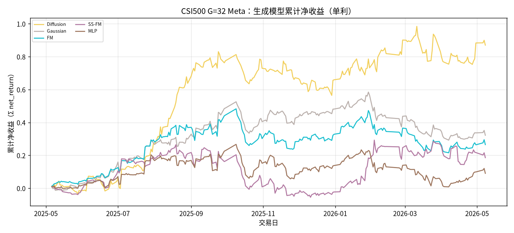
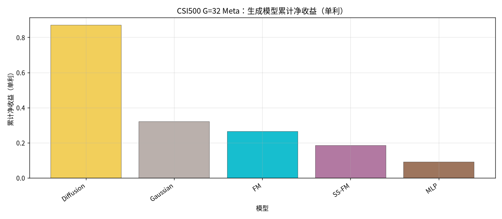
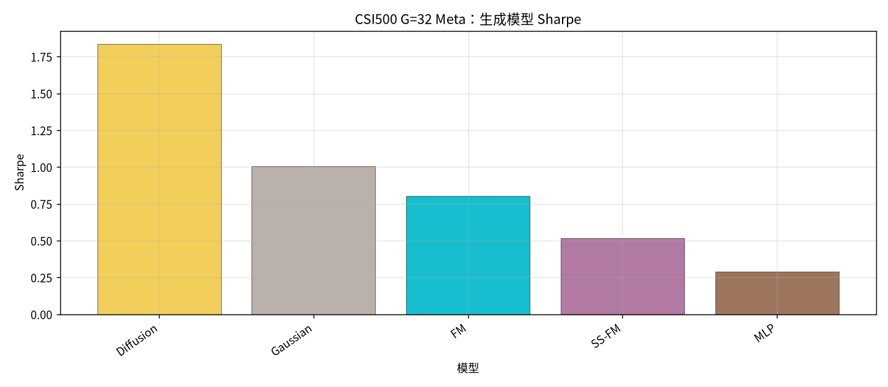
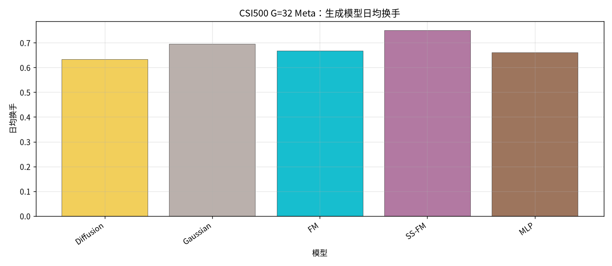
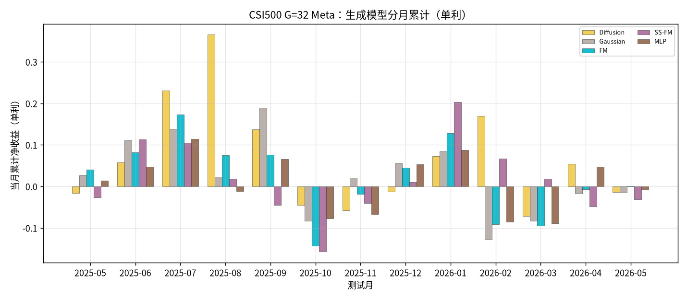

# CSI500：G=32 Meta 生成模型对比

设定：冻结 Alpha + 各生成 checkpoint；配权 **Top30**；**G=32**；
**Meta** = G 条生成样本 ∪ Teacher（MVO / MaxSharpe / RiskParity）→ `pred_utility`。
收益口径：**单利 Σ**；拼接 OOS 2025-05…2026-05，**245** 日。

产物：`results/CSI500/strict_fixed_oos_g32_meta/`

## 全年对照（按单利排序）

| rank | model | total | sharpe | mdd | turnover | n_days | vs SS-FM |
| --- | --- | --- | --- | --- | --- | --- | --- |
| 1 | Diffusion G=32 Meta | 0.8701 | 1.8340 | 0.2480 | 0.6335 | 245 | +0.6842 |
| 2 | Gaussian G=32 Meta | 0.3220 | 1.0075 | 0.2641 | 0.6953 | 245 | +0.1361 |
| 3 | FM G=32 Meta | 0.2652 | 0.8037 | 0.2565 | 0.6673 | 245 | +0.0793 |
| 4 | SS-FM G=32 Meta | 0.1859 | 0.5164 | 0.2922 | 0.7499 | 245 | +0.0000 |
| 5 | MLP G=32 Meta | 0.0906 | 0.2888 | 0.2478 | 0.6611 | 245 | -0.0954 |

## 分月累计（单利）

| month | Diffusion | Gaussian | FM | SS-FM | MLP |
| --- | --- | --- | --- | --- | --- |
| 2025-05 | -0.0165 | 0.0269 | 0.0399 | -0.0264 | 0.0137 |
| 2025-06 | 0.0578 | 0.1106 | 0.0814 | 0.1128 | 0.0476 |
| 2025-07 | 0.2312 | 0.1385 | 0.1728 | 0.1051 | 0.1140 |
| 2025-08 | 0.3655 | 0.0228 | 0.0750 | 0.0186 | -0.0117 |
| 2025-09 | 0.1370 | 0.1889 | 0.0759 | -0.0444 | 0.0652 |
| 2025-10 | -0.0455 | -0.0828 | -0.1432 | -0.1574 | -0.0770 |
| 2025-11 | -0.0576 | 0.0210 | -0.0186 | -0.0409 | -0.0675 |
| 2025-12 | -0.0124 | 0.0553 | 0.0451 | 0.0099 | 0.0537 |
| 2026-01 | 0.0726 | 0.0843 | 0.1286 | 0.2029 | 0.0874 |
| 2026-02 | 0.1691 | -0.1281 | -0.0911 | 0.0666 | -0.0859 |
| 2026-03 | -0.0717 | -0.0834 | -0.0946 | 0.0181 | -0.0883 |
| 2026-04 | 0.0539 | -0.0177 | -0.0072 | -0.0481 | 0.0478 |
| 2026-05 | -0.0133 | -0.0146 | 0.0012 | -0.0310 | -0.0084 |

### 累计净值

### 累计净收益柱

### Sharpe

### 换手

### 分月

## 结论

- 单利排序：Diffusion `0.8701` > Gaussian `0.3220` > FM `0.2652` > SS-FM `0.1859` > MLP `0.0906`。
- **SS-FM G=32 Meta** = `0.1859` / Sharpe `0.5164`；在生成族中排第 **4**。
- 生成族最优：**Diffusion** `0.8701`，相对 SS-FM Δ=`+0.6842`。
- 同口径下 SS-FM 并不领先；Diffusion 显著高于其余生成模型。
