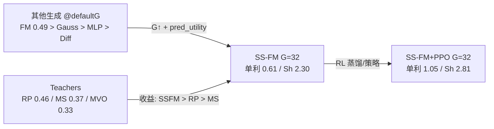

# CSI500 G=32：SS-FM 与生成模型 / Teacher / RL 的关系

- **市场**：CSI500 Top30；**固定 checkpoint**（不重训 Alpha / 生成 / Teacher）。
- **口径**：全年 OOS **单利 Σ**（`Σ net_return`），245 日（2025-05…2026-05）。
- **选仓（现成结果）**：生成模型为采 G 条后 `pred_utility`（**尚未**做 Meta＝样本∪Teacher 再选）；Teacher 为闭式解并排对照。
- **Meta 复评**：脚本 `experiments/rerun_csi500_g32_meta.py` → `results/CSI500/strict_fixed_oos_g32_meta/`（等 SP500 稳定性任务释放 GPU 后跑）。
- 表：`strict_fixed_oos/analysis/全年总览/tables/g32_ssfm_relations_simple.csv`。

> 注意：部分旧表把 **复利** `(∏(1+r)−1)` 写成 total（如 SS-FM G=32 复利 0.771）；下表统一 **单利 0.608**。

---

## A. SS-FM vs 其他生成模型

| model | total（单利） | Sharpe | MDD | turnover |
| --- | ---: | ---: | ---: | ---: |
| MLP (default G) | 0.366 | 1.85 | 0.142 | 0.356 |
| Gaussian (default G) | 0.405 | 1.70 | 0.166 | 0.551 |
| FM (default G) | 0.490 | 2.15 | 0.143 | 0.493 |
| Diffusion (default G) | 0.319 | 1.10 | 0.131 | 0.736 |
| SS-FM (default G) | 0.374 | 1.33 | 0.152 | 0.668 |
| **SS-FM G=32** | **0.608** | **2.30** | **0.109** | 0.649 |
| FM G=32 | 0.370 | 1.52 | 0.153 | 0.499 |

**关系要点**

- 默认 G 下 FM（0.49）> Gaussian ≈ SS-FM ≈ MLP > Diffusion；**Pure SS-FM 并不自然领先**。
- 把 SS-FM 提到 **G=32** 后单利跳到 **0.608**、Sharpe **2.30**，同 G 的 FM（0.37）被明显拉开 → CSI 上 SS-FM 的优势主要来自 **更大候选集 + 选仓**，而非默认 G 的分布质量 alone。
- FM 的 G 网格不稳定（G=16 复跑更高、G=32 反而低），SS-FM 在 G=32 附近更稳、更强。

图（既有）：`strict_fixed_oos/analysis/全年总览/figures/fm_vs_ssfm_g_cumulative_return.png`

---

## B. SS-FM vs Teacher

| model | total（单利） | Sharpe | MDD | turnover |
| --- | ---: | ---: | ---: | ---: |
| MVO | 0.326 | 0.87 | 0.311 | 0.935 |
| MaxSharpe | 0.369 | 1.19 | 0.220 | 0.917 |
| RiskParity | 0.459 | **2.39** | 0.129 | **0.055** |
| **SS-FM G=32** | **0.608** | 2.30 | **0.109** | 0.649 |
| FM G=32 | 0.370 | 1.52 | 0.153 | 0.499 |

**关系要点**

- **收益**：SS-FM G=32（0.61）> RiskParity（0.46）> MaxSharpe ≈ FM G=32 > MVO。
- **风险/换手**：RiskParity Sharpe 略高（2.39 vs 2.30），换手极低（0.055 vs 0.65）；SS-FM 用更高换手换取更高累计收益与更低 MDD（0.109 vs RP 0.129）。
- Teacher 是确定性优化；SS-FM 是条件生成 + 选仓。二者互补：RP 稳、SS-FM 进攻。

图：`…/figures/teacher_vs_gen_g32_cumulative_return.png`

---

## C. SS-FM vs RL

| model | total（单利） | Sharpe | MDD | turnover |
| --- | ---: | ---: | ---: | ---: |
| Pure SS-FM G=32 | 0.608 | 2.30 | 0.109 | 0.649 |
| SS-FM+GRPO (init) | 0.678 | 2.36 | 0.138 | 0.274 |
| SS-FM+GRPO | 0.717 | 2.45 | 0.118 | 0.263 |
| SS-FM+PPO (cand) | 0.887 | 2.14 | 0.207 | 0.214 |
| **SS-FM+PPO** | **1.051** | **2.81** | 0.110 | 0.259 |

**关系要点**

- CSI 上 RL **全面抬升** Pure SS-FM：PPO（旧）单利 **+73%**（0.61→1.05），换手降至约 **0.26**。
- 消融：cand-PPO（0.89）仍明显优于 Pure；SSFM-init GRPO（0.68）弱于旧 GRPO（0.72），但仍优于 Pure。
- 与 SP500（Meta 常胜、RL 易伤收益）不同：**CSI 的 RL 是明确增益**，且换手约束有效。

图：`…/figures/rl_g32_vs_pure_cumulative_return.png`

---

## 总览关系（一张图）

| 对比轴 | 结论（CSI500，冻结 ckpt，单利） |
| --- | --- |
| vs 生成模型 | SS-FM 需 **G=32** 才显著赢；默认 G 不如 FM |
| vs Teacher | SS-FM **收益/回撤** 优于 RP；RP **换手/Sharpe** 更稳 |
| vs RL | PPO/GRPO **显著增强** Pure，并大幅降换手 |

---

## Meta 缺口

当前上表 **不是** Meta（候选集不含 Teacher）。Meta 复评启动后会更新 `CSI500_G32_Meta关系对比.md`，并把 Teacher 纳入每日候选再 `pred_utility`。
