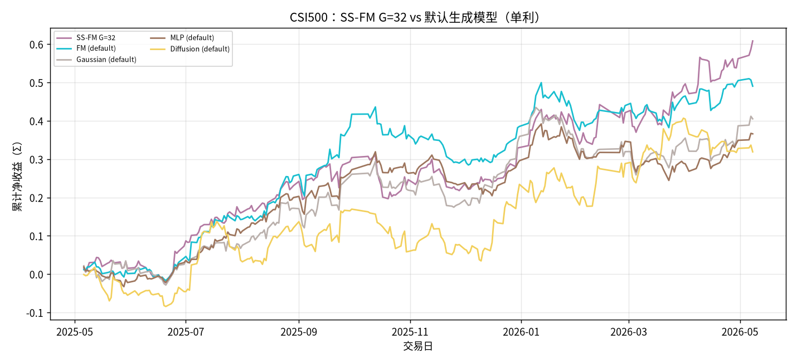
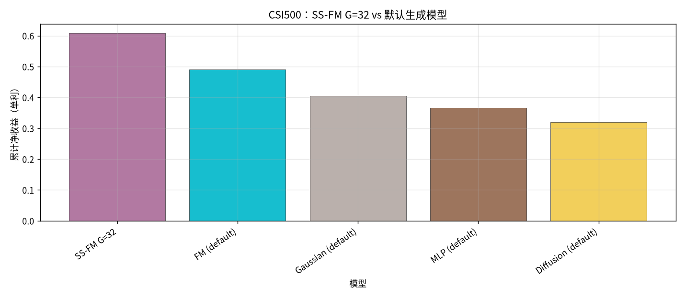
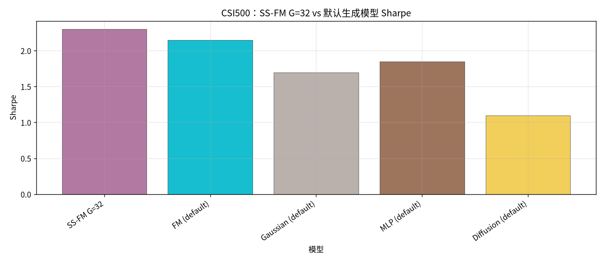
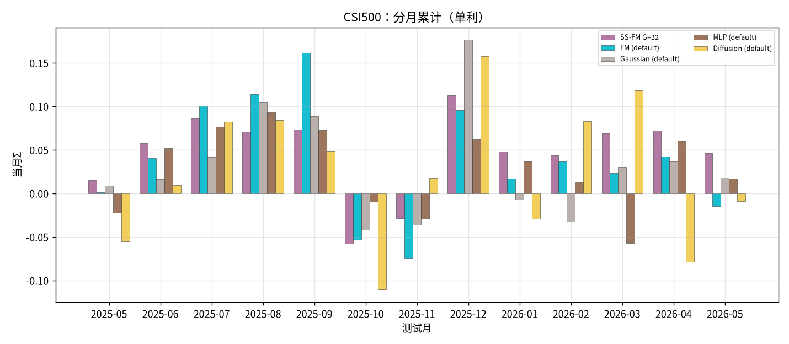

# CSI500：SS-FM G=32 vs 默认参数生成模型

设定：冻结 Alpha + 各生成 checkpoint；配权 **Top30**；拼接 OOS 2025-05…2026-05，**245** 日；收益 **单利 Σ**。

- **SS-FM**：固定 **G=32**，每日采 G 条后 `pred_utility` 选仓（**不含 Teacher Meta**）
- **其他生成模型**：正本**默认参数**（默认 G，非 Meta，`pred_utility`）

产物：`results/CSI500/strict_fixed_oos_ssfm_g32_vs_default_gens/`

## 全年对照（按单利排序）

| rank | model | total | sharpe | mdd | turnover | n_days | vs SS-FM G=32 |
| --- | --- | --- | --- | --- | --- | --- | --- |
| 1 | SS-FM G=32 | 0.6084 | 2.2998 | 0.1091 | 0.6492 | 245 | +0.0000 |
| 2 | FM (default) | 0.4903 | 2.1480 | 0.1434 | 0.4930 | 245 | -0.1180 |
| 3 | Gaussian (default) | 0.4051 | 1.6954 | 0.1663 | 0.5513 | 245 | -0.2033 |
| 4 | MLP (default) | 0.3660 | 1.8503 | 0.1422 | 0.3555 | 245 | -0.2423 |
| 5 | Diffusion (default) | 0.3189 | 1.0955 | 0.1310 | 0.7365 | 245 | -0.2894 |

### 累计净值

### 累计净收益柱

### Sharpe

### 分月

## 结论

- 单利排序：SS-FM G=32 `0.6084` > FM (default) `0.4903` > Gaussian (default) `0.4051` > MLP (default) `0.3660` > Diffusion (default) `0.3189`。
- **SS-FM G=32** = `0.6084` / Sharpe `2.2998`，对照集第 **1**，相对次优 FM (default) Δ=`+0.1180`。
- 相对「SS-FM G=32 Meta vs 默认生成」：去掉 Meta 后 SS-FM@32 显著领先默认生成族。
