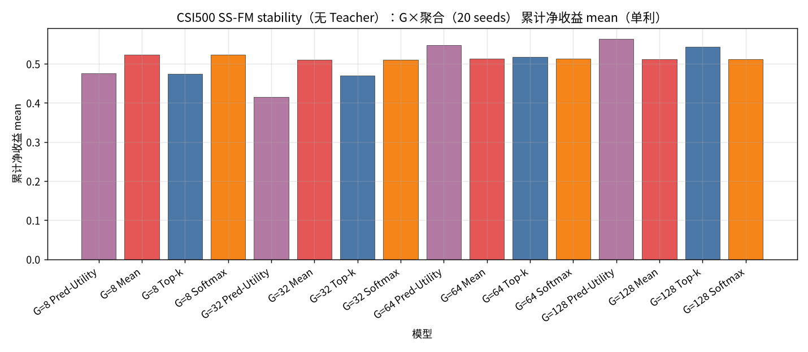
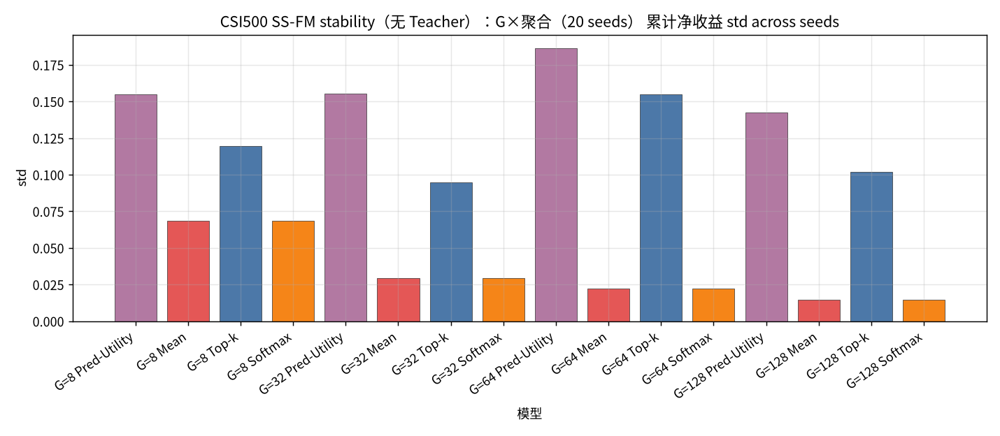
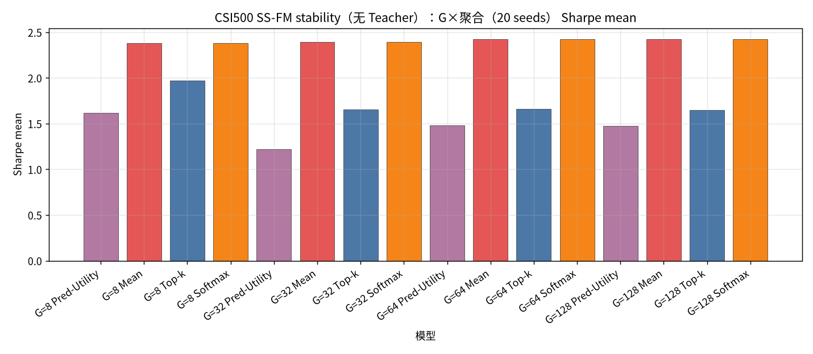
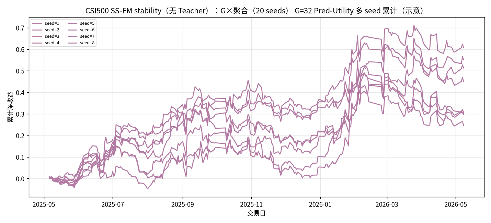

# CSI500 SS-FM stability（无 Teacher）：G×聚合（20 seeds）

设定：冻结 CSI500 Top30 最新 Alpha+SS-FM（**不训练**）；**候选 = G 条 SS-FM（不含 Teacher）**；**G ∈ {8, 32, 64, 128}**；**seed ∈ {1..20}**；每日 `noise = hash(date, seed)`。同 (日,G,seed) 只建一次样本池，四种聚合共享。

聚合：Pred-Utility / Mean / Top-k=3 / Softmax(τ=1.0)。下表为 **across seeds 的 mean±std（单利）**。

产物：`results/CSI500/strict_fixed_oos_ssfm_stability_seeds/`。约 **245** 日 × 20 seeds。

| G | Pred-Utility | Mean | Top-k | Softmax |
| --- | --- | --- | --- | --- |
| G=8 | 0.4750±0.1549 | 0.5231±0.0684 | 0.4745±0.1196 | 0.5231±0.0685 |
| G=32 | 0.4156±0.1553 | 0.5103±0.0293 | 0.4693±0.0947 | 0.5103±0.0293 |
| G=64 | 0.5478±0.1862 | 0.5134±0.0223 | 0.5174±0.1547 | 0.5134±0.0222 |
| G=128 | 0.5634±0.1426 | 0.5122±0.0147 | 0.5437±0.1018 | 0.5122±0.0147 |

| G | agg | n | total mean±std | min | max | sharpe mean±std | turnover mean |
| --- | --- | --- | --- | --- | --- | --- | --- |
| 8 | Pred-Utility | 20 | 0.4750±0.1549 | 0.1137 | 0.7991 | 1.6195±0.5505 | 0.6957 |
| 8 | Mean | 20 | 0.5231±0.0684 | 0.4120 | 0.6470 | 2.3824±0.2987 | 0.5132 |
| 8 | Top-k | 20 | 0.4745±0.1196 | 0.2647 | 0.8065 | 1.9725±0.4797 | 0.5620 |
| 8 | Softmax | 20 | 0.5231±0.0685 | 0.4120 | 0.6471 | 2.3821±0.2987 | 0.5131 |
| 32 | Pred-Utility | 20 | 0.4156±0.1553 | 0.1921 | 0.7963 | 1.2189±0.4313 | 0.6866 |
| 32 | Mean | 20 | 0.5103±0.0293 | 0.4561 | 0.5803 | 2.3938±0.1417 | 0.4634 |
| 32 | Top-k | 20 | 0.4693±0.0947 | 0.3232 | 0.6885 | 1.6557±0.3225 | 0.5810 |
| 32 | Softmax | 20 | 0.5103±0.0293 | 0.4564 | 0.5803 | 2.3936±0.1417 | 0.4633 |
| 64 | Pred-Utility | 20 | 0.5478±0.1862 | 0.2065 | 0.9477 | 1.4816±0.4636 | 0.6632 |
| 64 | Mean | 20 | 0.5134±0.0223 | 0.4703 | 0.5663 | 2.4216±0.1120 | 0.4530 |
| 64 | Top-k | 20 | 0.5174±0.1547 | 0.2560 | 0.8611 | 1.6624±0.4684 | 0.5782 |
| 64 | Softmax | 20 | 0.5134±0.0222 | 0.4706 | 0.5664 | 2.4215±0.1118 | 0.4530 |
| 128 | Pred-Utility | 20 | 0.5634±0.1426 | 0.2566 | 0.7675 | 1.4751±0.3672 | 0.6322 |
| 128 | Mean | 20 | 0.5122±0.0147 | 0.4824 | 0.5370 | 2.4234±0.0701 | 0.4444 |
| 128 | Top-k | 20 | 0.5437±0.1018 | 0.3659 | 0.7169 | 1.6477±0.3104 | 0.5683 |
| 128 | Softmax | 20 | 0.5122±0.0147 | 0.4824 | 0.5371 | 2.4232±0.0700 | 0.4444 |

### 累计净收益 mean

### 累计净收益 std

### Sharpe mean

### G=32 Pred-Utility 多seed累计

### 结论

- across-seed 均值最高：`G=128 Pred-Utility` = `0.5634±0.1426`（range [0.2566, 0.7675]）。
