# 全年总览：CSI500 2025-05 至 2026-05

- 状态: **13 个测试月均已写入**
- 编号: `全年总览`
- 类型: 全年总览
- 说明: 13 个测试月拼接：冻结复用 ablation `transformer_gated_residual_auction`（含 9 维集合竞价）→ Top30 配权 → 生成模型 MLP / Gaussian / FM / Diffusion / SS-FM → SS-FM+PPO/GRPO；Teacher=MVO/MaxSharpe/RiskParity（Kelly 仅 baseline）；G∈{8,16,32,64,128}。strict_fixed_oos。
- 缺测一律 `-`。曲线颜色见下表，中途不改色。

## 固定颜色

| 模型 | 颜色 |
| --- | --- |
| gen_mlp | #9D755D |
| gen_gaussian | #BAB0AC |
| gen_standard_fm | #17BECF |
| gen_diffusion | #F2CF5B |
| gen_ssfm | #B279A2 |
| baseline_mvo         | #F58518 |
| baseline_max_sharpe  | #E45756 |
| baseline_risk_parity | #72B7B2 |
| rl_ssfm_ppo | #E45756 |
| rl_ssfm_grpo | #4C78A8 |
| FM G=16/32/64/128 | #17BECF / #54A24B / #4C78A8 / #EECA3B |
| SS-FM G=8..128 | #9D755D / #BAB0AC / #B279A2 / #F58518 / #E45756 |

## 实验设定

- Walk-forward 测试月 2025-05 … 2026-05（2026-05 分钟数据只到 05-08）。
- Alpha：**冻结复用** `results_alpha_prediction_ablation` 的 `transformer_gated_residual_auction` BEST（含竞价 Gate Residual Fusion，**不重训 SFT**）。
- Store：AblationStore F=62；分钟窗 `M_{D-10:D-1}`；竞价 D 日 09:25 九维。
- 标签 / 回测：`y = log(Close_D / Open_D)`，`return_type=log`，cost_bps=3.0。
- 配权=**Top30**（按 ŷ），long-only simplex，max_weight=0.15。
- OOS=`strict_fixed_oos`：每月单独跑，月内不周五重训。
- Teacher：MVO / MaxSharpe / RiskParity；Kelly 仅作 baseline。
- G 网格完整写入：8 / 16 / 32 / 64 / 128。

## 单月报告

各月正本在 `results/CSI500/strict_fixed_oos/strict_fixed_oos/test_month=YYYY-MM/`。

| 月份 | 报告 |
| --- | --- |
| 2025-05 | [实验分析.md](../strict_fixed_oos/test_month=2025-05/实验分析.md) |
| 2025-06 | [实验分析.md](../strict_fixed_oos/test_month=2025-06/实验分析.md) |
| 2025-07 | [实验分析.md](../strict_fixed_oos/test_month=2025-07/实验分析.md) |
| 2025-08 | [实验分析.md](../strict_fixed_oos/test_month=2025-08/实验分析.md) |
| 2025-09 | [实验分析.md](../strict_fixed_oos/test_month=2025-09/实验分析.md) |
| 2025-10 | [实验分析.md](../strict_fixed_oos/test_month=2025-10/实验分析.md) |
| 2025-11 | [实验分析.md](../strict_fixed_oos/test_month=2025-11/实验分析.md) |
| 2025-12 | [实验分析.md](../strict_fixed_oos/test_month=2025-12/实验分析.md) |
| 2026-01 | [实验分析.md](../strict_fixed_oos/test_month=2026-01/实验分析.md) |
| 2026-02 | [实验分析.md](../strict_fixed_oos/test_month=2026-02/实验分析.md) |
| 2026-03 | [实验分析.md](../strict_fixed_oos/test_month=2026-03/实验分析.md) |
| 2026-04 | [实验分析.md](../strict_fixed_oos/test_month=2026-04/实验分析.md) |
| 2026-05 | [实验分析.md](../strict_fixed_oos/test_month=2026-05/实验分析.md) |

## 论文主线

Gated Residual + Auction Alpha（冻结）→ Top30 选股 → Teacher 配权基线 vs 组合生成（MLP / Gaussian / FM / Diffusion / SS-FM）→ SS-FM 上叠加 PPO / GRPO，并扫 G 网格。回测用同日 open-to-close 对数收益。

## Teacher / Baseline 总表

| model | total_net_return | ann_return | sharpe | max_drawdown | mean_turnover | mean_cost | n_days |
| --- | --- | --- | --- | --- | --- | --- | --- |
| Equal Weight | 0.5616 | 0.5817 | 2.3836 | 0.1286 | 0.0265 | 0.0000 | 245 |
| MVO | 0.2897 | 0.2991 | 0.8746 | 0.3105 | 0.9353 | 0.0003 | 245 |
| MaxSharpe | 0.3768 | 0.3894 | 1.1874 | 0.2202 | 0.9166 | 0.0003 | 245 |
| Risk Parity | 0.5526 | 0.5722 | 2.3853 | 0.1294 | 0.0548 | 0.0000 | 245 |
| Kelly | 0.2897 | 0.2991 | 0.8746 | 0.3105 | 0.9353 | 0.0003 | 245 |

## Teacher 分月净收益

| month | Equal Weight | MVO | MaxSharpe | Risk Parity | Kelly |
| --- | --- | --- | --- | --- | --- |
| 2025-05 | -0.0143 | -0.0805 | -0.0878 | -0.0127 | -0.0805 |
| 2025-06 | 0.0628 | -0.0109 | 0.0023 | 0.0604 | -0.0109 |
| 2025-07 | 0.0558 | -0.1989 | -0.1039 | 0.0525 | -0.1989 |
| 2025-08 | 0.1089 | 0.1078 | 0.0934 | 0.1068 | 0.1078 |
| 2025-09 | 0.0977 | 0.0458 | 0.0669 | 0.0962 | 0.0458 |
| 2025-10 | -0.0180 | 0.1498 | 0.1109 | -0.0172 | 0.1498 |
| 2025-11 | -0.0185 | -0.1097 | -0.0337 | -0.0162 | -0.1097 |
| 2025-12 | 0.0672 | 0.2143 | 0.1021 | 0.0678 | 0.2143 |
| 2026-01 | 0.0905 | 0.1903 | 0.1996 | 0.0907 | 0.1903 |
| 2026-02 | 0.0038 | 0.1292 | 0.0608 | 0.0004 | 0.1292 |
| 2026-03 | -0.0436 | -0.0867 | -0.0436 | -0.0415 | -0.0867 |
| 2026-04 | 0.0639 | -0.0130 | -0.0086 | 0.0623 | -0.0130 |
| 2026-05 | 0.0124 | 0.0143 | 0.0091 | 0.0125 | 0.0143 |

## 生成模型消融总表

| model | total_net_return | ann_return | sharpe | max_drawdown | mean_turnover | mean_cost | n_days |
| --- | --- | --- | --- | --- | --- | --- | --- |
| MLP | 0.4129 | 0.4269 | 1.8503 | 0.1422 | 0.3555 | 0.0001 | 245 |
| Gaussian | 0.4557 | 0.4714 | 1.6954 | 0.1663 | 0.5513 | 0.0002 | 245 |
| FM | 0.5891 | 0.6103 | 2.1480 | 0.1434 | 0.4930 | 0.0001 | 245 |
| Diffusion | 0.3173 | 0.3277 | 1.0955 | 0.1310 | 0.7365 | 0.0002 | 245 |
| Pure SS-FM | 0.3952 | 0.4085 | 1.3309 | 0.1518 | 0.6675 | 0.0002 | 245 |

## 生成模型分月净收益

| month | MLP | Gaussian | FM | Diffusion | Pure SS-FM |
| --- | --- | --- | --- | --- | --- |
| 2025-05 | -0.0226 | 0.0070 | 0.0007 | -0.0561 | 0.1145 |
| 2025-06 | 0.0528 | 0.0157 | 0.0407 | 0.0085 | 0.0322 |
| 2025-07 | 0.0787 | 0.0413 | 0.1032 | 0.0794 | 0.0589 |
| 2025-08 | 0.0959 | 0.1074 | 0.1182 | 0.0862 | 0.0474 |
| 2025-09 | 0.0712 | 0.0878 | 0.1683 | 0.0435 | -0.0192 |
| 2025-10 | -0.0111 | -0.0430 | -0.0550 | -0.1075 | -0.0483 |
| 2025-11 | -0.0294 | -0.0366 | -0.0720 | 0.0167 | -0.0376 |
| 2025-12 | 0.0628 | 0.1899 | 0.0992 | 0.1644 | 0.1334 |
| 2026-01 | 0.0345 | -0.0104 | 0.0126 | -0.0328 | -0.0548 |
| 2026-02 | 0.0119 | -0.0346 | 0.0371 | 0.0823 | 0.0980 |
| 2026-03 | -0.0581 | 0.0279 | 0.0204 | 0.1194 | -0.0245 |
| 2026-04 | 0.0603 | 0.0343 | 0.0404 | -0.0778 | 0.0437 |
| 2026-05 | 0.0169 | 0.0181 | -0.0148 | -0.0093 | 0.0164 |

## 强化学习消融总表

| model | total_net_return | ann_return | sharpe | max_drawdown | mean_turnover | mean_cost | n_days |
| --- | --- | --- | --- | --- | --- | --- | --- |
| Pure SS-FM | 0.3952 | 0.4085 | 1.3309 | 0.1518 | 0.6675 | 0.0002 | 245 |
| SS-FM + PPO | 0.2758 | 0.2847 | 1.1293 | 0.1400 | 0.2858 | 0.0001 | 245 |
| SS-FM + GRPO | 0.5578 | 0.5777 | 2.2487 | 0.1174 | 0.2808 | 0.0001 | 245 |

## RL 分月净收益

| month | Pure SS-FM | SS-FM + PPO | SS-FM + GRPO |
| --- | --- | --- | --- |
| 2025-05 | 0.1145 | -0.0475 | -0.0240 |
| 2025-06 | 0.0322 | 0.0394 | 0.0481 |
| 2025-07 | 0.0589 | 0.0756 | 0.0650 |
| 2025-08 | 0.0474 | 0.0633 | 0.1013 |
| 2025-09 | -0.0192 | 0.0904 | 0.1101 |
| 2025-10 | -0.0483 | -0.0240 | -0.0084 |
| 2025-11 | -0.0376 | -0.0633 | -0.0311 |
| 2025-12 | 0.1334 | 0.0871 | 0.0945 |
| 2026-01 | -0.0548 | 0.0348 | 0.0297 |
| 2026-02 | 0.0980 | 0.0051 | 0.0089 |
| 2026-03 | -0.0245 | -0.0300 | -0.0189 |
| 2026-04 | 0.0437 | 0.0216 | 0.0895 |
| 2026-05 | 0.0164 | 0.0087 | 0.0017 |

## SS-FM / FM G 网格

冻结 Alpha 与生成模型 ckpt；SS-FM G∈{8,16,32,64,128} 来自正本实验 E；FM G∈{16,32,64,128} 为后续补跑（`strict_fixed_oos_fm_g*`，不重训）。每日采 G 条后按 `pred_utility` 选 1 条。FM 复跑有采样随机性，G=16 与正本 `gen_standard_fm`（+58.9%）不完全相同，**同一次复跑内**比较 G 更公允。

### SS-FM G 网格总表

| model | total_net_return | ann_return | sharpe | max_drawdown | mean_turnover | mean_cost | n_days |
| --- | --- | --- | --- | --- | --- | --- | --- |
| SS-FM G=8 | 0.4351 | 0.4500 | 1.5241 | 0.1094 | 0.6667 | 0.0002 | 245 |
| SS-FM G=16 | 0.4718 | 0.4881 | 1.6186 | 0.1716 | 0.6686 | 0.0002 | 245 |
| SS-FM G=32 | 0.7714 | 0.8006 | 2.2998 | 0.1091 | 0.6492 | 0.0002 | 245 |
| SS-FM G=64 | 0.6843 | 0.7096 | 1.9590 | 0.1836 | 0.6467 | 0.0002 | 245 |
| SS-FM G=128 | 0.6671 | 0.6916 | 1.9329 | 0.1315 | 0.6482 | 0.0002 | 245 |

### FM G 网格总表（补跑）

| model | total_net_return | ann_return | sharpe | max_drawdown | mean_turnover | mean_cost | n_days |
| --- | --- | --- | --- | --- | --- | --- | --- |
| FM G=16 | 0.6919 | 0.7175 | 2.1814 | 0.1709 | 0.5065 | 0.0002 | 245 |
| FM G=32 | 0.4045 | 0.4182 | 1.5171 | 0.1528 | 0.4989 | 0.0001 | 245 |
| FM G=64 | 0.3574 | 0.3693 | 1.2776 | 0.1751 | 0.5006 | 0.0002 | 245 |
| FM G=128 | 0.6015 | 0.6232 | 1.8756 | 0.1590 | 0.4932 | 0.0001 | 245 |

### SS-FM G 分月净收益

| month | SS-FM G=8 | SS-FM G=16 | SS-FM G=32 | SS-FM G=64 | SS-FM G=128 |
| --- | --- | --- | --- | --- | --- |
| 2025-05 | -0.0309 | -0.0042 | 0.0151 | 0.0509 | 0.0252 |
| 2025-06 | 0.0155 | 0.0209 | 0.0578 | 0.0447 | 0.0727 |
| 2025-07 | 0.0604 | 0.0465 | 0.0867 | 0.1168 | 0.1339 |
| 2025-08 | 0.0726 | 0.0561 | 0.0710 | 0.0471 | 0.0603 |
| 2025-09 | 0.0082 | 0.1862 | 0.0735 | 0.0277 | 0.0149 |
| 2025-10 | -0.0059 | -0.0253 | -0.0576 | -0.1045 | -0.0246 |
| 2025-11 | -0.0316 | -0.0813 | -0.0285 | -0.0440 | -0.0712 |
| 2025-12 | 0.0797 | 0.1244 | 0.1123 | 0.0892 | 0.1139 |
| 2026-01 | 0.0853 | -0.0184 | 0.0478 | 0.0954 | 0.0612 |
| 2026-02 | 0.0572 | 0.0404 | 0.0433 | 0.0654 | 0.0405 |
| 2026-03 | 0.0225 | 0.0509 | 0.0688 | 0.1118 | 0.0934 |
| 2026-04 | 0.0474 | 0.0137 | 0.0721 | 0.0313 | -0.0118 |
| 2026-05 | 0.0159 | 0.0120 | 0.0462 | 0.0327 | 0.0454 |

### FM G 分月净收益

| month | FM G=16 | FM G=32 | FM G=64 | FM G=128 |
| --- | --- | --- | --- | --- |
| 2025-05 | -0.0085 | 0.0486 | 0.0019 | 0.0129 |
| 2025-06 | 0.0990 | 0.0241 | 0.0858 | 0.0925 |
| 2025-07 | 0.0272 | 0.0378 | 0.0402 | 0.0269 |
| 2025-08 | 0.1582 | 0.0818 | 0.1138 | 0.1780 |
| 2025-09 | 0.1037 | 0.0778 | 0.1071 | 0.0175 |
| 2025-10 | 0.0280 | -0.0282 | -0.0365 | 0.0250 |
| 2025-11 | -0.0303 | -0.0410 | -0.0314 | -0.0403 |
| 2025-12 | 0.0534 | 0.0796 | 0.0192 | 0.0820 |
| 2026-01 | 0.0871 | 0.1149 | 0.0543 | 0.1122 |
| 2026-02 | 0.0571 | 0.0105 | 0.0653 | 0.0473 |
| 2026-03 | -0.1414 | -0.0955 | -0.1100 | -0.0688 |
| 2026-04 | 0.0968 | 0.0155 | 0.0030 | 0.0112 |
| 2026-05 | 0.0299 | 0.0446 | 0.0298 | 0.0128 |

### 图

### SS-FM G 累计净值

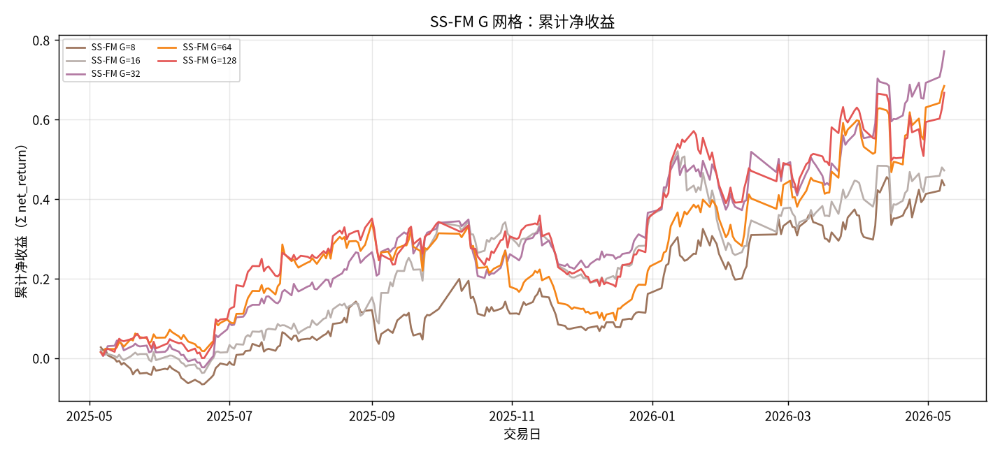

### FM G 累计净值

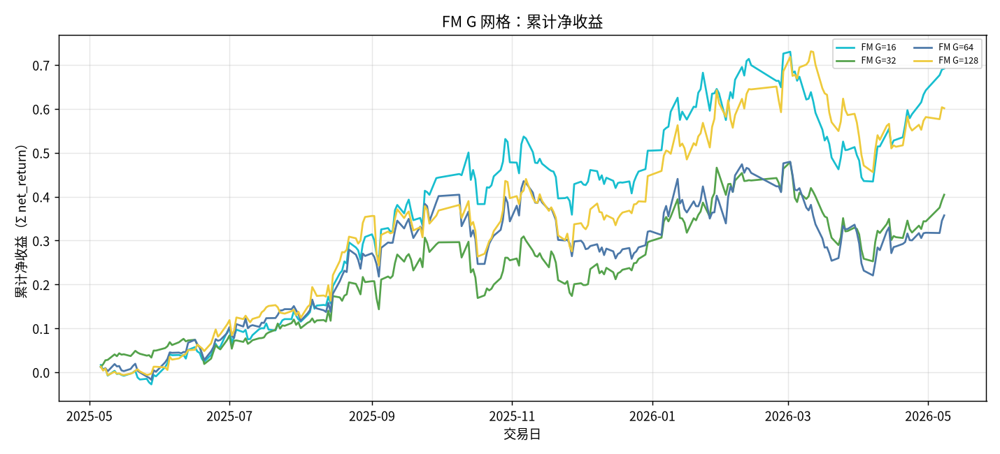

### FM vs SS-FM（同 G）累计净值

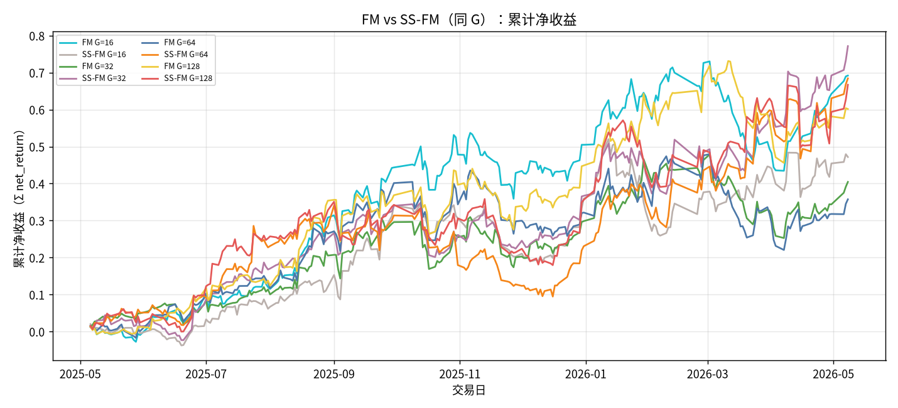

### G–收益曲线（FM vs SS-FM）

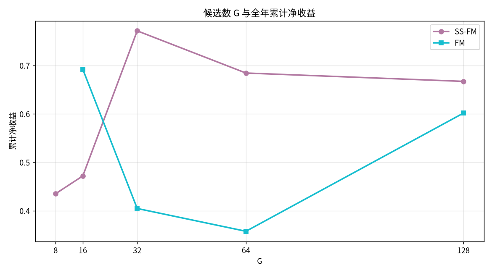

### SS-FM / FM 各 G 累计净收益（柱）

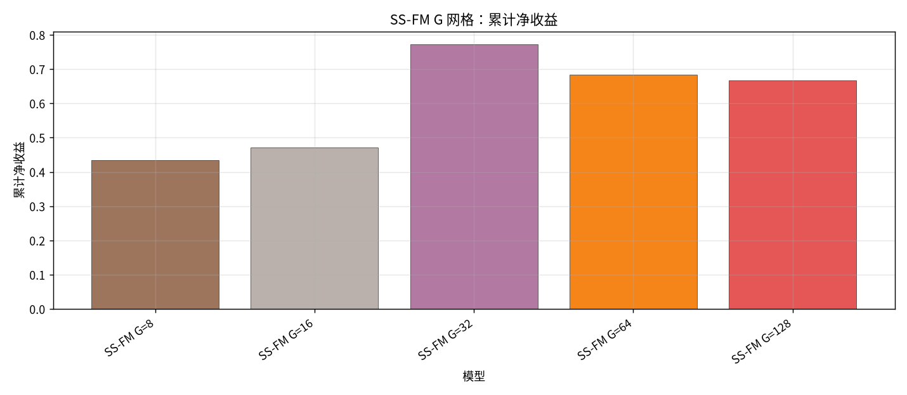

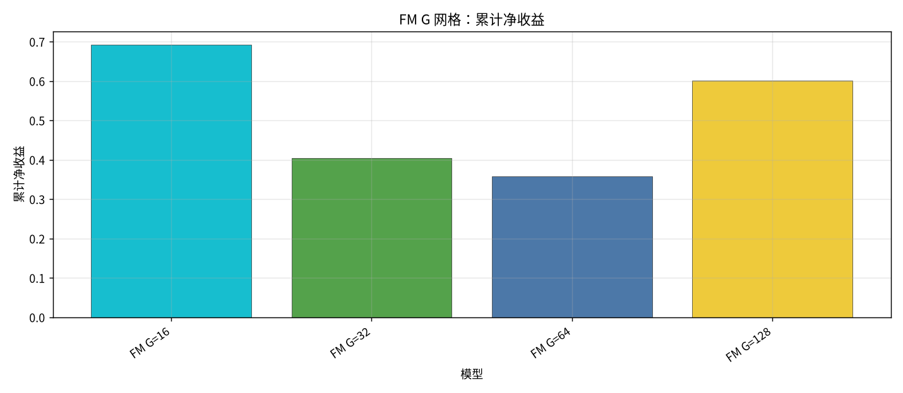

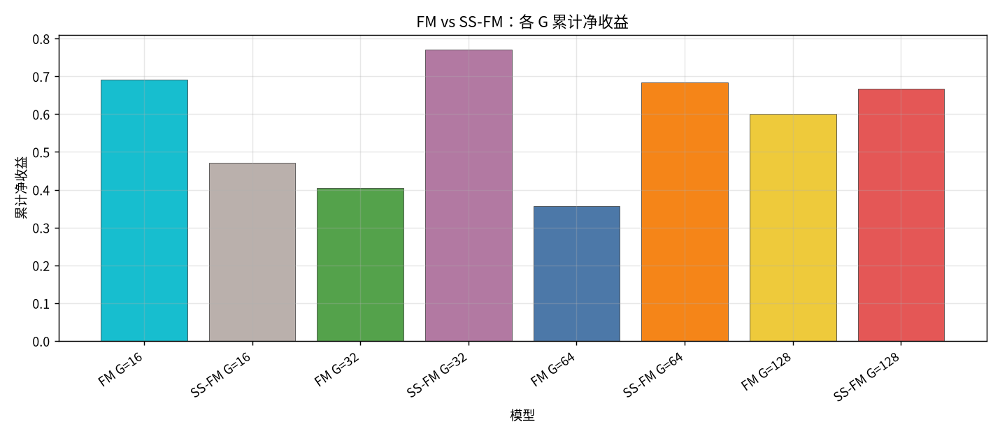

### SS-FM / FM 各 G Sharpe

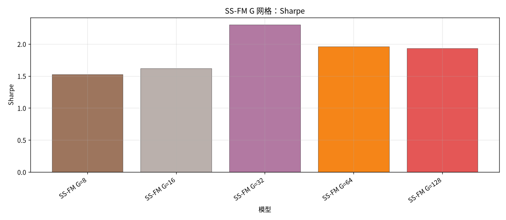

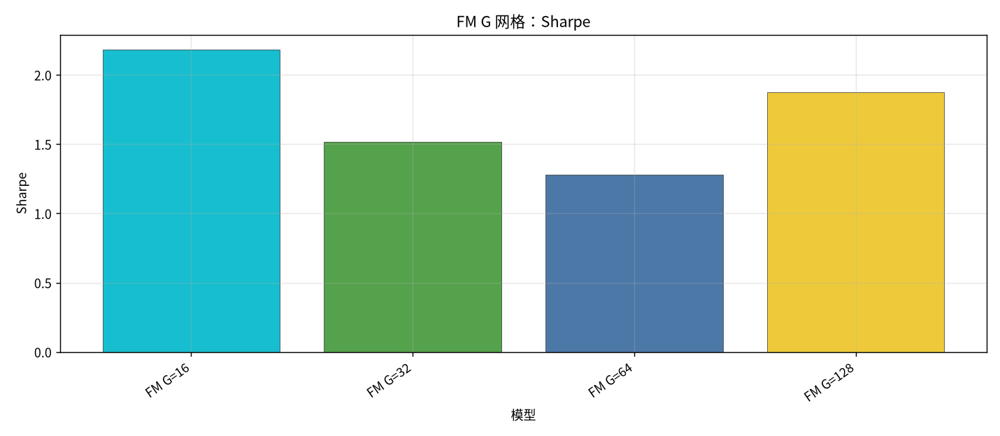

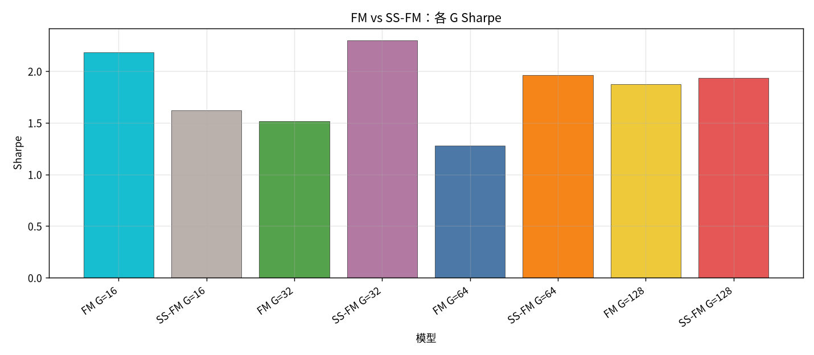

### SS-FM / FM 各 G 最大回撤与换手

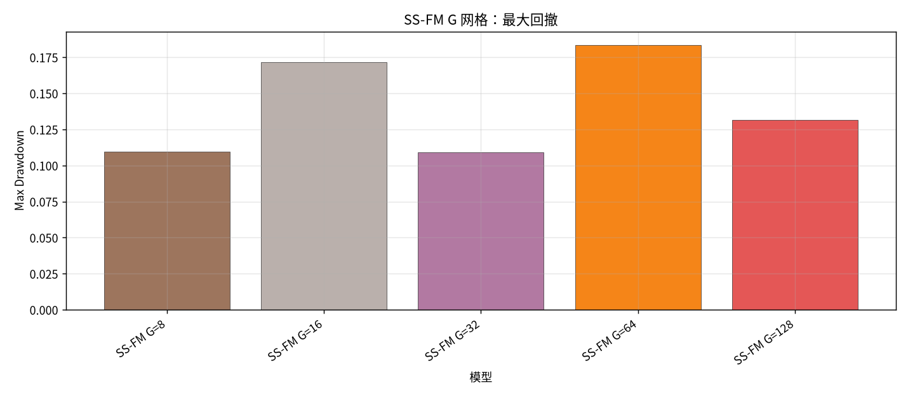

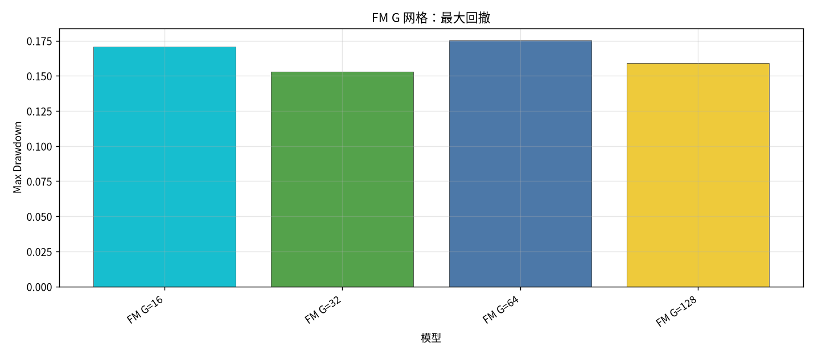

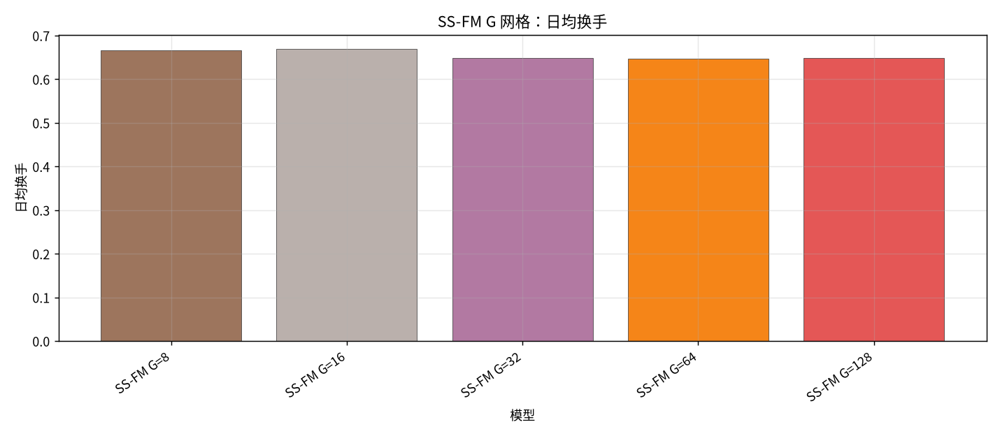

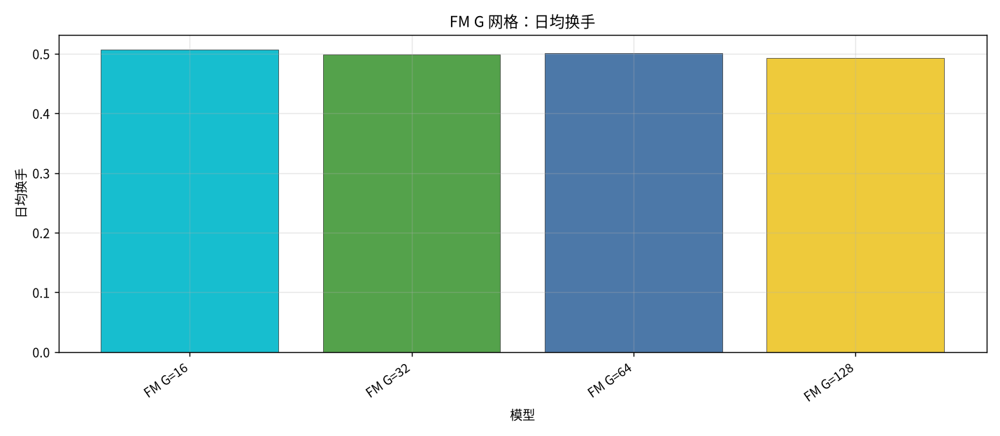

### SS-FM / FM G 分月收益

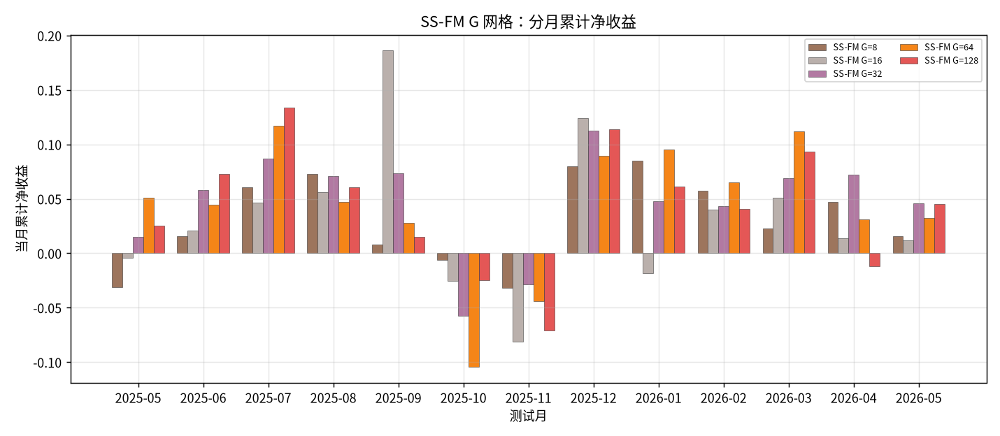

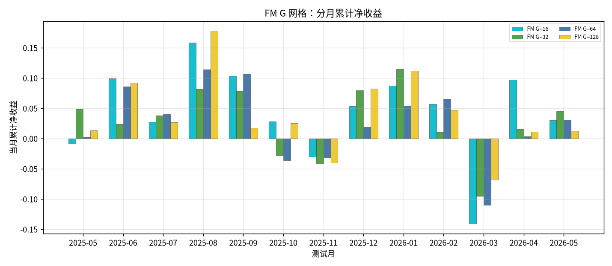

## 全年综合结果总表（生成 + RL）

| model | total_net_return | ann_return | sharpe | max_drawdown | mean_turnover | mean_cost | n_days |
| --- | --- | --- | --- | --- | --- | --- | --- |
| MLP | 0.4129 | 0.4269 | 1.8503 | 0.1422 | 0.3555 | 0.0001 | 245 |
| Gaussian | 0.4557 | 0.4714 | 1.6954 | 0.1663 | 0.5513 | 0.0002 | 245 |
| FM | 0.5891 | 0.6103 | 2.1480 | 0.1434 | 0.4930 | 0.0001 | 245 |
| Diffusion | 0.3173 | 0.3277 | 1.0955 | 0.1310 | 0.7365 | 0.0002 | 245 |
| Pure SS-FM | 0.3952 | 0.4085 | 1.3309 | 0.1518 | 0.6675 | 0.0002 | 245 |
| SS-FM + PPO | 0.2758 | 0.2847 | 1.1293 | 0.1400 | 0.2858 | 0.0001 | 245 |
| SS-FM + GRPO | 0.5578 | 0.5777 | 2.2487 | 0.1174 | 0.2808 | 0.0001 | 245 |

## 13 个月进度

| month | status | n_nav_models | leakage_audit |
| --- | --- | --- | --- |
| 2025-05 | 已写入 | 18 | clocks 适配器已修（跑时曾因 decision_timestamp 缺键标 failed，回测仍完整） |
| 2025-06 | 已写入 | 18 | clocks 适配器已修（跑时曾因 decision_timestamp 缺键标 failed，回测仍完整） |
| 2025-07 | 已写入 | 18 | clocks 适配器已修（跑时曾因 decision_timestamp 缺键标 failed，回测仍完整） |
| 2025-08 | 已写入 | 18 | clocks 适配器已修（跑时曾因 decision_timestamp 缺键标 failed，回测仍完整） |
| 2025-09 | 已写入 | 18 | clocks 适配器已修（跑时曾因 decision_timestamp 缺键标 failed，回测仍完整） |
| 2025-10 | 已写入 | 18 | clocks 适配器已修（跑时曾因 decision_timestamp 缺键标 failed，回测仍完整） |
| 2025-11 | 已写入 | 18 | clocks 适配器已修（跑时曾因 decision_timestamp 缺键标 failed，回测仍完整） |
| 2025-12 | 已写入 | 18 | clocks 适配器已修（跑时曾因 decision_timestamp 缺键标 failed，回测仍完整） |
| 2026-01 | 已写入 | 18 | clocks 适配器已修（跑时曾因 decision_timestamp 缺键标 failed，回测仍完整） |
| 2026-02 | 已写入 | 18 | clocks 适配器已修（跑时曾因 decision_timestamp 缺键标 failed，回测仍完整） |
| 2026-03 | 已写入 | 18 | clocks 适配器已修（跑时曾因 decision_timestamp 缺键标 failed，回测仍完整） |
| 2026-04 | 已写入 | 18 | clocks 适配器已修（跑时曾因 decision_timestamp 缺键标 failed，回测仍完整） |
| 2026-05 | 已写入 | 18 | clocks 适配器已修（跑时曾因 decision_timestamp 缺键标 failed，回测仍完整） |

## Teacher 配权 vs FM / SS-FM

Top30 long-only：经典 Teacher（MVO / MaxSharpe / Risk Parity）与生成模型 FM / Pure SS-FM 在同一拼接 OOS（2025-05…2026-05，245 日）上对照。

> **收益口径：单利**。`total_net_return = Σ net_return`（非 `∏(1+r)−1`）；累计曲线与分月表同为加总。Sharpe / MDD 仍按日收益序列计算。

### 全年对照（单利）

| model | total_net_return（单利） | ann_return（μ×252） | sharpe | max_drawdown | mean_turnover | mean_cost | n_days |
| --- | --- | --- | --- | --- | --- | --- | --- |
| MVO | 0.3261 | 0.3354 | 0.8746 | 0.3105 | 0.9353 | 0.0003 | 245 |
| MaxSharpe | 0.3694 | 0.3799 | 1.1874 | 0.2202 | 0.9166 | 0.0003 | 245 |
| Risk Parity | 0.4593 | 0.4724 | 2.3853 | 0.1294 | 0.0548 | 0.0000 | 245 |
| FM | 0.4903 | 0.5043 | 2.1480 | 0.1434 | 0.4930 | 0.0001 | 245 |
| Pure SS-FM | 0.3736 | 0.3843 | 1.3309 | 0.1518 | 0.6675 | 0.0002 | 245 |

### 分月净收益（单利）

| month | MVO | MaxSharpe | Risk Parity | FM | Pure SS-FM |
| --- | --- | --- | --- | --- | --- |
| 2025-05 | -0.0811 | -0.0898 | -0.0120 | 0.0014 | 0.1122 |
| 2025-06 | -0.0099 | 0.0031 | 0.0595 | 0.0406 | 0.0336 |
| 2025-07 | -0.2052 | -0.1013 | 0.0519 | 0.1003 | 0.0594 |
| 2025-08 | 0.1043 | 0.0910 | 0.1031 | 0.1136 | 0.0483 |
| 2025-09 | 0.0523 | 0.0729 | 0.0958 | 0.1613 | -0.0155 |
| 2025-10 | 0.1488 | 0.1088 | -0.0155 | -0.0536 | -0.0443 |
| 2025-11 | -0.1139 | -0.0320 | -0.0157 | -0.0740 | -0.0373 |
| 2025-12 | 0.2021 | 0.0997 | 0.0667 | 0.0957 | 0.1274 |
| 2026-01 | 0.1822 | 0.1878 | 0.0900 | 0.0167 | -0.0520 |
| 2026-02 | 0.1251 | 0.0610 | 0.0017 | 0.0376 | 0.0982 |
| 2026-03 | -0.0847 | -0.0401 | -0.0401 | 0.0233 | -0.0228 |
| 2026-04 | -0.0084 | -0.0008 | 0.0615 | 0.0421 | 0.0500 |
| 2026-05 | 0.0144 | 0.0091 | 0.0124 | -0.0147 | 0.0164 |

### 图

### Teacher vs FM / SS-FM 累计净值（单利）

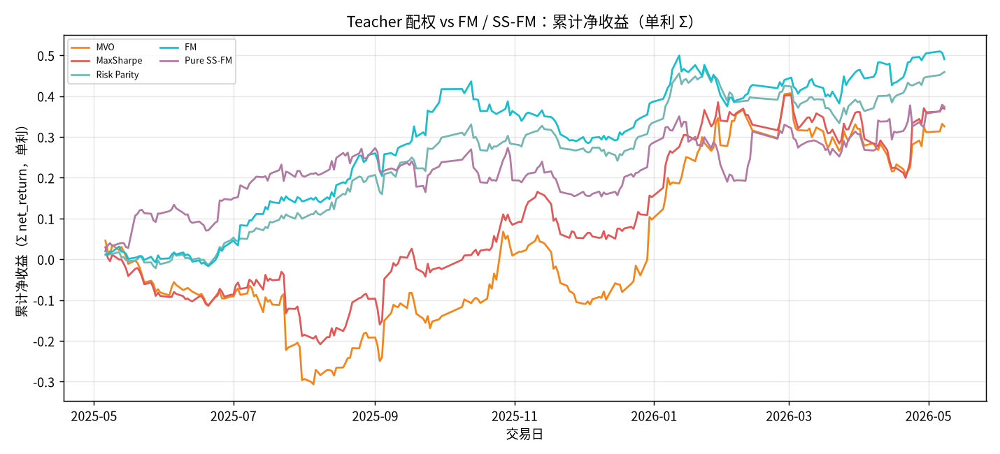

### Teacher vs FM / SS-FM 累计净收益（单利柱）

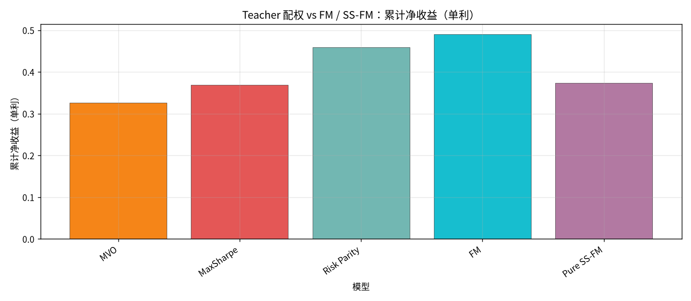

### Teacher vs FM / SS-FM Sharpe

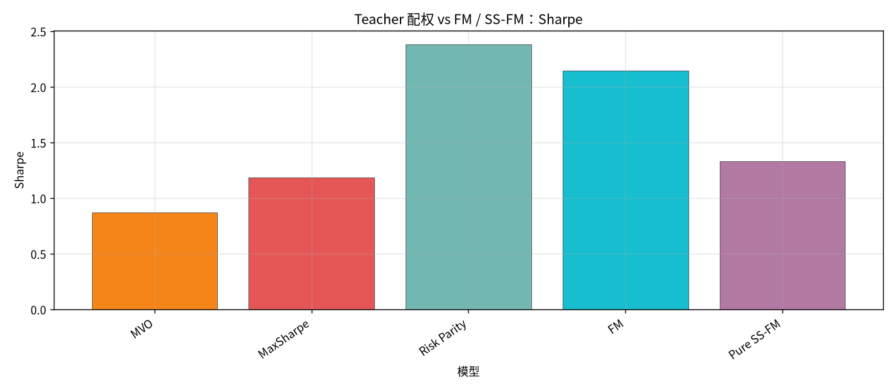

### Teacher vs FM / SS-FM 最大回撤

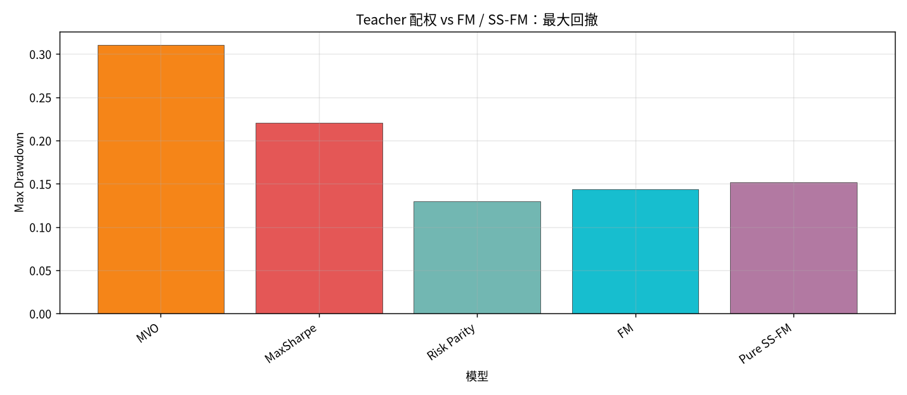

### Teacher vs FM / SS-FM 日均换手

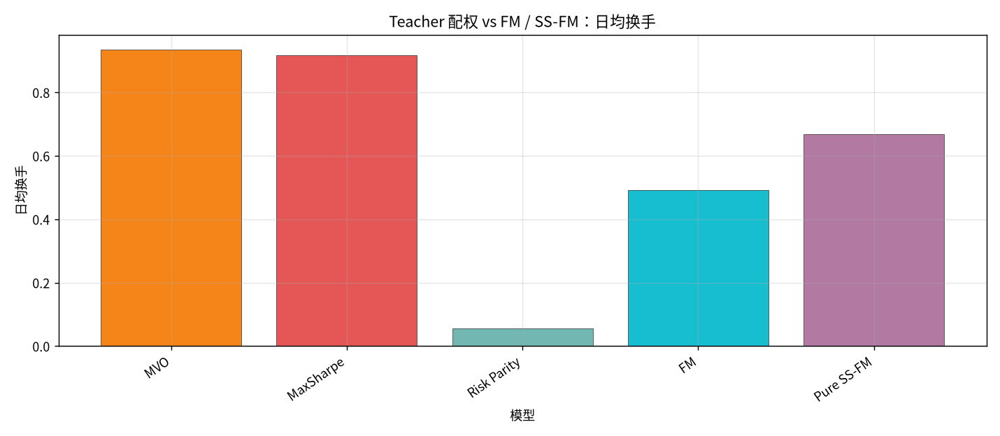

### Teacher vs FM / SS-FM 分月收益（单利）

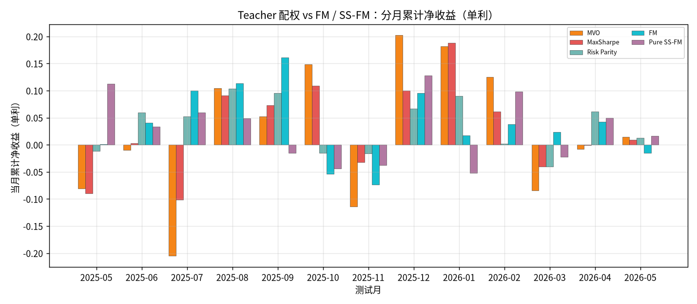

## G=32：Teacher 配权 vs FM / SS-FM

设定：生成模型取 **G=32**（每日采 32 条后 `pred_utility` 选 1 条）；Teacher（MVO / MaxSharpe / Risk Parity）为确定性优化，**无 G**。拼接 OOS 2025-05…2026-05，245 日。

> **收益口径：单利**。`total_net_return = Σ net_return`；累计曲线为 Σ 累加。FM G=32 来自补跑 `strict_fixed_oos_fm_g`；SS-FM G=32 来自正本实验 E；Teacher 来自正本 baseline。

### 全年对照（单利，G=32）

| model | total_net_return（单利） | ann_return（μ×252） | sharpe | max_drawdown | mean_turnover | mean_cost | n_days |
| --- | --- | --- | --- | --- | --- | --- | --- |
| MVO | 0.3261 | 0.3354 | 0.8746 | 0.3105 | 0.9353 | 0.0003 | 245 |
| MaxSharpe | 0.3694 | 0.3799 | 1.1874 | 0.2202 | 0.9166 | 0.0003 | 245 |
| Risk Parity | 0.4593 | 0.4724 | 2.3853 | 0.1294 | 0.0548 | 0.0000 | 245 |
| FM G=32 | 0.3705 | 0.3811 | 1.5171 | 0.1528 | 0.4989 | 0.0001 | 245 |
| SS-FM G=32 | 0.6084 | 0.6257 | 2.2998 | 0.1091 | 0.6492 | 0.0002 | 245 |

### 分月净收益（单利，G=32）

| month | MVO | MaxSharpe | Risk Parity | FM G=32 | SS-FM G=32 |
| --- | --- | --- | --- | --- | --- |
| 2025-05 | -0.0811 | -0.0898 | -0.0120 | 0.0486 | 0.0151 |
| 2025-06 | -0.0099 | 0.0031 | 0.0595 | 0.0241 | 0.0578 |
| 2025-07 | -0.2052 | -0.1013 | 0.0519 | 0.0378 | 0.0867 |
| 2025-08 | 0.1043 | 0.0910 | 0.1031 | 0.0818 | 0.0710 |
| 2025-09 | 0.0523 | 0.0729 | 0.0958 | 0.0778 | 0.0735 |
| 2025-10 | 0.1488 | 0.1088 | -0.0155 | -0.0282 | -0.0576 |
| 2025-11 | -0.1139 | -0.0320 | -0.0157 | -0.0410 | -0.0285 |
| 2025-12 | 0.2021 | 0.0997 | 0.0667 | 0.0796 | 0.1123 |
| 2026-01 | 0.1822 | 0.1878 | 0.0900 | 0.1149 | 0.0478 |
| 2026-02 | 0.1251 | 0.0610 | 0.0017 | 0.0105 | 0.0433 |
| 2026-03 | -0.0847 | -0.0401 | -0.0401 | -0.0955 | 0.0688 |
| 2026-04 | -0.0084 | -0.0008 | 0.0615 | 0.0155 | 0.0721 |
| 2026-05 | 0.0144 | 0.0091 | 0.0124 | 0.0446 | 0.0462 |

### 图

### G=32 Teacher vs FM/SS-FM 累计净值（单利）

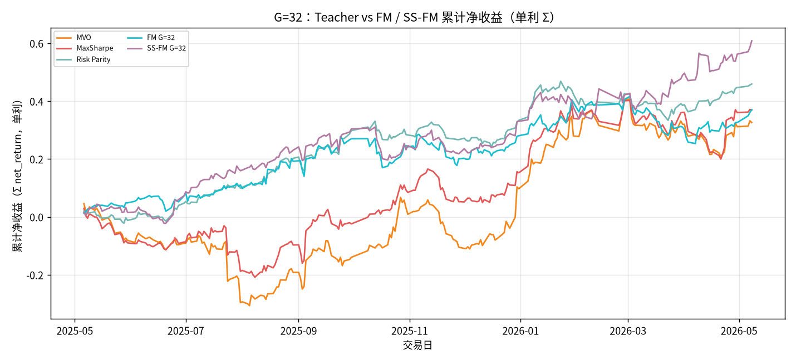

### G=32 Teacher vs FM/SS-FM 累计净收益（单利柱）

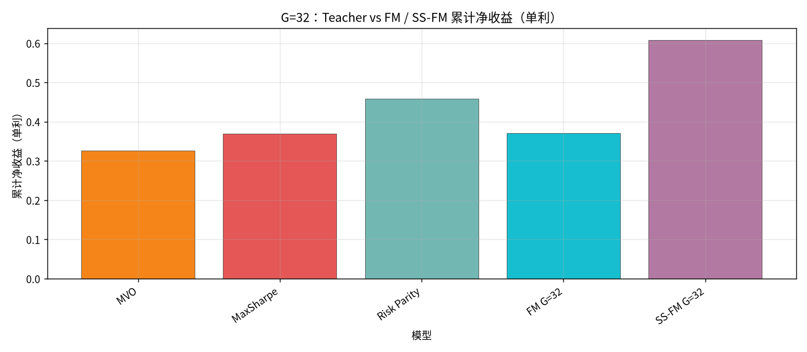

### G=32 Teacher vs FM/SS-FM Sharpe

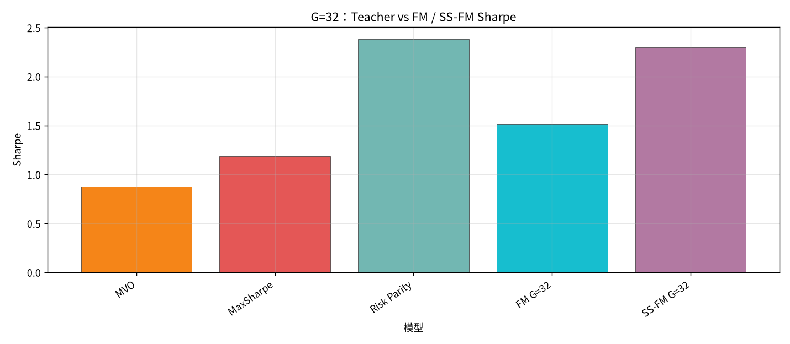

### G=32 Teacher vs FM/SS-FM 最大回撤

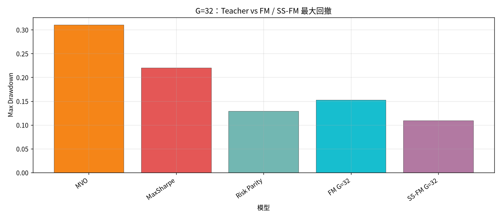

### G=32 Teacher vs FM/SS-FM 日均换手

### G=32 Teacher vs FM/SS-FM 分月收益（单利）

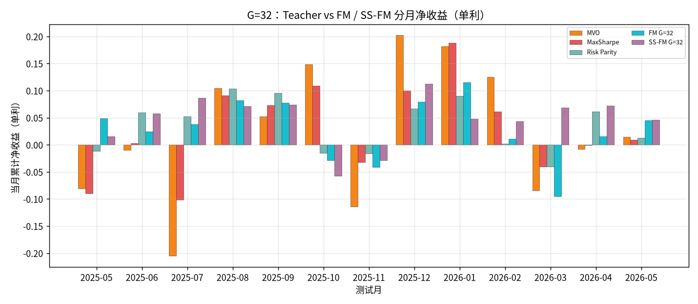

## G=32：Pure SS-FM vs SS-FM+PPO / GRPO

设定：冻结 Alpha+SS-FM，仅重训 PPO/GRPO，`rl.group_size=G=32`；回测同样 G=32 采样 + pred_utility。Pure SS-FM 取正本 `ssfm_G32_top30`（若无则 `gen_ssfm_top30`）。拼接 OOS 2025-05…2026-05，245 日。**收益口径：单利 Σ**。

| model | total_net_return（单利） | ann_return（μ×252） | sharpe | max_drawdown | mean_turnover | n_days |
| --- | --- | --- | --- | --- | --- | --- |
| Pure SS-FM G=32 | 0.6084 | 0.6257 | 2.2998 | 0.1091 | 0.6492 | 245 |
| SS-FM + PPO G=32 | 1.0511 | 1.0811 | 2.8106 | 0.1097 | 0.2595 | 245 |
| SS-FM + GRPO G=32 | 0.7166 | 0.7371 | 2.4533 | 0.1183 | 0.2626 | 245 |

### 图

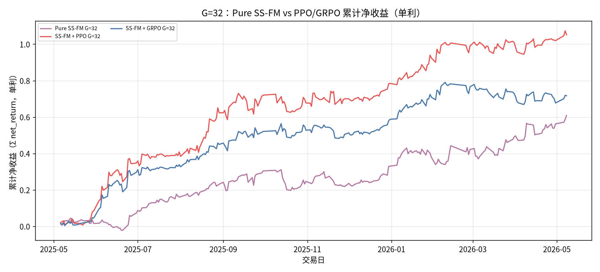

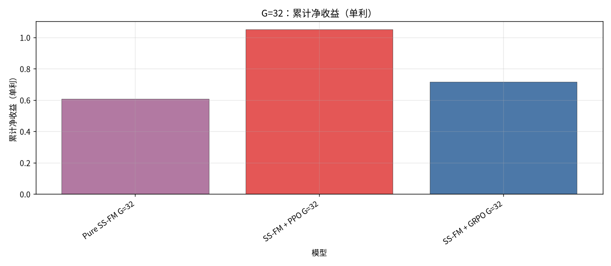

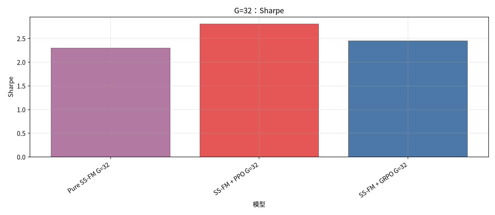

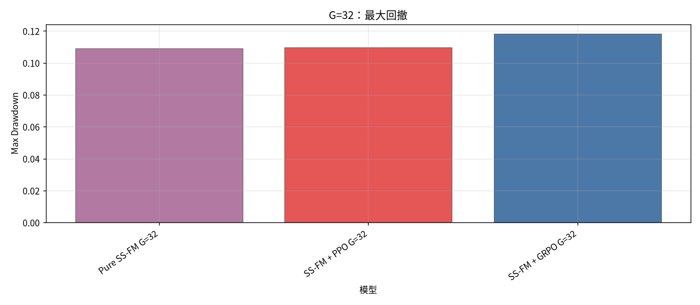

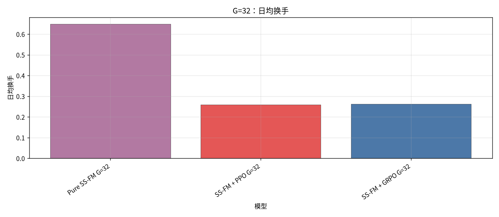

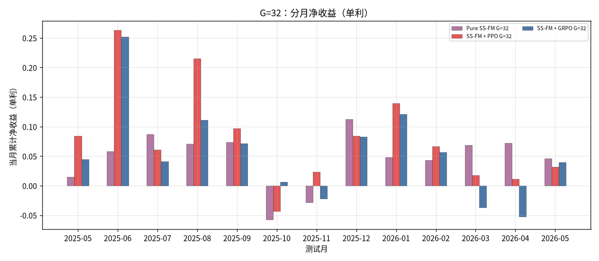

## G=32 RL 消融：cand-PPO vs SS-FM-init GRPO

设定：冻结 Alpha+SS-FM，`G=32`。

1. **SS-FM+PPO（cand 特征）**：每日 SS-FM 采 G 条候选作特征（cond + candidate encode），PPO 再输出权重。
2. **SS-FM+GRPO（SSFM init）**：先从 SS-FM 蒸馏初始化 WeightPolicy，再 GRPO（无 online BC）。

对照 Pure SS-FM G=32；拼接 OOS 2025-05…2026-05，245 日。**收益口径：单利 Σ**。

| model | total_net_return（单利） | ann_return（μ×252） | sharpe | max_drawdown | mean_turnover | n_days |
| --- | --- | --- | --- | --- | --- | --- |
| Pure SS-FM G=32 | 0.6084 | 0.6257 | 2.2998 | 0.1091 | 0.6492 | 245 |
| SS-FM+PPO (cand特征) G=32 | 0.8865 | 0.9118 | 2.1356 | 0.2074 | 0.2138 | 245 |
| SS-FM+GRPO (SSFM init) G=32 | 0.6779 | 0.6972 | 2.3644 | 0.1381 | 0.2739 | 245 |
| SS-FM+PPO G=32 (旧) | 1.0511 | 1.0811 | 2.8106 | 0.1097 | 0.2595 | 245 |
| SS-FM+GRPO G=32 (旧) | 0.7166 | 0.7371 | 2.4533 | 0.1183 | 0.2626 | 245 |

### 图

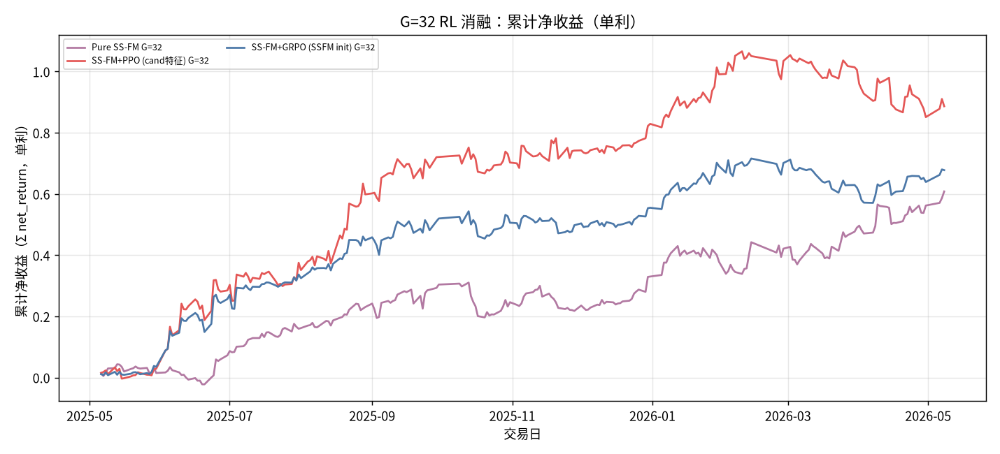

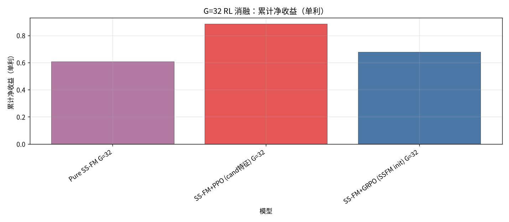

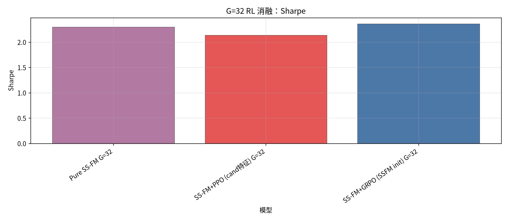

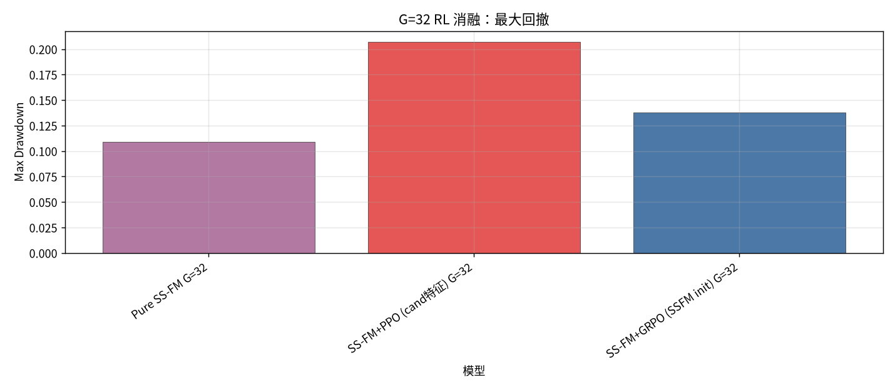

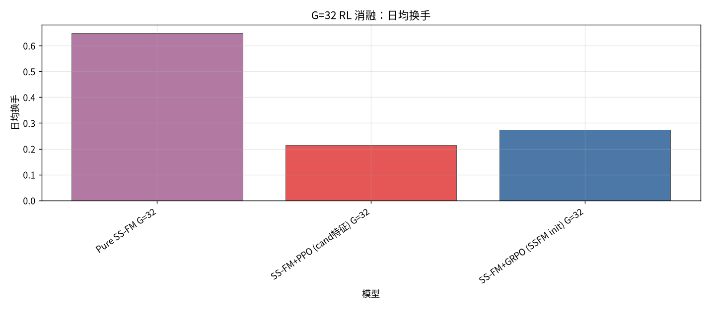

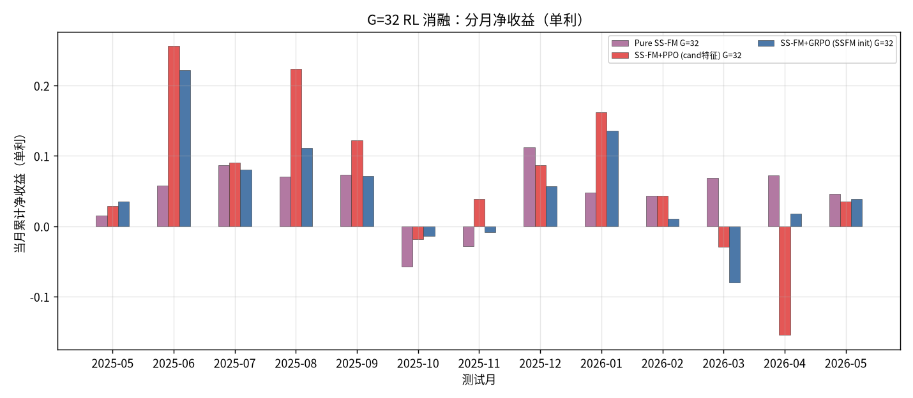

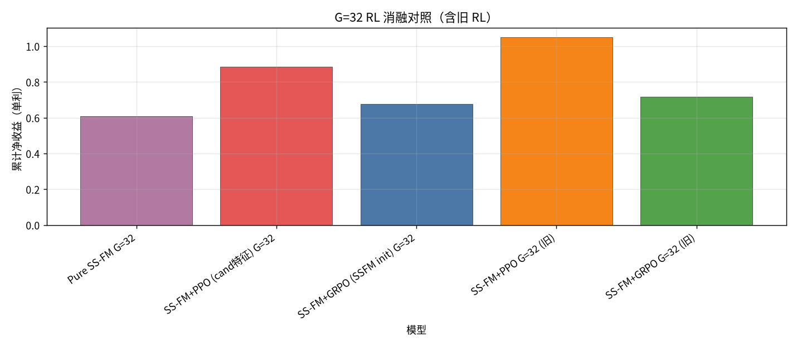

## 图（颜色已固定）

### 生成模型累计净值

系列: gen_mlp / gaussian / standard_fm / diffusion / ssfm。

### RL 累计净值

系列: gen_ssfm / rl_ssfm_ppo / rl_ssfm_grpo。

### Teacher 累计净值

系列: EW / MVO / MaxSharpe / RP / Kelly。

### G 网格累计净值

系列: SS-FM G=8..128；FM G=16..128（补跑）。

### 生成模型 Sharpe

### RL Sharpe

### G 网格 Sharpe

### 最大回撤

### 日均换手

### 生成模型分月收益

### RL 分月收益

## 分析

分析主线是 **冻结 Gated Residual+Auction Alpha → Top30 → Teacher 基线 / 组合生成 / RL / G 网格**。
缺测单元格为 `-`，不补 0。

### Teacher
- 全年累计净收益最高: `Equal Weight` = 0.5616。
- Sharpe 最高: `Risk Parity` = 2.3853。
- Equal Weight 收益 `0.5616` / Sharpe `2.3836` / 换手 `0.0265`。
- Risk Parity 收益 `0.5526` / Sharpe `2.3853`。
- MVO / Kelly 同路径点估计收益 `0.2897`，换手高（≈0.94）。

### Teacher 配权相对 FM / Pure SS-FM
- 口径：以下累计净收益均为 **单利 Σ net_return**（非复利 `∏(1+r)−1`）。
- 累计净收益排序：FM `0.4903` > Risk Parity `0.4593` > Pure SS-FM `0.3736` > MaxSharpe `0.3694` > MVO `0.3261`。
- Sharpe：Risk Parity `2.3853` / FM `2.1480` 领先；Pure SS-FM `1.3309`；MaxSharpe `1.1874`；MVO `0.8746`。
- 换手：Risk Parity 极低（`0.0548`）；MVO/MaxSharpe 很高（≈0.92–0.94）；FM/SS-FM 居中（`0.4930` / `0.6675`）。
- 结论：单利口径下 **FM 仍最优**，Risk Parity 接近；Pure SS-FM 弱于二者但强于 MVO/MaxSharpe；高换手 Teacher 单利总分也明显落后。

### G=32：Teacher 相对 FM / SS-FM
- 口径：单利 Σ；生成模型固定 **G=32**；Teacher 无 G。
- 累计净收益排序：SS-FM G=32 `0.6084` > Risk Parity `0.4593` > FM G=32 `0.3705` > MaxSharpe `0.3694` > MVO `0.3261`。
- 要点：**SS-FM G=32**（`0.6084` / Sharpe `2.2998`）显著高于 FM G=32（`0.3705` / `1.5171`）与全部 Teacher；Risk Parity（`0.4593`）仍强于 FM@32。
- 与默认 G 对照：默认路径上 FM 优于 Pure SS-FM；切到 G=32 后 SS-FM 反超，说明 SS-FM 更吃候选宽度，FM@32 仍受 pred_utility winner's curse 拖累。

### SS-FM 相对 FM / Diffusion / MLP / Gaussian
- 全年累计净收益最高: `FM` = 0.5891。
- Sharpe 最高: `FM` = 2.1480。
- 最大回撤最小: `Diffusion` = 0.1310。
- 日均换手最低: `MLP` = 0.3555。
- 点估计对照：Pure SS-FM `0.3952` / `1.3309`；FM `0.5891` / `2.1480`；Diffusion `0.3173` / `1.0955`。

### PPO / GRPO 相对 Pure SS-FM
- Pure SS-FM 收益 `0.3952` Sharpe `1.3309` 换手 `0.6675`。
- SS-FM + PPO 收益 `0.2758` Sharpe `1.1293` 换手 `0.2858`。
- SS-FM + GRPO 收益 `0.5578` Sharpe `2.2487` 换手 `0.2808`。
- GRPO 在降换手的同时抬升了收益与 Sharpe；PPO 降换手但收益低于纯 SS-FM。

### G=32：PPO / GRPO 相对 Pure SS-FM
- Pure（Pure SS-FM G=32）单利 `0.6084`；PPO G=32 `1.0511`；GRPO G=32 `0.7166`。
- 相对 Pure：PPO 胜；GRPO 胜。
- Sharpe：Pure `2.2998` / PPO `2.8106` / GRPO `2.4533`。

### G=32 RL 消融：cand-PPO / SS-FM-init GRPO
- Pure SS-FM G=32 单利 `0.6084`；cand-PPO `0.8865`；GRPO-init `0.6779`。
- 相对 Pure：cand-PPO 胜；GRPO-init 胜。
- Sharpe：Pure `2.2998` / cand-PPO `2.1356` / GRPO-init `2.3644`。
- 换手：Pure `0.6492` → cand-PPO `0.2138` / GRPO-init `0.2739`。

### G 网格（SS-FM / FM）

- SS-FM 全年最优：`SS-FM G=32` = `0.7714` / Sharpe `2.2998`；对照默认 Pure（约 G=16）`0.4718`。
- FM 补跑全年最优：`FM G=16` = `0.6919` / Sharpe `2.1814`；G=32 `0.4045`、G=64 `0.3574`、G=128 `0.6015`。
- 同 G 对照：G=32 上 **SS-FM `0.7714` >> FM `0.4045`**；G=16 上本次 FM 复跑最强（`0.6919`），但加大 G 对 FM 无单调收益（峰值在小 G）。
- 解释：SS-FM 分 teacher 采样，加大 G 改善模式覆盖；FM 单一流上加大 G 等于在弱相关的 `pred_utility` 上更狠 argmax（winner's curse），仓位更尖、OOS 变差。

