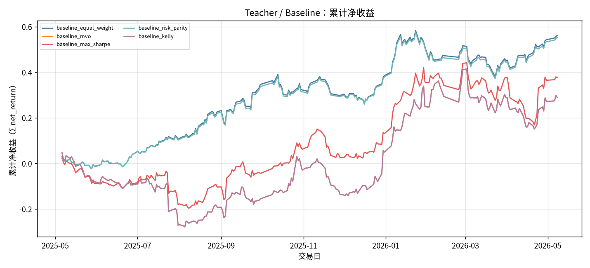
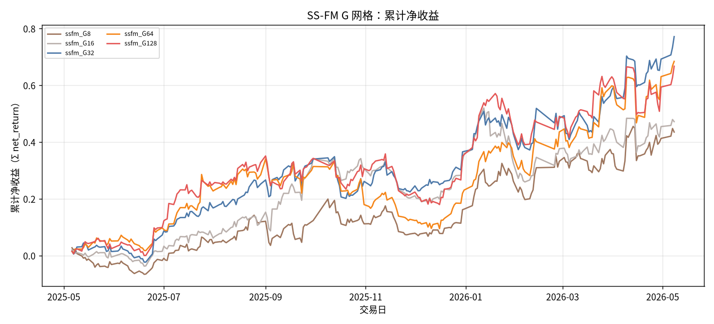
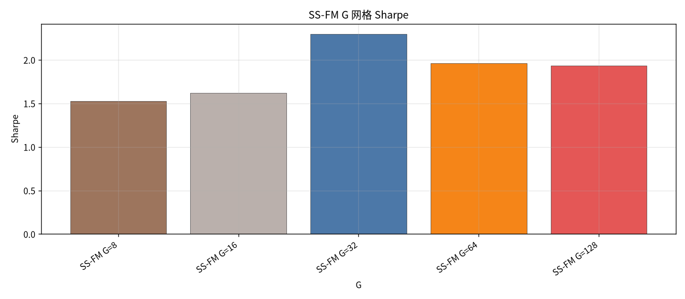

# 全年总览：CSI500 2025-05 至 2026-05

- 状态: **13 个测试月均已写入**
- 编号: `全年总览`
- 类型: 全年总览
- 说明: 13 个测试月拼接：冻结复用 ablation `transformer_gated_residual_auction`（含 9 维集合竞价）→ Top30 配权 → 生成模型 MLP / Gaussian / FM / Diffusion / SS-FM → SS-FM+PPO/GRPO；Teacher=MVO/MaxSharpe/RiskParity（Kelly 仅 baseline）；G∈{8,16,32,64,128}。strict_fixed_oos。
- 缺测一律 `-`。曲线颜色见下表，中途不改色。

## 固定颜色

| 模型 | 颜色 |
| --- | --- |
| gen_mlp | #9D755D |
| gen_gaussian | #BAB0AC |
| gen_standard_fm | #17BECF |
| gen_diffusion | #F2CF5B |
| gen_ssfm | #B279A2 |
| rl_ssfm_ppo | #E45756 |
| rl_ssfm_grpo | #4C78A8 |

## 实验设定

- Walk-forward 测试月 2025-05 … 2026-05（2026-05 分钟数据只到 05-08）。
- Alpha：**冻结复用** `results_alpha_prediction_ablation` 的 `transformer_gated_residual_auction` BEST（含竞价 Gate Residual Fusion，**不重训 SFT**）。
- Store：AblationStore F=62；分钟窗 `M_{D-10:D-1}`；竞价 D 日 09:25 九维。
- 标签 / 回测：`y = log(Close_D / Open_D)`，`return_type=log`，cost_bps=3.0。
- 配权=**Top30**（按 ŷ），long-only simplex，max_weight=0.15。
- OOS=`strict_fixed_oos`：每月单独跑，月内不周五重训。
- Teacher：MVO / MaxSharpe / RiskParity；Kelly 仅作 baseline。
- G 网格完整写入：8 / 16 / 32 / 64 / 128。

## 单月报告

各月正本在 `results/CSI500/strict_fixed_oos/strict_fixed_oos/test_month=YYYY-MM/`。

| 月份 | 报告 |
| --- | --- |
| 2025-05 | [实验分析.md](../strict_fixed_oos/test_month=2025-05/实验分析.md) |
| 2025-06 | [实验分析.md](../strict_fixed_oos/test_month=2025-06/实验分析.md) |
| 2025-07 | [实验分析.md](../strict_fixed_oos/test_month=2025-07/实验分析.md) |
| 2025-08 | [实验分析.md](../strict_fixed_oos/test_month=2025-08/实验分析.md) |
| 2025-09 | [实验分析.md](../strict_fixed_oos/test_month=2025-09/实验分析.md) |
| 2025-10 | [实验分析.md](../strict_fixed_oos/test_month=2025-10/实验分析.md) |
| 2025-11 | [实验分析.md](../strict_fixed_oos/test_month=2025-11/实验分析.md) |
| 2025-12 | [实验分析.md](../strict_fixed_oos/test_month=2025-12/实验分析.md) |
| 2026-01 | [实验分析.md](../strict_fixed_oos/test_month=2026-01/实验分析.md) |
| 2026-02 | [实验分析.md](../strict_fixed_oos/test_month=2026-02/实验分析.md) |
| 2026-03 | [实验分析.md](../strict_fixed_oos/test_month=2026-03/实验分析.md) |
| 2026-04 | [实验分析.md](../strict_fixed_oos/test_month=2026-04/实验分析.md) |
| 2026-05 | [实验分析.md](../strict_fixed_oos/test_month=2026-05/实验分析.md) |

## 论文主线

Gated Residual + Auction Alpha（冻结）→ Top30 选股 → Teacher 配权基线 vs 组合生成（MLP / Gaussian / FM / Diffusion / SS-FM）→ SS-FM 上叠加 PPO / GRPO，并扫 G 网格。回测用同日 open-to-close 对数收益。

## Teacher / Baseline 总表

| model | total_net_return | ann_return | sharpe | max_drawdown | mean_turnover | mean_cost | n_days |
| --- | --- | --- | --- | --- | --- | --- | --- |
| Equal Weight | 0.5616 | 0.5817 | 2.3836 | 0.1286 | 0.0265 | 0.0000 | 245 |
| MVO | 0.2897 | 0.2991 | 0.8746 | 0.3105 | 0.9353 | 0.0003 | 245 |
| MaxSharpe | 0.3768 | 0.3894 | 1.1874 | 0.2202 | 0.9166 | 0.0003 | 245 |
| Risk Parity | 0.5526 | 0.5722 | 2.3853 | 0.1294 | 0.0548 | 0.0000 | 245 |
| Kelly | 0.2897 | 0.2991 | 0.8746 | 0.3105 | 0.9353 | 0.0003 | 245 |

## Teacher 分月净收益

| month | Equal Weight | MVO | MaxSharpe | Risk Parity | Kelly |
| --- | --- | --- | --- | --- | --- |
| 2025-05 | -0.0143 | -0.0805 | -0.0878 | -0.0127 | -0.0805 |
| 2025-06 | 0.0628 | -0.0109 | 0.0023 | 0.0604 | -0.0109 |
| 2025-07 | 0.0558 | -0.1989 | -0.1039 | 0.0525 | -0.1989 |
| 2025-08 | 0.1089 | 0.1078 | 0.0934 | 0.1068 | 0.1078 |
| 2025-09 | 0.0977 | 0.0458 | 0.0669 | 0.0962 | 0.0458 |
| 2025-10 | -0.0180 | 0.1498 | 0.1109 | -0.0172 | 0.1498 |
| 2025-11 | -0.0185 | -0.1097 | -0.0337 | -0.0162 | -0.1097 |
| 2025-12 | 0.0672 | 0.2143 | 0.1021 | 0.0678 | 0.2143 |
| 2026-01 | 0.0905 | 0.1903 | 0.1996 | 0.0907 | 0.1903 |
| 2026-02 | 0.0038 | 0.1292 | 0.0608 | 0.0004 | 0.1292 |
| 2026-03 | -0.0436 | -0.0867 | -0.0436 | -0.0415 | -0.0867 |
| 2026-04 | 0.0639 | -0.0130 | -0.0086 | 0.0623 | -0.0130 |
| 2026-05 | 0.0124 | 0.0143 | 0.0091 | 0.0125 | 0.0143 |

## 生成模型消融总表

| model | total_net_return | ann_return | sharpe | max_drawdown | mean_turnover | mean_cost | n_days |
| --- | --- | --- | --- | --- | --- | --- | --- |
| MLP | 0.4129 | 0.4269 | 1.8503 | 0.1422 | 0.3555 | 0.0001 | 245 |
| Gaussian | 0.4557 | 0.4714 | 1.6954 | 0.1663 | 0.5513 | 0.0002 | 245 |
| FM | 0.5891 | 0.6103 | 2.1480 | 0.1434 | 0.4930 | 0.0001 | 245 |
| Diffusion | 0.3173 | 0.3277 | 1.0955 | 0.1310 | 0.7365 | 0.0002 | 245 |
| Pure SS-FM | 0.3952 | 0.4085 | 1.3309 | 0.1518 | 0.6675 | 0.0002 | 245 |

## 生成模型分月净收益

| month | MLP | Gaussian | FM | Diffusion | Pure SS-FM |
| --- | --- | --- | --- | --- | --- |
| 2025-05 | -0.0226 | 0.0070 | 0.0007 | -0.0561 | 0.1145 |
| 2025-06 | 0.0528 | 0.0157 | 0.0407 | 0.0085 | 0.0322 |
| 2025-07 | 0.0787 | 0.0413 | 0.1032 | 0.0794 | 0.0589 |
| 2025-08 | 0.0959 | 0.1074 | 0.1182 | 0.0862 | 0.0474 |
| 2025-09 | 0.0712 | 0.0878 | 0.1683 | 0.0435 | -0.0192 |
| 2025-10 | -0.0111 | -0.0430 | -0.0550 | -0.1075 | -0.0483 |
| 2025-11 | -0.0294 | -0.0366 | -0.0720 | 0.0167 | -0.0376 |
| 2025-12 | 0.0628 | 0.1899 | 0.0992 | 0.1644 | 0.1334 |
| 2026-01 | 0.0345 | -0.0104 | 0.0126 | -0.0328 | -0.0548 |
| 2026-02 | 0.0119 | -0.0346 | 0.0371 | 0.0823 | 0.0980 |
| 2026-03 | -0.0581 | 0.0279 | 0.0204 | 0.1194 | -0.0245 |
| 2026-04 | 0.0603 | 0.0343 | 0.0404 | -0.0778 | 0.0437 |
| 2026-05 | 0.0169 | 0.0181 | -0.0148 | -0.0093 | 0.0164 |

## 强化学习消融总表

| model | total_net_return | ann_return | sharpe | max_drawdown | mean_turnover | mean_cost | n_days |
| --- | --- | --- | --- | --- | --- | --- | --- |
| Pure SS-FM | 0.3952 | 0.4085 | 1.3309 | 0.1518 | 0.6675 | 0.0002 | 245 |
| SS-FM + PPO | 0.2758 | 0.2847 | 1.1293 | 0.1400 | 0.2858 | 0.0001 | 245 |
| SS-FM + GRPO | 0.5578 | 0.5777 | 2.2487 | 0.1174 | 0.2808 | 0.0001 | 245 |

## RL 分月净收益

| month | Pure SS-FM | SS-FM + PPO | SS-FM + GRPO |
| --- | --- | --- | --- |
| 2025-05 | 0.1145 | -0.0475 | -0.0240 |
| 2025-06 | 0.0322 | 0.0394 | 0.0481 |
| 2025-07 | 0.0589 | 0.0756 | 0.0650 |
| 2025-08 | 0.0474 | 0.0633 | 0.1013 |
| 2025-09 | -0.0192 | 0.0904 | 0.1101 |
| 2025-10 | -0.0483 | -0.0240 | -0.0084 |
| 2025-11 | -0.0376 | -0.0633 | -0.0311 |
| 2025-12 | 0.1334 | 0.0871 | 0.0945 |
| 2026-01 | -0.0548 | 0.0348 | 0.0297 |
| 2026-02 | 0.0980 | 0.0051 | 0.0089 |
| 2026-03 | -0.0245 | -0.0300 | -0.0189 |
| 2026-04 | 0.0437 | 0.0216 | 0.0895 |
| 2026-05 | 0.0164 | 0.0087 | 0.0017 |

## SS-FM G 网格总表

| model | total_net_return | ann_return | sharpe | max_drawdown | mean_turnover | mean_cost | n_days |
| --- | --- | --- | --- | --- | --- | --- | --- |
| SS-FM G=8 | 0.4351 | 0.4500 | 1.5241 | 0.1094 | 0.6667 | 0.0002 | 245 |
| SS-FM G=16 | 0.4718 | 0.4881 | 1.6186 | 0.1716 | 0.6686 | 0.0002 | 245 |
| SS-FM G=32 | 0.7714 | 0.8006 | 2.2998 | 0.1091 | 0.6492 | 0.0002 | 245 |
| SS-FM G=64 | 0.6843 | 0.7096 | 1.9590 | 0.1836 | 0.6467 | 0.0002 | 245 |
| SS-FM G=128 | 0.6671 | 0.6916 | 1.9329 | 0.1315 | 0.6482 | 0.0002 | 245 |

## G 网格分月净收益

| month | SS-FM G=8 | SS-FM G=16 | SS-FM G=32 | SS-FM G=64 | SS-FM G=128 |
| --- | --- | --- | --- | --- | --- |
| 2025-05 | -0.0317 | -0.0053 | 0.0141 | 0.0511 | 0.0244 |
| 2025-06 | 0.0148 | 0.0202 | 0.0573 | 0.0439 | 0.0728 |
| 2025-07 | 0.0604 | 0.0461 | 0.0890 | 0.1186 | 0.1394 |
| 2025-08 | 0.0737 | 0.0563 | 0.0723 | 0.0466 | 0.0605 |
| 2025-09 | 0.0040 | 0.1962 | 0.0702 | 0.0228 | 0.0110 |
| 2025-10 | -0.0103 | -0.0265 | -0.0587 | -0.1022 | -0.0271 |
| 2025-11 | -0.0321 | -0.0790 | -0.0296 | -0.0440 | -0.0703 |
| 2025-12 | 0.0814 | 0.1302 | 0.1167 | 0.0914 | 0.1169 |
| 2026-01 | 0.0846 | -0.0247 | 0.0450 | 0.0972 | 0.0582 |
| 2026-02 | 0.0556 | 0.0384 | 0.0391 | 0.0632 | 0.0386 |
| 2026-03 | 0.0206 | 0.0496 | 0.0669 | 0.1132 | 0.0935 |
| 2026-04 | 0.0391 | 0.0068 | 0.0686 | 0.0202 | -0.0222 |
| 2026-05 | 0.0158 | 0.0119 | 0.0468 | 0.0330 | 0.0460 |

## 全年综合结果总表（生成 + RL）

| model | total_net_return | ann_return | sharpe | max_drawdown | mean_turnover | mean_cost | n_days |
| --- | --- | --- | --- | --- | --- | --- | --- |
| MLP | 0.4129 | 0.4269 | 1.8503 | 0.1422 | 0.3555 | 0.0001 | 245 |
| Gaussian | 0.4557 | 0.4714 | 1.6954 | 0.1663 | 0.5513 | 0.0002 | 245 |
| FM | 0.5891 | 0.6103 | 2.1480 | 0.1434 | 0.4930 | 0.0001 | 245 |
| Diffusion | 0.3173 | 0.3277 | 1.0955 | 0.1310 | 0.7365 | 0.0002 | 245 |
| Pure SS-FM | 0.3952 | 0.4085 | 1.3309 | 0.1518 | 0.6675 | 0.0002 | 245 |
| SS-FM + PPO | 0.2758 | 0.2847 | 1.1293 | 0.1400 | 0.2858 | 0.0001 | 245 |
| SS-FM + GRPO | 0.5578 | 0.5777 | 2.2487 | 0.1174 | 0.2808 | 0.0001 | 245 |

## 13 个月进度

| month | status | n_nav_models | leakage_audit |
| --- | --- | --- | --- |
| 2025-05 | 已写入 | 18 | clocks 适配器已修（跑时曾因 decision_timestamp 缺键标 failed，回测仍完整） |
| 2025-06 | 已写入 | 18 | clocks 适配器已修（跑时曾因 decision_timestamp 缺键标 failed，回测仍完整） |
| 2025-07 | 已写入 | 18 | clocks 适配器已修（跑时曾因 decision_timestamp 缺键标 failed，回测仍完整） |
| 2025-08 | 已写入 | 18 | clocks 适配器已修（跑时曾因 decision_timestamp 缺键标 failed，回测仍完整） |
| 2025-09 | 已写入 | 18 | clocks 适配器已修（跑时曾因 decision_timestamp 缺键标 failed，回测仍完整） |
| 2025-10 | 已写入 | 18 | clocks 适配器已修（跑时曾因 decision_timestamp 缺键标 failed，回测仍完整） |
| 2025-11 | 已写入 | 18 | clocks 适配器已修（跑时曾因 decision_timestamp 缺键标 failed，回测仍完整） |
| 2025-12 | 已写入 | 18 | clocks 适配器已修（跑时曾因 decision_timestamp 缺键标 failed，回测仍完整） |
| 2026-01 | 已写入 | 18 | clocks 适配器已修（跑时曾因 decision_timestamp 缺键标 failed，回测仍完整） |
| 2026-02 | 已写入 | 18 | clocks 适配器已修（跑时曾因 decision_timestamp 缺键标 failed，回测仍完整） |
| 2026-03 | 已写入 | 18 | clocks 适配器已修（跑时曾因 decision_timestamp 缺键标 failed，回测仍完整） |
| 2026-04 | 已写入 | 18 | clocks 适配器已修（跑时曾因 decision_timestamp 缺键标 failed，回测仍完整） |
| 2026-05 | 已写入 | 18 | clocks 适配器已修（跑时曾因 decision_timestamp 缺键标 failed，回测仍完整） |

## 图（颜色已固定）

### 生成模型累计净值

系列: gen_mlp / gaussian / standard_fm / diffusion / ssfm。

### RL 累计净值

系列: gen_ssfm / rl_ssfm_ppo / rl_ssfm_grpo。

### Teacher 累计净值

系列: EW / MVO / MaxSharpe / RP / Kelly。

### G 网格累计净值

系列: G=8..128。

### 生成模型 Sharpe

### RL Sharpe

### G 网格 Sharpe

### 最大回撤

### 日均换手

### 生成模型分月收益

### RL 分月收益

## 分析

分析主线是 **冻结 Gated Residual+Auction Alpha → Top30 → Teacher 基线 / 组合生成 / RL / G 网格**。
缺测单元格为 `-`，不补 0。

### Teacher
- 全年累计净收益最高: `Equal Weight` = 0.5616。
- Sharpe 最高: `Risk Parity` = 2.3853。
- Equal Weight 收益 `0.5616` / Sharpe `2.3836` / 换手 `0.0265`。
- Risk Parity 收益 `0.5526` / Sharpe `2.3853`。
- MVO / Kelly 同路径点估计收益 `0.2897`，换手高（≈0.94）。

### SS-FM 相对 FM / Diffusion / MLP / Gaussian
- 全年累计净收益最高: `FM` = 0.5891。
- Sharpe 最高: `FM` = 2.1480。
- 最大回撤最小: `Diffusion` = 0.1310。
- 日均换手最低: `MLP` = 0.3555。
- 点估计对照：Pure SS-FM `0.3952` / `1.3309`；FM `0.5891` / `2.1480`；Diffusion `0.3173` / `1.0955`。

### PPO / GRPO 相对 Pure SS-FM
- Pure SS-FM 收益 `0.3952` Sharpe `1.3309` 换手 `0.6675`。
- SS-FM + PPO 收益 `0.2758` Sharpe `1.1293` 换手 `0.2858`。
- SS-FM + GRPO 收益 `0.5578` Sharpe `2.2487` 换手 `0.2808`。
- GRPO 在降换手的同时抬升了收益与 Sharpe；PPO 降换手但收益低于纯 SS-FM。

### G 网格
- 全年累计净收益 / Sharpe 最高: `SS-FM G=32` = 0.7714 / `SS-FM G=32` = 2.2998。
- 对照 Pure SS-FM（默认 G）收益 `0.3952`；G=32 明显更高。
- G=8/16 弱于 G=32；G=64/128 次于 G=32 但仍强于默认 Pure SS-FM。

