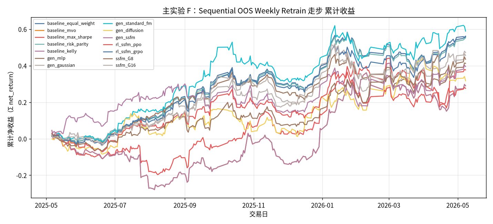

# 主实验 F：Sequential OOS Weekly Retrain 走步

- 状态: **占位（轴和表头已铺齐）**
- 编号: `M06_walkforward_oos`
- 类型: 主实验
- 说明: 仅 Sequential OOS：周五收盘后用已实现数据重训 primary+生成+RL，下周一生效。测试月 2025-05～2026-05。
- 缺测一律 `-`。曲线颜色见下表，中途不改色。

## 固定颜色

| 模型 | 颜色 |
| --- | --- |
| pred_lstm_softmax_all | #4C78A8 |
| universe_ew_all | #7F7F7F |
| baseline_equal_weight_all | #4C78A8 |
| baseline_mvo_all | #F58518 |
| baseline_max_sharpe_all | #E45756 |
| baseline_risk_parity_all | #72B7B2 |
| baseline_kelly_all | #B279A2 |
| baseline_equal_weight | #4C78A8 |
| baseline_mvo | #F58518 |
| baseline_max_sharpe | #E45756 |
| baseline_risk_parity | #72B7B2 |
| baseline_kelly | #B279A2 |
| baseline_score_softmax_all | #7F7F7F |
| gen_mlp_all | #9D755D |
| gen_gaussian_all | #BAB0AC |
| gen_standard_fm_all | #17BECF |
| gen_diffusion_all | #F2CF5B |
| gen_ssfm_all | #B279A2 |
| gen_mlp | #9D755D |
| gen_gaussian | #BAB0AC |
| gen_standard_fm | #17BECF |
| gen_diffusion | #F2CF5B |
| gen_ssfm | #B279A2 |
| rl_ssfm_ppo_all | #E45756 |
| rl_ssfm_grpo_all | #4C78A8 |
| rl_ssfm_ppo | #E45756 |
| rl_ssfm_grpo | #4C78A8 |
| ssfm_G8_all | #9D755D |
| ssfm_G16_all | #BAB0AC |
| ssfm_G8 | #9D755D |
| ssfm_G16 | #BAB0AC |

## 实验设定

- Walk-forward 测试月 2025-05 … 2026-05（2026-05 分钟数据只到 05-08）。
- 配权=全股池，cost_bps=3.0，primary=`gated_residual`。
- Sequential OOS：周五收盘重训，下周一生效。

## 13 个月进度

| month | status | n_pred_models_val | n_nav_models | leakage_audit |
| --- | --- | --- | --- | --- |
| 2025-05 | - | - | - | - |
| 2025-06 | - | - | - | - |
| 2025-07 | - | - | - | - |
| 2025-08 | - | - | - | - |
| 2025-09 | - | - | - | - |
| 2025-10 | - | - | - | - |
| 2025-11 | - | - | - | - |
| 2025-12 | - | - | - | - |
| 2026-01 | - | - | - | - |
| 2026-02 | - | - | - | - |
| 2026-03 | - | - | - | - |
| 2026-04 | - | - | - | - |
| 2026-05 | - | - | - | - |

## Validation BEST（按模型 Val MSE）

| model | MSE | MAE | IC | RankIC | topk_f1 | topk_precision | topk_recall | dir_acc | dir_f1 | dir_precision | dir_recall | top30_hit_rate | n |
| --- | --- | --- | --- | --- | --- | --- | --- | --- | --- | --- | --- | --- | --- |
| lstm | - | - | - | - | - | - | - | - | - | - | - | - | - |

## 组合绩效（已完成月份拼接）

| model | total_net_return | ann_return | sharpe | max_drawdown | mean_turnover | mean_cost | n_days |
| --- | --- | --- | --- | --- | --- | --- | --- |
| pred_lstm_softmax_all | - | - | - | - | - | - | - |
| universe_ew_all | - | - | - | - | - | - | - |
| baseline_equal_weight_all | - | - | - | - | - | - | - |
| baseline_mvo_all | - | - | - | - | - | - | - |
| baseline_max_sharpe_all | - | - | - | - | - | - | - |
| baseline_risk_parity_all | - | - | - | - | - | - | - |
| baseline_kelly_all | - | - | - | - | - | - | - |
| baseline_equal_weight | 0.5616 | 0.5817 | 2.3836 | 0.1286 | 0.0265 | 0.0000 | 245 |
| baseline_mvo | 0.2897 | 0.2991 | 0.8746 | 0.3105 | 0.9353 | 0.0003 | 245 |
| baseline_max_sharpe | 0.3768 | 0.3894 | 1.1874 | 0.2202 | 0.9166 | 0.0003 | 245 |
| baseline_risk_parity | 0.5526 | 0.5722 | 2.3853 | 0.1294 | 0.0548 | 0.0000 | 245 |
| baseline_kelly | 0.2897 | 0.2991 | 0.8746 | 0.3105 | 0.9353 | 0.0003 | 245 |
| baseline_score_softmax_all | - | - | - | - | - | - | - |
| gen_mlp_all | - | - | - | - | - | - | - |
| gen_gaussian_all | - | - | - | - | - | - | - |
| gen_standard_fm_all | - | - | - | - | - | - | - |
| gen_diffusion_all | - | - | - | - | - | - | - |
| gen_ssfm_all | - | - | - | - | - | - | - |
| gen_mlp | 0.4129 | 0.4269 | 1.8503 | 0.1422 | 0.3555 | 0.0001 | 245 |
| gen_gaussian | 0.4557 | 0.4714 | 1.6954 | 0.1663 | 0.5513 | 0.0002 | 245 |
| gen_standard_fm | 0.5891 | 0.6103 | 2.1480 | 0.1434 | 0.4930 | 0.0001 | 245 |
| gen_diffusion | 0.3173 | 0.3277 | 1.0955 | 0.1310 | 0.7365 | 0.0002 | 245 |
| gen_ssfm | 0.3952 | 0.4085 | 1.3309 | 0.1518 | 0.6675 | 0.0002 | 245 |
| rl_ssfm_ppo_all | - | - | - | - | - | - | - |
| rl_ssfm_grpo_all | - | - | - | - | - | - | - |
| rl_ssfm_ppo | 0.2758 | 0.2847 | 1.1293 | 0.1400 | 0.2858 | 0.0001 | 245 |
| rl_ssfm_grpo | 0.5578 | 0.5777 | 2.2487 | 0.1174 | 0.2808 | 0.0001 | 245 |
| ssfm_G8_all | - | - | - | - | - | - | - |
| ssfm_G16_all | - | - | - | - | - | - | - |
| ssfm_G8 | 0.4351 | 0.4500 | 1.5241 | 0.1094 | 0.6667 | 0.0002 | 245 |
| ssfm_G16 | 0.4718 | 0.4881 | 1.6186 | 0.1716 | 0.6686 | 0.0002 | 245 |

## 图（颜色已固定，无数据时只画轴）

### 累计收益

固定颜色: `pred_lstm_softmax_all` `#4C78A8`；`universe_ew_all` `#7F7F7F`；`baseline_equal_weight_all` `#4C78A8`；`baseline_mvo_all` `#F58518`；`baseline_max_sharpe_all` `#E45756`；`baseline_risk_parity_all` `#72B7B2`；`baseline_kelly_all` `#B279A2`；`baseline_equal_weight` `#4C78A8`；`baseline_mvo` `#F58518`；`baseline_max_sharpe` `#E45756`；`baseline_risk_parity` `#72B7B2`；`baseline_kelly` `#B279A2`；`baseline_score_softmax_all` `#7F7F7F`；`gen_mlp_all` `#9D755D`；`gen_gaussian_all` `#BAB0AC`；`gen_standard_fm_all` `#17BECF`；`gen_diffusion_all` `#F2CF5B`；`gen_ssfm_all` `#B279A2`；`gen_mlp` `#9D755D`；`gen_gaussian` `#BAB0AC`；`gen_standard_fm` `#17BECF`；`gen_diffusion` `#F2CF5B`；`gen_ssfm` `#B279A2`；`rl_ssfm_ppo_all` `#E45756`；`rl_ssfm_grpo_all` `#4C78A8`；`rl_ssfm_ppo` `#E45756`；`rl_ssfm_grpo` `#4C78A8`；`ssfm_G8_all` `#9D755D`；`ssfm_G16_all` `#BAB0AC`；`ssfm_G8` `#9D755D`；`ssfm_G16` `#BAB0AC`。

## 分析

以下只讨论**已经写入数字**的行；单元格为 `-` 的表示该实验尚未跑完，不编造。
来源: aggregated disk。OOS=`strict_fixed_oos`，费用=3.0bps，配权池=全股池（无 Top30）。

目前还没有任何实测单元格。图只画了坐标轴和固定颜色图例。
- 已回测净值目前最高: `ssfm_G32` 累计净收益 0.7714，Sharpe 2.2998。
- 实验 E（G 候选数，top30）累计净收益最高: `ssfm_G32` = 0.7714（G=8 0.4351；G=16 0.4718）。
