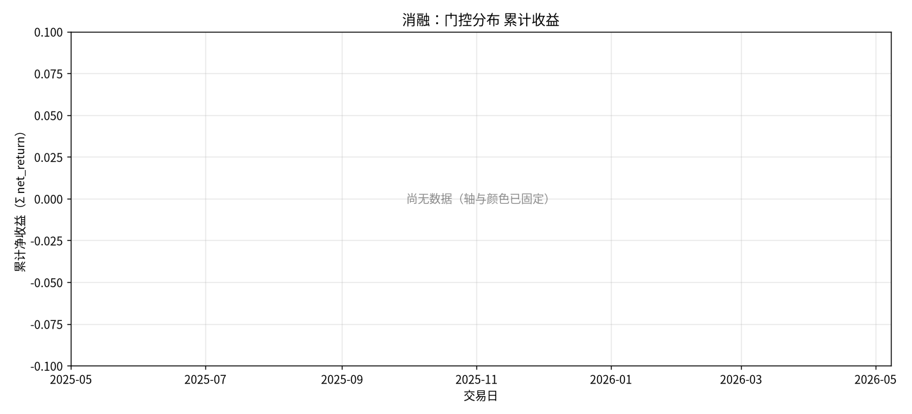

# 消融：门控分布

- 状态: **占位（轴和表头已铺齐）**
- 编号: `X04_gate`
- 类型: 消融/系统
- 说明: g 的均值/分位，检验竞价通道是否被学到。
- 缺测一律 `-`。曲线颜色见下表，中途不改色。

## 固定颜色

| 模型 | 颜色 |
| --- | --- |
| gated_residual | #B279A2 |

## 实验设定

- Walk-forward 测试月 2025-05 … 2026-05（2026-05 分钟数据只到 05-08）。
- 配权=全股池，cost_bps=3.0，primary=`gated_residual`。
- Sequential OOS：周五收盘重训，下周一生效。

## 13 个月进度

| month | status | n_pred_models_val | n_nav_models | leakage_audit |
| --- | --- | --- | --- | --- |
| 2025-05 | - | - | - | - |
| 2025-06 | - | - | - | - |
| 2025-07 | - | - | - | - |
| 2025-08 | - | - | - | - |
| 2025-09 | - | - | - | - |
| 2025-10 | - | - | - | - |
| 2025-11 | - | - | - | - |
| 2025-12 | - | - | - | - |
| 2026-01 | - | - | - | - |
| 2026-02 | - | - | - | - |
| 2026-03 | - | - | - | - |
| 2026-04 | - | - | - | - |
| 2026-05 | - | - | - | - |

## Validation BEST（按模型 Val MSE）

| model | MSE | MAE | IC | RankIC | topk_f1 | topk_precision | topk_recall | dir_acc | dir_f1 | dir_precision | dir_recall | top30_hit_rate | n |
| --- | --- | --- | --- | --- | --- | --- | --- | --- | --- | --- | --- | --- | --- |
| lstm | - | - | - | - | - | - | - | - | - | - | - | - | - |

## gate 分位

| mean | p25 | p50 | p75 | min | max | n |
| --- | --- | --- | --- | --- | --- | --- |
| - | - | - | - | - | - | - |

## 图（颜色已固定，无数据时只画轴）

### 累计收益

固定颜色: `pred_lstm_softmax_all` `#4C78A8`；`universe_ew_all` `#7F7F7F`；`baseline_equal_weight_all` `#4C78A8`；`baseline_mvo_all` `#F58518`；`baseline_max_sharpe_all` `#E45756`；`baseline_risk_parity_all` `#72B7B2`；`baseline_kelly_all` `#B279A2`；`baseline_equal_weight` `#4C78A8`；`baseline_mvo` `#F58518`；`baseline_max_sharpe` `#E45756`；`baseline_risk_parity` `#72B7B2`；`baseline_kelly` `#B279A2`；`baseline_score_softmax_all` `#7F7F7F`；`gen_mlp_all` `#9D755D`；`gen_gaussian_all` `#BAB0AC`；`gen_standard_fm_all` `#17BECF`；`gen_diffusion_all` `#F2CF5B`；`gen_ssfm_all` `#B279A2`；`gen_mlp` `#9D755D`；`gen_gaussian` `#BAB0AC`；`gen_standard_fm` `#17BECF`；`gen_diffusion` `#F2CF5B`；`gen_ssfm` `#B279A2`；`rl_ssfm_ppo_all` `#E45756`；`rl_ssfm_grpo_all` `#4C78A8`；`rl_ssfm_ppo` `#E45756`；`rl_ssfm_grpo` `#4C78A8`；`ssfm_G8_all` `#9D755D`；`ssfm_G16_all` `#BAB0AC`；`ssfm_G8` `#9D755D`；`ssfm_G16` `#BAB0AC`。

### gate 分布

固定颜色: `gated_residual` `#B279A2`。

## 分析

以下只讨论**已经写入数字**的行；单元格为 `-` 的表示该实验尚未跑完，不编造。
来源: aggregated disk。OOS=`strict_fixed_oos`，费用=3.0bps，配权池=全股池（无 Top30）。

目前还没有任何实测单元格。图只画了坐标轴和固定颜色图例。
- 已回测净值目前最高: `pred_gated_residual_softmax` 累计净收益 -0.2877，Sharpe -0.4967。
