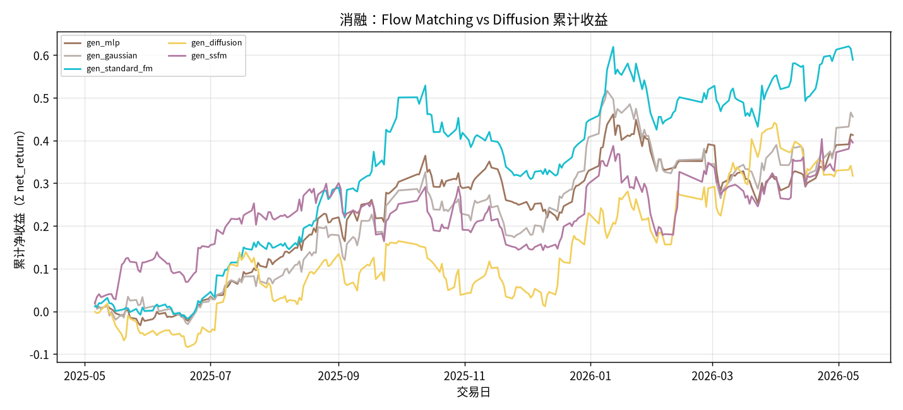

# 消融：Flow Matching vs Diffusion

- 状态: **占位（轴和表头已铺齐）**
- 编号: `X05_fm_vs_diffusion`
- 类型: 消融/系统
- 说明: MLP、高斯、标准 FM、扩散、单纯形 SS-FM 对照。
- 缺测一律 `-`。曲线颜色见下表，中途不改色。

## 固定颜色

| 模型 | 颜色 |
| --- | --- |
| gen_mlp | #9D755D |
| gen_gaussian | #BAB0AC |
| gen_standard_fm | #17BECF |
| gen_diffusion | #F2CF5B |
| gen_ssfm | #B279A2 |

## 实验设定

- Walk-forward 测试月 2025-05 … 2026-05（2026-05 分钟数据只到 05-08）。
- 配权=全股池，cost_bps=3.0，primary=`gated_residual`。
- Sequential OOS：周五收盘重训，下周一生效。

## 13 个月进度

| month | status | n_pred_models_val | n_nav_models | leakage_audit |
| --- | --- | --- | --- | --- |
| 2025-05 | - | - | - | - |
| 2025-06 | - | - | - | - |
| 2025-07 | - | - | - | - |
| 2025-08 | - | - | - | - |
| 2025-09 | - | - | - | - |
| 2025-10 | - | - | - | - |
| 2025-11 | - | - | - | - |
| 2025-12 | - | - | - | - |
| 2026-01 | - | - | - | - |
| 2026-02 | - | - | - | - |
| 2026-03 | - | - | - | - |
| 2026-04 | - | - | - | - |
| 2026-05 | - | - | - | - |

## Validation BEST（按模型 Val MSE）

| model | MSE | MAE | IC | RankIC | topk_f1 | topk_precision | topk_recall | dir_acc | dir_f1 | dir_precision | dir_recall | top30_hit_rate | n |
| --- | --- | --- | --- | --- | --- | --- | --- | --- | --- | --- | --- | --- | --- |
| lstm | - | - | - | - | - | - | - | - | - | - | - | - | - |

## 组合绩效（已完成月份拼接）

| model | total_net_return | ann_return | sharpe | max_drawdown | mean_turnover | mean_cost | n_days |
| --- | --- | --- | --- | --- | --- | --- | --- |
| gen_mlp | 0.4129 | 0.4269 | 1.8503 | 0.1422 | 0.3555 | 0.0001 | 245 |
| gen_gaussian | 0.4557 | 0.4714 | 1.6954 | 0.1663 | 0.5513 | 0.0002 | 245 |
| gen_standard_fm | 0.5891 | 0.6103 | 2.1480 | 0.1434 | 0.4930 | 0.0001 | 245 |
| gen_diffusion | 0.3173 | 0.3277 | 1.0955 | 0.1310 | 0.7365 | 0.0002 | 245 |
| gen_ssfm | 0.3952 | 0.4085 | 1.3309 | 0.1518 | 0.6675 | 0.0002 | 245 |

## 图（颜色已固定，无数据时只画轴）

### 累计收益

固定颜色: `gen_mlp` `#9D755D`；`gen_gaussian` `#BAB0AC`；`gen_standard_fm` `#17BECF`；`gen_diffusion` `#F2CF5B`；`gen_ssfm` `#B279A2`。

## 分析

以下只讨论**已经写入数字**的行；单元格为 `-` 的表示该实验尚未跑完，不编造。
来源: aggregated disk。OOS=`strict_fixed_oos`，费用=3.0bps，配权池=全股池（无 Top30）。

目前还没有任何实测单元格。图只画了坐标轴和固定颜色图例。
- 已回测净值目前最高: `gen_standard_fm_top30` 累计净收益 0.5891，Sharpe 2.1480。
