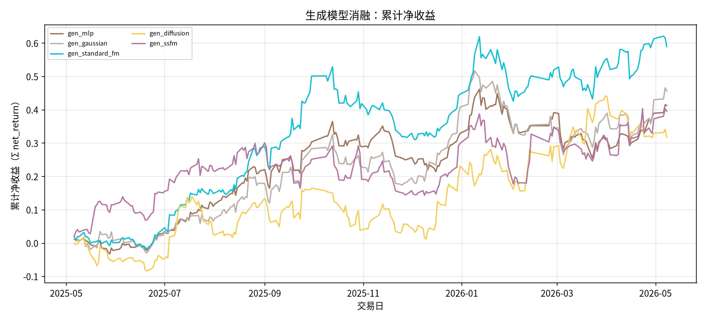
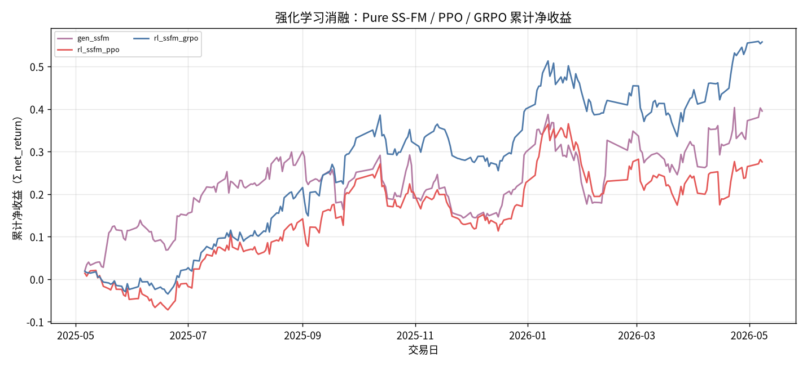
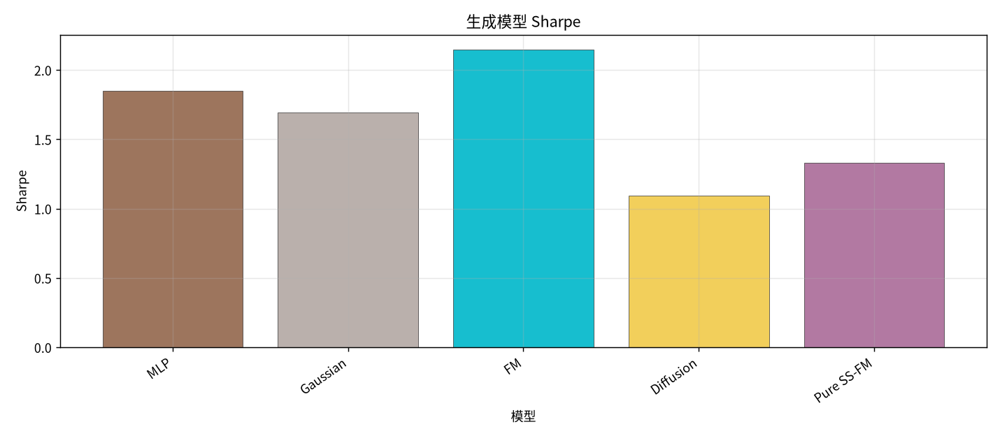
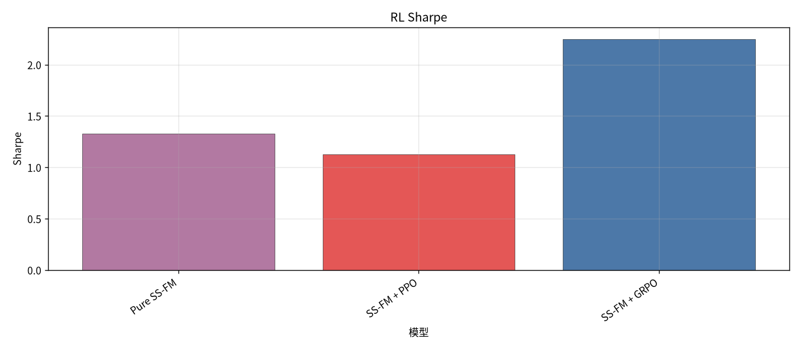
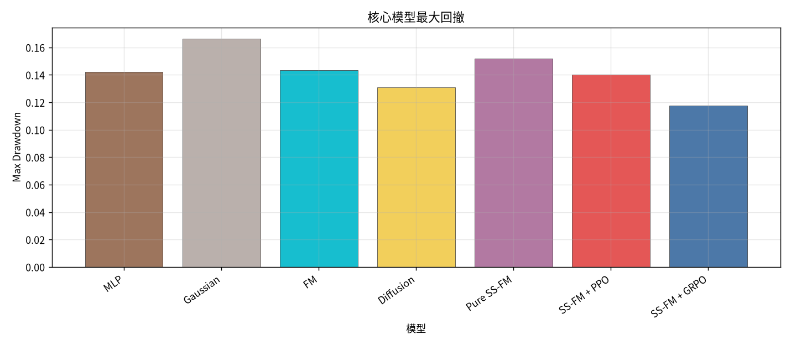
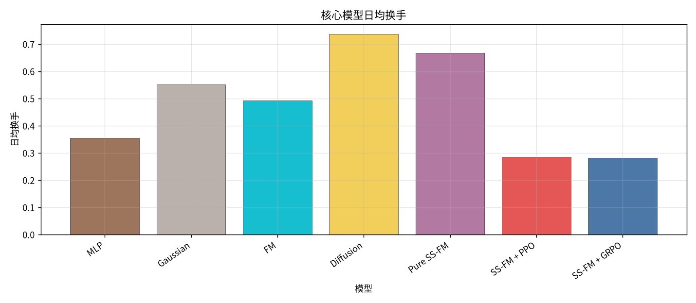
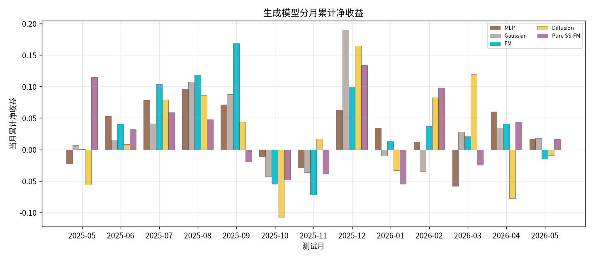
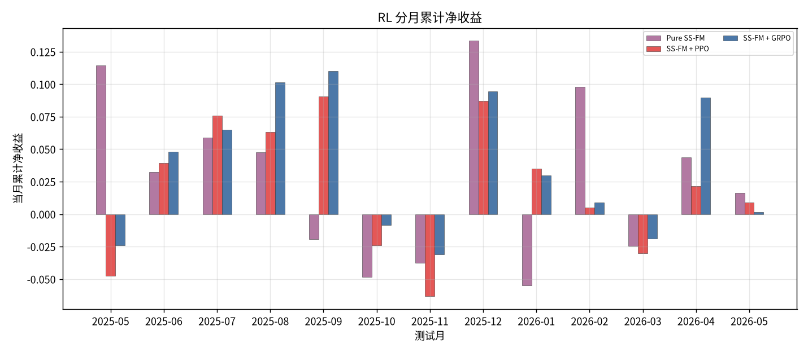
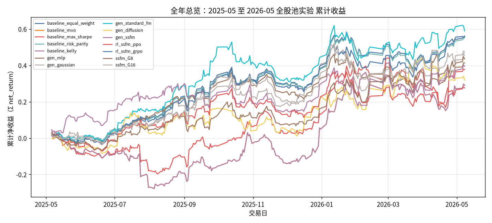

# 全年总览：2025-05 至 2026-05 全股池实验

- 状态: **13 个测试月均已写入**
- 编号: `全年总览`
- 类型: 全年总览
- 说明: 13 个测试月拼接：LSTM minute-only Alpha → 生成模型（MLP / Gaussian / FM / Diffusion / SS-FM）→ SS-FM+PPO/GRPO。全股池配权、下一日 close-to-close。
- 缺测一律 `-`。曲线颜色见下表，中途不改色。

## 固定颜色

| 模型 | 颜色 |
| --- | --- |
| gen_mlp | #9D755D |
| gen_gaussian | #BAB0AC |
| gen_standard_fm | #17BECF |
| gen_diffusion | #F2CF5B |
| gen_ssfm | #B279A2 |
| rl_ssfm_ppo | #E45756 |
| rl_ssfm_grpo | #4C78A8 |

## 实验设定

- Walk-forward 测试月 2025-05 … 2026-05（2026-05 分钟数据只到 05-08）。
- 配权=全股池，cost_bps=3.0，primary=`gated_residual`。
- Sequential OOS：周五收盘重训，下周一生效。

## 单月全股池报告

正本在 `results/full_universe/`，镜像在 `results/full/`（图仍指向正本 `figures/`）。

| 月份 | 正本 | 镜像 |
| --- | --- | --- |
| 2025-05 | [实验分析_全股池配权.md](../../sequential_oos_weekly_retrain/test_month=2025-05/实验分析_全股池配权.md) | [镜像](../../../full/sequential_oos_weekly_retrain/test_month=2025-05/实验分析_全股池配权.md) |
| 2025-06 | [实验分析_全股池配权.md](../../sequential_oos_weekly_retrain/test_month=2025-06/实验分析_全股池配权.md) | [镜像](../../../full/sequential_oos_weekly_retrain/test_month=2025-06/实验分析_全股池配权.md) |
| 2025-07 | [实验分析_全股池配权.md](../../sequential_oos_weekly_retrain/test_month=2025-07/实验分析_全股池配权.md) | [镜像](../../../full/sequential_oos_weekly_retrain/test_month=2025-07/实验分析_全股池配权.md) |
| 2025-08 | [实验分析_全股池配权.md](../../sequential_oos_weekly_retrain/test_month=2025-08/实验分析_全股池配权.md) | [镜像](../../../full/sequential_oos_weekly_retrain/test_month=2025-08/实验分析_全股池配权.md) |
| 2025-09 | [实验分析_全股池配权.md](../../sequential_oos_weekly_retrain/test_month=2025-09/实验分析_全股池配权.md) | [镜像](../../../full/sequential_oos_weekly_retrain/test_month=2025-09/实验分析_全股池配权.md) |
| 2025-10 | [实验分析_全股池配权.md](../../sequential_oos_weekly_retrain/test_month=2025-10/实验分析_全股池配权.md) | [镜像](../../../full/sequential_oos_weekly_retrain/test_month=2025-10/实验分析_全股池配权.md) |
| 2025-11 | [实验分析_全股池配权.md](../../sequential_oos_weekly_retrain/test_month=2025-11/实验分析_全股池配权.md) | [镜像](../../../full/sequential_oos_weekly_retrain/test_month=2025-11/实验分析_全股池配权.md) |
| 2025-12 | [实验分析_全股池配权.md](../../sequential_oos_weekly_retrain/test_month=2025-12/实验分析_全股池配权.md) | [镜像](../../../full/sequential_oos_weekly_retrain/test_month=2025-12/实验分析_全股池配权.md) |
| 2026-01 | [实验分析_全股池配权.md](../../sequential_oos_weekly_retrain/test_month=2026-01/实验分析_全股池配权.md) | [镜像](../../../full/sequential_oos_weekly_retrain/test_month=2026-01/实验分析_全股池配权.md) |
| 2026-02 | [实验分析_全股池配权.md](../../sequential_oos_weekly_retrain/test_month=2026-02/实验分析_全股池配权.md) | [镜像](../../../full/sequential_oos_weekly_retrain/test_month=2026-02/实验分析_全股池配权.md) |
| 2026-03 | [实验分析_全股池配权.md](../../sequential_oos_weekly_retrain/test_month=2026-03/实验分析_全股池配权.md) | [镜像](../../../full/sequential_oos_weekly_retrain/test_month=2026-03/实验分析_全股池配权.md) |
| 2026-04 | [实验分析_全股池配权.md](../../sequential_oos_weekly_retrain/test_month=2026-04/实验分析_全股池配权.md) | [镜像](../../../full/sequential_oos_weekly_retrain/test_month=2026-04/实验分析_全股池配权.md) |
| 2026-05 | [实验分析_全股池配权.md](../../sequential_oos_weekly_retrain/test_month=2026-05/实验分析_全股池配权.md) | [镜像](../../../full/sequential_oos_weekly_retrain/test_month=2026-05/实验分析_全股池配权.md) |

相关全年切片：[`M03 生成`](../M03_generative/实验分析.md) · [`M04 RL`](../M04_rl/实验分析.md) · [`X05 FM vs Diffusion`](../X05_fm_vs_diffusion/实验分析.md) · [`X06 PPO vs GRPO`](../X06_ppo_vs_grpo/实验分析.md) · [实验目录](../实验目录.md)

## 论文主线

LSTM minute-only 预测下一日 close-to-close，全股池 long-only simplex 配权。比较组合生成（MLP / Gaussian / FM / Diffusion / SS-FM）以及在 SS-FM 上叠加 PPO / GRPO。

## 生成模型消融总表

| model | total_net_return | ann_return | sharpe | max_drawdown | mean_turnover | mean_cost | n_days |
| --- | --- | --- | --- | --- | --- | --- | --- |
| MLP | 0.4129 | 0.4269 | 1.8503 | 0.1422 | 0.3555 | 0.0001 | 245 |
| Gaussian | 0.4557 | 0.4714 | 1.6954 | 0.1663 | 0.5513 | 0.0002 | 245 |
| FM | 0.5891 | 0.6103 | 2.1480 | 0.1434 | 0.4930 | 0.0001 | 245 |
| Diffusion | 0.3173 | 0.3277 | 1.0955 | 0.1310 | 0.7365 | 0.0002 | 245 |
| Pure SS-FM | 0.3952 | 0.4085 | 1.3309 | 0.1518 | 0.6675 | 0.0002 | 245 |

## 生成模型分月净收益

| month | MLP | Gaussian | FM | Diffusion | Pure SS-FM |
| --- | --- | --- | --- | --- | --- |
| 2025-05 | -0.0226 | 0.0070 | 0.0007 | -0.0561 | 0.1145 |
| 2025-06 | 0.0528 | 0.0157 | 0.0407 | 0.0085 | 0.0322 |
| 2025-07 | 0.0787 | 0.0413 | 0.1032 | 0.0794 | 0.0589 |
| 2025-08 | 0.0959 | 0.1074 | 0.1182 | 0.0862 | 0.0474 |
| 2025-09 | 0.0712 | 0.0878 | 0.1683 | 0.0435 | -0.0192 |
| 2025-10 | -0.0111 | -0.0430 | -0.0550 | -0.1075 | -0.0483 |
| 2025-11 | -0.0294 | -0.0366 | -0.0720 | 0.0167 | -0.0376 |
| 2025-12 | 0.0628 | 0.1899 | 0.0992 | 0.1644 | 0.1334 |
| 2026-01 | 0.0345 | -0.0104 | 0.0126 | -0.0328 | -0.0548 |
| 2026-02 | 0.0119 | -0.0346 | 0.0371 | 0.0823 | 0.0980 |
| 2026-03 | -0.0581 | 0.0279 | 0.0204 | 0.1194 | -0.0245 |
| 2026-04 | 0.0603 | 0.0343 | 0.0404 | -0.0778 | 0.0437 |
| 2026-05 | 0.0169 | 0.0181 | -0.0148 | -0.0093 | 0.0164 |

## 强化学习消融总表

| model | total_net_return | ann_return | sharpe | max_drawdown | mean_turnover | mean_cost | n_days |
| --- | --- | --- | --- | --- | --- | --- | --- |
| Pure SS-FM | 0.3952 | 0.4085 | 1.3309 | 0.1518 | 0.6675 | 0.0002 | 245 |
| SS-FM + PPO | 0.2758 | 0.2847 | 1.1293 | 0.1400 | 0.2858 | 0.0001 | 245 |
| SS-FM + GRPO | 0.5578 | 0.5777 | 2.2487 | 0.1174 | 0.2808 | 0.0001 | 245 |

## RL 分月净收益

| month | Pure SS-FM | SS-FM + PPO | SS-FM + GRPO |
| --- | --- | --- | --- |
| 2025-05 | 0.1145 | -0.0475 | -0.0240 |
| 2025-06 | 0.0322 | 0.0394 | 0.0481 |
| 2025-07 | 0.0589 | 0.0756 | 0.0650 |
| 2025-08 | 0.0474 | 0.0633 | 0.1013 |
| 2025-09 | -0.0192 | 0.0904 | 0.1101 |
| 2025-10 | -0.0483 | -0.0240 | -0.0084 |
| 2025-11 | -0.0376 | -0.0633 | -0.0311 |
| 2025-12 | 0.1334 | 0.0871 | 0.0945 |
| 2026-01 | -0.0548 | 0.0348 | 0.0297 |
| 2026-02 | 0.0980 | 0.0051 | 0.0089 |
| 2026-03 | -0.0245 | -0.0300 | -0.0189 |
| 2026-04 | 0.0437 | 0.0216 | 0.0895 |
| 2026-05 | 0.0164 | 0.0087 | 0.0017 |

## 全年综合结果总表

| model | total_net_return | ann_return | sharpe | max_drawdown | mean_turnover | mean_cost | n_days |
| --- | --- | --- | --- | --- | --- | --- | --- |
| MLP | 0.4129 | 0.4269 | 1.8503 | 0.1422 | 0.3555 | 0.0001 | 245 |
| Gaussian | 0.4557 | 0.4714 | 1.6954 | 0.1663 | 0.5513 | 0.0002 | 245 |
| FM | 0.5891 | 0.6103 | 2.1480 | 0.1434 | 0.4930 | 0.0001 | 245 |
| Diffusion | 0.3173 | 0.3277 | 1.0955 | 0.1310 | 0.7365 | 0.0002 | 245 |
| Pure SS-FM | 0.3952 | 0.4085 | 1.3309 | 0.1518 | 0.6675 | 0.0002 | 245 |
| SS-FM + PPO | 0.2758 | 0.2847 | 1.1293 | 0.1400 | 0.2858 | 0.0001 | 245 |
| SS-FM + GRPO | 0.5578 | 0.5777 | 2.2487 | 0.1174 | 0.2808 | 0.0001 | 245 |

## 13 个月进度

| month | status | n_pred_models_val | n_nav_models | leakage_audit |
| --- | --- | --- | --- | --- |
| 2025-05 | 已写入 | - | - | - |
| 2025-06 | 已写入 | - | - | - |
| 2025-07 | 已写入 | - | - | - |
| 2025-08 | 已写入 | - | - | - |
| 2025-09 | 已写入 | - | - | - |
| 2025-10 | 已写入 | - | - | - |
| 2025-11 | 已写入 | - | - | - |
| 2025-12 | 已写入 | - | - | - |
| 2026-01 | 已写入 | - | - | - |
| 2026-02 | 已写入 | - | - | - |
| 2026-03 | 已写入 | - | - | - |
| 2026-04 | 已写入 | - | - | - |
| 2026-05 | 已写入 | - | - | - |

## 图（颜色已固定，无数据时只画轴）

### 生成模型累计净值

固定颜色: `gen_mlp` `#9D755D`；`gen_gaussian` `#BAB0AC`；`gen_standard_fm` `#17BECF`；`gen_diffusion` `#F2CF5B`；`gen_ssfm` `#B279A2`。

### RL 累计净值

固定颜色: `gen_ssfm` `#B279A2`；`rl_ssfm_ppo` `#E45756`；`rl_ssfm_grpo` `#4C78A8`。

### 生成模型 Sharpe

固定颜色: `gen_mlp` `#9D755D`；`gen_gaussian` `#BAB0AC`；`gen_standard_fm` `#17BECF`；`gen_diffusion` `#F2CF5B`；`gen_ssfm` `#B279A2`。

### RL Sharpe

固定颜色: `gen_ssfm` `#B279A2`；`rl_ssfm_ppo` `#E45756`；`rl_ssfm_grpo` `#4C78A8`。

### 最大回撤

固定颜色: `gen_mlp` `#9D755D`；`gen_gaussian` `#BAB0AC`；`gen_standard_fm` `#17BECF`；`gen_diffusion` `#F2CF5B`；`gen_ssfm` `#B279A2`；`rl_ssfm_ppo` `#E45756`；`rl_ssfm_grpo` `#4C78A8`。

### 日均换手

固定颜色: `gen_mlp` `#9D755D`；`gen_gaussian` `#BAB0AC`；`gen_standard_fm` `#17BECF`；`gen_diffusion` `#F2CF5B`；`gen_ssfm` `#B279A2`；`rl_ssfm_ppo` `#E45756`；`rl_ssfm_grpo` `#4C78A8`。

### 生成模型分月收益

固定颜色: `gen_mlp` `#9D755D`；`gen_gaussian` `#BAB0AC`；`gen_standard_fm` `#17BECF`；`gen_diffusion` `#F2CF5B`；`gen_ssfm` `#B279A2`。

### RL 分月收益

固定颜色: `gen_ssfm` `#B279A2`；`rl_ssfm_ppo` `#E45756`；`rl_ssfm_grpo` `#4C78A8`。

### 累计收益

固定颜色: `pred_lstm_softmax_all` `#4C78A8`；`universe_ew_all` `#7F7F7F`；`baseline_equal_weight_all` `#4C78A8`；`baseline_mvo_all` `#F58518`；`baseline_max_sharpe_all` `#E45756`；`baseline_risk_parity_all` `#72B7B2`；`baseline_kelly_all` `#B279A2`；`baseline_equal_weight` `#4C78A8`；`baseline_mvo` `#F58518`；`baseline_max_sharpe` `#E45756`；`baseline_risk_parity` `#72B7B2`；`baseline_kelly` `#B279A2`；`baseline_score_softmax_all` `#7F7F7F`；`gen_mlp_all` `#9D755D`；`gen_gaussian_all` `#BAB0AC`；`gen_standard_fm_all` `#17BECF`；`gen_diffusion_all` `#F2CF5B`；`gen_ssfm_all` `#B279A2`；`gen_mlp` `#9D755D`；`gen_gaussian` `#BAB0AC`；`gen_standard_fm` `#17BECF`；`gen_diffusion` `#F2CF5B`；`gen_ssfm` `#B279A2`；`rl_ssfm_ppo_all` `#E45756`；`rl_ssfm_grpo_all` `#4C78A8`；`rl_ssfm_ppo` `#E45756`；`rl_ssfm_grpo` `#4C78A8`；`ssfm_G8_all` `#9D755D`；`ssfm_G16_all` `#BAB0AC`；`ssfm_G8` `#9D755D`；`ssfm_G16` `#BAB0AC`。

## 分析

分析主线是 **LSTM Alpha → 组合生成 → RL 配权优化**，不再比较其它预测骨干。
缺测单元格为 `-`（例如 2025-05～09 全股池未跑 MLP/Gaussian 时），不补 0。

### SS-FM 相对 FM / Diffusion / MLP / Gaussian
- 全年累计净收益最高: `FM` = 0.5891。
- Sharpe 最高: `FM` = 2.1480。
- 最大回撤最小: `Diffusion` = 0.1310。
- 日均换手最低: `MLP` = 0.3555。
- 点估计对照（拼接 OOS）：Pure SS-FM 收益 `0.3952` / Sharpe `1.3309` / 换手 `0.6675`；FM `0.5891` / `2.1480`；Diffusion `0.3173` / `1.0955`。

### PPO / GRPO 相对 Pure SS-FM
- Pure SS-FM 收益 `0.3952` Sharpe `1.3309` 换手 `0.6675`。
- SS-FM + PPO 收益 `0.2758` Sharpe `1.1293` 换手 `0.2858`。
- SS-FM + GRPO 收益 `0.5578` Sharpe `2.2487` 换手 `0.2808`。
- 若 RL 换手明显低于纯 SS-FM 而收益更高，优先解释为摩擦下降，而不是新的截面 alpha。
