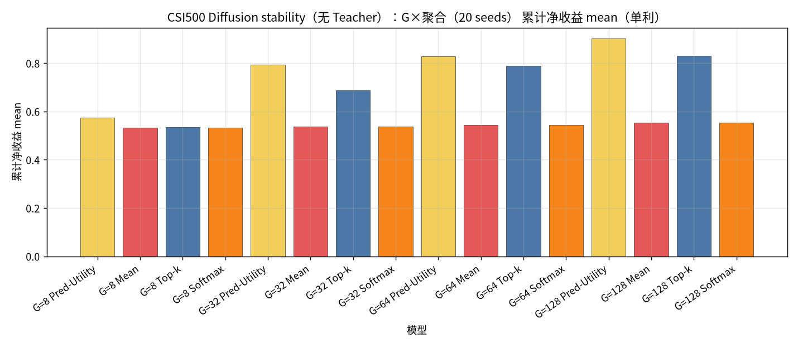
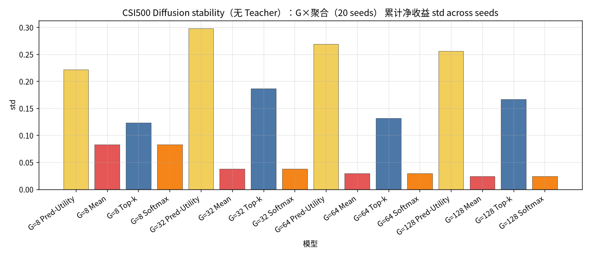
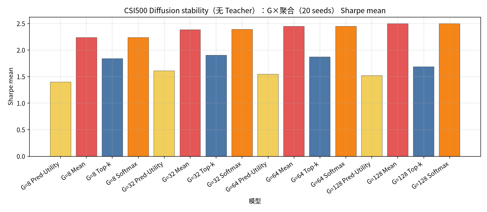
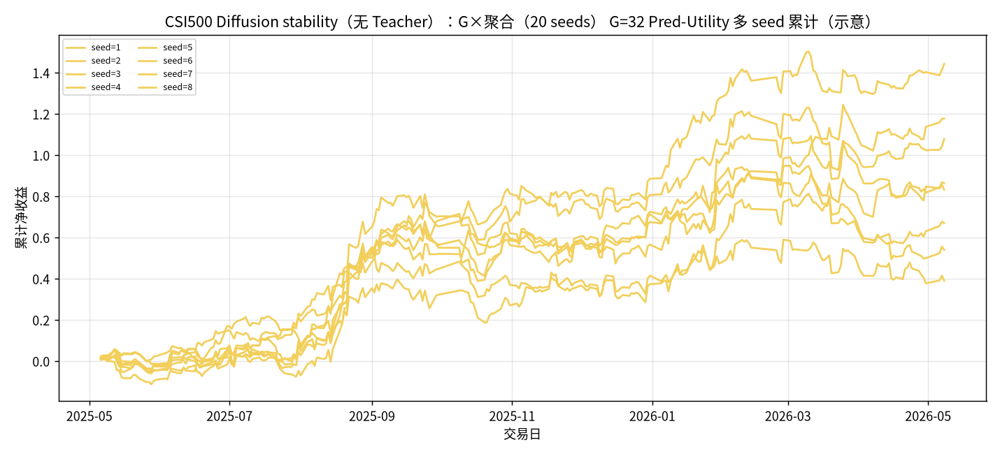

# CSI500 Diffusion stability（无 Teacher）：G×聚合（20 seeds）

设定：冻结 CSI500 Top30 最新 Alpha+Diffusion（**不训练**）；**候选 = G 条 Diffusion（不含 Teacher）**；**G ∈ {8, 32, 64, 128}**；**seed ∈ {1..20}**；每日 `noise = hash(date, seed)`。同 (日,G,seed) 只建一次样本池，四种聚合共享。

聚合：Pred-Utility / Mean / Top-k=3 / Softmax(τ=1.0)。下表为 **across seeds 的 mean±std（单利）**。

产物：`results/CSI500/strict_fixed_oos_diff_stability_seeds/`。约 **245** 日 × 20 seeds。

| G | Pred-Utility | Mean | Top-k | Softmax |
| --- | --- | --- | --- | --- |
| G=8 | 0.5732±0.2214 | 0.5331±0.0828 | 0.5348±0.1236 | 0.5335±0.0827 |
| G=32 | 0.7926±0.2978 | 0.5372±0.0377 | 0.6879±0.1862 | 0.5375±0.0377 |
| G=64 | 0.8285±0.2693 | 0.5448±0.0292 | 0.7902±0.1318 | 0.5451±0.0292 |
| G=128 | 0.9018±0.2561 | 0.5531±0.0244 | 0.8303±0.1670 | 0.5534±0.0244 |

| G | agg | n | total mean±std | min | max | sharpe mean±std | turnover mean |
| --- | --- | --- | --- | --- | --- | --- | --- |
| 8 | Pred-Utility | 20 | 0.5732±0.2214 | -0.1122 | 0.9090 | 1.3957±0.5562 | 0.7852 |
| 8 | Mean | 20 | 0.5331±0.0828 | 0.3947 | 0.7341 | 2.2366±0.3430 | 0.5314 |
| 8 | Top-k | 20 | 0.5348±0.1236 | 0.2903 | 0.7896 | 1.8397±0.4282 | 0.6536 |
| 8 | Softmax | 20 | 0.5335±0.0827 | 0.3951 | 0.7340 | 2.2372±0.3426 | 0.5313 |
| 32 | Pred-Utility | 20 | 0.7926±0.2978 | 0.2956 | 1.4424 | 1.6064±0.5860 | 0.6391 |
| 32 | Mean | 20 | 0.5372±0.0377 | 0.4604 | 0.6016 | 2.3868±0.1550 | 0.3157 |
| 32 | Top-k | 20 | 0.6879±0.1862 | 0.3080 | 0.9855 | 1.9023±0.5216 | 0.5825 |
| 32 | Softmax | 20 | 0.5375±0.0377 | 0.4605 | 0.6017 | 2.3871±0.1551 | 0.3156 |
| 64 | Pred-Utility | 20 | 0.8285±0.2693 | 0.5027 | 1.6034 | 1.5455±0.4886 | 0.5154 |
| 64 | Mean | 20 | 0.5448±0.0292 | 0.4882 | 0.6219 | 2.4457±0.1254 | 0.2395 |
| 64 | Top-k | 20 | 0.7902±0.1318 | 0.6221 | 1.1352 | 1.8738±0.3308 | 0.5141 |
| 64 | Softmax | 20 | 0.5451±0.0292 | 0.4883 | 0.6220 | 2.4460±0.1255 | 0.2395 |
| 128 | Pred-Utility | 20 | 0.9018±0.2561 | 0.2829 | 1.5186 | 1.5210±0.4038 | 0.3801 |
| 128 | Mean | 20 | 0.5531±0.0244 | 0.5005 | 0.5937 | 2.4975±0.1116 | 0.1865 |
| 128 | Top-k | 20 | 0.8303±0.1670 | 0.5003 | 1.1507 | 1.6833±0.3366 | 0.4242 |
| 128 | Softmax | 20 | 0.5534±0.0244 | 0.5006 | 0.5940 | 2.4977±0.1117 | 0.1864 |

### 累计净收益 mean

### 累计净收益 std

### Sharpe mean

### G=32 Pred-Utility 多seed累计

### 结论

- across-seed 均值最高：`G=128 Pred-Utility` = `0.9018±0.2561`（range [0.2829, 1.5186]）。
