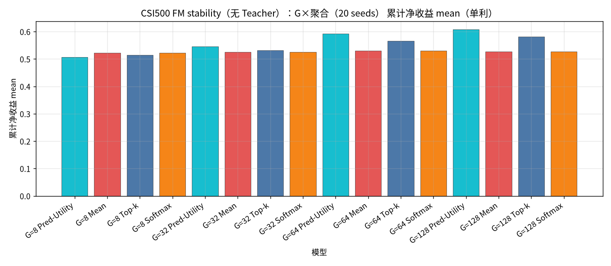
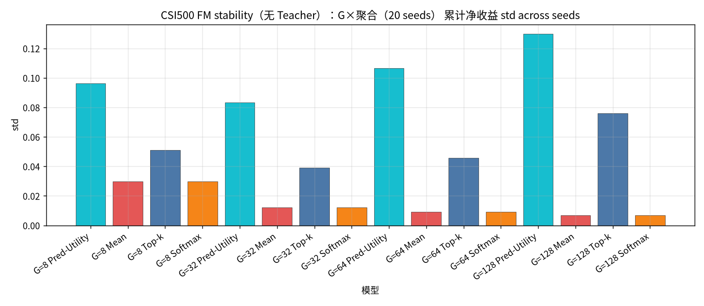
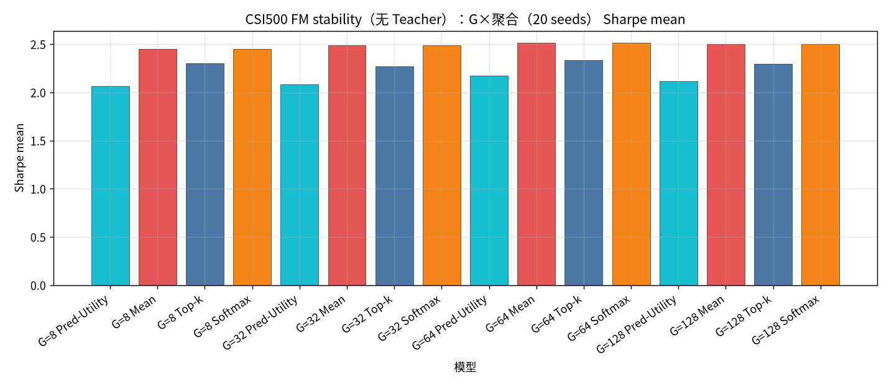
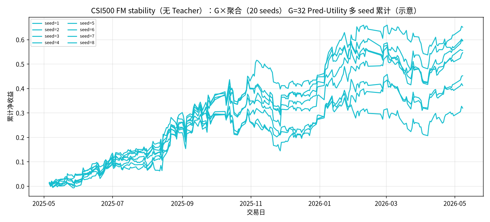

# CSI500 FM stability（无 Teacher）：G×聚合（20 seeds）

设定：冻结 CSI500 Top30 最新 Alpha+FM（**不训练**）；**候选 = G 条 FM（不含 Teacher）**；**G ∈ {8, 32, 64, 128}**；**seed ∈ {1..20}**；每日 `noise = hash(date, seed)`。同 (日,G,seed) 只建一次样本池，四种聚合共享。

聚合：Pred-Utility / Mean / Top-k=3 / Softmax(τ=1.0)。下表为 **across seeds 的 mean±std（单利）**。

产物：`results/CSI500/strict_fixed_oos_fm_stability_seeds/`。约 **245** 日 × 20 seeds。

| G | Pred-Utility | Mean | Top-k | Softmax |
| --- | --- | --- | --- | --- |
| G=8 | 0.5066±0.0964 | 0.5221±0.0297 | 0.5146±0.0510 | 0.5221±0.0297 |
| G=32 | 0.5451±0.0832 | 0.5256±0.0120 | 0.5322±0.0392 | 0.5256±0.0120 |
| G=64 | 0.5922±0.1065 | 0.5297±0.0091 | 0.5667±0.0457 | 0.5297±0.0091 |
| G=128 | 0.6079±0.1298 | 0.5274±0.0067 | 0.5814±0.0759 | 0.5275±0.0067 |

| G | agg | n | total mean±std | min | max | sharpe mean±std | turnover mean |
| --- | --- | --- | --- | --- | --- | --- | --- |
| 8 | Pred-Utility | 20 | 0.5066±0.0964 | 0.3227 | 0.7440 | 2.0652±0.3785 | 0.4992 |
| 8 | Mean | 20 | 0.5221±0.0297 | 0.4690 | 0.5719 | 2.4479±0.1338 | 0.2402 |
| 8 | Top-k | 20 | 0.5146±0.0510 | 0.4192 | 0.6028 | 2.3033±0.2047 | 0.3378 |
| 8 | Softmax | 20 | 0.5221±0.0297 | 0.4690 | 0.5720 | 2.4479±0.1338 | 0.2402 |
| 32 | Pred-Utility | 20 | 0.5451±0.0832 | 0.3193 | 0.6558 | 2.0837±0.3004 | 0.4995 |
| 32 | Mean | 20 | 0.5256±0.0120 | 0.4989 | 0.5464 | 2.4886±0.0581 | 0.1476 |
| 32 | Top-k | 20 | 0.5322±0.0392 | 0.4698 | 0.6048 | 2.2690±0.1654 | 0.3400 |
| 32 | Softmax | 20 | 0.5256±0.0120 | 0.4989 | 0.5465 | 2.4886±0.0581 | 0.1476 |
| 64 | Pred-Utility | 20 | 0.5922±0.1065 | 0.3769 | 0.7596 | 2.1711±0.4027 | 0.4989 |
| 64 | Mean | 20 | 0.5297±0.0091 | 0.5172 | 0.5531 | 2.5125±0.0452 | 0.1215 |
| 64 | Top-k | 20 | 0.5667±0.0457 | 0.4792 | 0.6579 | 2.3316±0.2029 | 0.3423 |
| 64 | Softmax | 20 | 0.5297±0.0091 | 0.5172 | 0.5532 | 2.5125±0.0452 | 0.1215 |
| 128 | Pred-Utility | 20 | 0.6079±0.1298 | 0.3281 | 0.9083 | 2.1155±0.4412 | 0.4991 |
| 128 | Mean | 20 | 0.5274±0.0067 | 0.5155 | 0.5455 | 2.5021±0.0296 | 0.1049 |
| 128 | Top-k | 20 | 0.5814±0.0759 | 0.4091 | 0.7822 | 2.2953±0.2867 | 0.3458 |
| 128 | Softmax | 20 | 0.5275±0.0067 | 0.5155 | 0.5456 | 2.5021±0.0296 | 0.1049 |

### 累计净收益 mean

### 累计净收益 std

### Sharpe mean

### G=32 Pred-Utility 多seed累计

### 结论

- across-seed 均值最高：`G=128 Pred-Utility` = `0.6079±0.1298`（range [0.3281, 0.9083]）。
