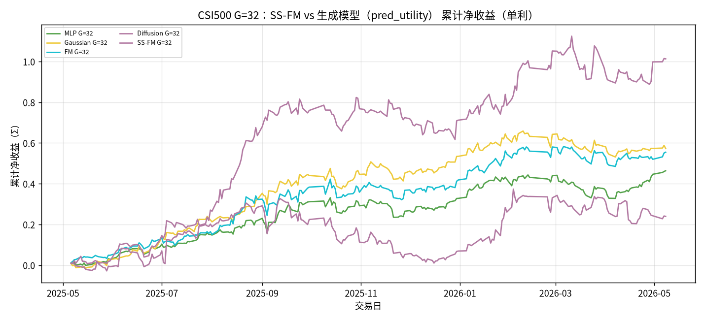
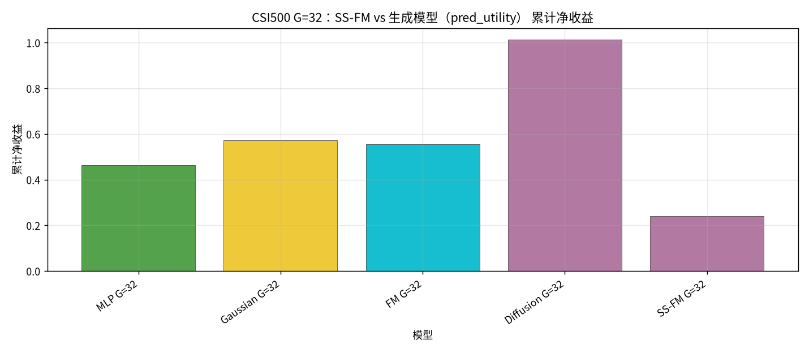
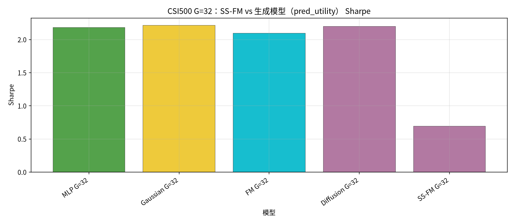
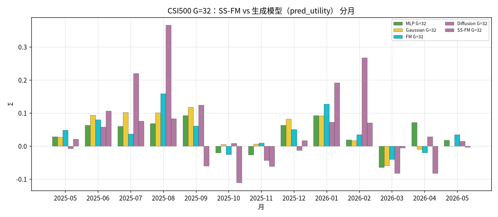

# CSI500 G=32：SS-FM vs MLP / Gaussian / FM / Diffusion

设定：冻结 Alpha + 生成 ckpt；**G=32**；选仓 = G 样本 → `pred_utility`（**不含 Teacher**）。**单利 Σ**，245 日。

产物：`results/CSI500/strict_fixed_oos_g32_gens/`。

| model | total | sharpe | mdd | turnover | n_days |
| --- | --- | --- | --- | --- | --- |
| MLP G=32 | 0.4637 | 2.1829 | 0.1117 | 0.3402 | 245 |
| Gaussian G=32 | 0.5731 | 2.2150 | 0.1250 | 0.5673 | 245 |
| FM G=32 | 0.5546 | 2.0959 | 0.1005 | 0.4961 | 245 |
| Diffusion G=32 | 1.0130 | 2.2011 | 0.2270 | 0.6213 | 245 |
| SS-FM G=32 | 0.2396 | 0.6929 | 0.2816 | 0.6914 | 245 |

| month | MLP G=32 | Gaussian G=32 | FM G=32 | Diffusion G=32 | SS-FM G=32 |
| --- | --- | --- | --- | --- | --- |
| 2025-05 | 0.0284 | 0.0269 | 0.0486 | -0.0075 | 0.0205 |
| 2025-06 | 0.0627 | 0.0935 | 0.0795 | 0.0580 | 0.1057 |
| 2025-07 | 0.0597 | 0.1017 | 0.0365 | 0.2201 | 0.0755 |
| 2025-08 | 0.0681 | 0.1008 | 0.1581 | 0.3655 | 0.0826 |
| 2025-09 | 0.0924 | 0.1174 | 0.0605 | 0.1237 | -0.0600 |
| 2025-10 | -0.0199 | 0.0053 | -0.0250 | 0.0082 | -0.1110 |
| 2025-11 | -0.0266 | 0.0065 | 0.0095 | -0.0436 | -0.0609 |
| 2025-12 | 0.0631 | 0.0823 | 0.0506 | -0.0124 | 0.0170 |
| 2026-01 | 0.0927 | 0.0911 | 0.1271 | 0.0726 | 0.1915 |
| 2026-02 | 0.0185 | 0.0168 | 0.0349 | 0.2670 | 0.0698 |
| 2026-03 | -0.0643 | -0.0594 | -0.0399 | -0.0822 | -0.0060 |
| 2026-04 | 0.0713 | -0.0099 | -0.0206 | 0.0287 | -0.0820 |
| 2026-05 | 0.0174 | 0.0001 | 0.0348 | 0.0149 | -0.0031 |

### 累计净收益

### 累计净收益柱

### Sharpe

### 分月收益

### 结论

- 单利最高：`Diffusion G=32` = `1.0130`（Sharpe `2.2011`）。
- SS-FM G=32 = `0.2396`；相对最优差距 `-0.7735`。
