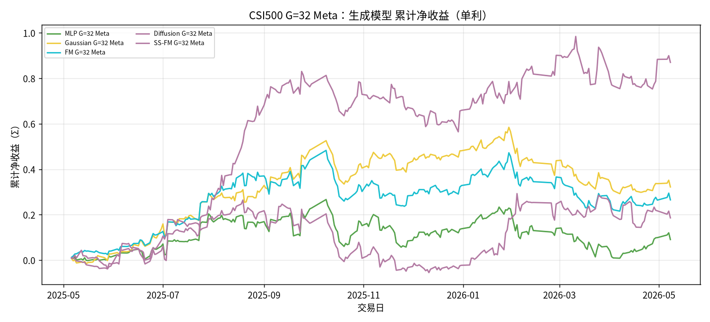
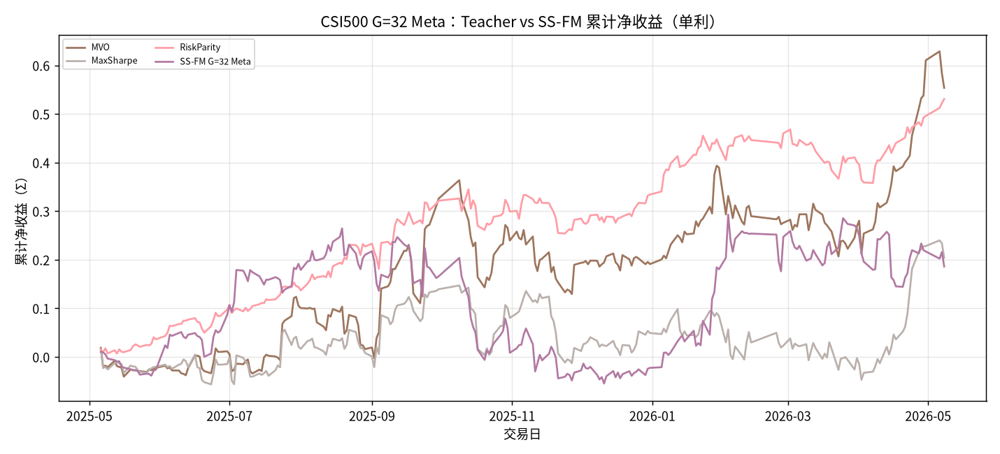
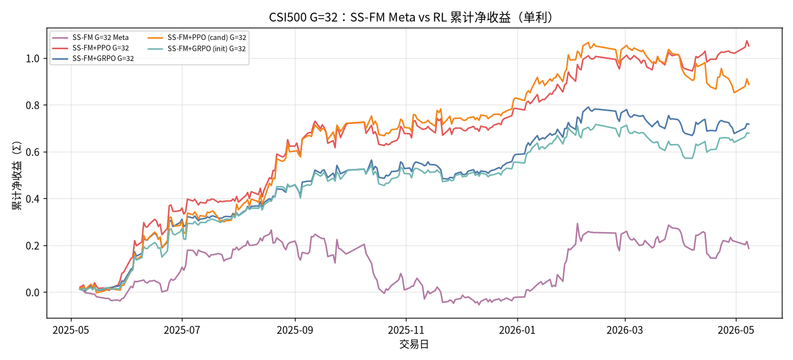

# CSI500 G=32 Meta：SS-FM vs 生成 / Teacher / RL

设定：冻结 Alpha + 生成 ckpt；**G=32**；**Meta** = 样本∪Teacher → `pred_utility`。RL 为既有 `rl_g32` / ablation 叠加（非 Meta 重训）。**单利 Σ**，245 日。

产物：`results/CSI500/strict_fixed_oos_g32_meta/`。

## A. SS-FM vs 其他生成模型（G=32 Meta）

| model | total | sharpe | mdd | turnover | n_days |
| --- | --- | --- | --- | --- | --- |
| MLP G=32 Meta | 0.0906 | 0.2888 | 0.2478 | 0.6611 | 245 |
| Gaussian G=32 Meta | 0.3220 | 1.0075 | 0.2641 | 0.6953 | 245 |
| FM G=32 Meta | 0.2652 | 0.8037 | 0.2565 | 0.6673 | 245 |
| Diffusion G=32 Meta | 0.8701 | 1.8340 | 0.2480 | 0.6335 | 245 |
| SS-FM G=32 Meta | 0.1859 | 0.5164 | 0.2922 | 0.7499 | 245 |

## B. SS-FM vs Teacher

| model | total | sharpe | mdd | turnover | n_days |
| --- | --- | --- | --- | --- | --- |
| MVO | 0.5537 | 1.4550 | 0.2188 | 0.9376 | 245 |
| MaxSharpe | 0.2040 | 0.6746 | 0.1955 | 0.9204 | 245 |
| RiskParity | 0.5307 | 2.5471 | 0.1065 | 0.0549 | 245 |
| SS-FM G=32 Meta | 0.1859 | 0.5164 | 0.2922 | 0.7499 | 245 |

## C. SS-FM Meta vs RL（RL 为既有冻结策略）

| model | total | sharpe | mdd | turnover | n_days |
| --- | --- | --- | --- | --- | --- |
| SS-FM G=32 Meta | 0.1859 | 0.5164 | 0.2922 | 0.7499 | 245 |
| SS-FM+PPO G=32 | 1.0511 | 2.8106 | 0.1097 | 0.2595 | 245 |
| SS-FM+GRPO G=32 | 0.7166 | 2.4533 | 0.1183 | 0.2626 | 245 |
| SS-FM+PPO (cand) G=32 | 0.8865 | 2.1356 | 0.2074 | 0.2138 | 245 |
| SS-FM+GRPO (init) G=32 | 0.6779 | 2.3644 | 0.1381 | 0.2739 | 245 |

### A 累计

### B 累计

### C 累计

