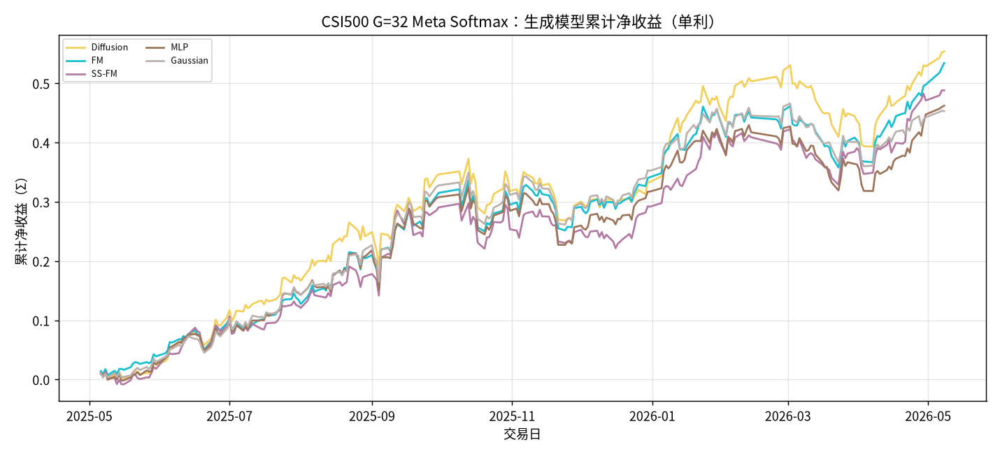
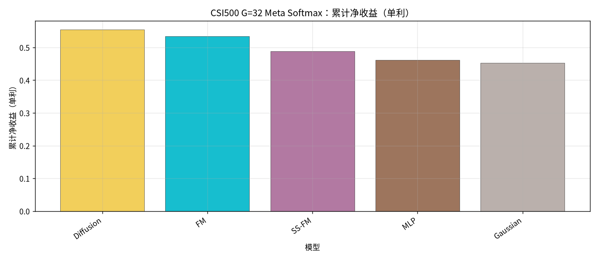
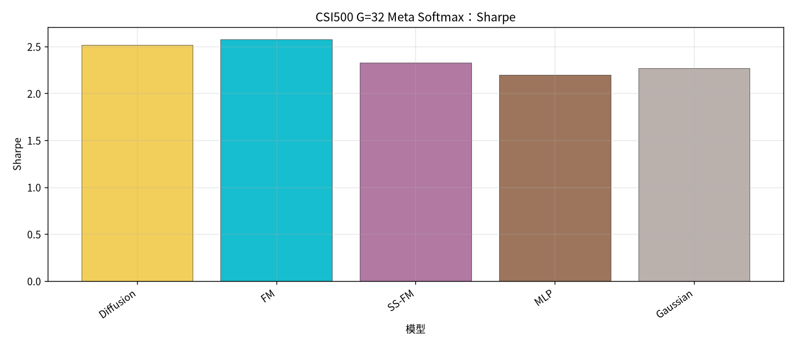
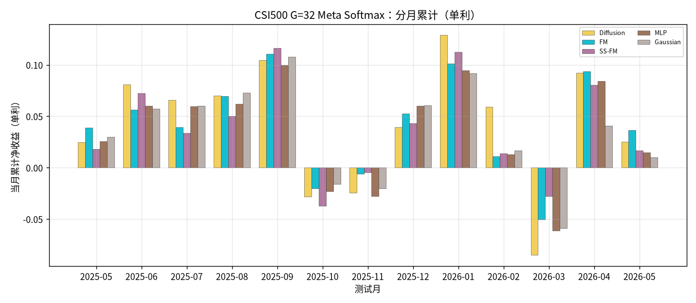

# CSI500：G=32 Meta Softmax 生成模型对比

设定：冻结 Alpha + 各生成 checkpoint；配权 **Top30**；**G=32**；
**Meta** = G 条生成样本 ∪ Teacher（MVO / MaxSharpe / RiskParity）→ **Softmax(u/τ)**（τ=1.0）。
收益口径：**单利 Σ**；拼接 OOS 2025-05…2026-05，**245** 日。

产物：`results/CSI500/strict_fixed_oos_g32_meta_softmax/`

## 全年对照（按单利排序）

| rank | model | total | sharpe | mdd | turnover | n_days | vs SS-FM |
| --- | --- | --- | --- | --- | --- | --- | --- |
| 1 | Diffusion G=32 Softmax Meta | 0.5541 | 2.5177 | 0.1309 | 0.3144 | 245 | +0.0661 |
| 2 | FM G=32 Softmax Meta | 0.5344 | 2.5743 | 0.1010 | 0.1750 | 245 | +0.0463 |
| 3 | SS-FM G=32 Softmax Meta | 0.4881 | 2.3278 | 0.0906 | 0.4606 | 245 | +0.0000 |
| 4 | MLP G=32 Softmax Meta | 0.4623 | 2.1990 | 0.1083 | 0.3431 | 245 | -0.0258 |
| 5 | Gaussian G=32 Softmax Meta | 0.4531 | 2.2662 | 0.1025 | 0.3673 | 245 | -0.0350 |

### 累计净值

### 累计净收益柱

### Sharpe

### 分月

## 结论

- 单利排序：Diffusion `0.5541` > FM `0.5344` > SS-FM `0.4881` > MLP `0.4623` > Gaussian `0.4531`。
- **SS-FM G=32 Softmax Meta** = `0.4881` / Sharpe `2.3278`；生成族第 **3**。
- 最优：**Diffusion** `0.5541`，相对 SS-FM Δ=`+0.0661`。
- 相对 Pred-Utility Meta：Softmax 压平极端选仓，Diffusion 优势通常明显收窄。
