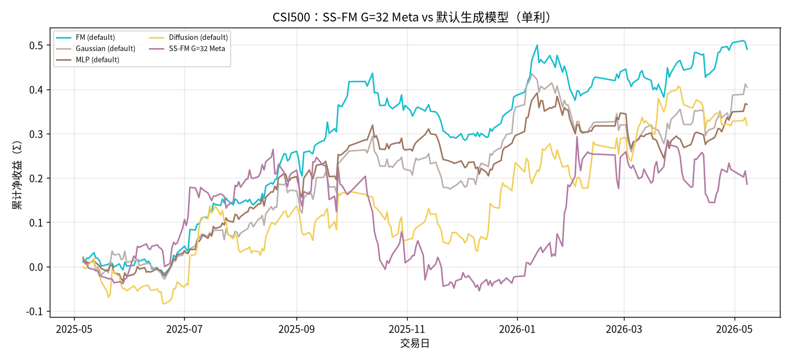
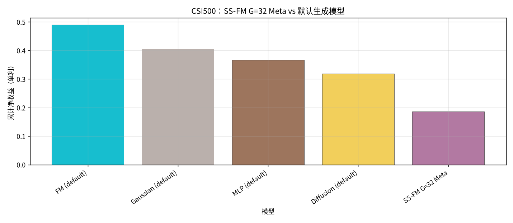
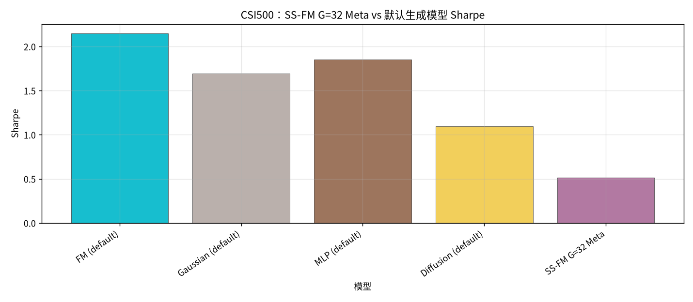
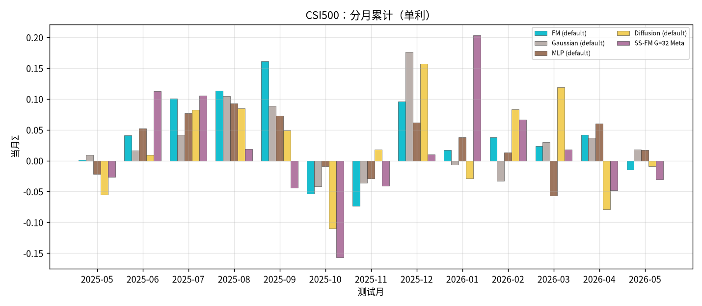

# CSI500：SS-FM G=32 Meta vs 默认参数生成模型

设定：冻结 Alpha + 各生成 checkpoint；配权 **Top30**；拼接 OOS 2025-05…2026-05，**245** 日；收益 **单利 Σ**。

- **SS-FM**：G=32，**Meta** = 样本∪Teacher → `pred_utility`（来自 `strict_fixed_oos_g32_meta`）
- **其他生成模型**：正本默认参数（默认 G / 非 Meta，`pred_utility` 选仓；来自 `strict_fixed_oos` 全年）

产物：`results/CSI500/strict_fixed_oos_ssfm_g32_meta_vs_default_gens/`

## 全年对照（按单利排序）

| rank | model | total | sharpe | mdd | turnover | n_days | vs SS-FM Meta |
| --- | --- | --- | --- | --- | --- | --- | --- |
| 1 | FM (default) | 0.4903 | 2.1480 | 0.1434 | 0.4930 | 245 | +0.3044 |
| 2 | Gaussian (default) | 0.4051 | 1.6954 | 0.1663 | 0.5513 | 245 | +0.2192 |
| 3 | MLP (default) | 0.3660 | 1.8503 | 0.1422 | 0.3555 | 245 | +0.1801 |
| 4 | Diffusion (default) | 0.3189 | 1.0955 | 0.1310 | 0.7365 | 245 | +0.1330 |
| 5 | SS-FM G=32 Meta | 0.1859 | 0.5164 | 0.2922 | 0.7499 | 245 | +0.0000 |

### 参考：同正本默认 Pure SS-FM

- Pure SS-FM（default）单利 `0.3736` / Sharpe `1.3309`；相对 SS-FM G=32 Meta Δ=`+0.1877`。

### 累计净值

### 累计净收益柱

### Sharpe

### 分月

## 结论

- 单利排序：FM (default) `0.4903` > Gaussian (default) `0.4051` > MLP (default) `0.3660` > Diffusion (default) `0.3189` > SS-FM G=32 Meta `0.1859`。
- **SS-FM G=32 Meta** = `0.1859` / Sharpe `0.5164`；在对照集中排第 **5**。
- 对照集最优：**FM (default)** `0.4903`。
- 注意：SS-FM 使用 Meta+G=32，其他模型为默认 G、无 Teacher Meta，口径不对等，解读时应以「SS-FM 加强设定 vs 默认生成基线」为准。
