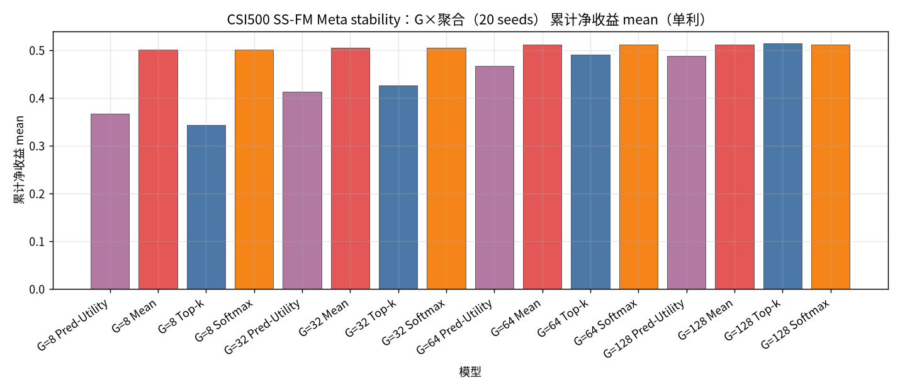
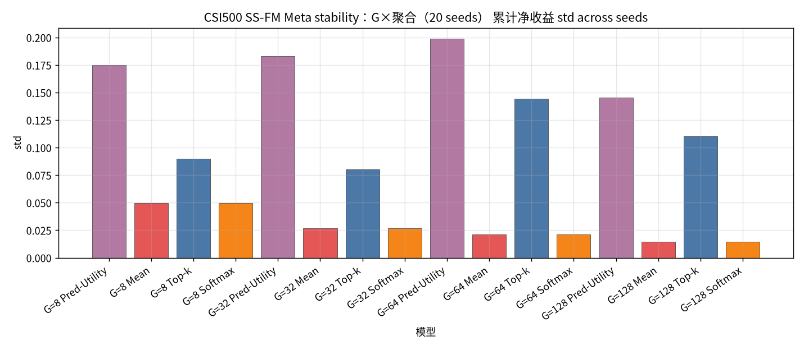
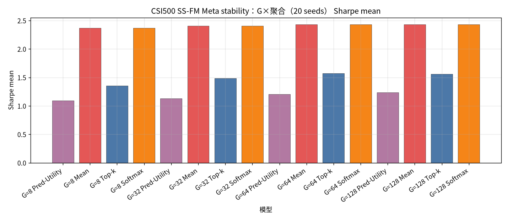
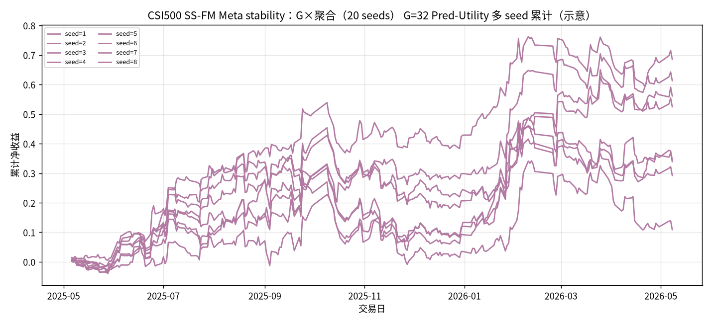

# CSI500 SS-FM Meta stability：G×聚合（20 seeds）

设定：冻结 CSI500 Top30 最新 Alpha+SS-FM（**不训练**）；**Meta 候选 = G 条 SS-FM ∪ Teacher（MVO/MaxSharpe/RP）**；**G ∈ {8, 32, 64, 128}**；**seed ∈ {1..20}**；每日 `noise = hash(date, seed)`。同 (日,G,seed) 只建一次 Meta 池，四种聚合共享。

聚合：Pred-Utility / Mean / Top-k=3 / Softmax(τ=1.0)。下表为 **across seeds 的 mean±std（单利）**。

产物：`results/CSI500/strict_fixed_oos_ssfm_stability_meta_seeds/`。约 **245** 日 × 20 seeds。

| G | Pred-Utility | Mean | Top-k | Softmax |
| --- | --- | --- | --- | --- |
| G=8 | 0.3668±0.1751 | 0.5005±0.0498 | 0.3430±0.0902 | 0.5003±0.0498 |
| G=32 | 0.4121±0.1831 | 0.5051±0.0268 | 0.4258±0.0802 | 0.5051±0.0268 |
| G=64 | 0.4663±0.1988 | 0.5108±0.0213 | 0.4897±0.1444 | 0.5107±0.0212 |
| G=128 | 0.4882±0.1455 | 0.5110±0.0144 | 0.5136±0.1105 | 0.5110±0.0144 |

| G | agg | n | total mean±std | min | max | sharpe mean±std | turnover mean |
| --- | --- | --- | --- | --- | --- | --- | --- |
| 8 | Pred-Utility | 20 | 0.3668±0.1751 | 0.0687 | 0.6593 | 1.0912±0.5136 | 0.7655 |
| 8 | Mean | 20 | 0.5005±0.0498 | 0.4199 | 0.5907 | 2.3692±0.2309 | 0.5070 |
| 8 | Top-k | 20 | 0.3430±0.0902 | 0.2096 | 0.5527 | 1.3509±0.3361 | 0.5953 |
| 8 | Softmax | 20 | 0.5003±0.0498 | 0.4196 | 0.5906 | 2.3679±0.2309 | 0.5070 |
| 32 | Pred-Utility | 20 | 0.4121±0.1831 | 0.1088 | 0.8107 | 1.1287±0.4836 | 0.7347 |
| 32 | Mean | 20 | 0.5051±0.0268 | 0.4556 | 0.5691 | 2.4060±0.1323 | 0.4547 |
| 32 | Top-k | 20 | 0.4258±0.0802 | 0.2582 | 0.5847 | 1.4828±0.2664 | 0.6100 |
| 32 | Softmax | 20 | 0.5051±0.0268 | 0.4558 | 0.5690 | 2.4055±0.1323 | 0.4547 |
| 64 | Pred-Utility | 20 | 0.4663±0.1988 | 0.0558 | 0.8100 | 1.2077±0.4856 | 0.7051 |
| 64 | Mean | 20 | 0.5108±0.0213 | 0.4696 | 0.5613 | 2.4295±0.1080 | 0.4458 |
| 64 | Top-k | 20 | 0.4897±0.1444 | 0.2238 | 0.7867 | 1.5698±0.4366 | 0.6021 |
| 64 | Softmax | 20 | 0.5107±0.0212 | 0.4699 | 0.5613 | 2.4292±0.1078 | 0.4458 |
| 128 | Pred-Utility | 20 | 0.4882±0.1455 | 0.2102 | 0.7730 | 1.2343±0.3531 | 0.6679 |
| 128 | Mean | 20 | 0.5110±0.0144 | 0.4819 | 0.5353 | 2.4284±0.0689 | 0.4393 |
| 128 | Top-k | 20 | 0.5136±0.1105 | 0.2742 | 0.6810 | 1.5564±0.3398 | 0.5858 |
| 128 | Softmax | 20 | 0.5110±0.0144 | 0.4818 | 0.5353 | 2.4281±0.0688 | 0.4393 |

### 累计净收益 mean

### 累计净收益 std

### Sharpe mean

### G=32 Pred-Utility 多seed累计

### 结论

- across-seed 均值最高：`G=128 Top-k` = `0.5136±0.1105`（range [0.2742, 0.6810]）。
