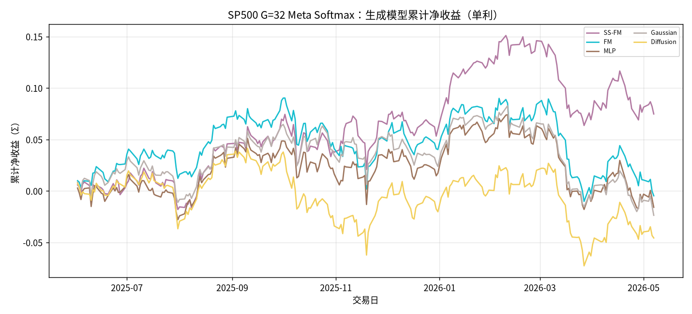
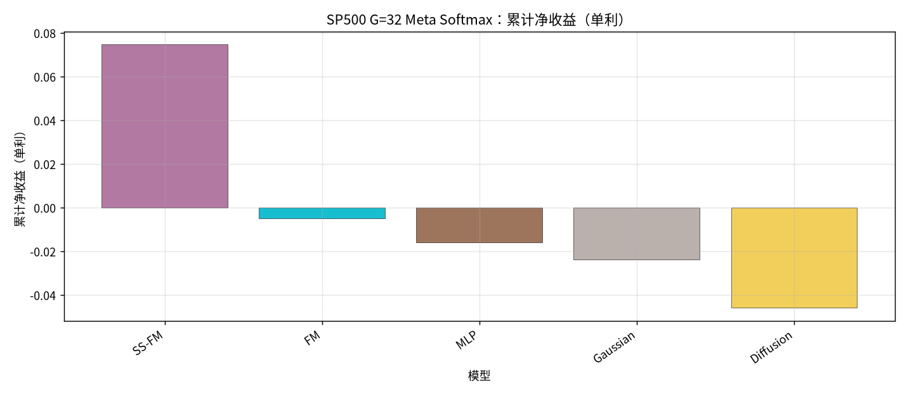
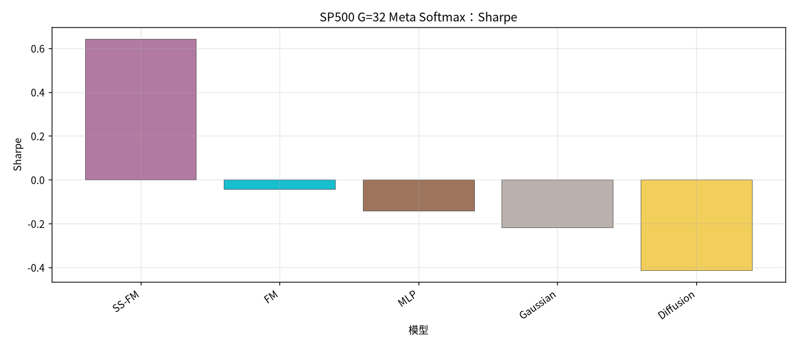
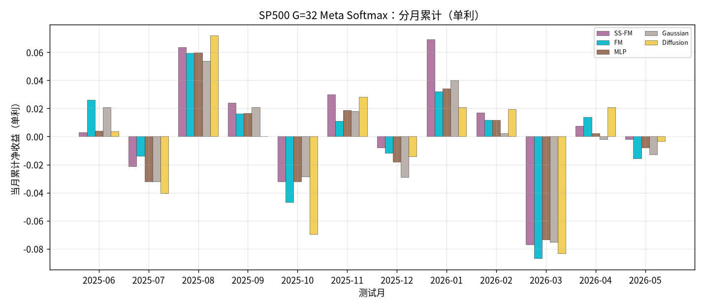

# SP500：G=32 Meta Softmax 生成模型对比

设定：冻结 Alpha + 各生成 checkpoint；配权 **Top30**；**G=32**；
**Meta** = G 条生成样本 ∪ Teacher（MVO / MaxSharpe / RiskParity）→ **Softmax(u/τ)**（τ=1.0）。
收益口径：**单利 Σ**；拼接 OOS 2025-06…2026-05，约 **235** 日。

产物：`results/S&P500/strict_fixed_oos_top30_g32_meta_softmax/`

## 全年对照（按单利排序）

| rank | model | total | sharpe | mdd | turnover | n_days | vs SS-FM |
| --- | --- | --- | --- | --- | --- | --- | --- |
| 1 | SS-FM G=32 Softmax Meta | 0.0747 | 0.6421 | 0.0846 | 0.4512 | 235 | +0.0000 |
| 2 | FM G=32 Softmax Meta | -0.0048 | -0.0425 | 0.0996 | 0.1760 | 235 | -0.0795 |
| 3 | MLP G=32 Softmax Meta | -0.0160 | -0.1420 | 0.0890 | 0.4532 | 235 | -0.0906 |
| 4 | Gaussian G=32 Softmax Meta | -0.0237 | -0.2191 | 0.1025 | 0.4410 | 235 | -0.0984 |
| 5 | Diffusion G=32 Softmax Meta | -0.0457 | -0.4131 | 0.1118 | 0.3266 | 235 | -0.1204 |

### 累计净值

### 累计净收益柱

### Sharpe

### 分月

## 结论

- 单利排序：SS-FM `0.0747` > FM `-0.0048` > MLP `-0.0160` > Gaussian `-0.0237` > Diffusion `-0.0457`。
- **SS-FM G=32 Softmax Meta** = `0.0747` / Sharpe `0.6421`；生成族第 **1**。
- 最优：**SS-FM** `0.0747`，相对 SS-FM Δ=`+0.0000`。
