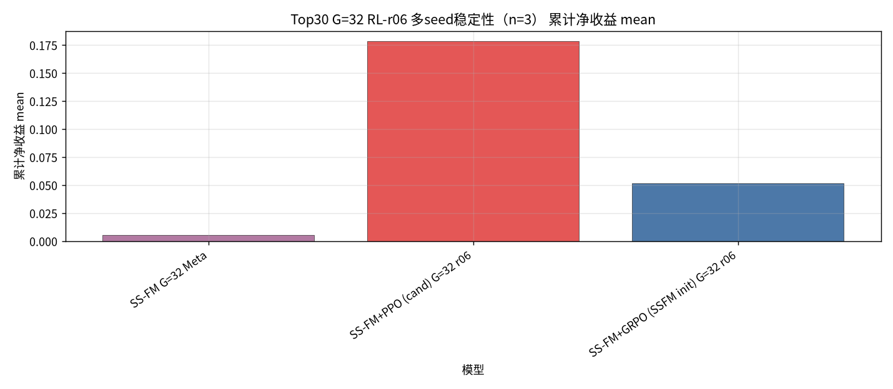
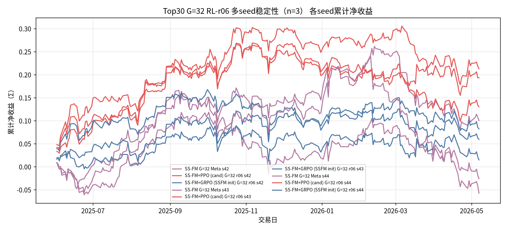

## Top30 G=32 RL-r06 多seed稳定性：SS-FM vs PPO / GRPO

设定：冻结 Top30 Alpha+SS-FM；**G=32**；Pure SS-FM=Meta（样本∪Teacher→`pred_utility`）；PPO=cand；GRPO=SSFM init；`bc_coef=0`；reward-r06；**seeds=[42, 43, 44]**。

产物：`results/S&P500/strict_fixed_oos_top30_rl_r06_stability/`。指标为全年单利 Σ 的跨seed统计。

| model | n | total mean±std | min | max | sharpe mean±std | turnover mean |
| --- | --- | --- | --- | --- | --- | --- |
| SS-FM G=32 Meta | 3 | 0.0055±0.0682 | -0.0575 | 0.1001 | 0.0355±0.4135 | 0.7663 |
| SS-FM+PPO (cand) G=32 r06 | 3 | 0.1786±0.0354 | 0.1298 | 0.2127 | 1.1227±0.2188 | 0.1722 |
| SS-FM+GRPO (SSFM init) G=32 r06 | 3 | 0.0519±0.0279 | 0.0147 | 0.0819 | 0.3992±0.2207 | 0.1878 |

| seed | SS-FM G=32 Meta | SS-FM+PPO (cand) G=32 r06 | SS-FM+GRPO (SSFM init) G=32 r06 |
| --- | --- | --- | --- |
| 42 | 0.1001 | 0.2127 | 0.0819 |
| 43 | -0.0575 | 0.1932 | 0.0590 |
| 44 | -0.0262 | 0.1298 | 0.0147 |

#### Top30 G=32 RL-r06 多seed稳定性（n=3） 累计净收益 mean

#### Top30 G=32 RL-r06 多seed稳定性（n=3） 各seed累计曲线

### 稳定性结论

- 跨seed均值最高：`SS-FM+PPO (cand) G=32 r06` = `0.1786±0.0354` （range [0.1298, 0.2127]）。
- `SS-FM G=32 Meta` 夺冠次数：0/3。
- `SS-FM+PPO (cand) G=32 r06` 夺冠次数：3/3。
- `SS-FM+GRPO (SSFM init) G=32 r06` 夺冠次数：0/3。
- 波动（std/|mean|）：SS-FM G=32 Meta=12.48；SS-FM+PPO (cand) G=32 r06=0.20；SS-FM+GRPO (SSFM init) G=32 r06=0.54。
