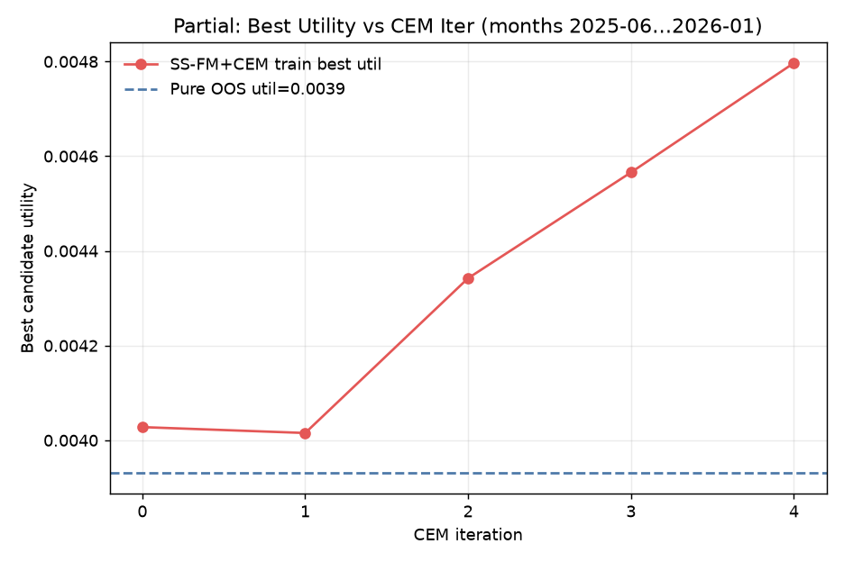
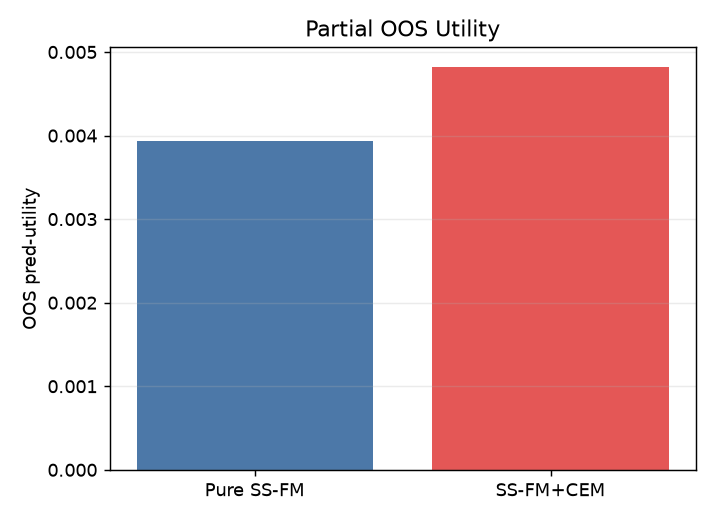
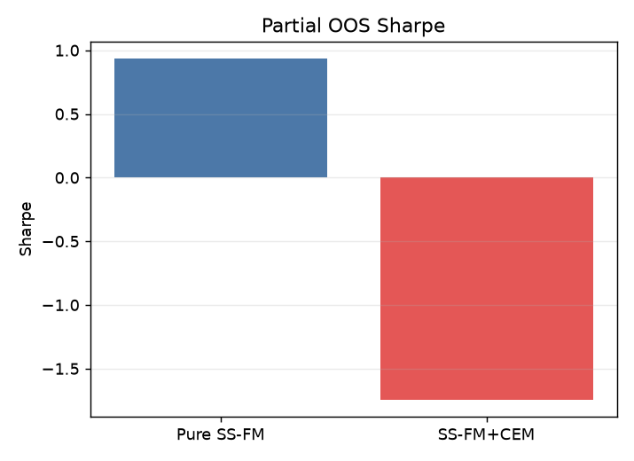

# SP500 Top30：SS-FM + CEM vs Pure SS-FM 阶段性报告

- **性质**：部分月份已跑完的中期报告，**不是**最终全年报告。
- **已完成**：2025-06 … 2026-01（**8/12**）。
- **剩余**：2026-02 … 2026-05。
- **设定**：Top30；G=16；CEM iters=4；Elite E=4；|T|≤8；seeds=1…20；Alpha + θ₀ 冻结；CEM 仅 train 更新，test 冻结；pred_utility 从 G 个 samples 选 1。
- **覆盖**：约 **168** 个交易日（单利拼接）。
- 产物目录：`results/S&P500/strict_fixed_oos_top30_ssfm_cem/`

## 主对照（已完成月份，20 seeds mean）

| Method | Utility (pred) | Sharpe | Turnover | total_net |
| --- | ---: | ---: | ---: | ---: |
| Pure SS-FM | 0.00393 | **0.932** | 0.733 | **+0.098** |
| SS-FM + CEM | **0.00482** | −1.742 | 0.483 | −0.251 |
| Δ (CEM − Pure) | **+0.00089** | −2.675 | −0.250 | −0.349 |
| P(Util_CEM > Util_Pure) | **0.974** | — | — | — |

要点：

- **Pred-utility**：CEM 明显更高，且约 **97%** 的日×seed 上 CEM 选中组合的 pred-utility 高于 Pure。
- **实现收益 / Sharpe**：阶段性结果中 CEM **显著更差**（尤其 2025-10 单月拖累大）。
- **换手**：CEM 更低（0.48 vs 0.73），并非“换手爆炸”。

## 分月 pred-utility（20 seeds 日均）

| month | util_pure | util_cem | Δutil | P(CEM>) |
| --- | ---: | ---: | ---: | ---: |
| 2025-06 | 0.00708 | 0.00767 | +0.00059 | 0.818 |
| 2025-07 | 0.00282 | 0.00312 | +0.00030 | 0.970 |
| 2025-08 | 0.00853 | 0.00984 | +0.00131 | 0.998 |
| 2025-09 | 0.00280 | 0.00383 | +0.00103 | 0.998 |
| 2025-10 | 0.00430 | 0.00518 | +0.00088 | 1.000 |
| 2025-11 | 0.00381 | 0.00416 | +0.00036 | 0.997 |
| 2025-12 | −0.00337 | −0.00282 | +0.00055 | 1.000 |
| 2026-01 | 0.00610 | 0.00820 | +0.00210 | 1.000 |

## 分月实现收益（20 seeds 月合计均值）

| month | Pure total | CEM total |
| --- | ---: | ---: |
| 2025-06 | −0.0132 | −0.0029 |
| 2025-07 | −0.0049 | +0.0110 |
| 2025-08 | +0.0775 | +0.0375 |
| 2025-09 | +0.0032 | −0.0225 |
| 2025-10 | −0.0147 | **−0.2290** |
| 2025-11 | −0.0044 | +0.0075 |
| 2025-12 | −0.0105 | −0.0561 |
| 2026-01 | +0.0650 | +0.0031 |

## CEM 每轮（train 诊断，已完成月平均）

| iter | best util | mean util | frac beat teacher | diversity |
| --- | ---: | ---: | ---: | ---: |
| 0 | 0.00403 | 0.00357 | 0.197 | 1.267 |
| 1 | 0.00402 | 0.00357 | 0.198 | 1.263 |
| 2 | 0.00434 | 0.00383 | 0.462 | 1.173 |
| 3 | 0.00457 | 0.00405 | 0.638 | 1.090 |
| 4 | 0.00480 | 0.00429 | 0.763 | 0.997 |

Train 上：**best/mean utility 随迭代上升**，超过 teacher 的比例升至 ~76%，同时 diversity 下降（分布在收窄）。

## 图

### Best Candidate Utility vs CEM Iteration

### OOS Utility / Sharpe（阶段性）

## 阶段性结论（针对实验问题）

1. **Pred-utility**：是——CEM 相对 Pure 提高（Δ≈+0.0009；P≈0.97）。
2. **实现 Sharpe / 收益**：现阶段否——CEM OOS Sharpe/累计收益明显更差；2025-10 异常差，需终局报告再确认。
3. **换手**：未显著增加，反而更低。
4. **CEM 轮次**：train best utility **持续提高**，且更能超过三个 original teachers。
5. **解释假设（待终局验证）**：utility-guided fine-tune 可能过拟合 pred-utility / 压低 diversity，导致 OOS 实现收益脱钩。

全年跑完后写入最终 `summary.md`，并替换本阶段性结论。
