# SP500 Top30 阶段性汇总（2025-06 … 2026-03）

- **性质**：部分月份已跑完时的中期报告，**不是**最终全年报告。
- **已完成月份**：2025-06, 2025-07, 2025-08, 2025-09, 2025-10, 2025-11, 2025-12, 2026-01, 2026-02, 2026-03（10/12）。
- **设定**：冻结 Alpha；配权池 **Top30**；生成 MLP / Gaussian / FM / Diffusion / SS-FM；Teacher=MVO / MaxSharpe / Risk Parity；RL=`SS-FM+PPO(cand特征, sharpe_only)` + `SS-FM+GRPO(SSFM init)`；G-grid：FM & SS-FM ∈{16,32,64,128}。
- **收益口径：单利** `total = Σ net_return`。已拼接约 **209** 个交易日。
- 最终全年报告文件名：`SP500_top30全年实验分析.md`（与本文件不重名）。

## 1. 生成模型家族对比

| model | total_net_return（单利） | ann_return | sharpe | max_drawdown | mean_turnover | n_days |
| --- | --- | --- | --- | --- | --- | --- |
| MLP | -0.0260 | -0.0313 | -0.2512 | 0.0902 | 0.4607 | 209 |
| Gaussian | -0.0412 | -0.0497 | -0.3428 | 0.1336 | 0.6059 | 209 |
| FM | -0.0420 | -0.0506 | -0.3663 | 0.1488 | 0.4925 | 209 |
| Diffusion | -0.2934 | -0.3538 | -1.8403 | 0.2895 | 0.7596 | 209 |
| Pure SS-FM | -0.0197 | -0.0237 | -0.1341 | 0.1264 | 0.7551 | 209 |

| month | MLP | Gaussian | FM | Diffusion | Pure SS-FM |
| --- | --- | --- | --- | --- | --- |
| 2025-06 | 0.0009 | 0.0185 | 0.0274 | 0.0065 | 0.0287 |
| 2025-07 | -0.0351 | -0.0341 | -0.0020 | -0.0383 | -0.0255 |
| 2025-08 | 0.0619 | 0.0824 | 0.0605 | 0.0431 | 0.0495 |
| 2025-09 | 0.0149 | 0.0091 | 0.0058 | -0.0217 | -0.0011 |
| 2025-10 | -0.0325 | -0.0232 | -0.0492 | -0.1678 | 0.0200 |
| 2025-11 | 0.0147 | 0.0377 | 0.0173 | -0.0623 | 0.0157 |
| 2025-12 | -0.0175 | -0.0344 | -0.0535 | -0.0324 | -0.0354 |
| 2026-01 | 0.0301 | 0.0105 | 0.0271 | 0.0391 | 0.0381 |
| 2026-02 | 0.0112 | -0.0006 | 0.0076 | 0.0484 | 0.0072 |
| 2026-03 | -0.0746 | -0.1073 | -0.0829 | -0.1079 | -0.1169 |

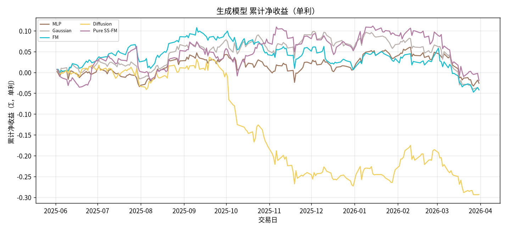

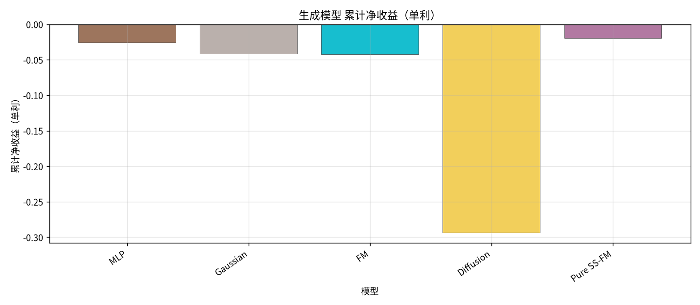

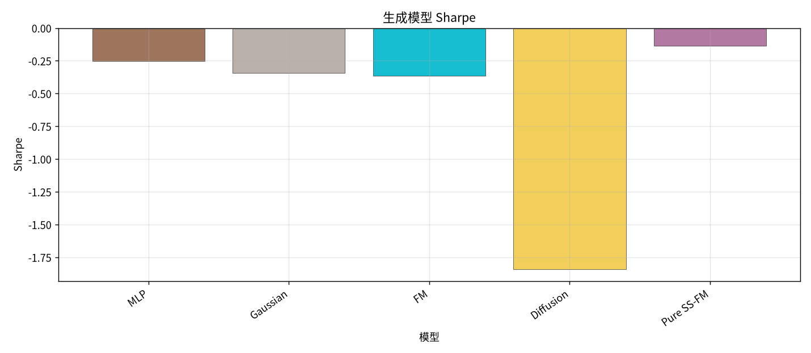

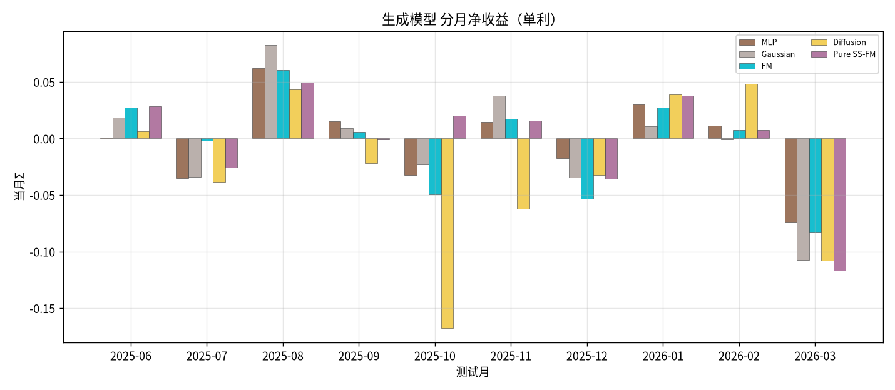

## 2. Teacher vs FM / SS-FM

| model | total_net_return（单利） | ann_return | sharpe | max_drawdown | mean_turnover | n_days |
| --- | --- | --- | --- | --- | --- | --- |
| MVO | 0.2688 | 0.3241 | 1.7774 | 0.1276 | 0.9378 | 209 |
| MaxSharpe | 0.1819 | 0.2194 | 1.3703 | 0.1224 | 0.9336 | 209 |
| Risk Parity | -0.0260 | -0.0313 | -0.2627 | 0.1167 | 0.0646 | 209 |
| FM | -0.0420 | -0.0506 | -0.3663 | 0.1488 | 0.4925 | 209 |
| Pure SS-FM | -0.0197 | -0.0237 | -0.1341 | 0.1264 | 0.7551 | 209 |

| month | MVO | MaxSharpe | Risk Parity | FM | Pure SS-FM |
| --- | --- | --- | --- | --- | --- |
| 2025-06 | 0.0379 | 0.0453 | 0.0232 | 0.0274 | 0.0287 |
| 2025-07 | 0.0165 | 0.0025 | -0.0209 | -0.0020 | -0.0255 |
| 2025-08 | 0.0242 | 0.0152 | 0.0627 | 0.0605 | 0.0495 |
| 2025-09 | 0.0315 | 0.0567 | 0.0164 | 0.0058 | -0.0011 |
| 2025-10 | -0.0085 | -0.0126 | -0.0631 | -0.0492 | 0.0200 |
| 2025-11 | 0.0923 | 0.0744 | 0.0122 | 0.0173 | 0.0157 |
| 2025-12 | -0.0232 | -0.0344 | -0.0148 | -0.0535 | -0.0354 |
| 2026-01 | 0.1401 | 0.0508 | 0.0368 | 0.0271 | 0.0381 |
| 2026-02 | 0.0311 | 0.0296 | -0.0047 | 0.0076 | 0.0072 |
| 2026-03 | -0.0730 | -0.0456 | -0.0737 | -0.0829 | -0.1169 |

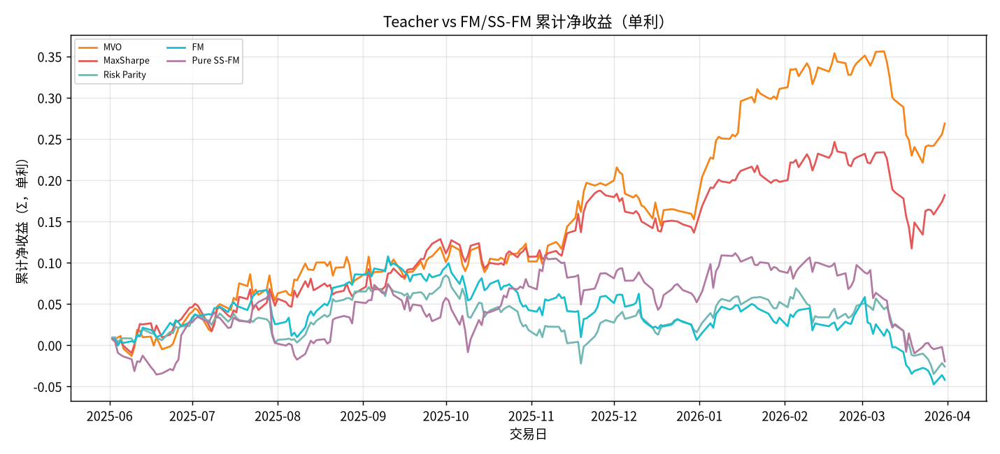

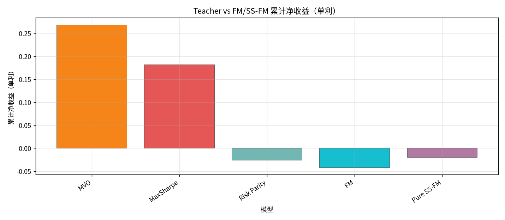

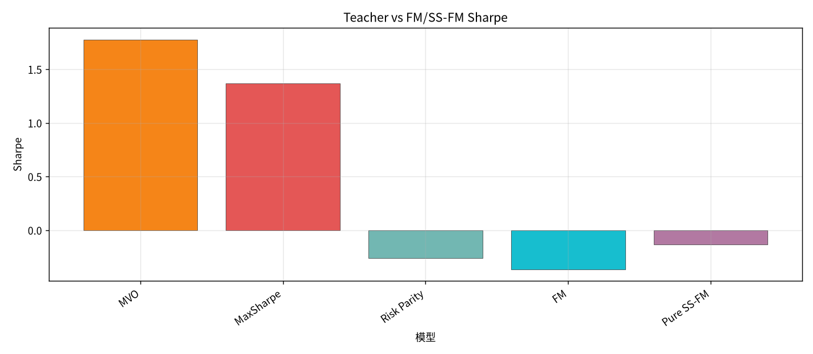

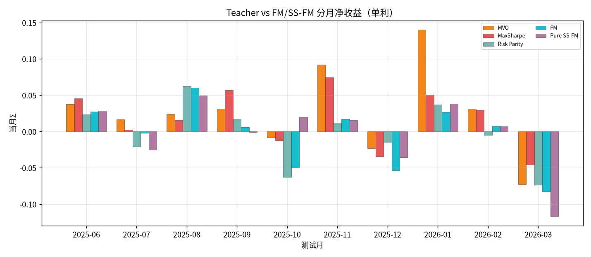

## 3. SS-FM vs RL（及 FM 参照）

- PPO：SS-FM candidate 作特征，再输出权重；**reward = sharpe_only**。
- GRPO：从 SS-FM 蒸馏初始化 WeightPolicy，再 GRPO（无 online BC）。

| model | total_net_return（单利） | ann_return | sharpe | max_drawdown | mean_turnover | n_days |
| --- | --- | --- | --- | --- | --- | --- |
| Pure SS-FM | -0.0197 | -0.0237 | -0.1341 | 0.1264 | 0.7551 | 209 |
| SS-FM+PPO (cand, Sharpe) | 0.1432 | 0.1726 | 1.1606 | 0.0970 | 0.2027 | 209 |
| SS-FM+GRPO (SSFM init) | 0.1077 | 0.1299 | 0.9559 | 0.0890 | 0.1796 | 209 |
| FM | -0.0420 | -0.0506 | -0.3663 | 0.1488 | 0.4925 | 209 |

| month | Pure SS-FM | SS-FM+PPO (cand, Sharpe) | SS-FM+GRPO (SSFM init) | FM |
| --- | --- | --- | --- | --- |
| 2025-06 | 0.0287 | 0.0717 | 0.0741 | 0.0274 |
| 2025-07 | -0.0255 | -0.0194 | -0.0129 | -0.0020 |
| 2025-08 | 0.0495 | 0.0779 | 0.0647 | 0.0605 |
| 2025-09 | -0.0011 | 0.0165 | 0.0156 | 0.0058 |
| 2025-10 | 0.0200 | 0.0566 | 0.0012 | -0.0492 |
| 2025-11 | 0.0157 | 0.0014 | 0.0060 | 0.0173 |
| 2025-12 | -0.0354 | -0.0307 | -0.0149 | -0.0535 |
| 2026-01 | 0.0381 | 0.0303 | 0.0330 | 0.0271 |
| 2026-02 | 0.0072 | 0.0156 | 0.0161 | 0.0076 |
| 2026-03 | -0.1169 | -0.0769 | -0.0751 | -0.0829 |

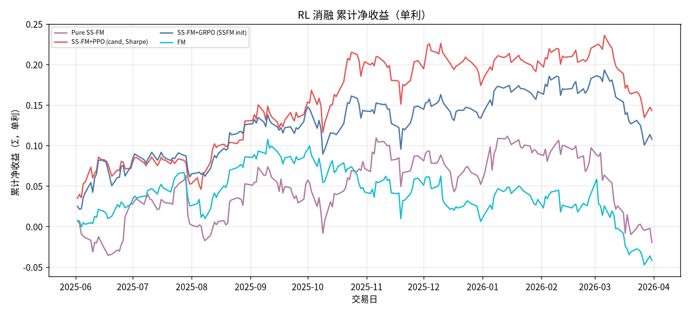

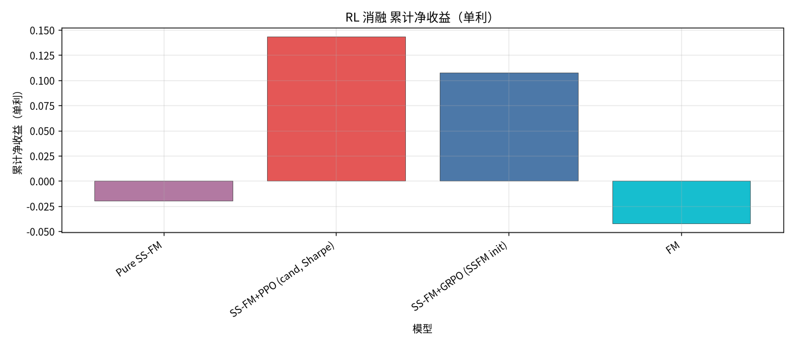

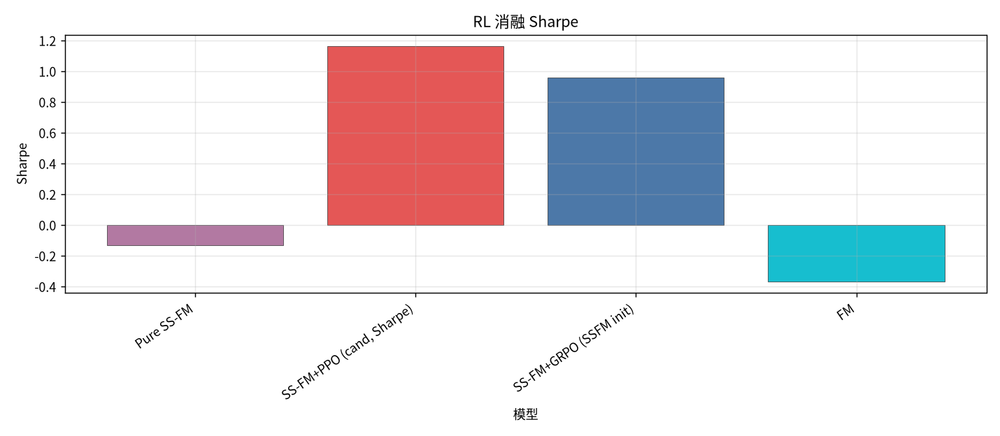

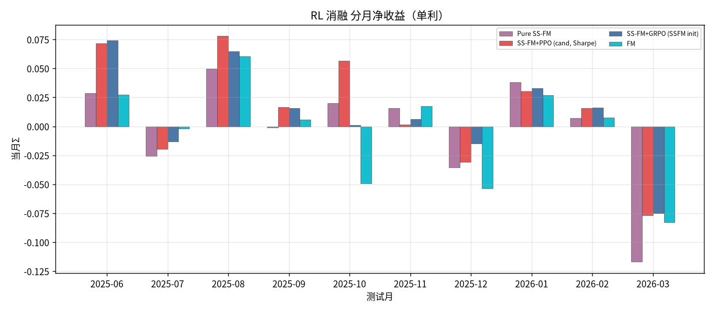

## 4. FM / SS-FM @ G∈{16,32,64,128}

### SS-FM G-grid

| model | total_net_return（单利） | ann_return | sharpe | max_drawdown | mean_turnover | n_days |
| --- | --- | --- | --- | --- | --- | --- |
| Pure SS-FM | -0.0197 | -0.0237 | -0.1341 | 0.1264 | 0.7551 | 209 |
| SS-FM G=16 | -0.0469 | -0.0566 | -0.3461 | 0.1516 | 0.7433 | 209 |
| SS-FM G=32 | -0.0684 | -0.0825 | -0.4868 | 0.1685 | 0.7310 | 209 |
| SS-FM G=64 | -0.0829 | -0.1000 | -0.5558 | 0.2066 | 0.7283 | 209 |
| SS-FM G=128 | -0.0314 | -0.0379 | -0.2050 | 0.1364 | 0.6840 | 209 |

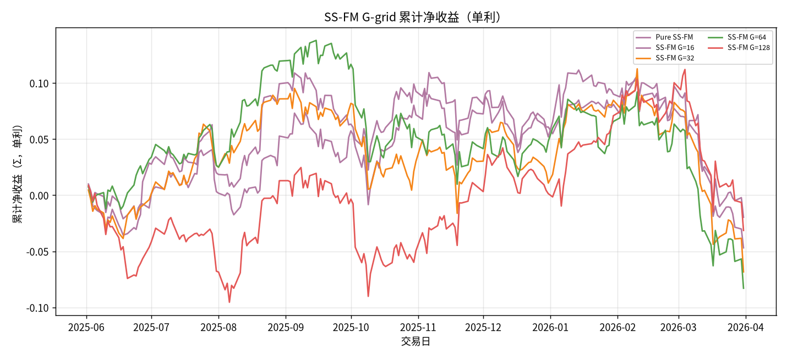

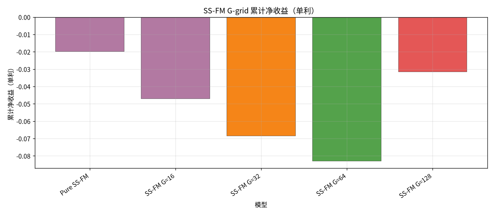

### FM G-grid

| model | total_net_return（单利） | ann_return | sharpe | max_drawdown | mean_turnover | n_days |
| --- | --- | --- | --- | --- | --- | --- |
| FM | -0.0420 | -0.0506 | -0.3663 | 0.1488 | 0.4925 | 209 |
| FM G=16 | -0.1016 | -0.1225 | -0.8758 | 0.1834 | 0.4890 | 209 |
| FM G=32 | -0.0365 | -0.0440 | -0.3272 | 0.1459 | 0.5063 | 209 |
| FM G=64 | -0.0557 | -0.0672 | -0.4786 | 0.1530 | 0.5109 | 209 |
| FM G=128 | 0.0238 | 0.0287 | 0.2261 | 0.0971 | 0.4948 | 209 |

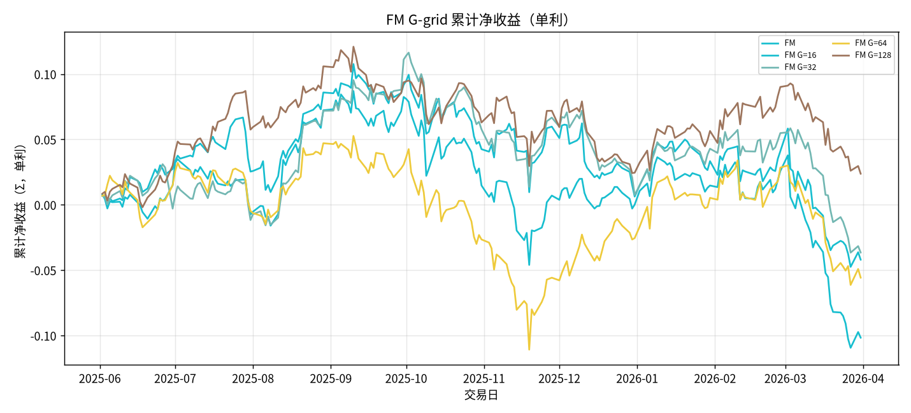

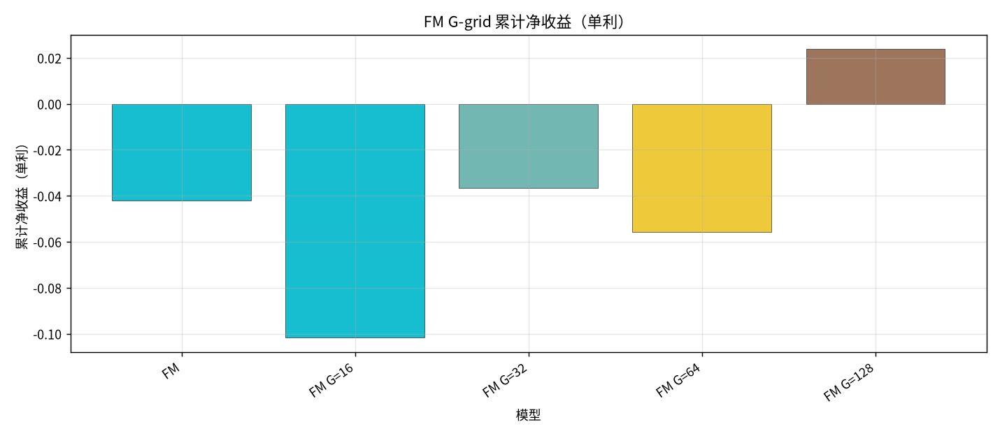

## 简要结论（阶段性）

- 生成模型单利最高：`Pure SS-FM` = `-0.0197`（Sharpe `-0.1341`）。
- RL 相对 Pure：PPO `0.1432`（胜） / GRPO `0.1077`（胜）；Pure `-0.0197`。
- 覆盖至 `2026-03`；剩余月份跑完后写入 `SP500_top30全年实验分析.md`。
