# S&P500全年实验分析

本实验未执行 sequential OOS weekly retrain。本实验没有周五重训。所有结果均为 `strict_fixed_oos`。Alpha 模型仅为 Minute Transformer + Cross-Stock Attention。未使用 auction 数据、Auction Encoder、Fusion 或 Gate。

## 1. 数据覆盖

- 原始数据覆盖 2024-05 至 2026-05；2026-05 的源文件只覆盖至 2026-05-08。
- 可用 Train 范围：`2024-05-01 至 2026-02-28`；各月均使用完整 12 个月。
- 可用 Validation 范围：`2025-05-01 至 2026-03-31`；各 Test 月前一自然月用于 checkpoint/G 选择。
- 有效 Test 范围：`2025-06-01 至 2026-04-30`；共 `230` 个交易日。
- 纳入汇总月份：`2025-06, 2025-07, 2025-08, 2025-09, 2025-10, 2025-11, 2025-12, 2026-01, 2026-02, 2026-03, 2026-04`。
- 剔除月份：`[{"month": "2026-05", "reason": "terminal source partition is incomplete (observed through 2026-05-08)"}]`。
- universe_type 为 `data_available_equity_universe`。原始交付没有 point-in-time 历史 S&P 500 membership，因此存在 survivorship bias，不能把该代理池表述为无偏的历史指数成分回放。

## 2. Alpha 总体 OOS 表现

- 平均 IC / ICIR：`-0.002628` / `-0.078924`。
- 平均 RankIC / RankICIR：`0.000488` / `0.017412`。
- MSE / MAE：`0.000489` / `0.015978`。
- Top-K 平均收益 / 超额 / hit rate：`0.000178` / `-0.000025` / `0.487971`。
- `5/11` 个 Test 月 IC 为正；最高为 `2025-09`（`0.053723`），最低为 `2026-03`（`-0.050233`）。月间符号不稳定，因此全年均值接近零不能解释为稳定 alpha。

| test_month | IC | RankIC | MSE | MAE | topk_mean_true_return | topk_excess_return_vs_universe | topk_hit_rate |
|---|---:|---:|---:|---:|---:|---:|---:|
| 2025-06 | 0.0436 | 0.0296 | 0.0004 | 0.0143 | 0.0033 | 0.0023 | 0.5233 |
| 2025-07 | -0.0046 | -0.0120 | 0.0005 | 0.0175 | -0.0005 | -0.0004 | 0.4682 |
| 2025-08 | -0.0174 | -0.0123 | 0.0004 | 0.0153 | -0.0001 | -0.0009 | 0.4762 |
| 2025-09 | 0.0537 | 0.0476 | 0.0004 | 0.0143 | 0.0022 | 0.0016 | 0.5317 |
| 2025-10 | 0.0299 | 0.0342 | 0.0005 | 0.0153 | -0.0009 | 0.0010 | 0.4638 |
| 2025-11 | -0.0366 | -0.0235 | 0.0006 | 0.0170 | -0.0023 | -0.0027 | 0.4561 |
| 2025-12 | -0.0228 | -0.0071 | 0.0005 | 0.0157 | 0.0009 | 0.0012 | 0.5061 |
| 2026-01 | -0.0415 | -0.0324 | 0.0005 | 0.0162 | -0.0019 | -0.0026 | 0.4417 |
| 2026-02 | 0.0057 | 0.0106 | 0.0006 | 0.0182 | 0.0027 | 0.0015 | 0.5772 |
| 2026-03 | -0.0502 | -0.0451 | 0.0006 | 0.0170 | -0.0025 | -0.0013 | 0.4394 |
| 2026-04 | 0.0113 | 0.0158 | 0.0004 | 0.0152 | 0.0012 | -0.0002 | 0.4937 |

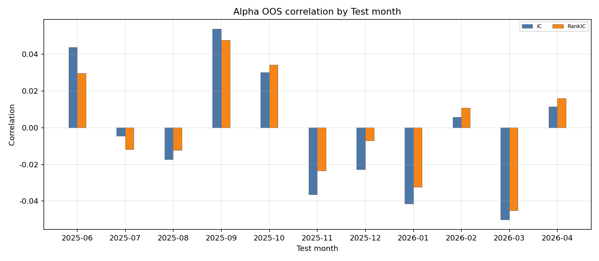

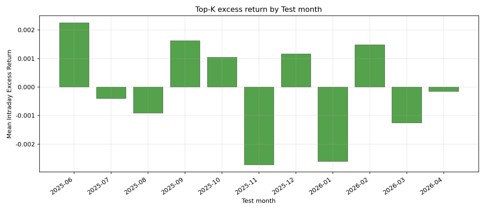

## 3. Portfolio 策略总览

| model | cumulative_return | ann_return | ann_volatility | sharpe | max_drawdown | calmar | mean_turnover | total_transaction_cost | candidate_feasibility |
|---|---:|---:|---:|---:|---:|---:|---:|---:|---:|
| SS-FM G=128 | 0.1423 | 0.1570 | 0.2311 | 0.6308 | 0.1203 | 1.3053 | 0.6570 | 0.0453 | 1.0000 |
| Diffusion | 0.1068 | 0.1176 | 0.3846 | 0.2891 | 0.2966 | 0.3964 | 0.7539 | 0.0520 | 1.0000 |
| Gaussian Policy | 0.1059 | 0.1166 | 0.2179 | 0.5061 | 0.1269 | 0.9186 | 0.6441 | 0.0444 | 1.0000 |
| Black-Litterman | 0.0602 | 0.0662 | 0.1548 | 0.4140 | 0.1194 | 0.5543 | 0.3441 | 0.0237 | 1.0000 |
| SS-FM G=16 | 0.0443 | 0.0486 | 0.1992 | 0.2384 | 0.1307 | 0.3721 | 0.6496 | 0.0448 | 1.0000 |
| Maximum Sharpe | 0.0343 | 0.0376 | 0.1501 | 0.2460 | 0.1245 | 0.3019 | 0.3523 | 0.0243 | 1.0000 |
| MVO | 0.0248 | 0.0272 | 0.1516 | 0.1771 | 0.1268 | 0.2146 | 0.3339 | 0.0230 | 1.0000 |
| Kelly | 0.0248 | 0.0272 | 0.1516 | 0.1771 | 0.1268 | 0.2146 | 0.3339 | 0.0230 | 1.0000 |
| MLP Policy | 0.0217 | 0.0238 | 0.1575 | 0.1496 | 0.1239 | 0.1924 | 0.3449 | 0.0238 | 1.0000 |
| Equal Weight | 0.0208 | 0.0229 | 0.1573 | 0.1437 | 0.1256 | 0.1820 | 0.2934 | 0.0202 | 1.0000 |
| Risk Parity | 0.0176 | 0.0193 | 0.1547 | 0.1236 | 0.1256 | 0.1537 | 0.3004 | 0.0207 | 1.0000 |
| SS-FM G=64 | 0.0152 | 0.0166 | 0.2220 | 0.0744 | 0.2126 | 0.0783 | 0.6633 | 0.0458 | 1.0000 |
| SS-FM + PPO | -0.0056 | -0.0061 | 0.1660 | -0.0371 | 0.1244 | -0.0493 | 0.4750 | 0.0328 | 1.0000 |
| SS-FM + GRPO | -0.0195 | -0.0213 | 0.1625 | -0.1325 | 0.1168 | -0.1823 | 0.4683 | 0.0323 | 1.0000 |
| SS-FM | -0.0536 | -0.0586 | 0.2244 | -0.2692 | 0.2393 | -0.2449 | 0.6605 | 0.0456 | 1.0000 |
| SS-FM G=32 | -0.0757 | -0.0827 | 0.2167 | -0.3983 | 0.2045 | -0.4043 | 0.6542 | 0.0451 | 1.0000 |
| Standard FM | -0.0801 | -0.0874 | 0.2103 | -0.4350 | 0.1802 | -0.4852 | 0.6462 | 0.0446 | 1.0000 |
| SS-FM G=8 | -0.0853 | -0.0931 | 0.1899 | -0.5147 | 0.2077 | -0.4483 | 0.6456 | 0.0445 | 1.0000 |

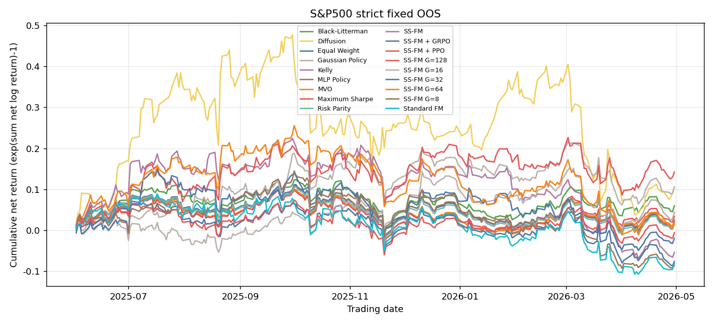

### 3.1 Generation Model Ablation（全年拼接）

| model | cumulative_return | ann_return | ann_volatility | sharpe | max_drawdown | calmar | mean_turnover | total_transaction_cost | candidate_feasibility |
|---|---:|---:|---:|---:|---:|---:|---:|---:|---:|
| Gaussian Policy | 0.1059 | 0.1166 | 0.2179 | 0.5061 | 0.1269 | 0.9186 | 0.6441 | 0.0444 | 1.0000 |
| MLP Policy | 0.0217 | 0.0238 | 0.1575 | 0.1496 | 0.1239 | 0.1924 | 0.3449 | 0.0238 | 1.0000 |
| Standard FM | -0.0801 | -0.0874 | 0.2103 | -0.4350 | 0.1802 | -0.4852 | 0.6462 | 0.0446 | 1.0000 |
| Diffusion | 0.1068 | 0.1176 | 0.3846 | 0.2891 | 0.2966 | 0.3964 | 0.7539 | 0.0520 | 1.0000 |
| SS-FM | -0.0536 | -0.0586 | 0.2244 | -0.2692 | 0.2393 | -0.2449 | 0.6605 | 0.0456 | 1.0000 |

#### Question 1：Portfolio Generation

Generation 组累计净收益最高的是 **Diffusion**（`0.1068`），Sharpe 最高的是 **Gaussian Policy**（`0.5061`）。SS-FM 相对 Standard FM 的累计净收益差为 `0.0265`，但两者全年累计净收益均为负，不能据此宣称生成主线已稳定获得正收益。

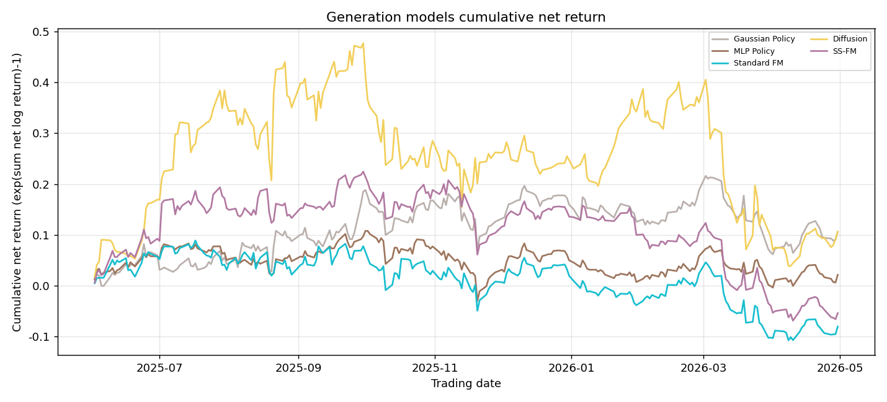

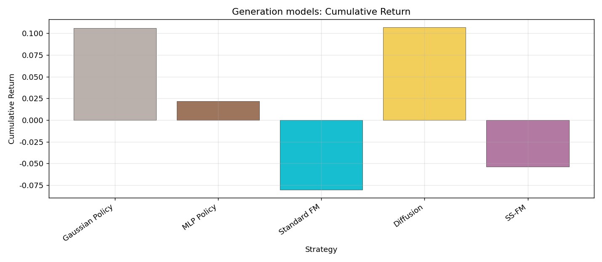

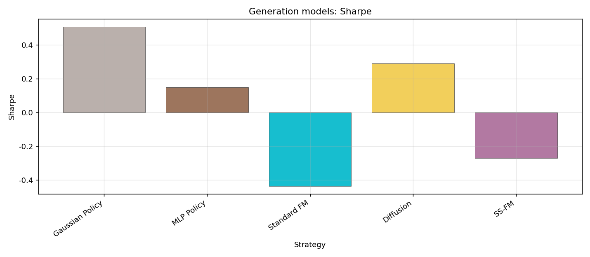

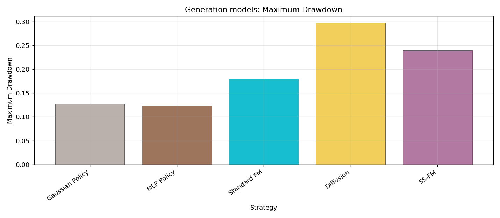

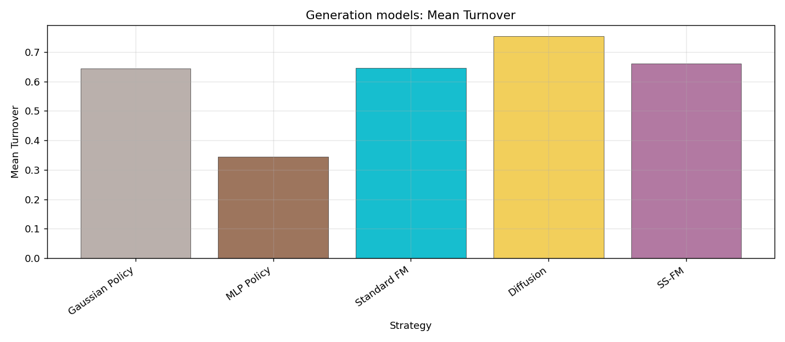

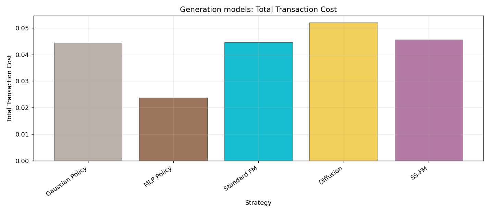

#### Generation 月度表现

##### Cumulative Return

| Model | 2025-06 | 2025-07 | 2025-08 | 2025-09 | 2025-10 | 2025-11 | 2025-12 | 2026-01 | 2026-02 | 2026-03 | 2026-04 |
|---|---:|---:|---:|---:|---:|---:|---:|---:|---:|---:|---:|
| Gaussian Policy | 0.0603 | -0.0161 | 0.0426 | 0.0897 | -0.0144 | -0.0360 | 0.0296 | -0.0289 | 0.0551 | -0.1025 | 0.0372 |
| MLP Policy | 0.0579 | -0.0069 | -0.0022 | 0.0470 | -0.0183 | -0.0473 | 0.0229 | -0.0405 | 0.0503 | -0.0553 | 0.0220 |
| Standard FM | 0.0572 | -0.0247 | -0.0089 | 0.0547 | -0.0447 | -0.0207 | 0.0111 | -0.0566 | 0.0648 | -0.1232 | 0.0243 |
| Diffusion | 0.1695 | 0.1589 | -0.0036 | 0.0937 | -0.1299 | -0.0177 | -0.0122 | 0.0765 | 0.0135 | -0.1931 | 0.0082 |
| SS-FM | 0.0927 | 0.0548 | -0.0166 | 0.0805 | -0.0294 | -0.0711 | 0.0290 | -0.0316 | 0.0039 | -0.1298 | -0.0153 |

##### Sharpe

| Model | 2025-06 | 2025-07 | 2025-08 | 2025-09 | 2025-10 | 2025-11 | 2025-12 | 2026-01 | 2026-02 | 2026-03 | 2026-04 |
|---|---:|---:|---:|---:|---:|---:|---:|---:|---:|---:|---:|
| Gaussian Policy | 4.1482 | -1.1449 | 1.7549 | 4.0252 | -0.8108 | -1.4701 | 2.8745 | -1.8897 | 6.0168 | -4.6919 | 3.1293 |
| MLP Policy | 5.1577 | -0.6691 | -0.1680 | 4.7596 | -1.0353 | -2.5760 | 2.0452 | -5.2512 | 5.3762 | -3.4519 | 2.0354 |
| Standard FM | 3.7500 | -2.0175 | -0.4558 | 3.0221 | -2.0602 | -0.9148 | 0.8701 | -5.8415 | 6.0764 | -5.1820 | 2.0147 |
| Diffusion | 8.1574 | 5.2772 | -0.0733 | 3.2529 | -3.5407 | -0.4878 | -0.8523 | 4.0505 | 0.6638 | -4.3672 | 0.5219 |
| SS-FM | 5.1838 | 2.1229 | -0.8402 | 6.2247 | -1.3949 | -3.3754 | 2.5528 | -2.4167 | 0.4337 | -5.1873 | -1.1813 |

##### Maximum Drawdown

| Model | 2025-06 | 2025-07 | 2025-08 | 2025-09 | 2025-10 | 2025-11 | 2025-12 | 2026-01 | 2026-02 | 2026-03 | 2026-04 |
|---|---:|---:|---:|---:|---:|---:|---:|---:|---:|---:|---:|
| Gaussian Policy | 0.0223 | 0.0239 | 0.0521 | 0.0328 | 0.0743 | 0.0943 | 0.0335 | 0.0412 | 0.0094 | 0.1234 | 0.0342 |
| MLP Policy | 0.0117 | 0.0303 | 0.0321 | 0.0238 | 0.0587 | 0.0914 | 0.0331 | 0.0405 | 0.0139 | 0.0731 | 0.0333 |
| Standard FM | 0.0345 | 0.0533 | 0.0434 | 0.0336 | 0.0705 | 0.0818 | 0.0363 | 0.0474 | 0.0160 | 0.1419 | 0.0323 |
| Diffusion | 0.0342 | 0.0446 | 0.1045 | 0.0589 | 0.1294 | 0.0882 | 0.0584 | 0.0497 | 0.0567 | 0.2374 | 0.0340 |
| SS-FM | 0.0249 | 0.0369 | 0.0562 | 0.0204 | 0.0683 | 0.1211 | 0.0302 | 0.0498 | 0.0249 | 0.1448 | 0.0449 |

##### Mean Turnover

| Model | 2025-06 | 2025-07 | 2025-08 | 2025-09 | 2025-10 | 2025-11 | 2025-12 | 2026-01 | 2026-02 | 2026-03 | 2026-04 |
|---|---:|---:|---:|---:|---:|---:|---:|---:|---:|---:|---:|
| Gaussian Policy | 0.6086 | 0.6035 | 0.5986 | 0.6314 | 0.6386 | 0.7194 | 0.6504 | 0.6549 | 0.6677 | 0.6057 | 0.7181 |
| MLP Policy | 0.3185 | 0.2850 | 0.2547 | 0.2704 | 0.3514 | 0.3367 | 0.3937 | 0.3715 | 0.4062 | 0.3439 | 0.4668 |
| Standard FM | 0.6156 | 0.6300 | 0.5906 | 0.6110 | 0.5941 | 0.6854 | 0.6832 | 0.6791 | 0.6981 | 0.6242 | 0.7107 |
| Diffusion | 0.8493 | 0.8792 | 0.6139 | 0.5291 | 0.6836 | 0.6224 | 0.8617 | 0.8456 | 0.8705 | 0.7634 | 0.7765 |
| SS-FM | 0.6122 | 0.7689 | 0.5894 | 0.5823 | 0.6234 | 0.6350 | 0.6920 | 0.6264 | 0.7275 | 0.6084 | 0.7988 |

### 3.2 RL Ablation（全年拼接）

| model | cumulative_return | ann_return | ann_volatility | sharpe | max_drawdown | calmar | mean_turnover | total_transaction_cost | candidate_feasibility |
|---|---:|---:|---:|---:|---:|---:|---:|---:|---:|
| SS-FM | -0.0536 | -0.0586 | 0.2244 | -0.2692 | 0.2393 | -0.2449 | 0.6605 | 0.0456 | 1.0000 |
| SS-FM + PPO | -0.0056 | -0.0061 | 0.1660 | -0.0371 | 0.1244 | -0.0493 | 0.4750 | 0.0328 | 1.0000 |
| SS-FM + GRPO | -0.0195 | -0.0213 | 0.1625 | -0.1325 | 0.1168 | -0.1823 | 0.4683 | 0.0323 | 1.0000 |

#### Question 2：RL Optimization

PPO 相对 Pure SS-FM 的全年累计净收益差为 `0.0480`，GRPO 相对 Pure SS-FM 为 `0.0342`。两种 RL 都改善了默认 SS-FM 路径，但全年累计净收益仍为负；PPO 收益较高，GRPO 最大回撤较低，结论必须同时结合收益、风险、换手和成本。

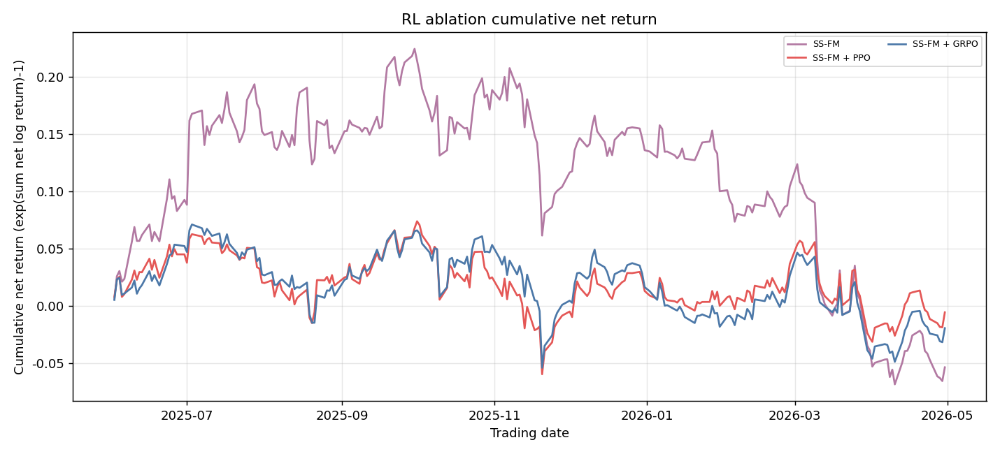

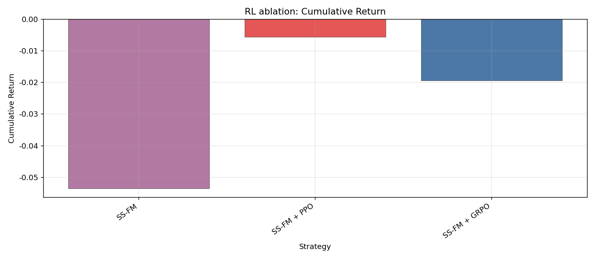

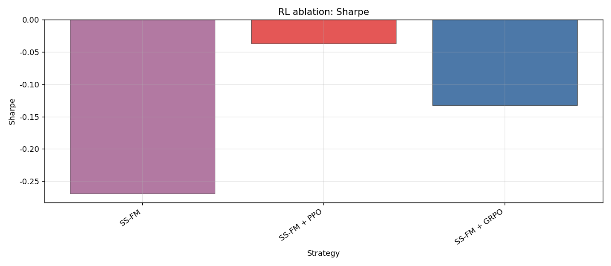

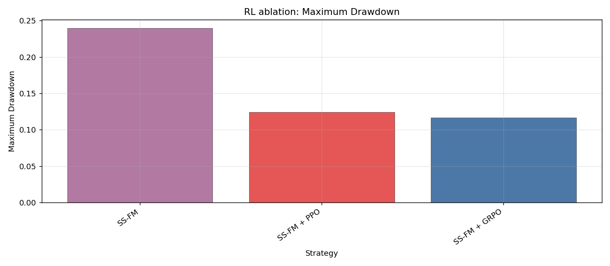

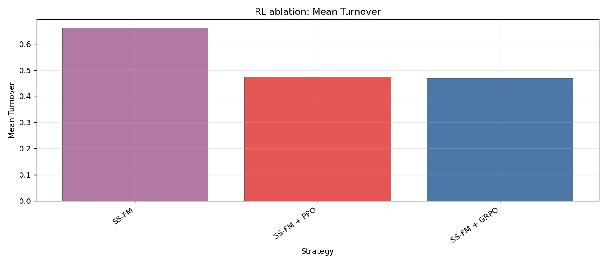

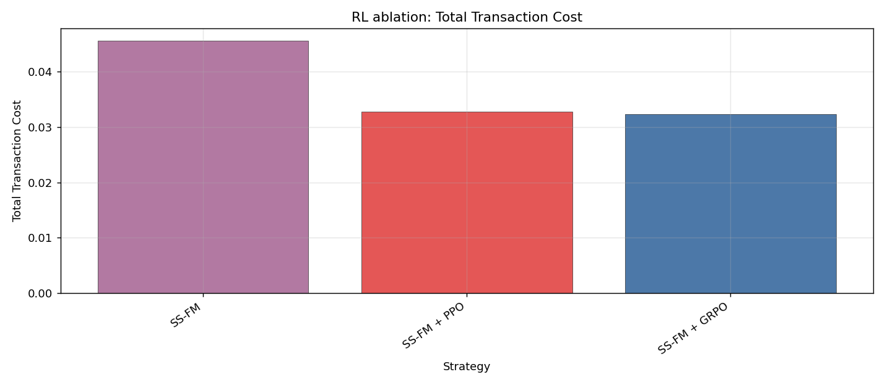

#### RL 月度表现

##### Cumulative Return

| Model | 2025-06 | 2025-07 | 2025-08 | 2025-09 | 2025-10 | 2025-11 | 2025-12 | 2026-01 | 2026-02 | 2026-03 | 2026-04 |
|---|---:|---:|---:|---:|---:|---:|---:|---:|---:|---:|---:|
| SS-FM | 0.0927 | 0.0548 | -0.0166 | 0.0805 | -0.0294 | -0.0711 | 0.0290 | -0.0316 | 0.0039 | -0.1298 | -0.0153 |
| SS-FM + PPO | 0.0450 | -0.0236 | -0.0025 | 0.0492 | -0.0402 | -0.0326 | 0.0217 | -0.0128 | 0.0366 | -0.0623 | 0.0230 |
| SS-FM + GRPO | 0.0523 | -0.0236 | -0.0180 | 0.0559 | -0.0113 | -0.0497 | 0.0154 | -0.0340 | 0.0455 | -0.0666 | 0.0235 |

##### Sharpe

| Model | 2025-06 | 2025-07 | 2025-08 | 2025-09 | 2025-10 | 2025-11 | 2025-12 | 2026-01 | 2026-02 | 2026-03 | 2026-04 |
|---|---:|---:|---:|---:|---:|---:|---:|---:|---:|---:|---:|
| SS-FM | 5.1838 | 2.1229 | -0.8402 | 6.2247 | -1.3949 | -3.3754 | 2.5528 | -2.4167 | 0.4337 | -5.1873 | -1.1813 |
| SS-FM + PPO | 3.5934 | -2.3916 | -0.1789 | 4.5400 | -2.2565 | -1.7151 | 1.9668 | -1.4698 | 3.8197 | -3.2680 | 2.3223 |
| SS-FM + GRPO | 4.8144 | -2.3259 | -1.4274 | 5.4877 | -0.6356 | -2.5400 | 1.4939 | -4.1500 | 4.8330 | -3.5333 | 2.4110 |

##### Maximum Drawdown

| Model | 2025-06 | 2025-07 | 2025-08 | 2025-09 | 2025-10 | 2025-11 | 2025-12 | 2026-01 | 2026-02 | 2026-03 | 2026-04 |
|---|---:|---:|---:|---:|---:|---:|---:|---:|---:|---:|---:|
| SS-FM | 0.0249 | 0.0369 | 0.0562 | 0.0204 | 0.0683 | 0.1211 | 0.0302 | 0.0498 | 0.0249 | 0.1448 | 0.0449 |
| SS-FM + PPO | 0.0172 | 0.0398 | 0.0365 | 0.0199 | 0.0638 | 0.0816 | 0.0257 | 0.0279 | 0.0128 | 0.0803 | 0.0317 |
| SS-FM + GRPO | 0.0146 | 0.0408 | 0.0430 | 0.0218 | 0.0542 | 0.0930 | 0.0313 | 0.0377 | 0.0132 | 0.0845 | 0.0274 |

##### Mean Turnover

| Model | 2025-06 | 2025-07 | 2025-08 | 2025-09 | 2025-10 | 2025-11 | 2025-12 | 2026-01 | 2026-02 | 2026-03 | 2026-04 |
|---|---:|---:|---:|---:|---:|---:|---:|---:|---:|---:|---:|
| SS-FM | 0.6122 | 0.7689 | 0.5894 | 0.5823 | 0.6234 | 0.6350 | 0.6920 | 0.6264 | 0.7275 | 0.6084 | 0.7988 |
| SS-FM + PPO | 0.4468 | 0.4289 | 0.4097 | 0.4176 | 0.4786 | 0.4836 | 0.5373 | 0.4784 | 0.5126 | 0.4704 | 0.5631 |
| SS-FM + GRPO | 0.4385 | 0.3975 | 0.3866 | 0.4011 | 0.5003 | 0.4558 | 0.5359 | 0.4829 | 0.5287 | 0.4574 | 0.5678 |

## 4. SS-FM 主线

Standard FM → SS-FM → SS-FM + PPO 是主比较链，GRPO 作为并列对照。simplex feasibility、return、Sharpe、MDD、turnover、transaction cost 与运行信息见上表及年度 CSV；candidate/reward diversity 与 sampling latency 保留在各月候选表、reward logs 和 G 表中。

| strategy_name | candidate_count_G | candidate_diversity | reward_diversity | constraint_violation | sampling_time_sec |
|---|---:|---:|---:|---:|---:|
| SS-FM | 128.0000 | 0.2127 | 0.0042 | 0.0000 | 0.0163 |
| SS-FM + GRPO | 128.0000 | 0.0925 | 0.0018 | 0.0000 | 0.0004 |
| SS-FM + PPO | 128.0000 | 0.0931 | 0.0018 | 0.0000 | 0.0004 |
| Standard FM | 128.0000 | 0.2065 | 0.0041 | 0.0000 | 0.0033 |

阶段总运行时间（秒）：

| phase | seconds |
|---|---:|
| alpha_training | 3493.3435 |
| generative_training | 26.3310 |
| portfolio_state_generation | 1774.5839 |
| rl_training | 99.9233 |
| test_inference | 571.3183 |
| total | 6033.1055 |

### G 数量实验

各月默认 G 仅由该月 Validation 平均净收益选择。下表汇总所有预先指定 G 的 Test 表现辅助诊断，不参与选择。

| G | candidate_diversity | reward_diversity | constraint_violation | sampling_time_sec | cumulative_return | sharpe | max_drawdown | mean_turnover | total_transaction_cost |
|---|---:|---:|---:|---:|---:|---:|---:|---:|---:|
| 8.0000 | 0.2037 | 0.0038 | 0.0000 | 0.0160 | -0.0853 | -0.5147 | 0.2077 | 0.6456 | 0.0445 |
| 16.0000 | 0.2119 | 0.0042 | 0.0000 | 0.0157 | 0.0443 | 0.2384 | 0.1307 | 0.6496 | 0.0448 |
| 32.0000 | 0.2152 | 0.0042 | 0.0000 | 0.0157 | -0.0757 | -0.3983 | 0.2045 | 0.6542 | 0.0451 |
| 64.0000 | 0.2166 | 0.0044 | 0.0000 | 0.0165 | 0.0152 | 0.0744 | 0.2126 | 0.6633 | 0.0458 |
| 128.0000 | 0.2171 | 0.0044 | 0.0000 | 0.0166 | 0.1423 | 0.6308 | 0.1203 | 0.6570 | 0.0453 |

固定 G 的事后 Test 诊断中，`G=128` 累计净收益最高（`0.1423`）。这只是 OOS 诊断，不能反向替换各月由 Validation 选出的默认 G，否则会构成 Test 选择偏差。

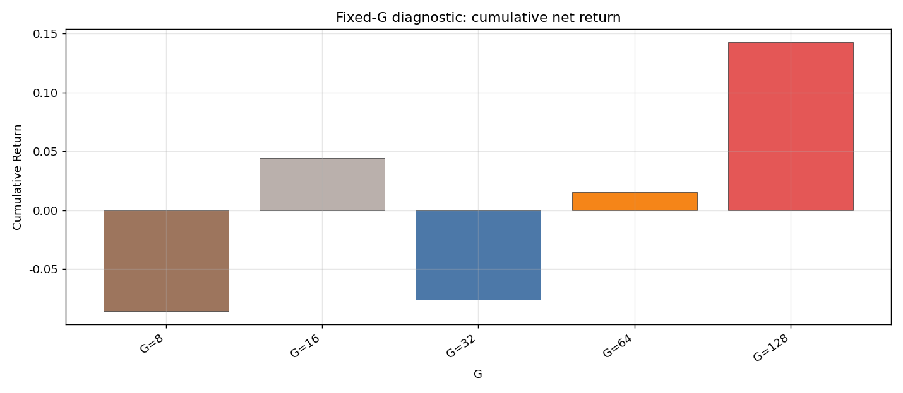

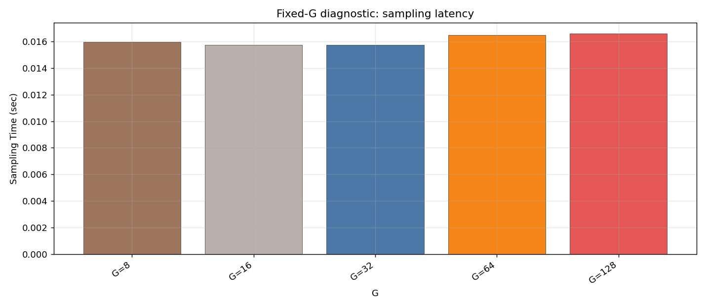

## 5. Alpha 解释

唯一 Alpha 路径使用历史分钟 OHLCV/技术特征、Temporal Transformer 和 Cross-Stock Attention。以下统计均来自 Validation 选定且在 Test 月冻结的 checkpoint。

- 历史 patch attention entropy / concentration：`4.861659` / `0.008113`。
- Cross-stock attention entropy / concentration：`5.583660` / `0.004640`。
- 历史 minute mask rate 均值/最大值：`0.005931` / `0.046047`；横截面 mask rate 均值/最大值：`0.000000` / `0.000000`。
- 因果 Top-K 中因目标日开盘不可用而在执行时置零的股票记录：`160/6900`；剩余股票重新归一化，计划权重和执行权重均已保留。

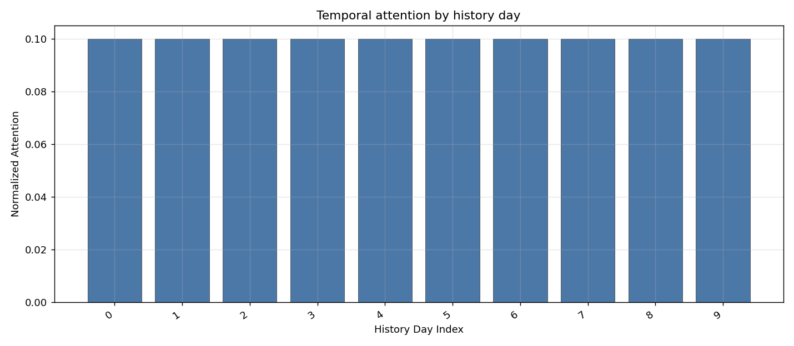

历史交易日注意力（`history_day_index=0` 为窗口最早日）：

| history_day_index | normalized_attention |
|---|---:|
| 0.0000 | 0.1000 |
| 1.0000 | 0.1000 |
| 2.0000 | 0.1000 |
| 3.0000 | 0.1000 |
| 4.0000 | 0.1000 |
| 5.0000 | 0.1000 |
| 6.0000 | 0.1000 |
| 7.0000 | 0.1000 |
| 8.0000 | 0.1000 |
| 9.0000 | 0.1000 |

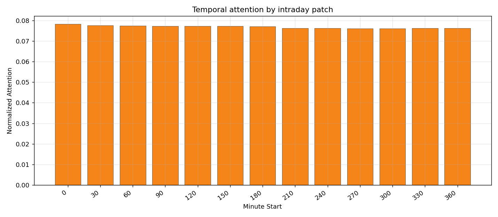

注意力最高的日内 30 分钟 patch 起点：

| minute_start_in_day | normalized_attention |
|---|---:|
| 0.0000 | 0.0783 |
| 30.0000 | 0.0777 |
| 60.0000 | 0.0775 |
| 90.0000 | 0.0773 |
| 120.0000 | 0.0773 |
| 150.0000 | 0.0773 |
| 180.0000 | 0.0772 |
| 240.0000 | 0.0762 |
| 330.0000 | 0.0762 |
| 360.0000 | 0.0763 |

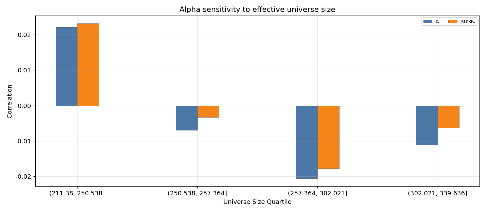

有效股票池规模敏感性（月度四分组）：

| universe_size_group | months | mean_universe_size | mean_IC | mean_RankIC | mean_topk_excess |
|---|---:|---:|---:|---:|---:|
| (211.38, 250.538] | 3.0000 | 229.1801 | 0.0221 | 0.0231 | 0.0006 |
| (250.538, 257.364] | 3.0000 | 256.3212 | -0.0069 | -0.0033 | 0.0003 |
| (257.364, 302.021] | 2.0000 | 278.7010 | -0.0206 | -0.0177 | -0.0016 |
| (302.021, 339.636] | 3.0000 | 328.1912 | -0.0111 | -0.0062 | 0.0000 |

输入特征组：

| feature_group | feature_count |
|---|---:|
| 因果滚动窗口 | 100.0000 |
| 价格/成交量技术特征 | 17.0000 |
| 原始 OHLCV | 5.0000 |
| 同分钟横截面排名 | 4.0000 |
| 日历变量 | 4.0000 |

注意力权重用于解释模型关注的历史时段和股票关系，不等同于单特征因果重要性；本实验未用 Test 标签拟合额外的特征归因器。分钟缺失通过 mask 显式处理；横截面 mask rate 为零，但历史分钟 mask 仍非零，股票池规模变化也会影响横截面 attention 与指标稳定性。

## 6. Strict OOS 与审计结论

- Leakage Audit：`473/473 PASS`；高严重度失败数：`0`。
- Test-period model update：`0`。Alpha、SS-FM、PPO、GRPO、normalizer、covariance 与 teacher state 在每个 Test 月内均冻结。
- 月度结果仅在高严重度审计全部通过后进入全年拼接；全年数字来自各 Test 月日收益顺序拼接，没有使用全年数据重新训练或选择 checkpoint。
- 本报告的固定 G Test 横向比较和月度表现均为事后诊断，不参与 checkpoint、G 或策略选择。

## 7. 风险和局限

- 历史 S&P 500 membership 不可得，代理股票池存在 survivorship/selection bias。
- 数据覆盖与 Test 月数量有限，2026-05 还是不完整月份；分钟缺失通过 mask 显式处理，但仍可能影响结果。
- 交易成本为固定费率，未完整建模开盘冲击、容量、滑点和成交概率；回测假设能在目标日开盘执行。
- 深度模型、生成策略与多组 G 比较存在过拟合和多重比较风险；RL 结果依赖 reward 定义与 Train-only robust normalization。
- 不进行周五重训降低了 Test 污染风险，但也牺牲月内适应性。strict fixed OOS 的优点是边界清晰，局限是面对 regime shift 时模型整月固定。
- Test-period model update 数为零；所有模型、normalizer、风险状态与策略参数在对应 Test 月内冻结。
