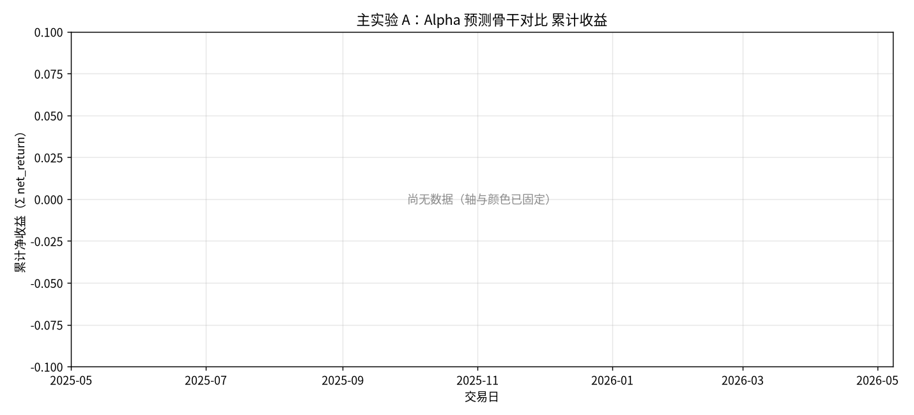
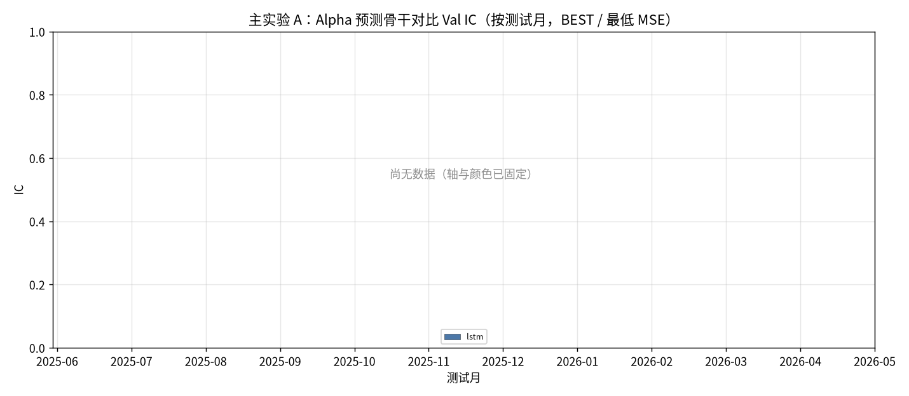
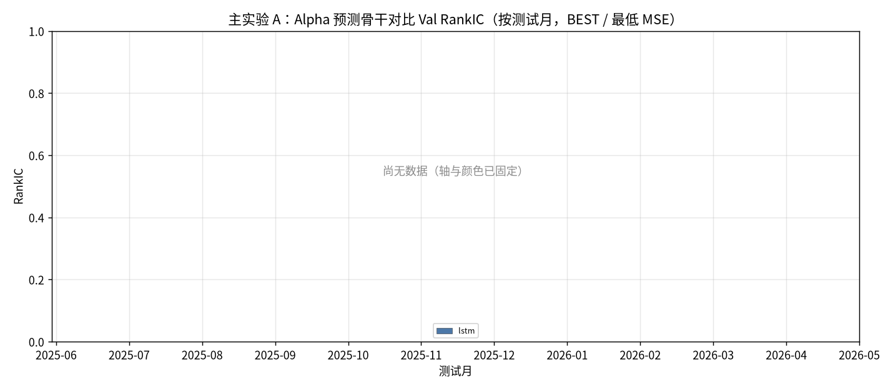
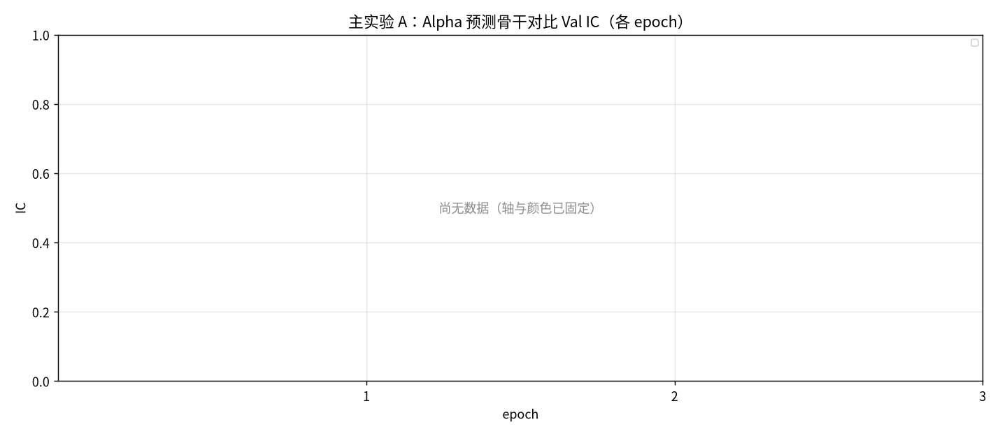
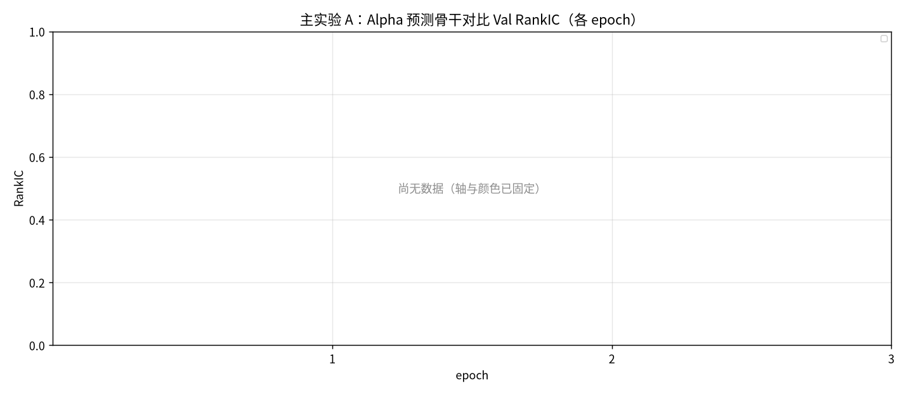
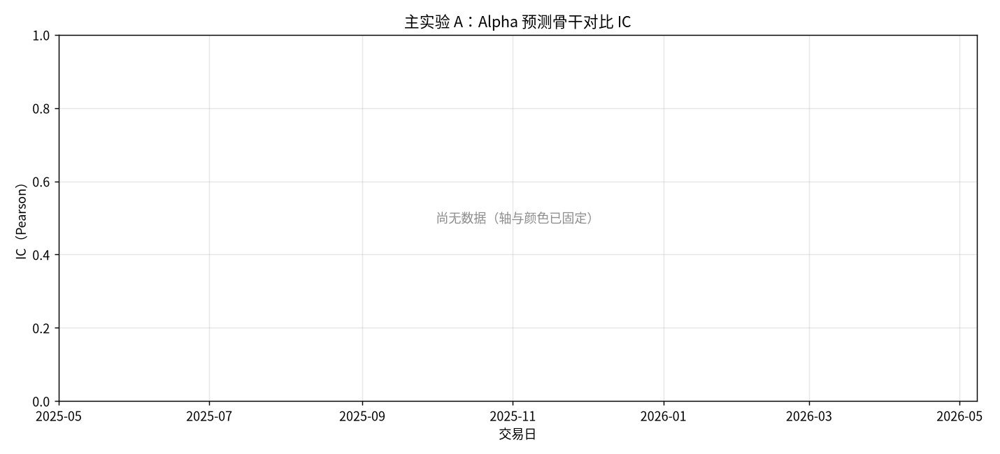
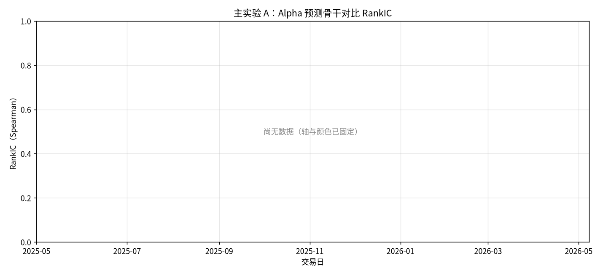
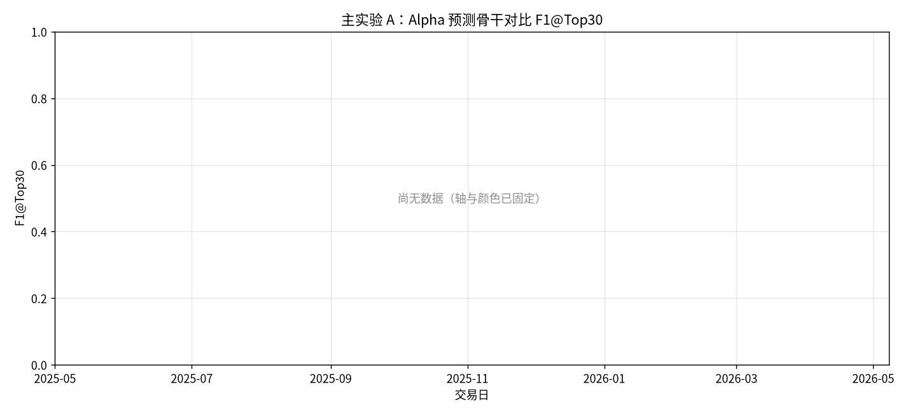
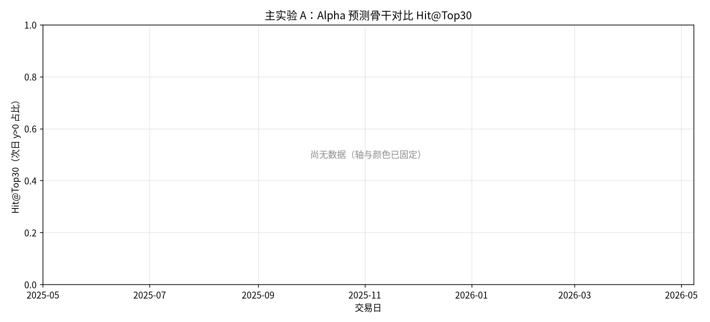

# 主实验 A：Alpha 预测骨干对比

- 状态: **进行中（12/13 月有数据）**
- 编号: `M01_prediction`
- 类型: 主实验
- 说明: LSTM minute-only 预测下一日 close-to-close，作为全股池配权的 Alpha baseline（取代 gated_residual）。
- 缺测一律 `-`。曲线颜色见下表，中途不改色。

## 固定颜色

| 模型 | 颜色 |
| --- | --- |
| lstm | #4C78A8 |

## 实验设定

- Walk-forward 测试月 2025-05 … 2026-05（2026-05 分钟数据只到 05-08）。
- 配权=全股池，cost_bps=3.0，primary=`standard_transformer`。
- Sequential OOS：周五收盘重训，下周一生效。

## 13 个月进度

| month | status | n_pred_models_val | n_nav_models | leakage_audit |
| --- | --- | --- | --- | --- |
| 2025-05 | - | - | - | - |
| 2025-06 | 已写入 | 0.0000 | 1 | - |
| 2025-07 | 已写入 | 0.0000 | 1 | - |
| 2025-08 | 已写入 | 0.0000 | 1 | - |
| 2025-09 | 已写入 | 0.0000 | 1 | - |
| 2025-10 | 已写入 | 0.0000 | 1 | - |
| 2025-11 | 已写入 | 0.0000 | 1 | - |
| 2025-12 | 已写入 | 0.0000 | 1 | - |
| 2026-01 | 已写入 | 0.0000 | 1 | - |
| 2026-02 | 已写入 | 0.0000 | 1 | - |
| 2026-03 | 已写入 | 0.0000 | 1 | - |
| 2026-04 | 已写入 | 0.0000 | 1 | - |
| 2026-05 | 已写入 | 0.0000 | 1 | - |

## Validation BEST（按模型 Val MSE）

| model | MSE | MAE | IC | RankIC | topk_f1 | topk_precision | topk_recall | dir_acc | dir_f1 | dir_precision | dir_recall | top30_hit_rate | n |
| --- | --- | --- | --- | --- | --- | --- | --- | --- | --- | --- | --- | --- | --- |
| lstm | - | - | - | - | - | - | - | - | - | - | - | - | - |

## Test 预测指标（已完成月份的日均）

| model | MSE | MAE | IC | RankIC | topk_f1 | topk_precision | topk_recall | dir_acc | dir_f1 | dir_precision | dir_recall | top30_hit_rate | top30_excess | n |
| --- | --- | --- | --- | --- | --- | --- | --- | --- | --- | --- | --- | --- | --- | --- |
| lstm | - | - | - | - | - | - | - | - | - | - | - | - | - | - |

## 组合绩效（已完成月份拼接）

| model | total_net_return | ann_return | sharpe | max_drawdown | mean_turnover | mean_cost | n_days |
| --- | --- | --- | --- | --- | --- | --- | --- |
| pred_lstm_softmax_all | - | - | - | - | - | - | - |
| universe_ew_all | - | - | - | - | - | - | - |

## 图（颜色已固定，无数据时只画轴）

### 累计收益

固定颜色: `pred_lstm_softmax_all` `#4C78A8`；`universe_ew_all` `#7F7F7F`。

### Val IC

固定颜色: `lstm` `#4C78A8`。

### Val RankIC

固定颜色: `lstm` `#4C78A8`。

### Val IC 各 epoch

固定颜色: `lstm` `#4C78A8`。

### Val RankIC 各 epoch

固定颜色: `lstm` `#4C78A8`。

### Test IC

固定颜色: `lstm` `#4C78A8`。

### Test RankIC

固定颜色: `lstm` `#4C78A8`。

### Test F1@Top30

固定颜色: `lstm` `#4C78A8`。

### Test Hit@Top30

固定颜色: `lstm` `#4C78A8`。

## 分析

以下只讨论**已经写入数字**的行；单元格为 `-` 的表示该实验尚未跑完，不编造。
来源: aggregated disk。OOS=`strict_fixed_oos`，费用=3.0bps，配权池=全股池（无 Top30）。

已有数据的对象: `2025-06`, `2025-07`, `2025-08`, `2025-09`, `2025-10`, `2025-11`, `2025-12`, `2026-01`, `2026-02`, `2026-03`, `2026-04`, `2026-05`。
- Val IC 目前最高: `standard_transformer` = -0.0023。
- Val F1@Top30 目前最高: `standard_transformer` = 0.1070（随机约 0.06）。
- Val MSE 目前最低（入选口径）: `standard_transformer` = 0.000196。
- Test 日均 IC 目前最高: `standard_transformer` = 0.0037。
- 已回测净值目前最高: `pred_standard_transformer_softmax` 累计净收益 -0.1126，Sharpe -0.8379。
