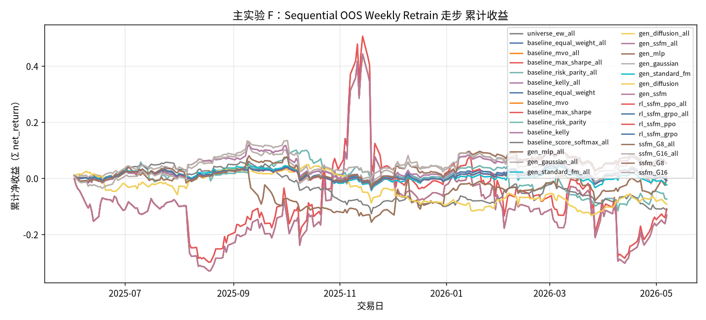

# 主实验 F：Sequential OOS Weekly Retrain 走步

- 状态: **进行中（12/13 月有数据）**
- 编号: `M06_walkforward_oos`
- 类型: 主实验
- 说明: 仅 Sequential OOS：周五收盘后用已实现数据重训 primary+生成+RL，下周一生效。测试月 2025-05～2026-05。
- 缺测一律 `-`。曲线颜色见下表，中途不改色。

## 固定颜色

| 模型 | 颜色 |
| --- | --- |
| pred_lstm_softmax_all | #4C78A8 |
| universe_ew_all | #7F7F7F |
| baseline_equal_weight_all | #4C78A8 |
| baseline_mvo_all | #F58518 |
| baseline_max_sharpe_all | #E45756 |
| baseline_risk_parity_all | #72B7B2 |
| baseline_kelly_all | #B279A2 |
| baseline_equal_weight | #4C78A8 |
| baseline_mvo | #F58518 |
| baseline_max_sharpe | #E45756 |
| baseline_risk_parity | #72B7B2 |
| baseline_kelly | #B279A2 |
| baseline_score_softmax_all | #7F7F7F |
| gen_mlp_all | #9D755D |
| gen_gaussian_all | #BAB0AC |
| gen_standard_fm_all | #17BECF |
| gen_diffusion_all | #F2CF5B |
| gen_ssfm_all | #B279A2 |
| gen_mlp | #9D755D |
| gen_gaussian | #BAB0AC |
| gen_standard_fm | #17BECF |
| gen_diffusion | #F2CF5B |
| gen_ssfm | #B279A2 |
| rl_ssfm_ppo_all | #E45756 |
| rl_ssfm_grpo_all | #4C78A8 |
| rl_ssfm_ppo | #E45756 |
| rl_ssfm_grpo | #4C78A8 |
| ssfm_G8_all | #9D755D |
| ssfm_G16_all | #BAB0AC |
| ssfm_G8 | #9D755D |
| ssfm_G16 | #BAB0AC |

## 实验设定

- Walk-forward 测试月 2025-05 … 2026-05（2026-05 分钟数据只到 05-08）。
- 配权=全股池，cost_bps=3.0，primary=`standard_transformer`。
- Sequential OOS：周五收盘重训，下周一生效。

## 13 个月进度

| month | status | n_pred_models_val | n_nav_models | leakage_audit |
| --- | --- | --- | --- | --- |
| 2025-05 | - | - | - | - |
| 2025-06 | 已写入 | - | 16 | - |
| 2025-07 | 已写入 | - | 16 | - |
| 2025-08 | 已写入 | - | 16 | - |
| 2025-09 | 已写入 | - | 16 | - |
| 2025-10 | 已写入 | - | 16 | - |
| 2025-11 | 已写入 | - | 16 | - |
| 2025-12 | 已写入 | - | 16 | - |
| 2026-01 | 已写入 | - | 16 | - |
| 2026-02 | 已写入 | - | 16 | - |
| 2026-03 | 已写入 | - | 16 | - |
| 2026-04 | 已写入 | - | 16 | - |
| 2026-05 | 已写入 | - | 16 | - |

## Validation BEST（按模型 Val MSE）

| model | MSE | MAE | IC | RankIC | topk_f1 | topk_precision | topk_recall | dir_acc | dir_f1 | dir_precision | dir_recall | top30_hit_rate | n |
| --- | --- | --- | --- | --- | --- | --- | --- | --- | --- | --- | --- | --- | --- |
| lstm | - | - | - | - | - | - | - | - | - | - | - | - | - |

## 组合绩效（已完成月份拼接）

| model | total_net_return | ann_return | sharpe | max_drawdown | mean_turnover | mean_cost | n_days |
| --- | --- | --- | --- | --- | --- | --- | --- |
| pred_lstm_softmax_all | - | - | - | - | - | - | - |
| universe_ew_all | 0.0011 | 0.0012 | 0.0630 | 0.0715 | 0.0262 | 0.0000 | 235 |
| baseline_equal_weight_all | 0.0011 | 0.0012 | 0.0630 | 0.0715 | 0.0262 | 0.0000 | 235 |
| baseline_mvo_all | -0.1312 | -0.1400 | 0.1082 | 0.5169 | 0.2340 | 0.0001 | 235 |
| baseline_max_sharpe_all | -0.1089 | -0.1163 | 0.1440 | 0.5254 | 0.2346 | 0.0001 | 235 |
| baseline_risk_parity_all | -0.0743 | -0.0795 | -0.3684 | 0.1968 | 0.2429 | 0.0001 | 235 |
| baseline_kelly_all | -0.1312 | -0.1400 | 0.1082 | 0.5169 | 0.2340 | 0.0001 | 235 |
| baseline_equal_weight | 0.0011 | 0.0012 | 0.0630 | 0.0715 | 0.0262 | 0.0000 | 235 |
| baseline_mvo | -0.1312 | -0.1400 | 0.1082 | 0.5169 | 0.2340 | 0.0001 | 235 |
| baseline_max_sharpe | -0.1089 | -0.1163 | 0.1440 | 0.5254 | 0.2346 | 0.0001 | 235 |
| baseline_risk_parity | -0.0743 | -0.0795 | -0.3684 | 0.1968 | 0.2429 | 0.0001 | 235 |
| baseline_kelly | -0.1312 | -0.1400 | 0.1082 | 0.5169 | 0.2340 | 0.0001 | 235 |
| baseline_score_softmax_all | -0.1126 | -0.1202 | -0.8379 | 0.1759 | 0.7566 | 0.0002 | 235 |
| gen_mlp_all | 0.0061 | 0.0065 | 0.1446 | 0.2120 | 0.1037 | 0.0000 | 235 |
| gen_gaussian_all | 0.0186 | 0.0199 | 0.2014 | 0.1412 | 0.5151 | 0.0002 | 235 |
| gen_standard_fm_all | -0.0232 | -0.0248 | -0.1813 | 0.0892 | 0.5230 | 0.0002 | 235 |
| gen_diffusion_all | -0.0922 | -0.0986 | -0.5767 | 0.1744 | 0.9230 | 0.0003 | 235 |
| gen_ssfm_all | 0.0520 | 0.0559 | 0.4471 | 0.1341 | 0.5442 | 0.0002 | 235 |
| gen_mlp | 0.0061 | 0.0065 | 0.1446 | 0.2120 | 0.1037 | 0.0000 | 235 |
| gen_gaussian | 0.0186 | 0.0199 | 0.2014 | 0.1412 | 0.5151 | 0.0002 | 235 |
| gen_standard_fm | -0.0232 | -0.0248 | -0.1813 | 0.0892 | 0.5230 | 0.0002 | 235 |
| gen_diffusion | -0.0922 | -0.0986 | -0.5767 | 0.1744 | 0.9230 | 0.0003 | 235 |
| gen_ssfm | 0.0520 | 0.0559 | 0.4471 | 0.1341 | 0.5442 | 0.0002 | 235 |
| rl_ssfm_ppo_all | -0.0079 | -0.0085 | -0.0306 | 0.0769 | 0.1599 | 0.0000 | 235 |
| rl_ssfm_grpo_all | -0.0080 | -0.0086 | -0.0318 | 0.0752 | 0.1597 | 0.0000 | 235 |
| rl_ssfm_ppo | -0.0079 | -0.0085 | -0.0306 | 0.0769 | 0.1599 | 0.0000 | 235 |
| rl_ssfm_grpo | -0.0080 | -0.0086 | -0.0318 | 0.0752 | 0.1597 | 0.0000 | 235 |
| ssfm_G8_all | 0.0547 | 0.0588 | 0.4584 | 0.1039 | 0.5461 | 0.0002 | 235 |
| ssfm_G16_all | 0.0266 | 0.0285 | 0.2599 | 0.1304 | 0.5577 | 0.0002 | 235 |
| ssfm_G8 | 0.0547 | 0.0588 | 0.4584 | 0.1039 | 0.5461 | 0.0002 | 235 |
| ssfm_G16 | 0.0266 | 0.0285 | 0.2599 | 0.1304 | 0.5577 | 0.0002 | 235 |

## 图（颜色已固定，无数据时只画轴）

### 累计收益

固定颜色: `pred_lstm_softmax_all` `#4C78A8`；`universe_ew_all` `#7F7F7F`；`baseline_equal_weight_all` `#4C78A8`；`baseline_mvo_all` `#F58518`；`baseline_max_sharpe_all` `#E45756`；`baseline_risk_parity_all` `#72B7B2`；`baseline_kelly_all` `#B279A2`；`baseline_equal_weight` `#4C78A8`；`baseline_mvo` `#F58518`；`baseline_max_sharpe` `#E45756`；`baseline_risk_parity` `#72B7B2`；`baseline_kelly` `#B279A2`；`baseline_score_softmax_all` `#7F7F7F`；`gen_mlp_all` `#9D755D`；`gen_gaussian_all` `#BAB0AC`；`gen_standard_fm_all` `#17BECF`；`gen_diffusion_all` `#F2CF5B`；`gen_ssfm_all` `#B279A2`；`gen_mlp` `#9D755D`；`gen_gaussian` `#BAB0AC`；`gen_standard_fm` `#17BECF`；`gen_diffusion` `#F2CF5B`；`gen_ssfm` `#B279A2`；`rl_ssfm_ppo_all` `#E45756`；`rl_ssfm_grpo_all` `#4C78A8`；`rl_ssfm_ppo` `#E45756`；`rl_ssfm_grpo` `#4C78A8`；`ssfm_G8_all` `#9D755D`；`ssfm_G16_all` `#BAB0AC`；`ssfm_G8` `#9D755D`；`ssfm_G16` `#BAB0AC`。

## 分析

以下只讨论**已经写入数字**的行；单元格为 `-` 的表示该实验尚未跑完，不编造。
来源: aggregated disk。OOS=`strict_fixed_oos`，费用=3.0bps，配权池=全股池（无 Top30）。

已有数据的对象: `2025-06`, `2025-07`, `2025-08`, `2025-09`, `2025-10`, `2025-11`, `2025-12`, `2026-01`, `2026-02`, `2026-03`, `2026-04`, `2026-05`。
- Val IC 目前最高: `standard_transformer` = -0.0023。
- Val F1@Top30 目前最高: `standard_transformer` = 0.1070（随机约 0.06）。
- Val MSE 目前最低（入选口径）: `standard_transformer` = 0.000196。
- 已回测净值目前最高: `ssfm_G128_all` 累计净收益 0.1974，Sharpe 1.2242。
- 实验 E（G 候选数，top30）累计净收益最高: `ssfm_G128` = 0.1974（G=8 0.0547；G=16 0.0266）。
