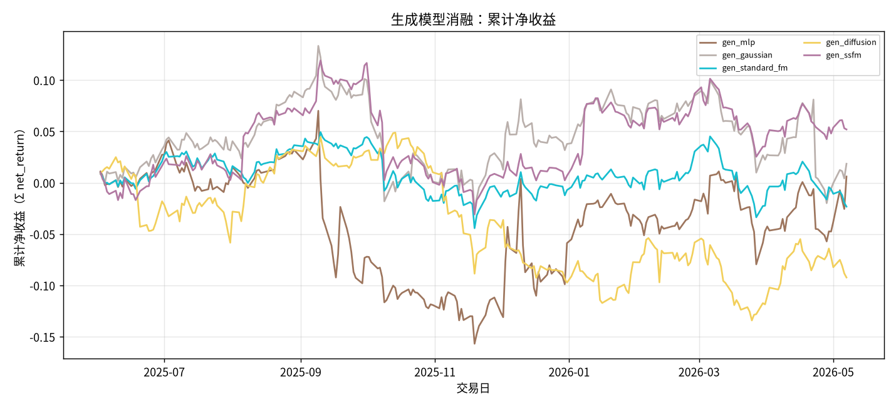
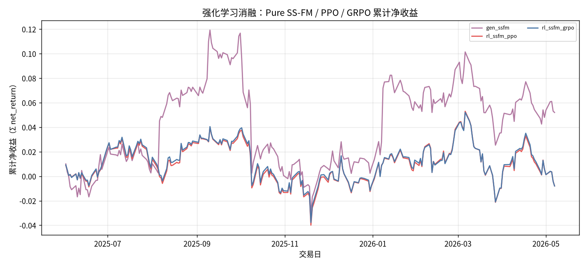
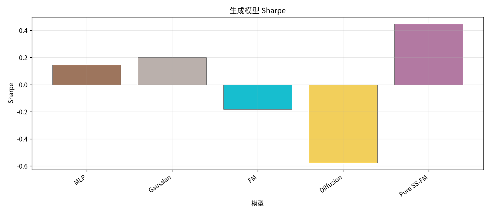
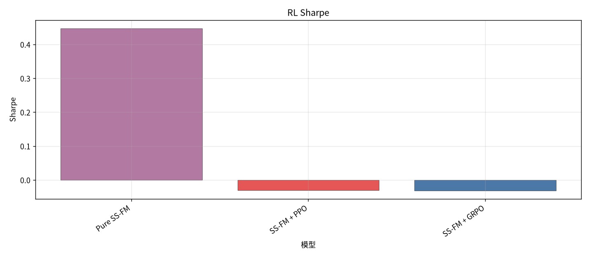
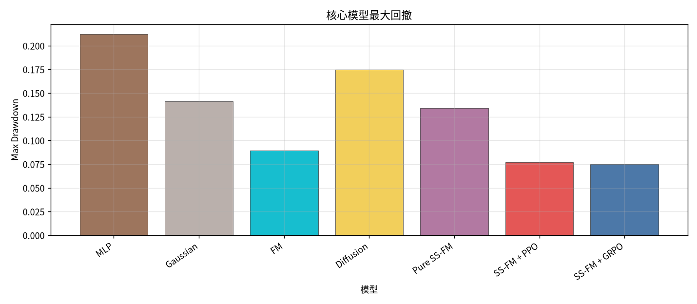
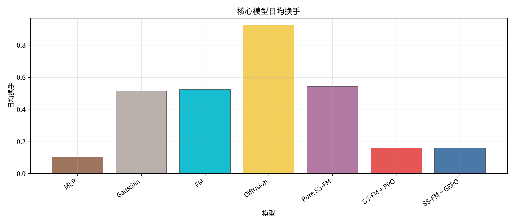
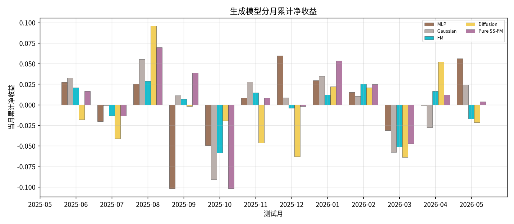
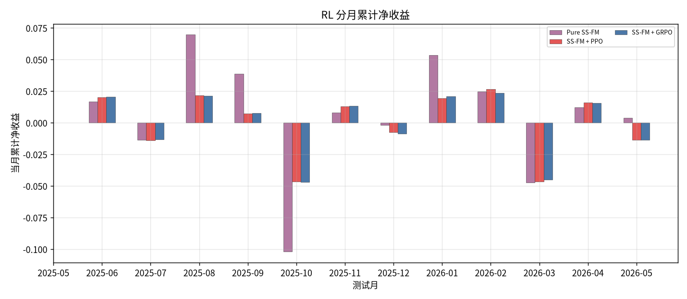
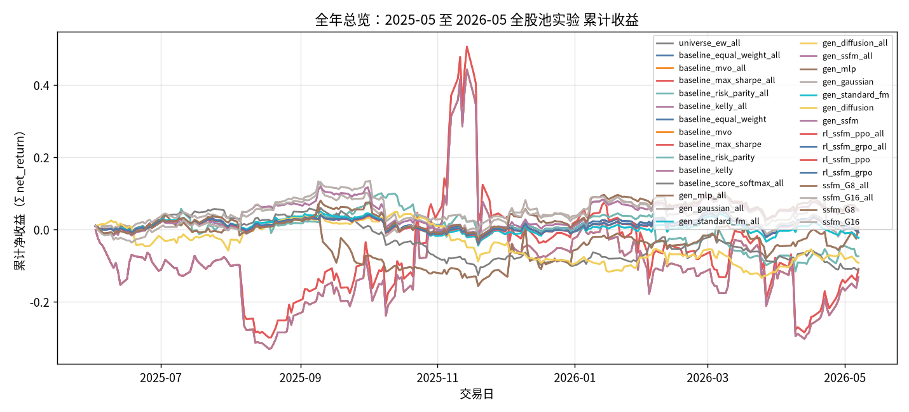

# 全年总览：S&P500 2025-06 至 2026-05

- 状态: **12 个测试月均已写入**
- 编号: `全年总览`
- 类型: 全年总览
- 说明: 12 个测试月拼接：Minute Transformer + Cross-Stock Attention，全股池 long-only，生成模型 MLP / Gaussian / FM / Diffusion / SS-FM，以及 SS-FM+PPO/GRPO。strict_fixed_oos。
- **RL 复跑（本版）**：冻结原 `gen_ssfm_all.pt`，不重训 Alpha/SS-FM；`w_turnover=w_smooth_mdd=0.05`，线上 BC（`bc_coef=0.2`）贴 SS-FM 采样，`prev_mode=best_reward`，`noise_std=0.25`，`epochs=3`。产物目录 `strict_fixed_oos_rl_bc/`，已写回本正本 RL 日收益。
- 缺测一律 `-`。曲线颜色见下表，中途不改色。

## 固定颜色

| 模型 | 颜色 |
| --- | --- |
| gen_mlp | #9D755D |
| gen_gaussian | #BAB0AC |
| gen_standard_fm | #17BECF |
| gen_diffusion | #F2CF5B |
| gen_ssfm | #B279A2 |
| rl_ssfm_ppo | #E45756 |
| rl_ssfm_grpo | #4C78A8 |

## 实验设定

- Walk-forward 测试月 2025-06 … 2026-05（2026-05 分钟数据只到 05-08）。Train 用 2024-05 起的分钟面板。
- 配权=全股池，cost_bps=3.0，primary=`standard_transformer`。
- OOS=`strict_fixed_oos`：每个测试月单独训练，月内不周五重训。
- 市场是 S&P500 proxy universe（非官方 PIT 成分，有 survivorship bias）。
- 标签按当日 open 到次日 close 的对数收益回测（`return_type=log`）。
- G 只写入 8 和 16，没有 32/64/128。
- 2025-05 不在本实验：分钟面板从 2024-05 起，Test 从 2025-06。2026-05 数据到 05-08。
- RL reward：`0.4·z(ret)+0.4·z(sharpe)−0.05·z(TO)−0.05·z(MDD)`（原 0.15/0.15 已下调）。

## 单月报告

各月正本在 `results/S&P500/strict_fixed_oos/strict_fixed_oos/test_month=YYYY-MM/`。

| 月份 | 报告 |
| --- | --- |
| 2025-06 | [实验分析.md](../strict_fixed_oos/test_month=2025-06/实验分析.md) |
| 2025-07 | [实验分析.md](../strict_fixed_oos/test_month=2025-07/实验分析.md) |
| 2025-08 | [实验分析.md](../strict_fixed_oos/test_month=2025-08/实验分析.md) |
| 2025-09 | [实验分析.md](../strict_fixed_oos/test_month=2025-09/实验分析.md) |
| 2025-10 | [实验分析.md](../strict_fixed_oos/test_month=2025-10/实验分析.md) |
| 2025-11 | [实验分析.md](../strict_fixed_oos/test_month=2025-11/实验分析.md) |
| 2025-12 | [实验分析.md](../strict_fixed_oos/test_month=2025-12/实验分析.md) |
| 2026-01 | [实验分析.md](../strict_fixed_oos/test_month=2026-01/实验分析.md) |
| 2026-02 | [实验分析.md](../strict_fixed_oos/test_month=2026-02/实验分析.md) |
| 2026-03 | [实验分析.md](../strict_fixed_oos/test_month=2026-03/实验分析.md) |
| 2026-04 | [实验分析.md](../strict_fixed_oos/test_month=2026-04/实验分析.md) |
| 2026-05 | [实验分析.md](../strict_fixed_oos/test_month=2026-05/实验分析.md) |

## 论文主线

Minute Transformer + Cross-Stock Attention，全股池 long-only simplex 配权，回测用 open-to-close 对数收益。比较组合生成（MLP / Gaussian / FM / Diffusion / SS-FM）以及在 SS-FM 上叠加 PPO / GRPO。

## 生成模型消融总表

| model | total_net_return | ann_return | sharpe | max_drawdown | mean_turnover | mean_cost | n_days |
| --- | --- | --- | --- | --- | --- | --- | --- |
| MLP | 0.0061 | 0.0065 | 0.1446 | 0.2120 | 0.1037 | 0.0000 | 235 |
| Gaussian | 0.0186 | 0.0199 | 0.2014 | 0.1412 | 0.5151 | 0.0002 | 235 |
| FM | -0.0232 | -0.0248 | -0.1813 | 0.0892 | 0.5230 | 0.0002 | 235 |
| Diffusion | -0.0922 | -0.0986 | -0.5767 | 0.1744 | 0.9230 | 0.0003 | 235 |
| Pure SS-FM | 0.0520 | 0.0559 | 0.4471 | 0.1341 | 0.5442 | 0.0002 | 235 |

## 生成模型分月净收益

| month | MLP | Gaussian | FM | Diffusion | Pure SS-FM |
| --- | --- | --- | --- | --- | --- |
| 2025-05 | - | - | - | - | - |
| 2025-06 | 0.0274 | 0.0325 | 0.0209 | -0.0180 | 0.0166 |
| 2025-07 | -0.0203 | -0.0009 | -0.0131 | -0.0411 | -0.0137 |
| 2025-08 | 0.0254 | 0.0555 | 0.0288 | 0.0959 | 0.0697 |
| 2025-09 | -0.1019 | 0.0113 | 0.0067 | -0.0019 | 0.0388 |
| 2025-10 | -0.0496 | -0.0908 | -0.0587 | -0.0192 | -0.1020 |
| 2025-11 | 0.0083 | 0.0277 | 0.0149 | -0.0463 | 0.0082 |
| 2025-12 | 0.0597 | 0.0087 | -0.0040 | -0.0630 | -0.0019 |
| 2026-01 | 0.0294 | 0.0346 | 0.0123 | 0.0221 | 0.0536 |
| 2026-02 | 0.0151 | 0.0104 | 0.0253 | 0.0208 | 0.0247 |
| 2026-03 | -0.0312 | -0.0576 | -0.0513 | -0.0640 | -0.0474 |
| 2026-04 | -0.0005 | -0.0276 | 0.0164 | 0.0523 | 0.0122 |
| 2026-05 | 0.0563 | 0.0245 | -0.0170 | -0.0215 | 0.0038 |

## 强化学习消融总表（RL-BC 复跑后）

| model | total_net_return | ann_return | sharpe | max_drawdown | mean_turnover | mean_cost | n_days |
| --- | --- | --- | --- | --- | --- | --- | --- |
| Pure SS-FM | 0.0520 | 0.0559 | 0.4471 | 0.1341 | 0.5442 | 0.0002 | 235 |
| SS-FM + PPO | -0.0079 | -0.0085 | -0.0306 | 0.0769 | 0.1599 | 0.0000 | 235 |
| SS-FM + GRPO | -0.0080 | -0.0086 | -0.0318 | 0.0752 | 0.1597 | 0.0000 | 235 |

## RL 分月净收益

| month | Pure SS-FM | SS-FM + PPO | SS-FM + GRPO |
| --- | --- | --- | --- |
| 2025-05 | - | - | - |
| 2025-06 | 0.0166 | 0.0202 | 0.0206 |
| 2025-07 | -0.0137 | -0.0141 | -0.0133 |
| 2025-08 | 0.0697 | 0.0216 | 0.0215 |
| 2025-09 | 0.0388 | 0.0072 | 0.0078 |
| 2025-10 | -0.1020 | -0.0465 | -0.0469 |
| 2025-11 | 0.0082 | 0.0129 | 0.0133 |
| 2025-12 | -0.0019 | -0.0074 | -0.0087 |
| 2026-01 | 0.0536 | 0.0196 | 0.0208 |
| 2026-02 | 0.0247 | 0.0264 | 0.0236 |
| 2026-03 | -0.0474 | -0.0464 | -0.0451 |
| 2026-04 | 0.0122 | 0.0160 | 0.0155 |
| 2026-05 | 0.0038 | -0.0137 | -0.0137 |

## 全年综合结果总表

| model | total_net_return | ann_return | sharpe | max_drawdown | mean_turnover | mean_cost | n_days |
| --- | --- | --- | --- | --- | --- | --- | --- |
| MLP | 0.0061 | 0.0065 | 0.1446 | 0.2120 | 0.1037 | 0.0000 | 235 |
| Gaussian | 0.0186 | 0.0199 | 0.2014 | 0.1412 | 0.5151 | 0.0002 | 235 |
| FM | -0.0232 | -0.0248 | -0.1813 | 0.0892 | 0.5230 | 0.0002 | 235 |
| Diffusion | -0.0922 | -0.0986 | -0.5767 | 0.1744 | 0.9230 | 0.0003 | 235 |
| Pure SS-FM | 0.0520 | 0.0559 | 0.4471 | 0.1341 | 0.5442 | 0.0002 | 235 |
| SS-FM + PPO | -0.0079 | -0.0085 | -0.0306 | 0.0769 | 0.1599 | 0.0000 | 235 |
| SS-FM + GRPO | -0.0080 | -0.0086 | -0.0318 | 0.0752 | 0.1597 | 0.0000 | 235 |

## 12 个月进度

| month | status | n_nav_models | rl_note |
| --- | --- | --- | --- |
| 2025-06 | 已写入 | - | RL 已用冻结 SS-FM + BC 复跑 |
| 2025-07 | 已写入 | - | RL 已用冻结 SS-FM + BC 复跑 |
| 2025-08 | 已写入 | - | RL 已用冻结 SS-FM + BC 复跑 |
| 2025-09 | 已写入 | - | RL 已用冻结 SS-FM + BC 复跑 |
| 2025-10 | 已写入 | - | RL 已用冻结 SS-FM + BC 复跑 |
| 2025-11 | 已写入 | - | RL 已用冻结 SS-FM + BC 复跑 |
| 2025-12 | 已写入 | - | RL 已用冻结 SS-FM + BC 复跑 |
| 2026-01 | 已写入 | - | RL 已用冻结 SS-FM + BC 复跑 |
| 2026-02 | 已写入 | - | RL 已用冻结 SS-FM + BC 复跑 |
| 2026-03 | 已写入 | - | RL 已用冻结 SS-FM + BC 复跑 |
| 2026-04 | 已写入 | - | RL 已用冻结 SS-FM + BC 复跑 |
| 2026-05 | 已写入 | - | RL 已用冻结 SS-FM + BC 复跑 |

## 图（颜色已固定）

### 生成模型累计净值

### RL 累计净值

### 生成模型 Sharpe

### RL Sharpe

### 最大回撤

### 日均换手

### 生成模型分月收益

### RL 分月收益

### 累计收益

## 分析

分析主线是 **Minute Transformer + Cross-Stock Attention → 组合生成 → RL 配权优化**。预测骨干只有 `standard_transformer`。
缺测单元格为 `-`，不补 0。

### SS-FM 相对 FM / Diffusion / MLP / Gaussian
- 全年累计净收益最高: `Pure SS-FM` = 0.0520。
- Sharpe 最高: `Pure SS-FM` = 0.4471。
- 点估计：Pure SS-FM `0.0520` / Sharpe `0.4471` / 换手 `0.5442`；FM `-0.0232` / `-0.1813`；Diffusion `-0.0922` / `-0.5767`。

### PPO / GRPO 相对 Pure SS-FM（RL-BC 复跑）
- Pure SS-FM 收益 `0.0520` Sharpe `0.4471` 换手 `0.5442`。
- SS-FM + PPO 收益 `-0.0079` Sharpe `-0.0306` 换手 `0.1599`。
- SS-FM + GRPO 收益 `-0.0080` Sharpe `-0.0318` 换手 `0.1597`。
- 相对旧版 RL（TO/MDD 权重 0.15、无 BC、prev=mean）：旧 PPO `-0.0117` / 旧 GRPO `-0.0140` → 本版 PPO `-0.0079` / GRPO `-0.0080`。
- 是否跑赢 Pure SS-FM：PPO **否**；GRPO **否**。
- 解释：下调摩擦权重 + BC 锚定 SS-FM + `best_reward` 滚动，减轻「均值塌缩成低换手盆地」；若仍落后 Pure，多半是截面 alpha 仍主要来自高换手暴露，RL 在稳健性上的增益不足以覆盖。

