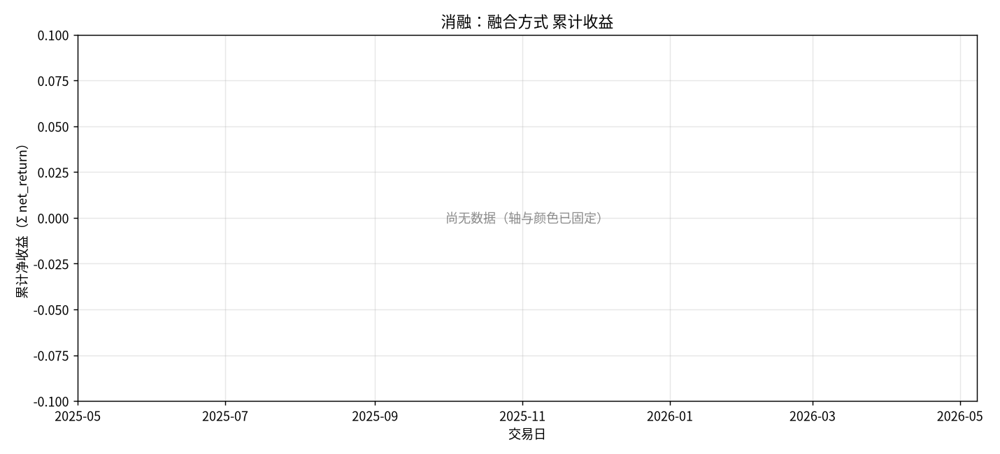
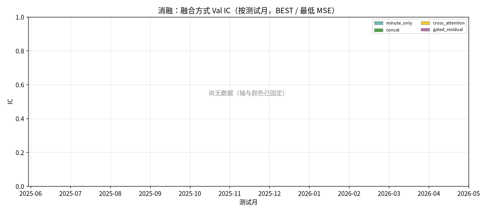
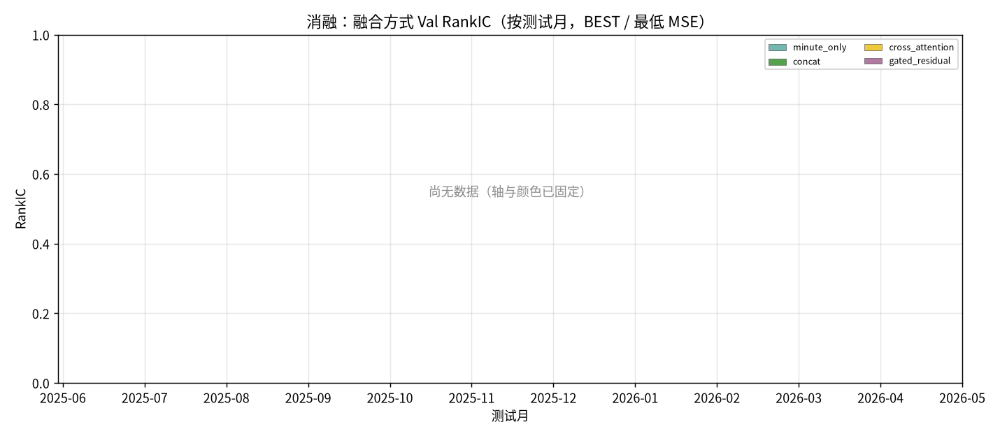
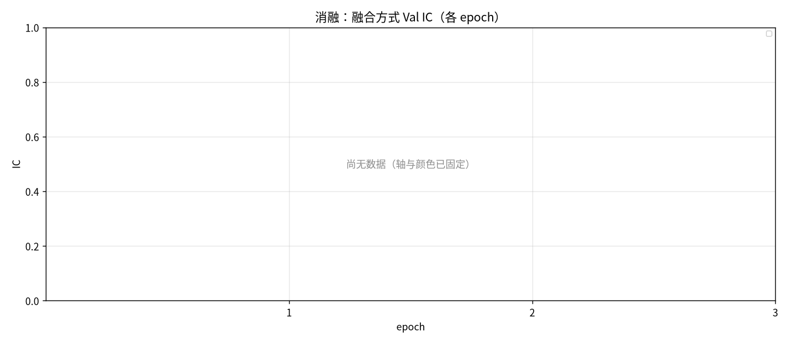
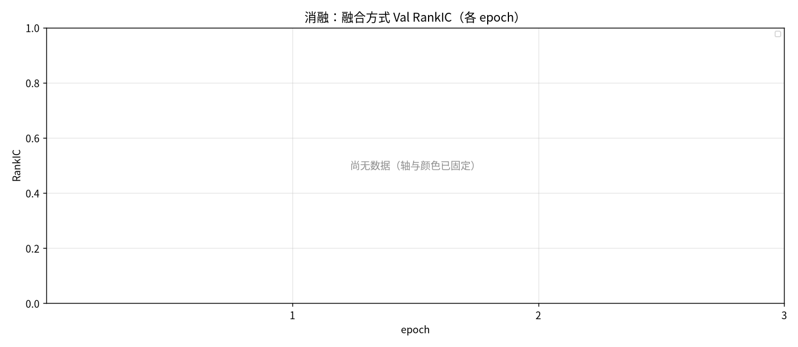
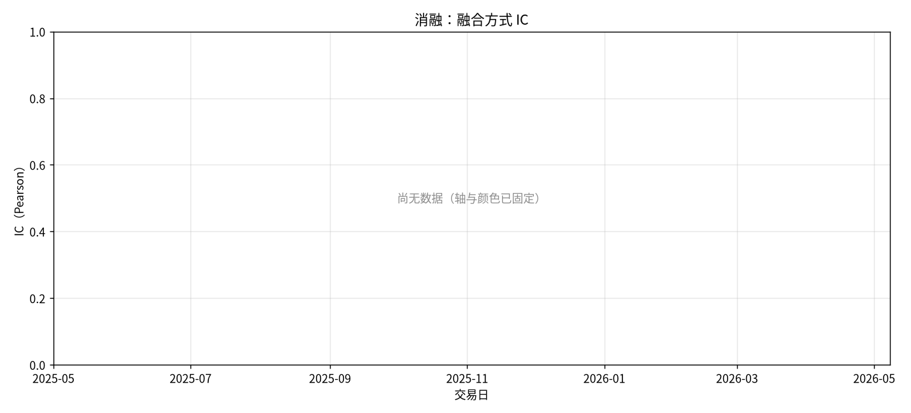
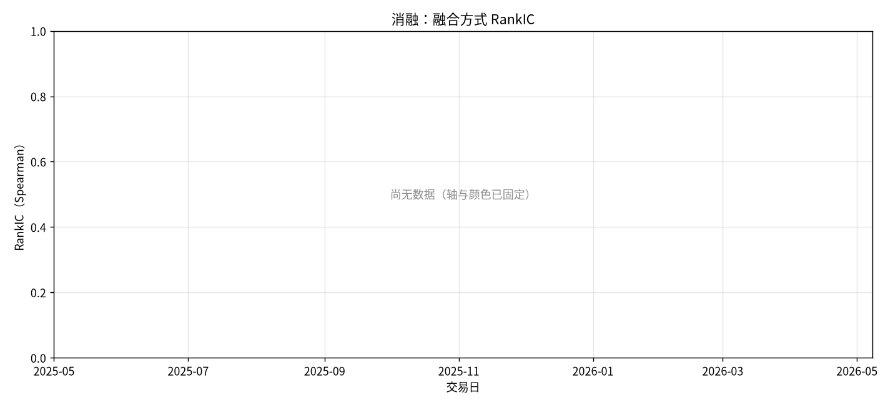
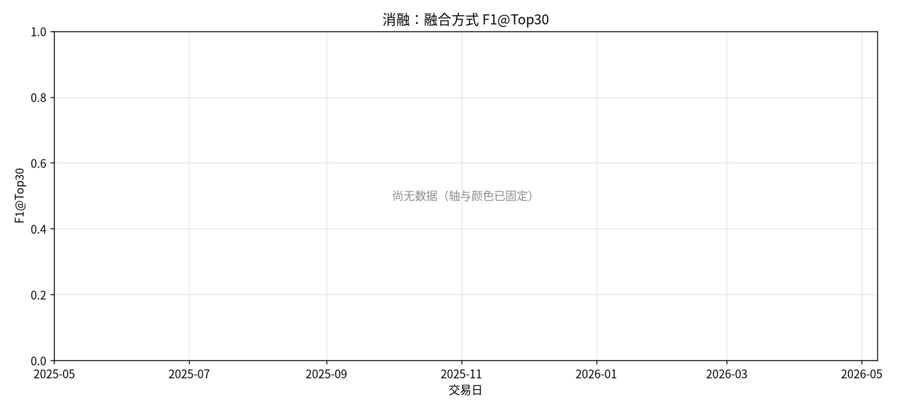
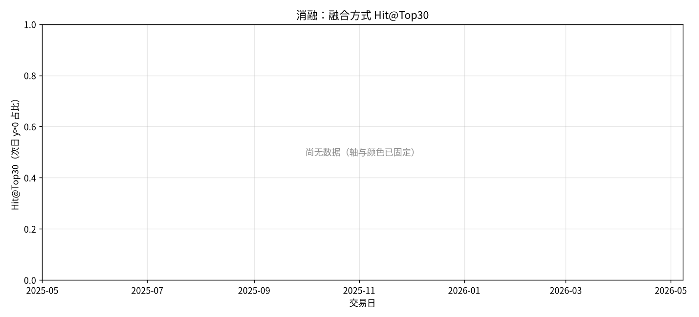

# 消融：融合方式

- 状态: **占位（轴和表头已铺齐）**
- 编号: `X01_fusion_ablation`
- 类型: 消融/系统
- 说明: 分钟-only / concat / 单向 cross-attn / 门控残差 H_hist + g⊙H_auction。
- 缺测一律 `-`。曲线颜色见下表，中途不改色。

## 固定颜色

| 模型 | 颜色 |
| --- | --- |
| minute_only | #72B7B2 |
| concat | #54A24B |
| cross_attention | #EECA3B |
| gated_residual | #B279A2 |

## 实验设定

- Walk-forward 测试月 2025-05 … 2026-05（2026-05 分钟数据只到 05-08）。
- 配权=全股池，cost_bps=3.0，primary=`standard_transformer`。
- Sequential OOS：周五收盘重训，下周一生效。

## 13 个月进度

| month | status | n_pred_models_val | n_nav_models | leakage_audit |
| --- | --- | --- | --- | --- |
| 2025-05 | - | - | - | - |
| 2025-06 | - | 0.0000 | - | - |
| 2025-07 | - | 0.0000 | - | - |
| 2025-08 | - | 0.0000 | - | - |
| 2025-09 | - | 0.0000 | - | - |
| 2025-10 | - | 0.0000 | - | - |
| 2025-11 | - | 0.0000 | - | - |
| 2025-12 | - | 0.0000 | - | - |
| 2026-01 | - | 0.0000 | - | - |
| 2026-02 | - | 0.0000 | - | - |
| 2026-03 | - | 0.0000 | - | - |
| 2026-04 | - | 0.0000 | - | - |
| 2026-05 | - | 0.0000 | - | - |

## Validation BEST（按模型 Val MSE）

| model | MSE | MAE | IC | RankIC | topk_f1 | topk_precision | topk_recall | dir_acc | dir_f1 | dir_precision | dir_recall | top30_hit_rate | n |
| --- | --- | --- | --- | --- | --- | --- | --- | --- | --- | --- | --- | --- | --- |
| minute_only | - | - | - | - | - | - | - | - | - | - | - | - | - |
| concat | - | - | - | - | - | - | - | - | - | - | - | - | - |
| cross_attention | - | - | - | - | - | - | - | - | - | - | - | - | - |
| gated_residual | - | - | - | - | - | - | - | - | - | - | - | - | - |

## Test 预测指标（已完成月份的日均）

| model | MSE | MAE | IC | RankIC | topk_f1 | topk_precision | topk_recall | dir_acc | dir_f1 | dir_precision | dir_recall | top30_hit_rate | top30_excess | n |
| --- | --- | --- | --- | --- | --- | --- | --- | --- | --- | --- | --- | --- | --- | --- |
| minute_only | - | - | - | - | - | - | - | - | - | - | - | - | - | - |
| concat | - | - | - | - | - | - | - | - | - | - | - | - | - | - |
| cross_attention | - | - | - | - | - | - | - | - | - | - | - | - | - | - |
| gated_residual | - | - | - | - | - | - | - | - | - | - | - | - | - | - |

## 组合绩效（已完成月份拼接）

| model | total_net_return | ann_return | sharpe | max_drawdown | mean_turnover | mean_cost | n_days |
| --- | --- | --- | --- | --- | --- | --- | --- |
| pred_minute_only_ew | - | - | - | - | - | - | - |
| pred_concat_ew | - | - | - | - | - | - | - |
| pred_cross_attention_ew | - | - | - | - | - | - | - |
| pred_gated_residual_ew | - | - | - | - | - | - | - |

## 图（颜色已固定，无数据时只画轴）

### 累计收益

固定颜色: `pred_minute_only_ew` `#72B7B2`；`pred_concat_ew` `#54A24B`；`pred_cross_attention_ew` `#EECA3B`；`pred_gated_residual_ew` `#B279A2`。

### Val IC

固定颜色: `minute_only` `#72B7B2`；`concat` `#54A24B`；`cross_attention` `#EECA3B`；`gated_residual` `#B279A2`。

### Val RankIC

固定颜色: `minute_only` `#72B7B2`；`concat` `#54A24B`；`cross_attention` `#EECA3B`；`gated_residual` `#B279A2`。

### Val IC 各 epoch

固定颜色: `minute_only` `#72B7B2`；`concat` `#54A24B`；`cross_attention` `#EECA3B`；`gated_residual` `#B279A2`。

### Val RankIC 各 epoch

固定颜色: `minute_only` `#72B7B2`；`concat` `#54A24B`；`cross_attention` `#EECA3B`；`gated_residual` `#B279A2`。

### Test IC

固定颜色: `minute_only` `#72B7B2`；`concat` `#54A24B`；`cross_attention` `#EECA3B`；`gated_residual` `#B279A2`。

### Test RankIC

固定颜色: `minute_only` `#72B7B2`；`concat` `#54A24B`；`cross_attention` `#EECA3B`；`gated_residual` `#B279A2`。

### Test F1@Top30

固定颜色: `minute_only` `#72B7B2`；`concat` `#54A24B`；`cross_attention` `#EECA3B`；`gated_residual` `#B279A2`。

### Test Hit@Top30

固定颜色: `minute_only` `#72B7B2`；`concat` `#54A24B`；`cross_attention` `#EECA3B`；`gated_residual` `#B279A2`。

## 分析

以下只讨论**已经写入数字**的行；单元格为 `-` 的表示该实验尚未跑完，不编造。
来源: aggregated disk。OOS=`strict_fixed_oos`，费用=3.0bps，配权池=全股池（无 Top30）。

目前还没有任何实测单元格。图只画了坐标轴和固定颜色图例。
