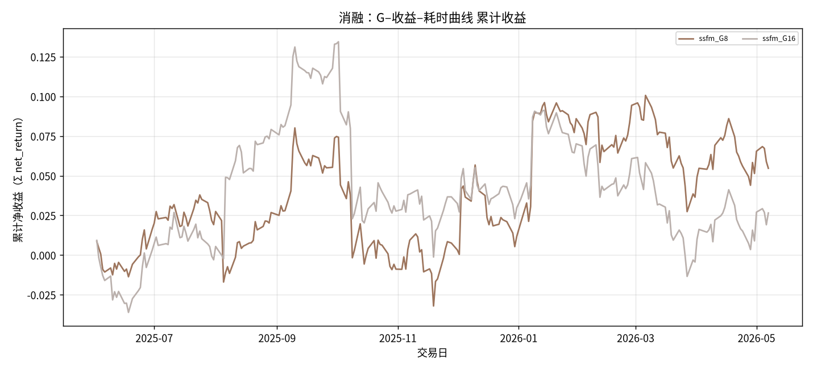
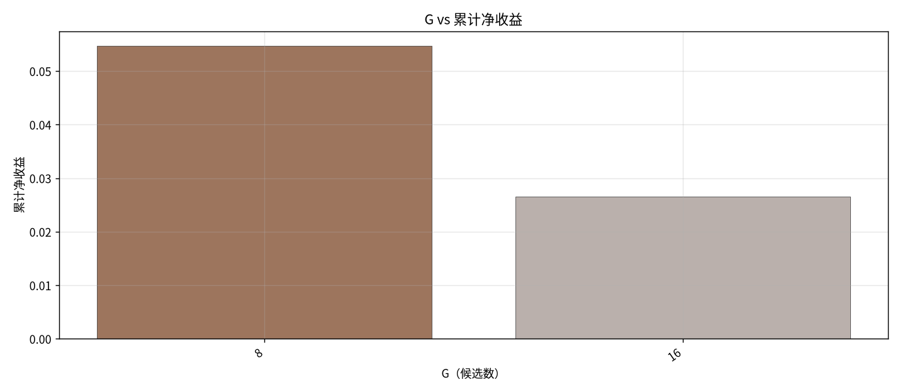

# 消融：G–收益–耗时曲线

- 状态: **占位（轴和表头已铺齐）**
- 编号: `X07_g_curves`
- 类型: 消融/系统
- 说明: 从主实验 E 抽出 G 曲线与采样时间。
- 缺测一律 `-`。曲线颜色见下表，中途不改色。

## 固定颜色

| 模型 | 颜色 |
| --- | --- |
| ssfm_G8 | #9D755D |
| ssfm_G16 | #BAB0AC |

## 实验设定

- Walk-forward 测试月 2025-05 … 2026-05（2026-05 分钟数据只到 05-08）。
- 配权=全股池，cost_bps=3.0，primary=`standard_transformer`。
- Sequential OOS：周五收盘重训，下周一生效。

## 13 个月进度

| month | status | n_pred_models_val | n_nav_models | leakage_audit |
| --- | --- | --- | --- | --- |
| 2025-05 | - | - | - | - |
| 2025-06 | - | - | - | - |
| 2025-07 | - | - | - | - |
| 2025-08 | - | - | - | - |
| 2025-09 | - | - | - | - |
| 2025-10 | - | - | - | - |
| 2025-11 | - | - | - | - |
| 2025-12 | - | - | - | - |
| 2026-01 | - | - | - | - |
| 2026-02 | - | - | - | - |
| 2026-03 | - | - | - | - |
| 2026-04 | - | - | - | - |
| 2026-05 | - | - | - | - |

## Validation BEST（按模型 Val MSE）

| model | MSE | MAE | IC | RankIC | topk_f1 | topk_precision | topk_recall | dir_acc | dir_f1 | dir_precision | dir_recall | top30_hit_rate | n |
| --- | --- | --- | --- | --- | --- | --- | --- | --- | --- | --- | --- | --- | --- |
| lstm | - | - | - | - | - | - | - | - | - | - | - | - | - |

## 组合绩效（已完成月份拼接）

| model | total_net_return | ann_return | sharpe | max_drawdown | mean_turnover | mean_cost | n_days |
| --- | --- | --- | --- | --- | --- | --- | --- |
| ssfm_G8 | 0.0547 | 0.0588 | 0.4584 | 0.1039 | 0.5461 | 0.0002 | 235 |
| ssfm_G16 | 0.0266 | 0.0285 | 0.2599 | 0.1304 | 0.5577 | 0.0002 | 235 |

## G–收益–耗时

| G | total_net_return | sharpe | max_drawdown | mean_turnover | sampling_time_sec | n_days |
| --- | --- | --- | --- | --- | --- | --- |
| 8 | 0.0547 | 0.4584 | 0.1039 | 0.5461 | - | 235 |
| 16 | 0.0266 | 0.2599 | 0.1304 | 0.5577 | - | 235 |

## 图（颜色已固定，无数据时只画轴）

### 累计收益

固定颜色: `ssfm_G8` `#9D755D`；`ssfm_G16` `#BAB0AC`。

### G–收益

固定颜色: `8` `#9D755D`；`16` `#BAB0AC`。

## 分析

以下只讨论**已经写入数字**的行；单元格为 `-` 的表示该实验尚未跑完，不编造。
来源: aggregated disk。OOS=`strict_fixed_oos`，费用=3.0bps，配权池=全股池（无 Top30）。

目前还没有任何实测单元格。图只画了坐标轴和固定颜色图例。
- Val IC 目前最高: `standard_transformer` = -0.0023。
- Val F1@Top30 目前最高: `standard_transformer` = 0.1070（随机约 0.06）。
- Val MSE 目前最低（入选口径）: `standard_transformer` = 0.000196。
- 已回测净值目前最高: `ssfm_G128` 累计净收益 0.1974，Sharpe 1.2242。
- 实验 E（G 候选数，top30）累计净收益最高: `ssfm_G128` = 0.1974（G=8 0.0547；G=16 0.0266）。
