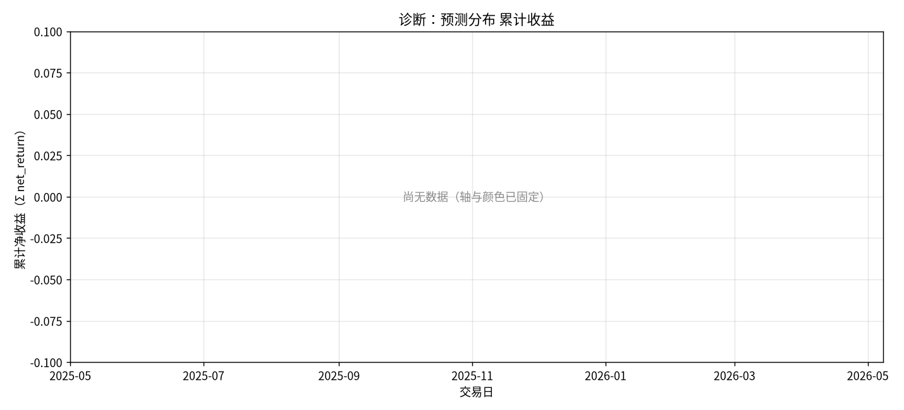
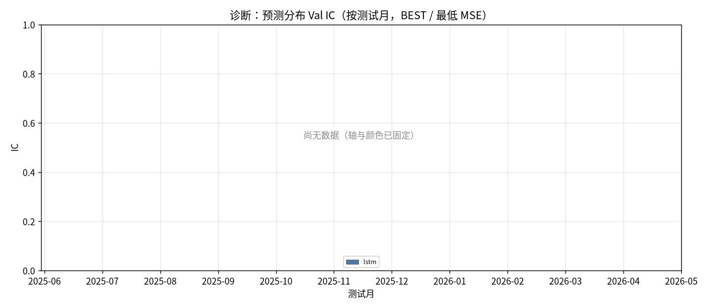
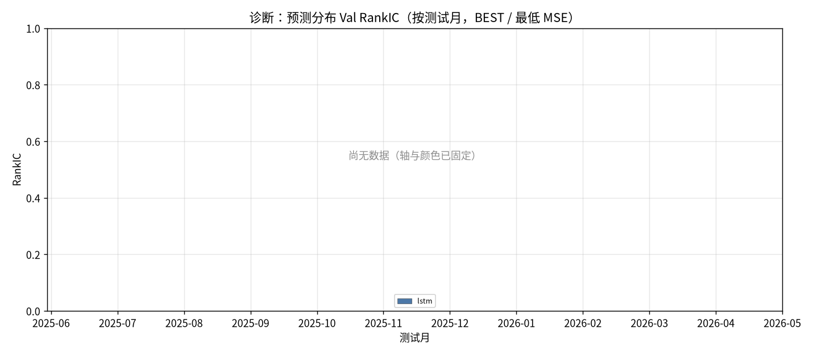
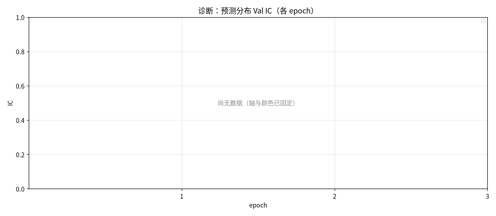
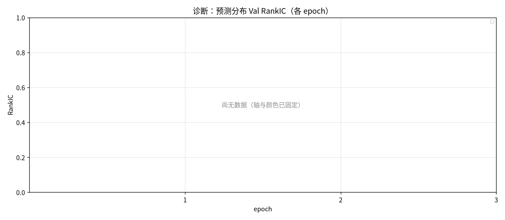
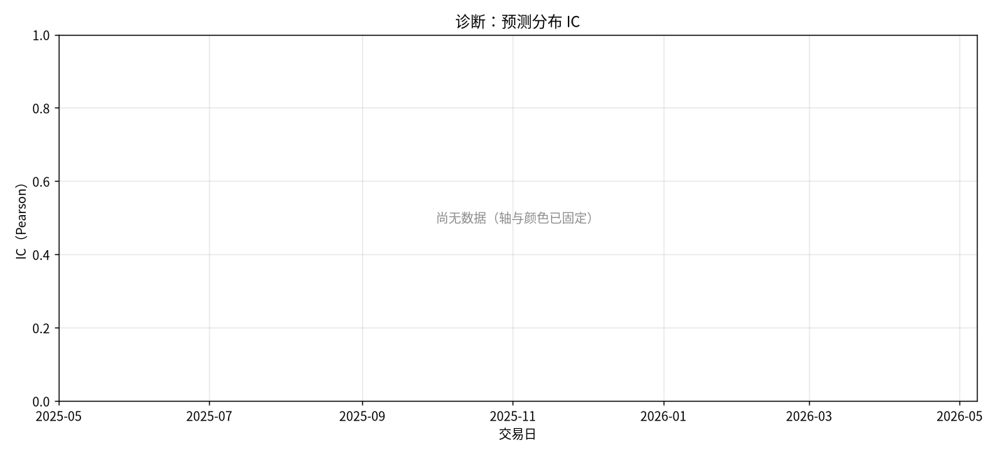
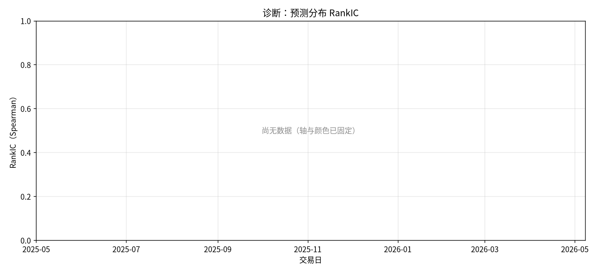
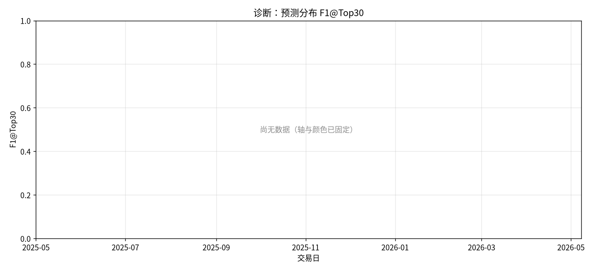
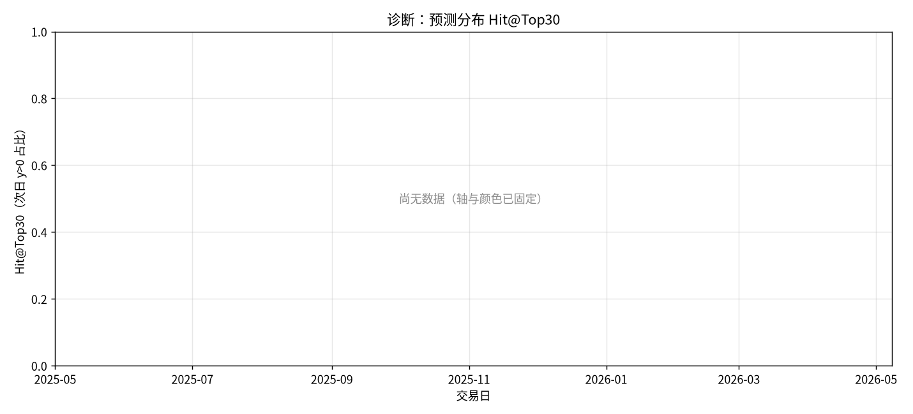
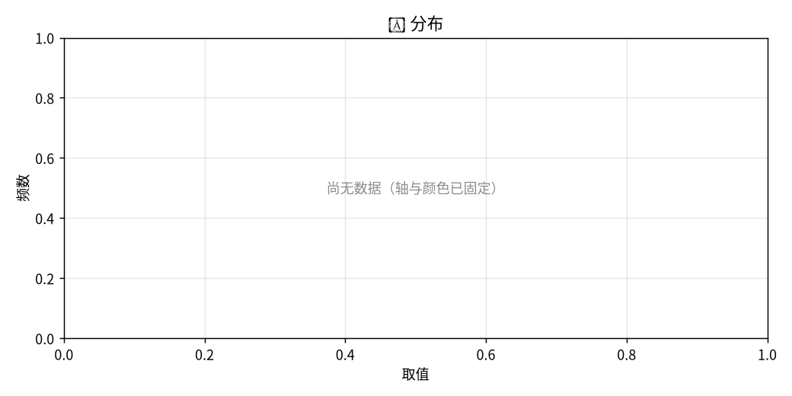

# 诊断：预测分布

- 状态: **进行中（12/13 月有数据）**
- 编号: `X10_prediction_distribution`
- 类型: 消融/系统
- 说明: ŷ 与 y 的分布、符号、分位。
- 缺测一律 `-`。曲线颜色见下表，中途不改色。

## 固定颜色

| 模型 | 颜色 |
| --- | --- |
| lstm | #4C78A8 |

## 实验设定

- Walk-forward 测试月 2025-05 … 2026-05（2026-05 分钟数据只到 05-08）。
- 配权=全股池，cost_bps=3.0，primary=`standard_transformer`。
- Sequential OOS：周五收盘重训，下周一生效。

## 13 个月进度

| month | status | n_pred_models_val | n_nav_models | leakage_audit |
| --- | --- | --- | --- | --- |
| 2025-05 | - | - | - | - |
| 2025-06 | 已写入 | 0.0000 | 16 | - |
| 2025-07 | 已写入 | 0.0000 | 16 | - |
| 2025-08 | 已写入 | 0.0000 | 16 | - |
| 2025-09 | 已写入 | 0.0000 | 16 | - |
| 2025-10 | 已写入 | 0.0000 | 16 | - |
| 2025-11 | 已写入 | 0.0000 | 16 | - |
| 2025-12 | 已写入 | 0.0000 | 16 | - |
| 2026-01 | 已写入 | 0.0000 | 16 | - |
| 2026-02 | 已写入 | 0.0000 | 16 | - |
| 2026-03 | 已写入 | 0.0000 | 16 | - |
| 2026-04 | 已写入 | 0.0000 | 16 | - |
| 2026-05 | 已写入 | 0.0000 | 16 | - |

## Validation BEST（按模型 Val MSE）

| model | MSE | MAE | IC | RankIC | topk_f1 | topk_precision | topk_recall | dir_acc | dir_f1 | dir_precision | dir_recall | top30_hit_rate | n |
| --- | --- | --- | --- | --- | --- | --- | --- | --- | --- | --- | --- | --- | --- |
| lstm | - | - | - | - | - | - | - | - | - | - | - | - | - |

## Test 预测指标（已完成月份的日均）

| model | MSE | MAE | IC | RankIC | topk_f1 | topk_precision | topk_recall | dir_acc | dir_f1 | dir_precision | dir_recall | top30_hit_rate | top30_excess | n |
| --- | --- | --- | --- | --- | --- | --- | --- | --- | --- | --- | --- | --- | --- | --- |
| lstm | - | - | - | - | - | - | - | - | - | - | - | - | - | - |

## 组合绩效（已完成月份拼接）

| model | total_net_return | ann_return | sharpe | max_drawdown | mean_turnover | mean_cost | n_days |
| --- | --- | --- | --- | --- | --- | --- | --- |
| pred_lstm_softmax_all | - | - | - | - | - | - | - |
| universe_ew_all | - | - | - | - | - | - | - |
| baseline_equal_weight_all | - | - | - | - | - | - | - |
| baseline_mvo_all | - | - | - | - | - | - | - |
| baseline_max_sharpe_all | - | - | - | - | - | - | - |
| baseline_risk_parity_all | - | - | - | - | - | - | - |
| baseline_kelly_all | - | - | - | - | - | - | - |
| baseline_equal_weight | - | - | - | - | - | - | - |
| baseline_mvo | - | - | - | - | - | - | - |
| baseline_max_sharpe | - | - | - | - | - | - | - |
| baseline_risk_parity | - | - | - | - | - | - | - |
| baseline_kelly | - | - | - | - | - | - | - |
| baseline_score_softmax_all | - | - | - | - | - | - | - |
| gen_mlp_all | - | - | - | - | - | - | - |
| gen_gaussian_all | - | - | - | - | - | - | - |
| gen_standard_fm_all | - | - | - | - | - | - | - |
| gen_diffusion_all | - | - | - | - | - | - | - |
| gen_ssfm_all | - | - | - | - | - | - | - |
| gen_mlp | - | - | - | - | - | - | - |
| gen_gaussian | - | - | - | - | - | - | - |
| gen_standard_fm | - | - | - | - | - | - | - |
| gen_diffusion | - | - | - | - | - | - | - |
| gen_ssfm | - | - | - | - | - | - | - |
| rl_ssfm_ppo_all | - | - | - | - | - | - | - |
| rl_ssfm_grpo_all | - | - | - | - | - | - | - |
| rl_ssfm_ppo | - | - | - | - | - | - | - |
| rl_ssfm_grpo | - | - | - | - | - | - | - |
| ssfm_G8_all | - | - | - | - | - | - | - |
| ssfm_G16_all | - | - | - | - | - | - | - |
| ssfm_G8 | - | - | - | - | - | - | - |
| ssfm_G16 | - | - | - | - | - | - | - |

## 图（颜色已固定，无数据时只画轴）

### 累计收益

固定颜色: `pred_lstm_softmax_all` `#4C78A8`；`universe_ew_all` `#7F7F7F`；`baseline_equal_weight_all` `#4C78A8`；`baseline_mvo_all` `#F58518`；`baseline_max_sharpe_all` `#E45756`；`baseline_risk_parity_all` `#72B7B2`；`baseline_kelly_all` `#B279A2`；`baseline_equal_weight` `#4C78A8`；`baseline_mvo` `#F58518`；`baseline_max_sharpe` `#E45756`；`baseline_risk_parity` `#72B7B2`；`baseline_kelly` `#B279A2`；`baseline_score_softmax_all` `#7F7F7F`；`gen_mlp_all` `#9D755D`；`gen_gaussian_all` `#BAB0AC`；`gen_standard_fm_all` `#17BECF`；`gen_diffusion_all` `#F2CF5B`；`gen_ssfm_all` `#B279A2`；`gen_mlp` `#9D755D`；`gen_gaussian` `#BAB0AC`；`gen_standard_fm` `#17BECF`；`gen_diffusion` `#F2CF5B`；`gen_ssfm` `#B279A2`；`rl_ssfm_ppo_all` `#E45756`；`rl_ssfm_grpo_all` `#4C78A8`；`rl_ssfm_ppo` `#E45756`；`rl_ssfm_grpo` `#4C78A8`；`ssfm_G8_all` `#9D755D`；`ssfm_G16_all` `#BAB0AC`；`ssfm_G8` `#9D755D`；`ssfm_G16` `#BAB0AC`。

### Val IC

固定颜色: `lstm` `#4C78A8`。

### Val RankIC

固定颜色: `lstm` `#4C78A8`。

### Val IC 各 epoch

固定颜色: `lstm` `#4C78A8`。

### Val RankIC 各 epoch

固定颜色: `lstm` `#4C78A8`。

### Test IC

固定颜色: `lstm` `#4C78A8`。

### Test RankIC

固定颜色: `lstm` `#4C78A8`。

### Test F1@Top30

固定颜色: `lstm` `#4C78A8`。

### Test Hit@Top30

固定颜色: `lstm` `#4C78A8`。

### ŷ 分布

固定颜色: `gated_residual` `#B279A2`。

## 分析

以下只讨论**已经写入数字**的行；单元格为 `-` 的表示该实验尚未跑完，不编造。
来源: aggregated disk。OOS=`strict_fixed_oos`，费用=3.0bps，配权池=全股池（无 Top30）。

已有数据的对象: `2025-06`, `2025-07`, `2025-08`, `2025-09`, `2025-10`, `2025-11`, `2025-12`, `2026-01`, `2026-02`, `2026-03`, `2026-04`, `2026-05`。
- Val IC 目前最高: `standard_transformer` = -0.0023。
- Val F1@Top30 目前最高: `standard_transformer` = 0.1070（随机约 0.06）。
- Val MSE 目前最低（入选口径）: `standard_transformer` = 0.000196。
- Test 日均 IC 目前最高: `standard_transformer` = 0.0037。
- 已回测净值目前最高: `pred_standard_transformer_softmax` 累计净收益 -0.1126，Sharpe -0.8379。
