# SP500 Top30 全年实验分析（2025-06 … 2026-05）

- **设定**：冻结原全年 Alpha checkpoint；配权池 **Top30**；生成 MLP / Gaussian / FM / Diffusion / SS-FM；Teacher = MVO / MaxSharpe / Risk Parity / Equal Weight；RL = `SS-FM+PPO(cand特征, sharpe_only)` + `SS-FM+GRPO(SSFM init)`；G-grid：FM & SS-FM ∈{16,32,64,128}；**无 FM+RL**。
- **OOS**：`strict_fixed_oos`，测试月 2025-06 … 2026-05（12/12），拼接约 **235** 个交易日。
- **收益口径：单利** `total_net_return = Σ net_return`（非复利）；累计曲线为加总。
- 产物目录：`results/S&P500/strict_fixed_oos_top30/`；本报告与阶段性汇总 `SP500_top30阶段性汇总.md` 不重名。

## 1. 生成模型家族

| model | total_net_return（单利） | ann_return | sharpe | max_drawdown | mean_turnover | n_days |
| --- | --- | --- | --- | --- | --- | --- |
| MLP | -0.0313 | -0.0336 | -0.2694 | 0.0926 | 0.4600 | 235 |
| Gaussian | -0.0826 | -0.0886 | -0.6238 | 0.1730 | 0.6062 | 235 |
| FM | -0.0345 | -0.0370 | -0.2707 | 0.1488 | 0.4899 | 235 |
| Diffusion | -0.2765 | -0.2965 | -1.5628 | 0.2906 | 0.7524 | 235 |
| Pure SS-FM | -0.0309 | -0.0331 | -0.1858 | 0.1654 | 0.7442 | 235 |

| month | MLP | Gaussian | FM | Diffusion | Pure SS-FM |
| --- | --- | --- | --- | --- | --- |
| 2025-06 | 0.0009 | 0.0185 | 0.0274 | 0.0065 | 0.0287 |
| 2025-07 | -0.0351 | -0.0341 | -0.0020 | -0.0383 | -0.0255 |
| 2025-08 | 0.0619 | 0.0824 | 0.0605 | 0.0431 | 0.0495 |
| 2025-09 | 0.0149 | 0.0091 | 0.0058 | -0.0217 | -0.0011 |
| 2025-10 | -0.0325 | -0.0232 | -0.0492 | -0.1678 | 0.0200 |
| 2025-11 | 0.0147 | 0.0377 | 0.0173 | -0.0623 | 0.0157 |
| 2025-12 | -0.0175 | -0.0344 | -0.0535 | -0.0324 | -0.0354 |
| 2026-01 | 0.0301 | 0.0105 | 0.0271 | 0.0391 | 0.0381 |
| 2026-02 | 0.0112 | -0.0006 | 0.0076 | 0.0484 | 0.0072 |
| 2026-03 | -0.0746 | -0.1073 | -0.0829 | -0.1079 | -0.1169 |
| 2026-04 | 0.0006 | -0.0316 | 0.0216 | 0.0054 | -0.0347 |
| 2026-05 | -0.0060 | -0.0098 | -0.0141 | 0.0115 | 0.0234 |

### 生成模型累计净值（单利）

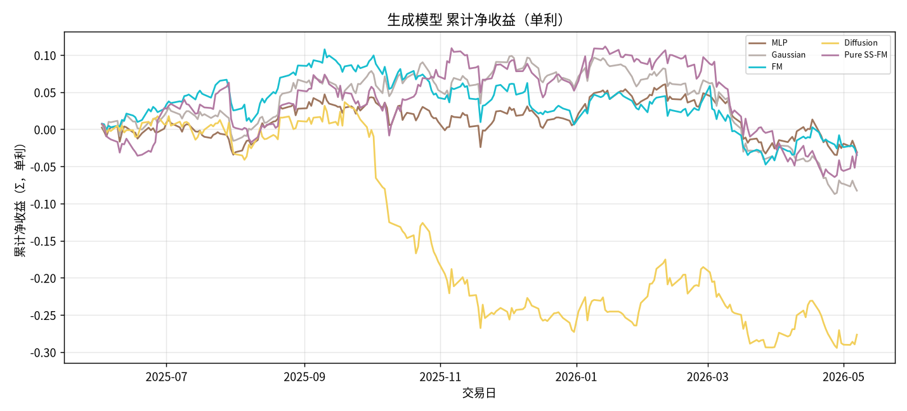

### 生成模型累计净收益（单利柱）

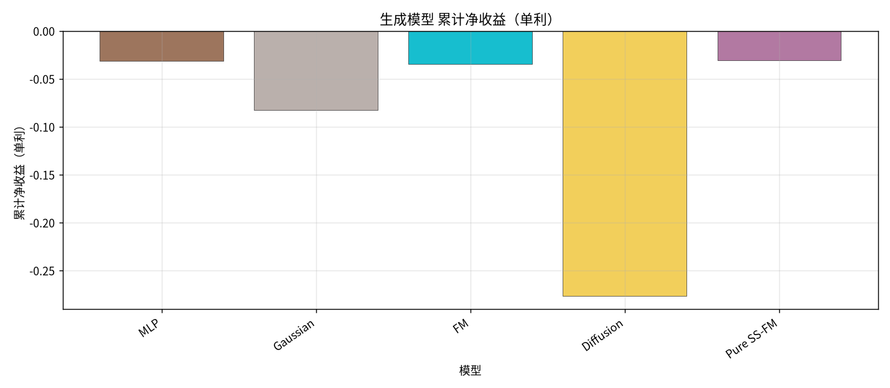

### 生成模型 Sharpe

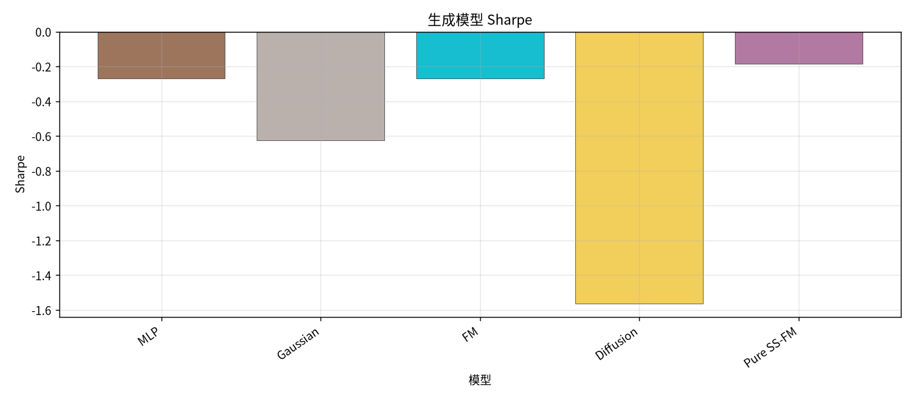

### 生成模型最大回撤

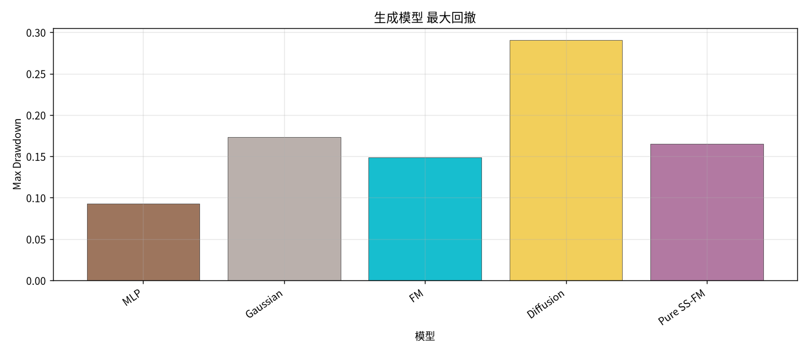

### 生成模型日均换手

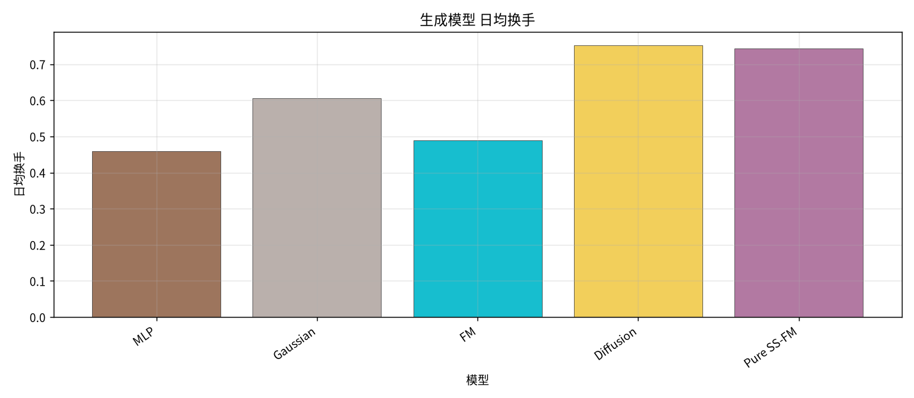

### 生成模型分月收益（单利）

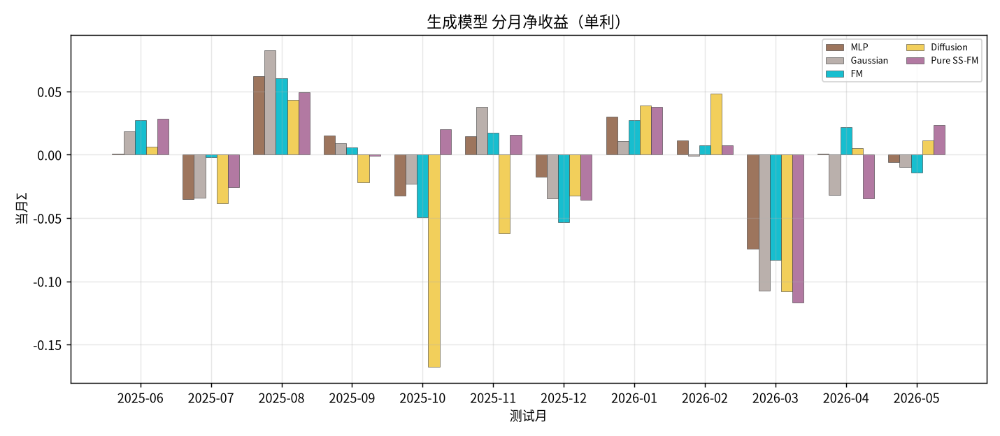

## 2. Teacher vs FM / SS-FM

| model | total_net_return（单利） | ann_return | sharpe | max_drawdown | mean_turnover | n_days |
| --- | --- | --- | --- | --- | --- | --- |
| MVO | 0.2449 | 0.2626 | 1.4444 | 0.1276 | 0.9404 | 235 |
| MaxSharpe | 0.1686 | 0.1808 | 1.1303 | 0.1224 | 0.9336 | 235 |
| Risk Parity | -0.0251 | -0.0269 | -0.2257 | 0.1167 | 0.0654 | 235 |
| Equal Weight | -0.0043 | -0.0046 | -0.0381 | 0.1058 | 0.0255 | 235 |
| FM | -0.0345 | -0.0370 | -0.2707 | 0.1488 | 0.4899 | 235 |
| Pure SS-FM | -0.0309 | -0.0331 | -0.1858 | 0.1654 | 0.7442 | 235 |

| month | MVO | MaxSharpe | Risk Parity | Equal Weight | FM | Pure SS-FM |
| --- | --- | --- | --- | --- | --- | --- |
| 2025-06 | 0.0379 | 0.0453 | 0.0232 | 0.0218 | 0.0274 | 0.0287 |
| 2025-07 | 0.0165 | 0.0025 | -0.0209 | -0.0207 | -0.0020 | -0.0255 |
| 2025-08 | 0.0242 | 0.0152 | 0.0627 | 0.0637 | 0.0605 | 0.0495 |
| 2025-09 | 0.0315 | 0.0567 | 0.0164 | 0.0162 | 0.0058 | -0.0011 |
| 2025-10 | -0.0085 | -0.0126 | -0.0631 | -0.0645 | -0.0492 | 0.0200 |
| 2025-11 | 0.0923 | 0.0744 | 0.0122 | 0.0119 | 0.0173 | 0.0157 |
| 2025-12 | -0.0232 | -0.0344 | -0.0148 | -0.0154 | -0.0535 | -0.0354 |
| 2026-01 | 0.1401 | 0.0508 | 0.0368 | 0.0375 | 0.0271 | 0.0381 |
| 2026-02 | 0.0311 | 0.0296 | -0.0047 | 0.0184 | 0.0076 | 0.0072 |
| 2026-03 | -0.0730 | -0.0456 | -0.0737 | -0.0757 | -0.0829 | -0.1169 |
| 2026-04 | 0.0175 | 0.0215 | 0.0106 | 0.0117 | 0.0216 | -0.0347 |
| 2026-05 | -0.0414 | -0.0348 | -0.0098 | -0.0093 | -0.0141 | 0.0234 |

### Teacher vs FM/SS-FM 累计净值（单利）

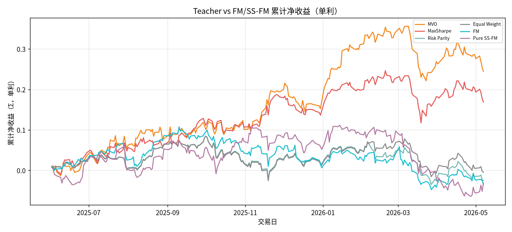

### Teacher vs FM/SS-FM 累计净收益（单利柱）

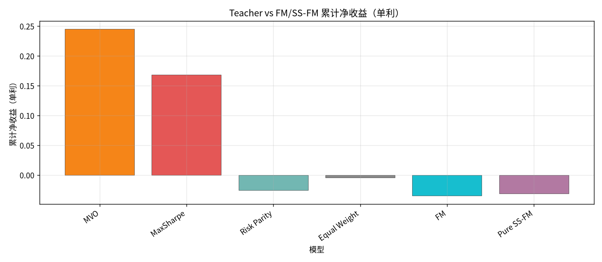

### Teacher vs FM/SS-FM Sharpe

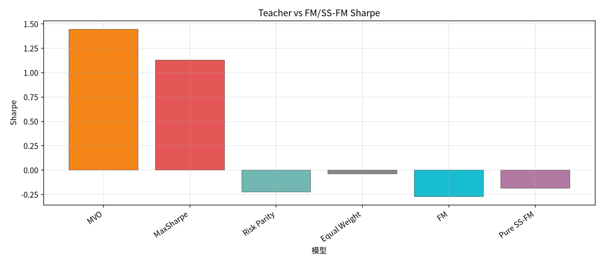

### Teacher vs FM/SS-FM 最大回撤

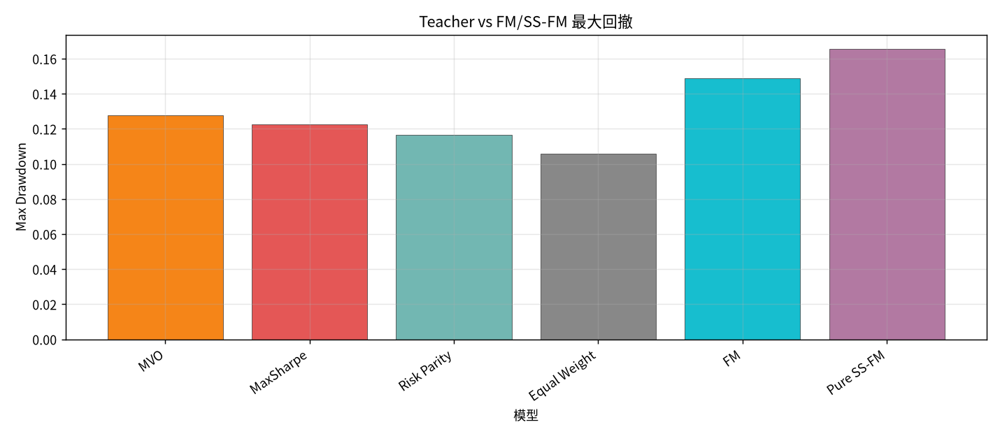

### Teacher vs FM/SS-FM 日均换手

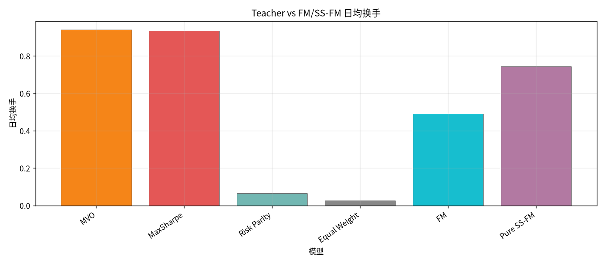

### Teacher vs FM/SS-FM 分月收益（单利）

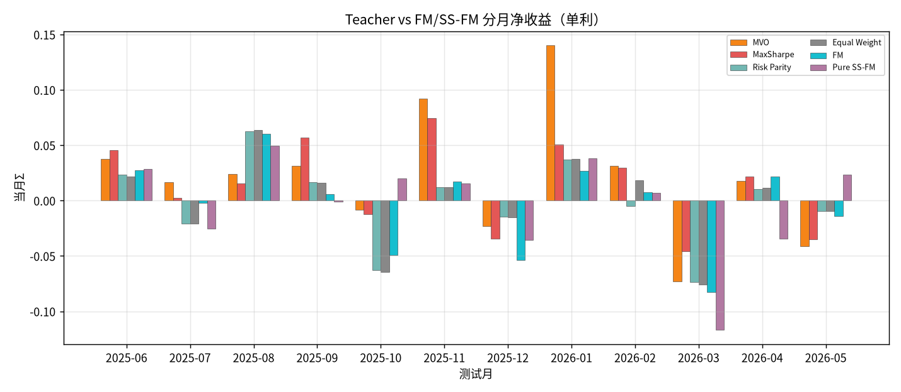

## 3. SS-FM vs RL（及 FM 参照）

- **PPO**：每日 SS-FM 采 G 条候选作特征（cond + candidate encode），再输出权重；**reward = sharpe_only**。
- **GRPO**：从 SS-FM 蒸馏初始化 WeightPolicy，再 GRPO（无 online BC）。

| model | total_net_return（单利） | ann_return | sharpe | max_drawdown | mean_turnover | n_days |
| --- | --- | --- | --- | --- | --- | --- |
| Pure SS-FM | -0.0309 | -0.0331 | -0.1858 | 0.1654 | 0.7442 | 235 |
| SS-FM+PPO (cand, Sharpe) | 0.1278 | 0.1370 | 0.9048 | 0.1188 | 0.1981 | 235 |
| SS-FM+GRPO (SSFM init) | 0.1039 | 0.1114 | 0.8178 | 0.0890 | 0.1835 | 235 |
| FM | -0.0345 | -0.0370 | -0.2707 | 0.1488 | 0.4899 | 235 |

| month | Pure SS-FM | SS-FM+PPO (cand, Sharpe) | SS-FM+GRPO (SSFM init) | FM |
| --- | --- | --- | --- | --- |
| 2025-06 | 0.0287 | 0.0717 | 0.0741 | 0.0274 |
| 2025-07 | -0.0255 | -0.0194 | -0.0129 | -0.0020 |
| 2025-08 | 0.0495 | 0.0779 | 0.0647 | 0.0605 |
| 2025-09 | -0.0011 | 0.0165 | 0.0156 | 0.0058 |
| 2025-10 | 0.0200 | 0.0566 | 0.0012 | -0.0492 |
| 2025-11 | 0.0157 | 0.0014 | 0.0060 | 0.0173 |
| 2025-12 | -0.0354 | -0.0307 | -0.0149 | -0.0535 |
| 2026-01 | 0.0381 | 0.0303 | 0.0330 | 0.0271 |
| 2026-02 | 0.0072 | 0.0156 | 0.0161 | 0.0076 |
| 2026-03 | -0.1169 | -0.0769 | -0.0751 | -0.0829 |
| 2026-04 | -0.0347 | -0.0083 | 0.0022 | 0.0216 |
| 2026-05 | 0.0234 | -0.0071 | -0.0060 | -0.0141 |

### RL 消融累计净值（单利）

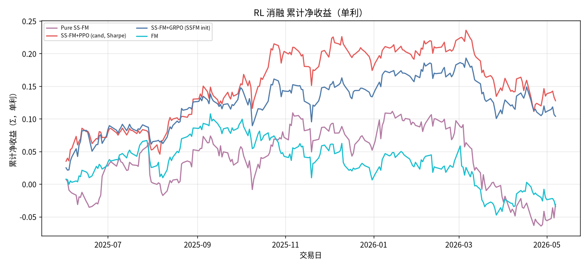

### RL 消融累计净收益（单利柱）

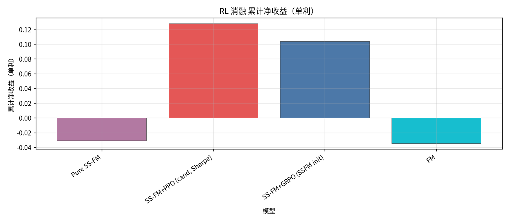

### RL 消融 Sharpe

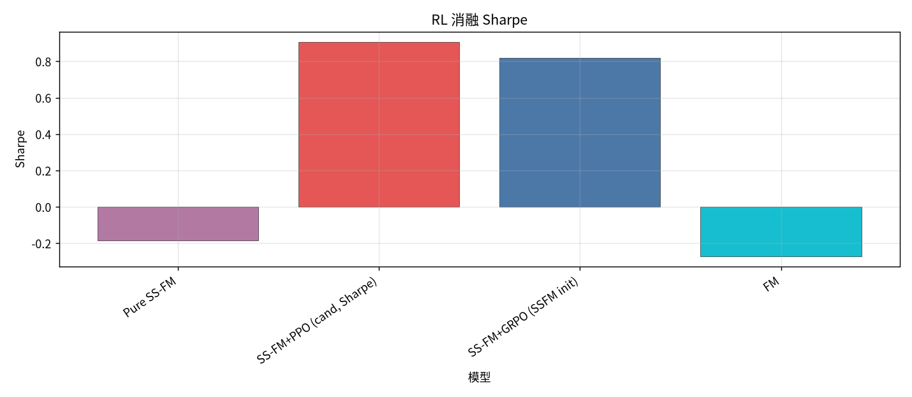

### RL 消融最大回撤

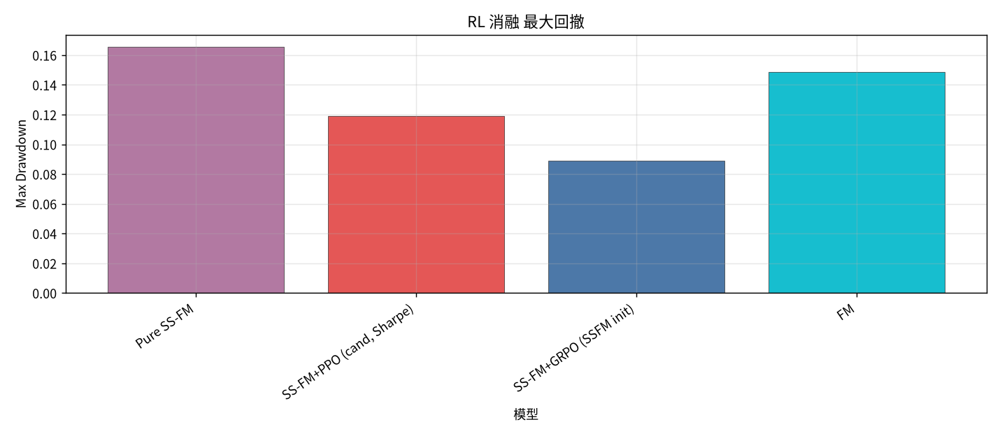

### RL 消融日均换手

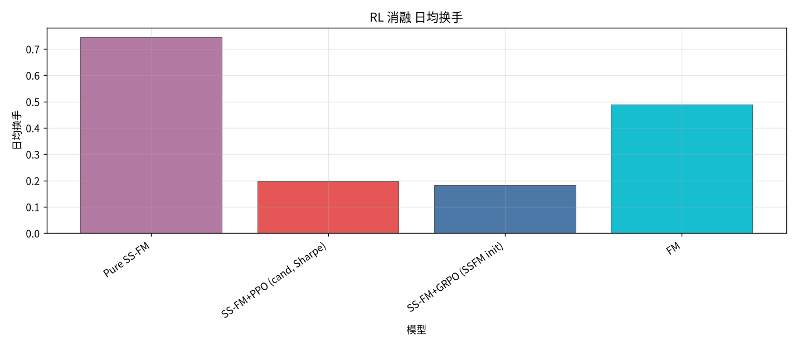

### RL 消融分月收益（单利）

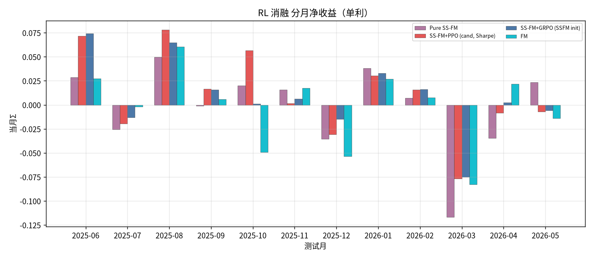

## 4. FM / SS-FM @ G∈{16,32,64,128}

### G–收益曲线（单利）

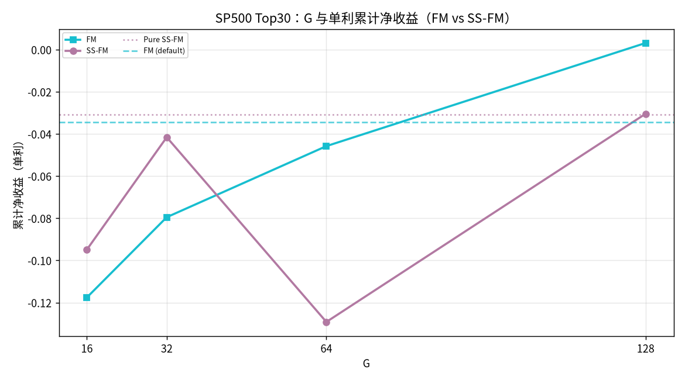

### SS-FM G-grid

| model | total_net_return（单利） | ann_return | sharpe | max_drawdown | mean_turnover | n_days |
| --- | --- | --- | --- | --- | --- | --- |
| Pure SS-FM | -0.0309 | -0.0331 | -0.1858 | 0.1654 | 0.7442 | 235 |
| SS-FM G=16 | -0.0948 | -0.1017 | -0.6229 | 0.2003 | 0.7390 | 235 |
| SS-FM G=32 | -0.0416 | -0.0446 | -0.2625 | 0.1685 | 0.7319 | 235 |
| SS-FM G=64 | -0.1292 | -0.1385 | -0.7716 | 0.2437 | 0.7205 | 235 |
| SS-FM G=128 | -0.0304 | -0.0326 | -0.1778 | 0.1482 | 0.6776 | 235 |

### SS-FM G-grid 累计净值

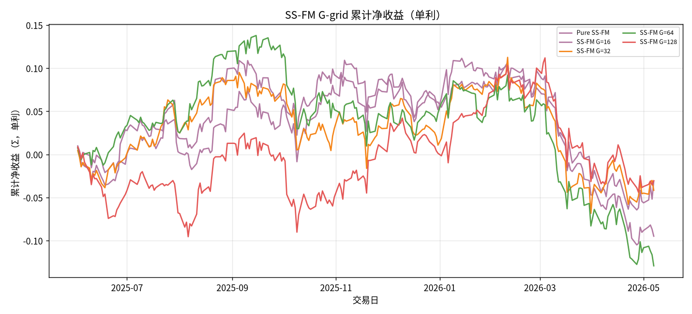

### SS-FM G-grid 累计净收益柱

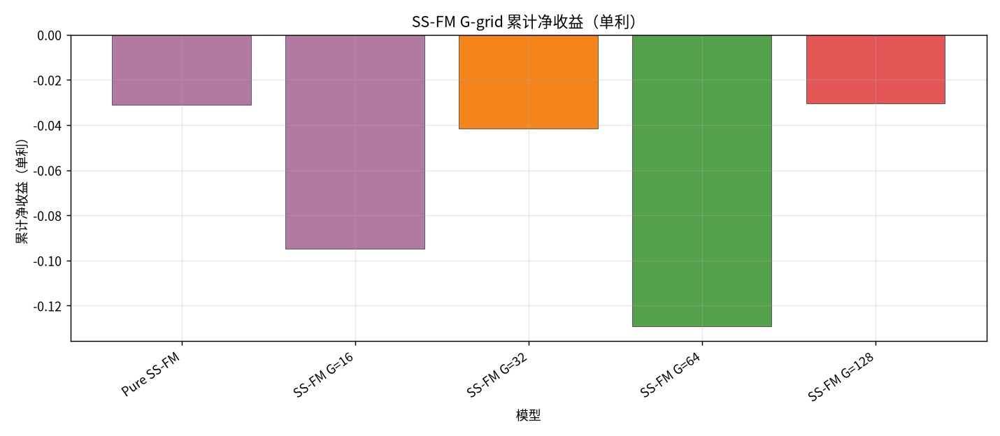

### SS-FM G-grid Sharpe

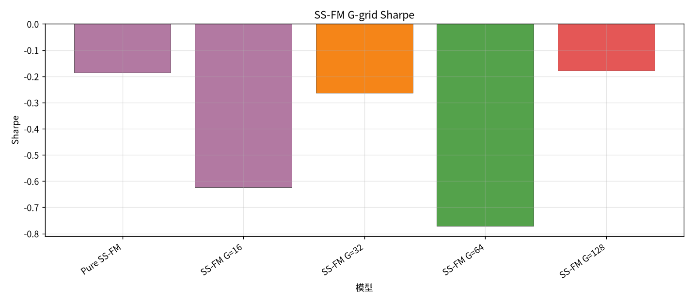

### SS-FM G-grid 分月

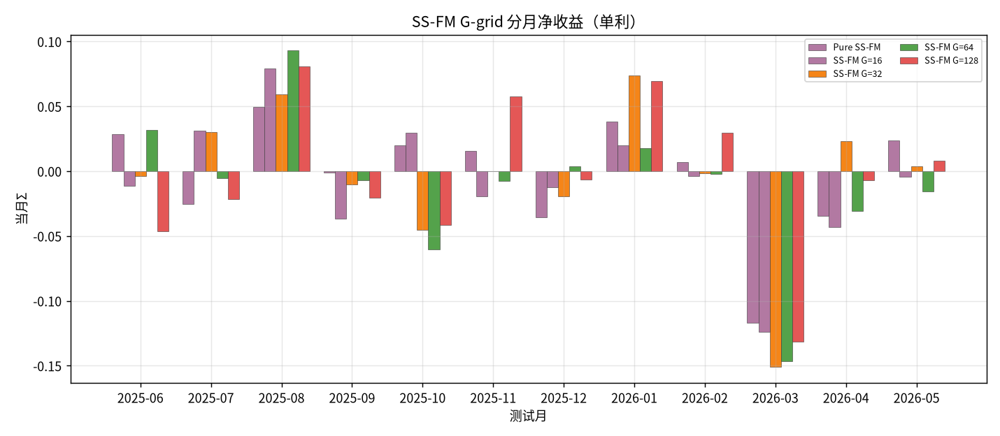

### FM G-grid

| model | total_net_return（单利） | ann_return | sharpe | max_drawdown | mean_turnover | n_days |
| --- | --- | --- | --- | --- | --- | --- |
| FM | -0.0345 | -0.0370 | -0.2707 | 0.1488 | 0.4899 | 235 |
| FM G=16 | -0.1176 | -0.1261 | -0.9070 | 0.1908 | 0.4887 | 235 |
| FM G=32 | -0.0795 | -0.0853 | -0.6316 | 0.1826 | 0.5059 | 235 |
| FM G=64 | -0.0458 | -0.0491 | -0.3484 | 0.1530 | 0.5094 | 235 |
| FM G=128 | 0.0031 | 0.0034 | 0.0262 | 0.1164 | 0.4973 | 235 |

### FM G-grid 累计净值

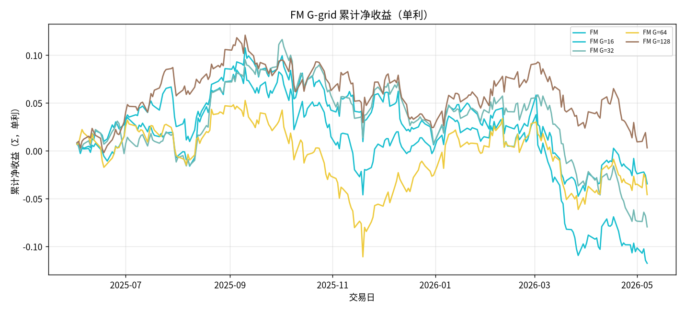

### FM G-grid 累计净收益柱

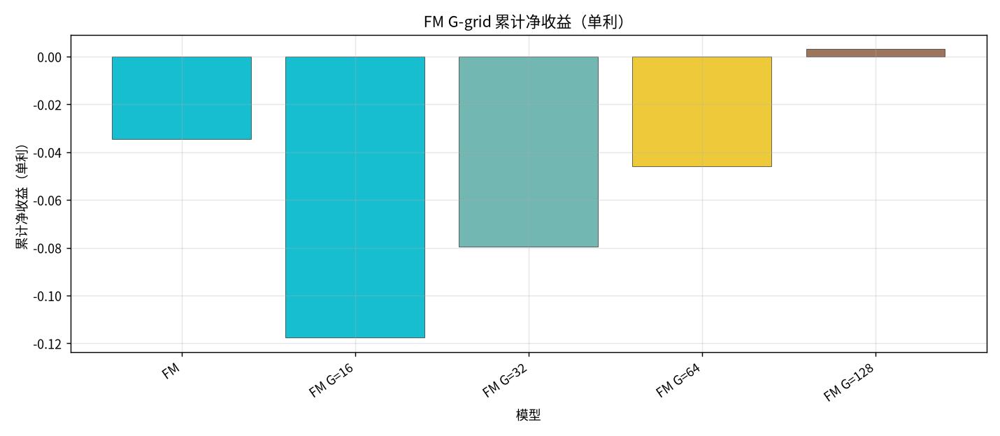

### FM G-grid Sharpe

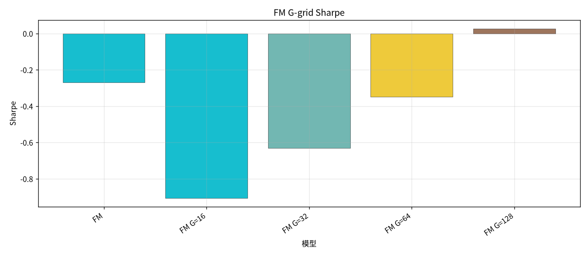

### FM G-grid 分月

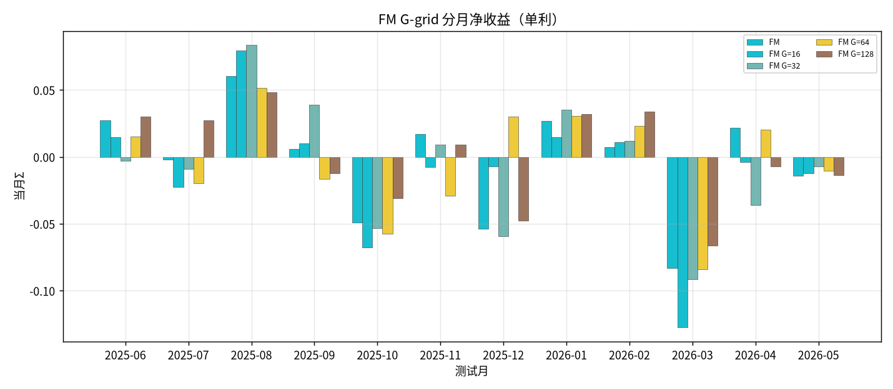

## 分析

### 生成模型
- 单利排序最高：`Pure SS-FM` = `-0.0309`（Sharpe `-0.1858`）。
- 全序：Pure SS-FM `-0.0309` > MLP `-0.0313` > FM `-0.0345` > Gaussian `-0.0826` > Diffusion `-0.2765`。

### Teacher 相对 FM / Pure SS-FM
- 单利排序：MVO `0.2449` > MaxSharpe `0.1686` > Equal Weight `-0.0043` > Risk Parity `-0.0251` > Pure SS-FM `-0.0309` > FM `-0.0345`。
- 最优：`MVO` `0.2449` / Sharpe `1.4444`。

### RL 消融相对 Pure SS-FM
- Pure `-0.0309`；cand-PPO `0.1278`（胜）；GRPO-init `0.1039`（胜）。
- Sharpe：Pure `-0.1858` / cand-PPO `0.9048` / GRPO-init `0.8178`。
- 换手：Pure `0.7442` → cand-PPO `0.1981` / GRPO-init `0.1835`。

### G-grid
- SS-FM 侧最优：`SS-FM G=128` `-0.0304`；FM 侧最优：`FM G=128` `0.0031`。

### 结论
- Top30 全年（单利）下，RL 两条消融均已打赢 Pure SS-FM；cand-PPO 相对 GRPO-init 更强。
- 与全股池设定对照时，注意本报告固定 Top30 配权池与冻结 Alpha。

## Top30 G=32 Meta 选仓：Teacher vs FM / SS-FM；SS-FM vs PPO / GRPO

设定：冻结 Top30 实验 Alpha + FM + SS-FM；配权池 **Top30**；**G=32**。生成模型每日采样后，**将 Teacher 闭式解（MVO / MaxSharpe / Risk Parity）并入候选集**，再按 `pred_utility`（`w·α̂ − ½λ wΣw`）做 Meta 选仓。RL：`SS-FM+PPO(cand特征)` 与 `SS-FM+GRPO(SSFM init)`，`G=32`，无 online BC。拼接 OOS 2025-06…2026-05，约 **235** 日。**收益口径：单利 Σ**。

产物：`results/S&P500/strict_fixed_oos_top30_g32_meta/`。

### Teacher vs FM / SS-FM（Top30 G=32 Meta）

| model | total_net_return（单利） | ann_return | sharpe | max_drawdown | mean_turnover | n_days |
| --- | --- | --- | --- | --- | --- | --- |
| MVO | 0.2449 | 0.2626 | 1.4444 | 0.1276 | 0.9404 | 235 |
| MaxSharpe | 0.1686 | 0.1808 | 1.1303 | 0.1224 | 0.9336 | 235 |
| Risk Parity | -0.0251 | -0.0269 | -0.2257 | 0.1167 | 0.0654 | 235 |
| FM G=32 Meta | 0.1436 | 0.1539 | 1.0658 | 0.1238 | 0.6789 | 235 |
| SS-FM G=32 Meta | 0.1785 | 0.1914 | 1.0970 | 0.1578 | 0.7675 | 235 |

| month | MVO | MaxSharpe | Risk Parity | FM G=32 Meta | SS-FM G=32 Meta |
| --- | --- | --- | --- | --- | --- |
| 2025-06 | 0.0379 | 0.0453 | 0.0232 | 0.0400 | 0.0210 |
| 2025-07 | 0.0165 | 0.0025 | -0.0209 | 0.0348 | 0.0463 |
| 2025-08 | 0.0242 | 0.0152 | 0.0627 | 0.1060 | 0.0870 |
| 2025-09 | 0.0315 | 0.0567 | 0.0164 | 0.0376 | 0.0256 |
| 2025-10 | -0.0085 | -0.0126 | -0.0631 | -0.0780 | 0.0612 |
| 2025-11 | 0.0923 | 0.0744 | 0.0122 | 0.0075 | 0.0075 |
| 2025-12 | -0.0232 | -0.0344 | -0.0148 | -0.0329 | -0.0259 |
| 2026-01 | 0.1401 | 0.0508 | 0.0368 | 0.0658 | 0.0974 |
| 2026-02 | 0.0311 | 0.0296 | -0.0047 | 0.0292 | -0.0115 |
| 2026-03 | -0.0730 | -0.0456 | -0.0737 | -0.0693 | -0.0830 |
| 2026-04 | 0.0175 | 0.0215 | 0.0106 | 0.0049 | -0.0159 |
| 2026-05 | -0.0414 | -0.0348 | -0.0098 | -0.0020 | -0.0313 |

#### Top30 G=32 Meta Teacher vs FM/SS-FM 累计净值（单利）

#### Top30 G=32 Meta Teacher vs FM/SS-FM 累计净收益（单利柱）

#### Top30 G=32 Meta Teacher vs FM/SS-FM Sharpe

#### Top30 G=32 Meta Teacher vs FM/SS-FM 最大回撤

#### Top30 G=32 Meta Teacher vs FM/SS-FM 日均换手

#### Top30 G=32 Meta Teacher vs FM/SS-FM 分月收益（单利）

### SS-FM G=32 Meta vs PPO / GRPO

- **PPO**：SS-FM 候选作特征，再输出权重。
- **GRPO**：从 SS-FM 蒸馏初始化 WeightPolicy，再 GRPO（无 online BC）。

| model | total_net_return（单利） | ann_return | sharpe | max_drawdown | mean_turnover | n_days |
| --- | --- | --- | --- | --- | --- | --- |
| SS-FM G=32 Meta | 0.1785 | 0.1914 | 1.0970 | 0.1578 | 0.7675 | 235 |
| SS-FM+PPO (cand) G=32 | 0.2466 | 0.2644 | 1.5972 | 0.1139 | 0.1705 | 235 |
| SS-FM+GRPO (SSFM init) G=32 | 0.0502 | 0.0539 | 0.4308 | 0.0758 | 0.1773 | 235 |

| month | SS-FM G=32 Meta | SS-FM+PPO (cand) G=32 | SS-FM+GRPO (SSFM init) G=32 |
| --- | --- | --- | --- |
| 2025-06 | 0.0210 | 0.0907 | 0.0242 |
| 2025-07 | 0.0463 | -0.0120 | -0.0049 |
| 2025-08 | 0.0870 | 0.1041 | 0.0521 |
| 2025-09 | 0.0256 | 0.0162 | 0.0094 |
| 2025-10 | 0.0612 | 0.0520 | -0.0107 |
| 2025-11 | 0.0075 | -0.0003 | 0.0034 |
| 2025-12 | -0.0259 | -0.0070 | -0.0229 |
| 2026-01 | 0.0974 | 0.0470 | 0.0278 |
| 2026-02 | -0.0115 | 0.0211 | 0.0331 |
| 2026-03 | -0.0830 | -0.0604 | -0.0656 |
| 2026-04 | -0.0159 | -0.0062 | 0.0111 |
| 2026-05 | -0.0313 | 0.0015 | -0.0067 |

#### Top30 G=32 Meta SS-FM vs PPO/GRPO 累计净值（单利）

#### Top30 G=32 Meta SS-FM vs PPO/GRPO 累计净收益（单利柱）

#### Top30 G=32 Meta SS-FM vs PPO/GRPO Sharpe

#### Top30 G=32 Meta SS-FM vs PPO/GRPO 最大回撤

#### Top30 G=32 Meta SS-FM vs PPO/GRPO 日均换手

#### Top30 G=32 Meta SS-FM vs PPO/GRPO 分月收益（单利）

### Top30 G=32 Meta 选仓结论
- Teacher vs 生成（单利排序）：MVO `0.2449` > SS-FM G=32 Meta `0.1785` > MaxSharpe `0.1686` > FM G=32 Meta `0.1436` > Risk Parity `-0.0251`。
- SS-FM G=32 Meta `0.1785`；cand-PPO `0.2466`（胜）；GRPO-init `0.0502`（负）。
- Meta = 生成样本 ∪ Teacher 闭式解再 `pred_utility`；若选中 Teacher，当日权重可与基线 Teacher 相同。
