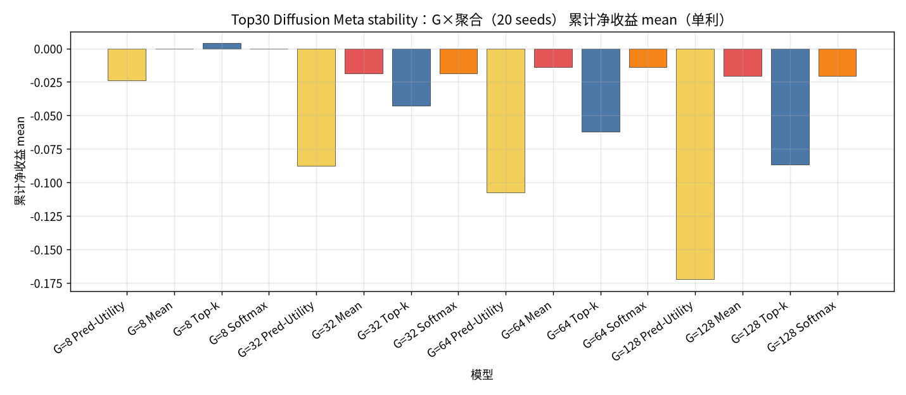
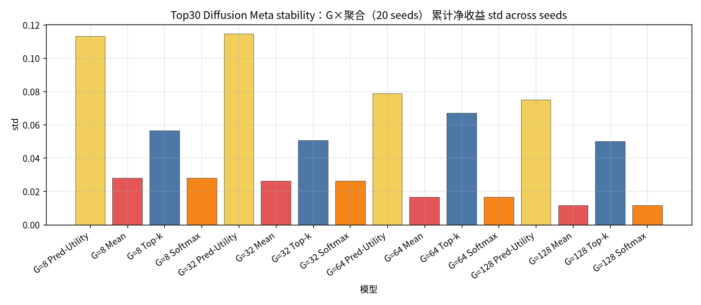
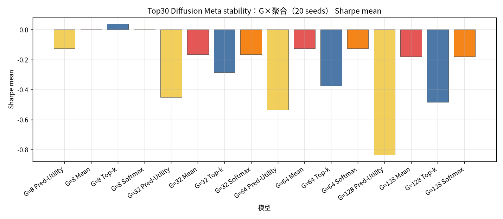
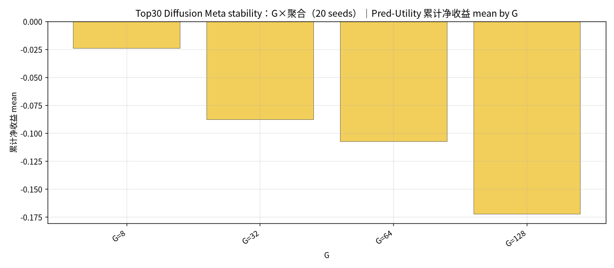
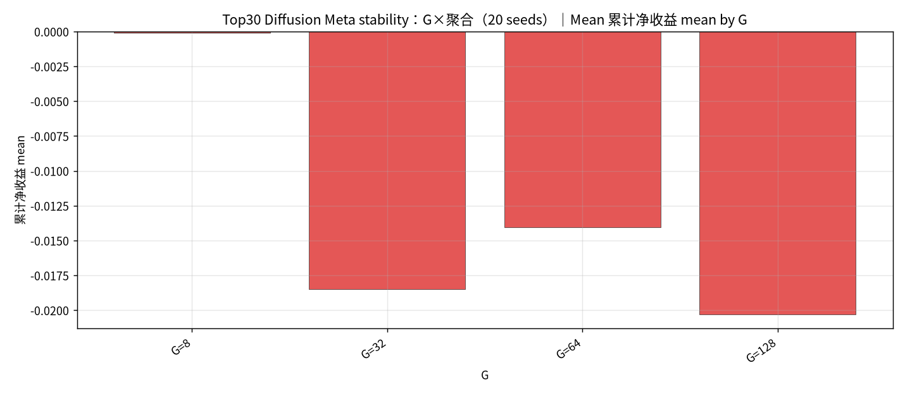
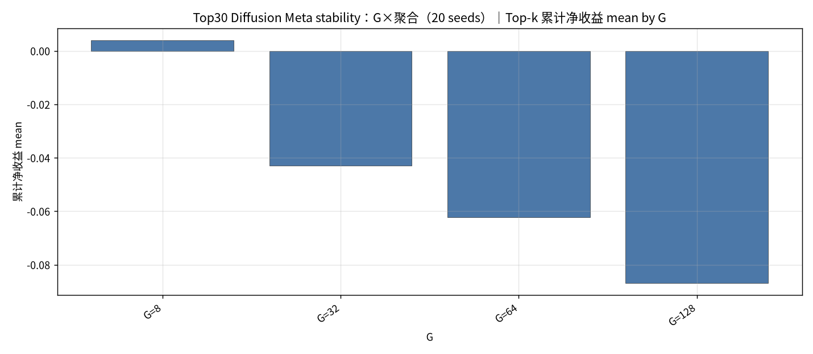
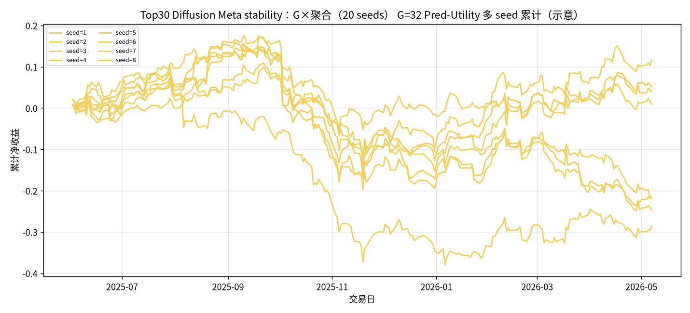

## Top30 Diffusion Meta stability：G×聚合（20 seeds）

设定：冻结 Top30 最新 Alpha+Diffusion（**不训练**）；配权 **Top30**；**Meta 候选 = G 条 Diffusion ∪ Teacher（MVO/MaxSharpe/RP）**；**G ∈ {8, 32, 64, 128}**；每组 G 使用 **seed ∈ {1..20}** 作初始化噪声；每日 `noise = hash(date, seed)`。同 (日,G,seed) 只建一次 Meta 池，四种聚合共享。

聚合：Pred-Utility / Mean / Top-k=3 / Softmax(τ=1.0)。下表为 **across seeds 的 mean±std（单利）**。

产物：`results/S&P500/strict_fixed_oos_top30_diff_stability_meta_seeds/`。约 **235** 日 × 20 seeds。

### 累计净收益 mean±std（单利）

| G | Pred-Utility | Mean | Top-k | Softmax |
| --- | --- | --- | --- | --- |
| G=8 | -0.0237±0.1134 | -0.0001±0.0282 | 0.0039±0.0566 | -0.0001±0.0282 |
| G=32 | -0.0878±0.1146 | -0.0185±0.0262 | -0.0429±0.0508 | -0.0185±0.0262 |
| G=64 | -0.1074±0.0789 | -0.0141±0.0165 | -0.0622±0.0672 | -0.0141±0.0165 |
| G=128 | -0.1722±0.0749 | -0.0203±0.0116 | -0.0869±0.0502 | -0.0203±0.0116 |

### Sharpe mean±std

| G | Pred-Utility | Mean | Top-k | Softmax |
| --- | --- | --- | --- | --- |
| G=8 | -0.1246±0.6885 | -0.0020±0.2547 | 0.0376±0.4284 | -0.0019±0.2547 |
| G=32 | -0.4510±0.5989 | -0.1645±0.2320 | -0.2851±0.3404 | -0.1646±0.2319 |
| G=64 | -0.5359±0.3867 | -0.1251±0.1467 | -0.3739±0.4056 | -0.1252±0.1467 |
| G=128 | -0.8346±0.3611 | -0.1797±0.1026 | -0.4845±0.2840 | -0.1798±0.1025 |

### 日均换手 mean±std

| G | Pred-Utility | Mean | Top-k | Softmax |
| --- | --- | --- | --- | --- |
| G=8 | 0.8194±0.0129 | 0.5269±0.0039 | 0.6840±0.0048 | 0.5269±0.0039 |
| G=32 | 0.6931±0.0198 | 0.3311±0.0029 | 0.6261±0.0089 | 0.3311±0.0029 |
| G=64 | 0.5952±0.0186 | 0.2561±0.0021 | 0.5675±0.0131 | 0.2561±0.0021 |
| G=128 | 0.4973±0.0232 | 0.2062±0.0011 | 0.4945±0.0142 | 0.2062±0.0011 |

#### Top30 Diffusion Meta stability：G×聚合（20 seeds） 累计净收益 mean

#### Top30 Diffusion Meta stability：G×聚合（20 seeds） 累计净收益 std

#### Top30 Diffusion Meta stability：G×聚合（20 seeds） Sharpe mean

#### Top30 Diffusion Meta stability：G×聚合（20 seeds）｜Pred-Utility by G

#### Top30 Diffusion Meta stability：G×聚合（20 seeds）｜Mean by G

#### Top30 Diffusion Meta stability：G×聚合（20 seeds）｜Top-k by G

#### Top30 Diffusion Meta stability：G×聚合（20 seeds）｜Softmax by G

#### Top30 Diffusion Meta stability：G×聚合（20 seeds） G=32 Pred-Utility 多 seed 累计（示意）

### Top30 Diffusion Meta stability（20 seeds）结论
- 最高 mean 单利：Meta G=8 Top-k = `0.0039±0.0566`（Sharpe `0.0376±0.4284`）。
- 最大跨 seed 方差：G=32 Pred-Utility std=`0.1146`。
- seed ∈ {1..20}；daily `hash(date, seed)`；候选含 Teacher；不训练。
