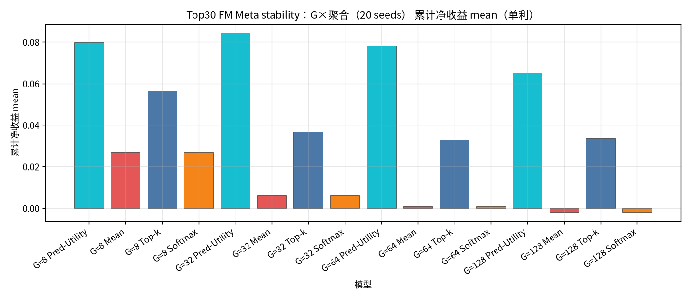
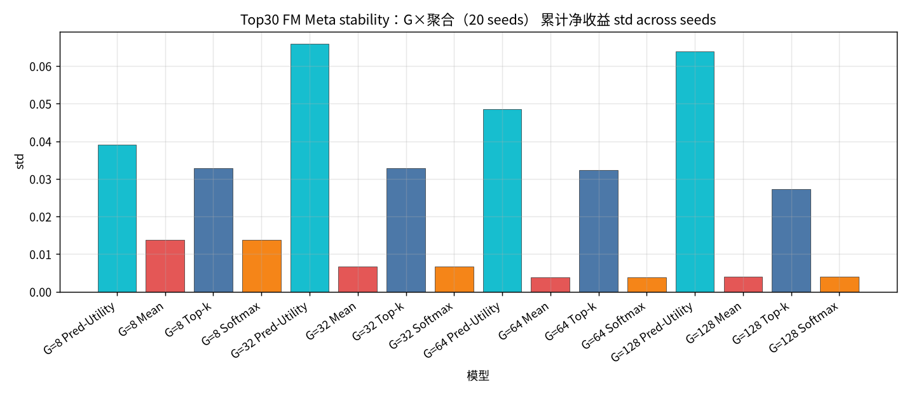
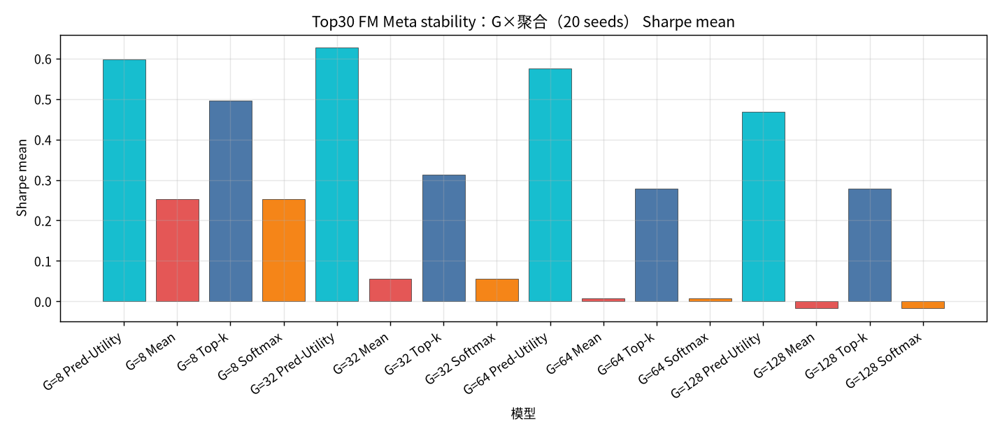
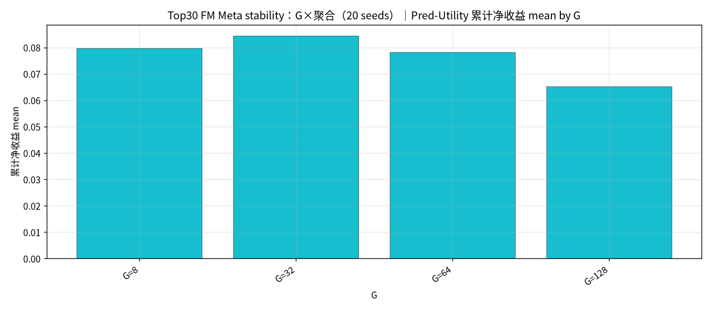
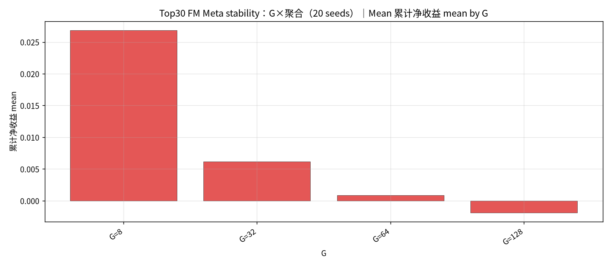
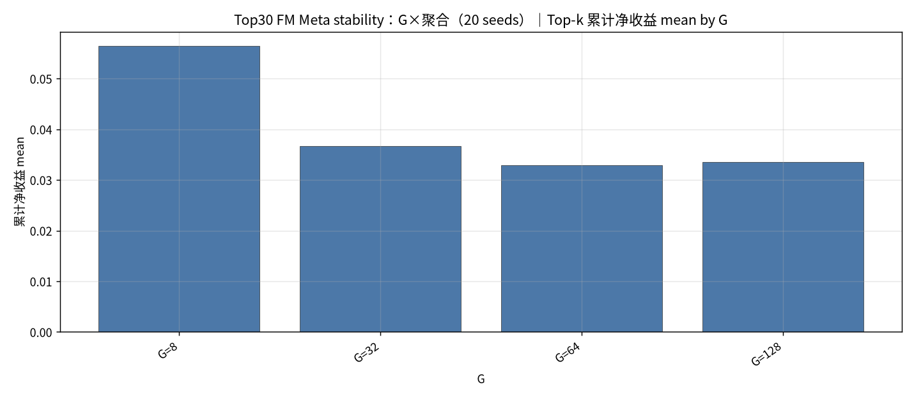
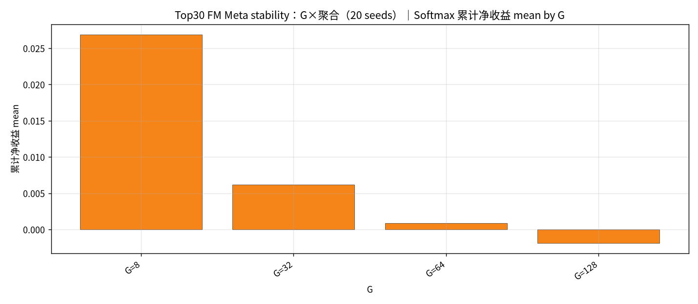
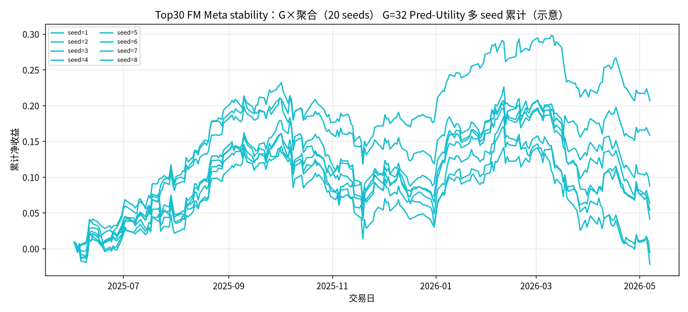

## Top30 FM Meta stability：G×聚合（20 seeds）

设定：冻结 Top30 最新 Alpha+standard FM（**不训练**）；配权 **Top30**；**Meta 候选 = G 条 FM ∪ Teacher（MVO/MaxSharpe/RP）**；**G ∈ {8, 32, 64, 128}**；每组 G 使用 **seed ∈ {1..20}** 作初始化噪声；每日 `noise = hash(date, seed)`。同 (日,G,seed) 只建一次 Meta 池，四种聚合共享。

聚合：Pred-Utility / Mean / Top-k=3 / Softmax(τ=1.0)。下表为 **across seeds 的 mean±std（单利）**。

产物：`results/S&P500/strict_fixed_oos_top30_fm_stability_meta_seeds/`。约 **235** 日 × 20 seeds。

### 累计净收益 mean±std（单利）

| G | Pred-Utility | Mean | Top-k | Softmax |
| --- | --- | --- | --- | --- |
| G=8 | 0.0797±0.0390 | 0.0268±0.0137 | 0.0564±0.0328 | 0.0269±0.0137 |
| G=32 | 0.0844±0.0659 | 0.0062±0.0068 | 0.0367±0.0328 | 0.0062±0.0068 |
| G=64 | 0.0782±0.0486 | 0.0009±0.0038 | 0.0329±0.0323 | 0.0009±0.0038 |
| G=128 | 0.0652±0.0639 | -0.0019±0.0040 | 0.0336±0.0272 | -0.0019±0.0040 |

### Sharpe mean±std

| G | Pred-Utility | Mean | Top-k | Softmax |
| --- | --- | --- | --- | --- |
| G=8 | 0.5971±0.2966 | 0.2520±0.1287 | 0.4967±0.2916 | 0.2523±0.1287 |
| G=32 | 0.6266±0.4908 | 0.0554±0.0609 | 0.3126±0.2827 | 0.0555±0.0609 |
| G=64 | 0.5759±0.3626 | 0.0078±0.0336 | 0.2778±0.2722 | 0.0078±0.0336 |
| G=128 | 0.4678±0.4538 | -0.0166±0.0353 | 0.2777±0.2239 | -0.0166±0.0353 |

### 日均换手 mean±std

| G | Pred-Utility | Mean | Top-k | Softmax |
| --- | --- | --- | --- | --- |
| G=8 | 0.7053±0.0115 | 0.3296±0.0018 | 0.4941±0.0057 | 0.3296±0.0018 |
| G=32 | 0.6818±0.0088 | 0.1768±0.0010 | 0.4834±0.0065 | 0.1768±0.0010 |
| G=64 | 0.6624±0.0112 | 0.1350±0.0008 | 0.4698±0.0059 | 0.1350±0.0008 |
| G=128 | 0.6463±0.0099 | 0.1098±0.0007 | 0.4600±0.0075 | 0.1098±0.0007 |

#### Top30 FM Meta stability：G×聚合（20 seeds） 累计净收益 mean

#### Top30 FM Meta stability：G×聚合（20 seeds） 累计净收益 std

#### Top30 FM Meta stability：G×聚合（20 seeds） Sharpe mean

#### Top30 FM Meta stability：G×聚合（20 seeds）｜Pred-Utility by G

#### Top30 FM Meta stability：G×聚合（20 seeds）｜Mean by G

#### Top30 FM Meta stability：G×聚合（20 seeds）｜Top-k by G

#### Top30 FM Meta stability：G×聚合（20 seeds）｜Softmax by G

#### Top30 FM Meta stability：G×聚合（20 seeds） G=32 Pred-Utility 多 seed 累计（示意）

### Top30 FM Meta stability（20 seeds）结论
- 最高 mean 单利：Meta G=32 Pred-Utility = `0.0844±0.0659`（Sharpe `0.6266±0.4908`）。
- 最大跨 seed 方差：G=32 Pred-Utility std=`0.0659`。
- seed ∈ {1..20}；daily `hash(date, seed)`；候选含 Teacher；不训练。
