## Top30 G=32 Meta 选仓：Teacher vs FM / SS-FM；SS-FM vs PPO / GRPO

设定：冻结 Top30 实验 Alpha + FM + SS-FM；配权池 **Top30**；**G=32**。生成模型每日采样后，**将 Teacher 闭式解（MVO / MaxSharpe / Risk Parity）并入候选集**，再按 `pred_utility`（`w·α̂ − ½λ wΣw`）做 Meta 选仓。RL：`SS-FM+PPO(cand特征)` 与 `SS-FM+GRPO(SSFM init)`，`G=32`，无 online BC。拼接 OOS 2025-06…2026-05，约 **235** 日。**收益口径：单利 Σ**。

产物：`results/S&P500/strict_fixed_oos_top30_g32_meta/`。

### Teacher vs FM / SS-FM（Top30 G=32 Meta）

| model | total_net_return（单利） | ann_return | sharpe | max_drawdown | mean_turnover | n_days |
| --- | --- | --- | --- | --- | --- | --- |
| MVO | 0.2449 | 0.2626 | 1.4444 | 0.1276 | 0.9404 | 235 |
| MaxSharpe | 0.1686 | 0.1808 | 1.1303 | 0.1224 | 0.9336 | 235 |
| Risk Parity | -0.0251 | -0.0269 | -0.2257 | 0.1167 | 0.0654 | 235 |
| FM G=32 Meta | 0.1436 | 0.1539 | 1.0658 | 0.1238 | 0.6789 | 235 |
| SS-FM G=32 Meta | 0.1785 | 0.1914 | 1.0970 | 0.1578 | 0.7675 | 235 |

| month | MVO | MaxSharpe | Risk Parity | FM G=32 Meta | SS-FM G=32 Meta |
| --- | --- | --- | --- | --- | --- |
| 2025-06 | 0.0379 | 0.0453 | 0.0232 | 0.0400 | 0.0210 |
| 2025-07 | 0.0165 | 0.0025 | -0.0209 | 0.0348 | 0.0463 |
| 2025-08 | 0.0242 | 0.0152 | 0.0627 | 0.1060 | 0.0870 |
| 2025-09 | 0.0315 | 0.0567 | 0.0164 | 0.0376 | 0.0256 |
| 2025-10 | -0.0085 | -0.0126 | -0.0631 | -0.0780 | 0.0612 |
| 2025-11 | 0.0923 | 0.0744 | 0.0122 | 0.0075 | 0.0075 |
| 2025-12 | -0.0232 | -0.0344 | -0.0148 | -0.0329 | -0.0259 |
| 2026-01 | 0.1401 | 0.0508 | 0.0368 | 0.0658 | 0.0974 |
| 2026-02 | 0.0311 | 0.0296 | -0.0047 | 0.0292 | -0.0115 |
| 2026-03 | -0.0730 | -0.0456 | -0.0737 | -0.0693 | -0.0830 |
| 2026-04 | 0.0175 | 0.0215 | 0.0106 | 0.0049 | -0.0159 |
| 2026-05 | -0.0414 | -0.0348 | -0.0098 | -0.0020 | -0.0313 |

#### Top30 G=32 Meta Teacher vs FM/SS-FM 累计净值（单利）

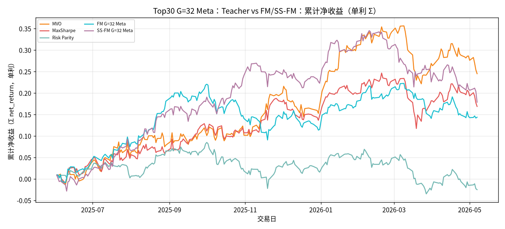

#### Top30 G=32 Meta Teacher vs FM/SS-FM 累计净收益（单利柱）

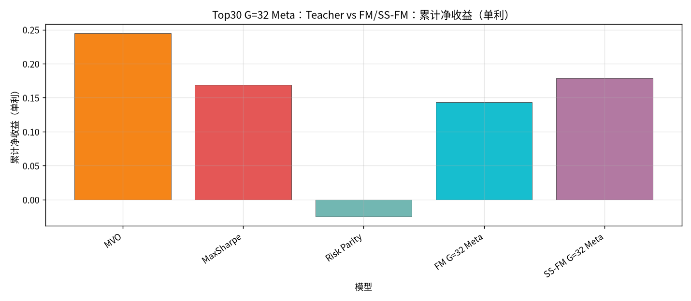

#### Top30 G=32 Meta Teacher vs FM/SS-FM Sharpe

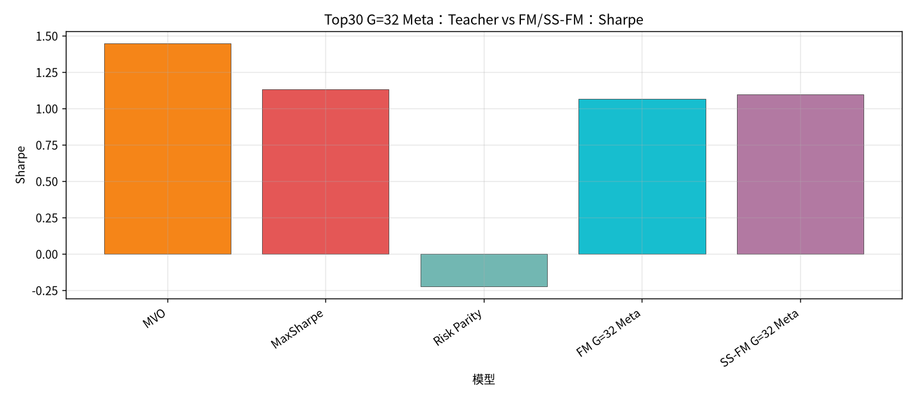

#### Top30 G=32 Meta Teacher vs FM/SS-FM 最大回撤

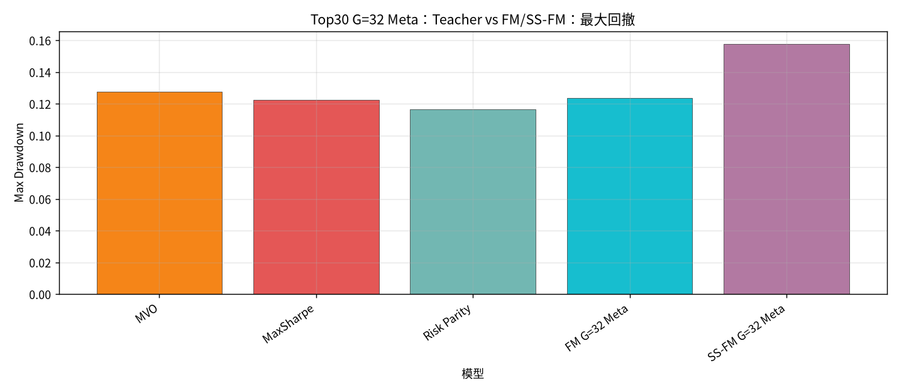

#### Top30 G=32 Meta Teacher vs FM/SS-FM 日均换手

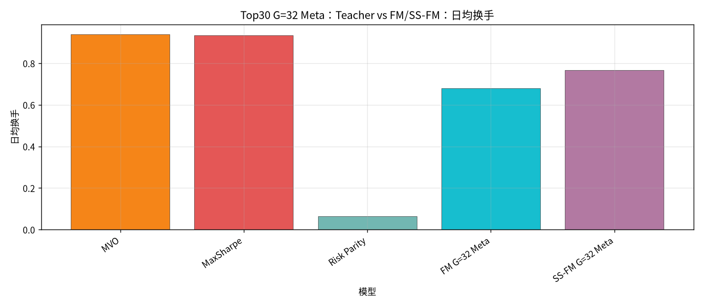

#### Top30 G=32 Meta Teacher vs FM/SS-FM 分月收益（单利）

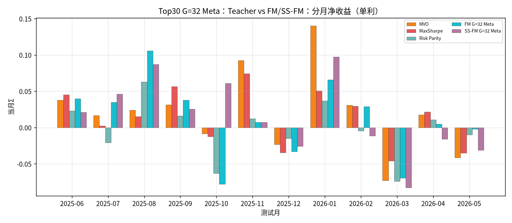

### SS-FM G=32 Meta vs PPO / GRPO

- **PPO**：SS-FM 候选作特征，再输出权重。
- **GRPO**：从 SS-FM 蒸馏初始化 WeightPolicy，再 GRPO（无 online BC）。

| model | total_net_return（单利） | ann_return | sharpe | max_drawdown | mean_turnover | n_days |
| --- | --- | --- | --- | --- | --- | --- |
| SS-FM G=32 Meta | 0.1785 | 0.1914 | 1.0970 | 0.1578 | 0.7675 | 235 |
| SS-FM+PPO (cand) G=32 | 0.2466 | 0.2644 | 1.5972 | 0.1139 | 0.1705 | 235 |
| SS-FM+GRPO (SSFM init) G=32 | 0.0502 | 0.0539 | 0.4308 | 0.0758 | 0.1773 | 235 |

| month | SS-FM G=32 Meta | SS-FM+PPO (cand) G=32 | SS-FM+GRPO (SSFM init) G=32 |
| --- | --- | --- | --- |
| 2025-06 | 0.0210 | 0.0907 | 0.0242 |
| 2025-07 | 0.0463 | -0.0120 | -0.0049 |
| 2025-08 | 0.0870 | 0.1041 | 0.0521 |
| 2025-09 | 0.0256 | 0.0162 | 0.0094 |
| 2025-10 | 0.0612 | 0.0520 | -0.0107 |
| 2025-11 | 0.0075 | -0.0003 | 0.0034 |
| 2025-12 | -0.0259 | -0.0070 | -0.0229 |
| 2026-01 | 0.0974 | 0.0470 | 0.0278 |
| 2026-02 | -0.0115 | 0.0211 | 0.0331 |
| 2026-03 | -0.0830 | -0.0604 | -0.0656 |
| 2026-04 | -0.0159 | -0.0062 | 0.0111 |
| 2026-05 | -0.0313 | 0.0015 | -0.0067 |

#### Top30 G=32 Meta SS-FM vs PPO/GRPO 累计净值（单利）

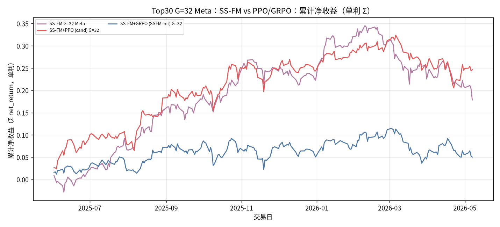

#### Top30 G=32 Meta SS-FM vs PPO/GRPO 累计净收益（单利柱）

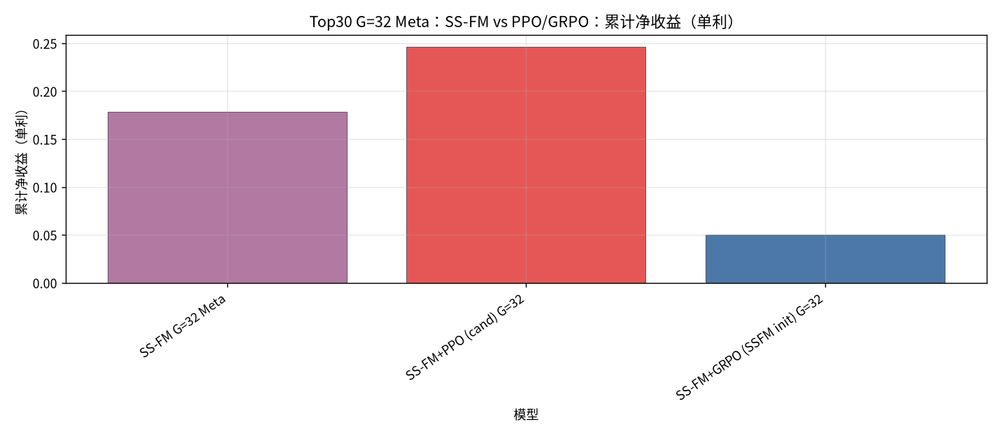

#### Top30 G=32 Meta SS-FM vs PPO/GRPO Sharpe

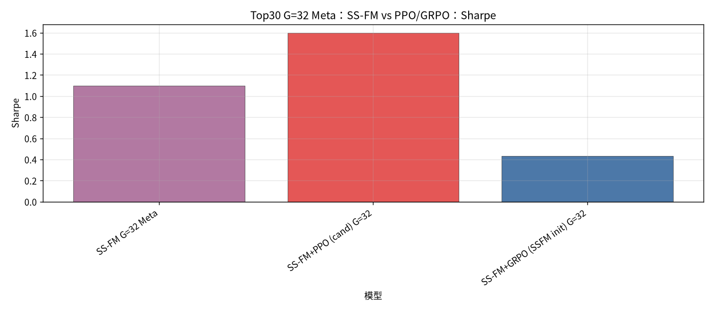

#### Top30 G=32 Meta SS-FM vs PPO/GRPO 最大回撤

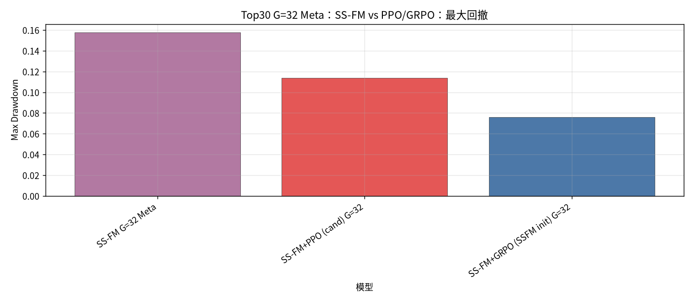

#### Top30 G=32 Meta SS-FM vs PPO/GRPO 日均换手

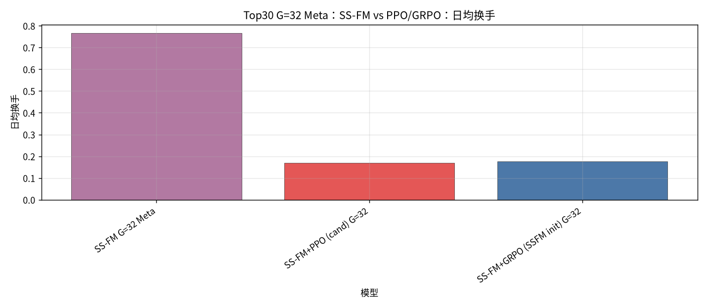

#### Top30 G=32 Meta SS-FM vs PPO/GRPO 分月收益（单利）

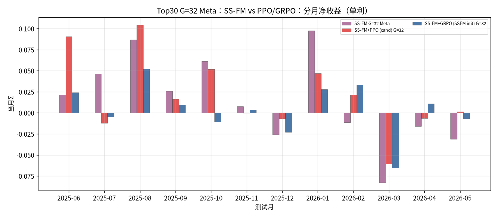

### Top30 G=32 Meta 选仓结论
- Teacher vs 生成（单利排序）：MVO `0.2449` > SS-FM G=32 Meta `0.1785` > MaxSharpe `0.1686` > FM G=32 Meta `0.1436` > Risk Parity `-0.0251`。
- SS-FM G=32 Meta `0.1785`；cand-PPO `0.2466`（胜）；GRPO-init `0.0502`（负）。
- Meta = 生成样本 ∪ Teacher 闭式解再 `pred_utility`；若选中 Teacher，当日权重可与基线 Teacher 相同。
