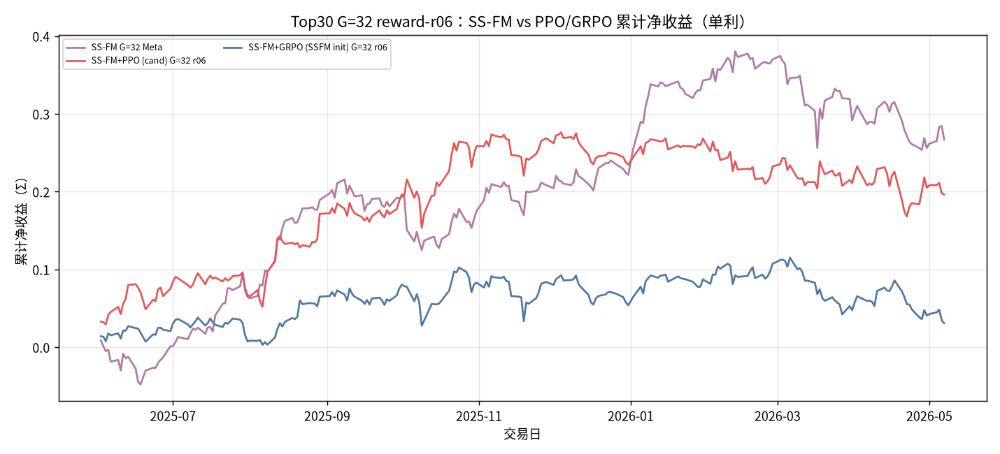
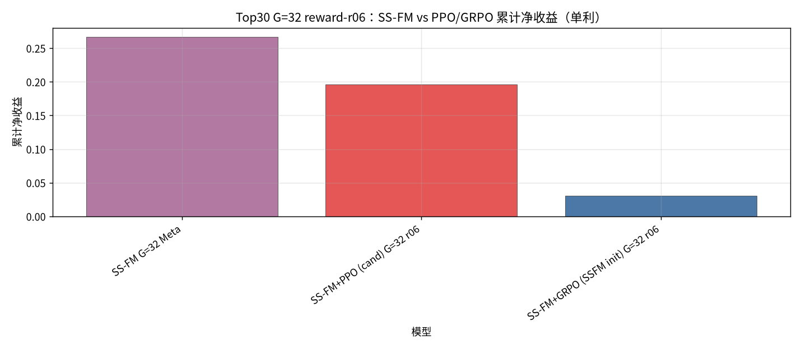
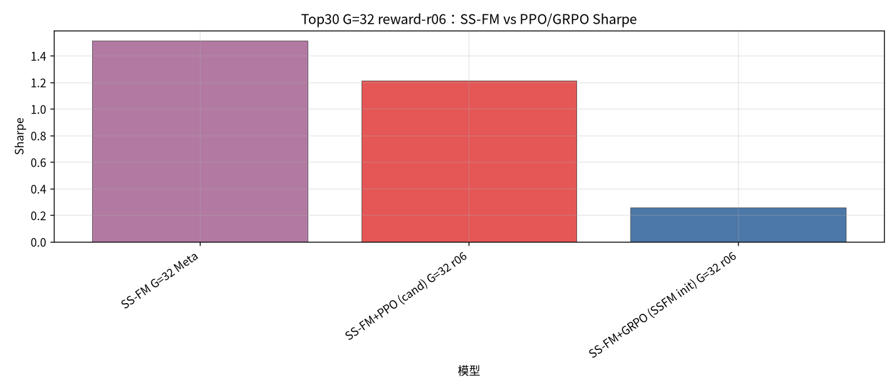
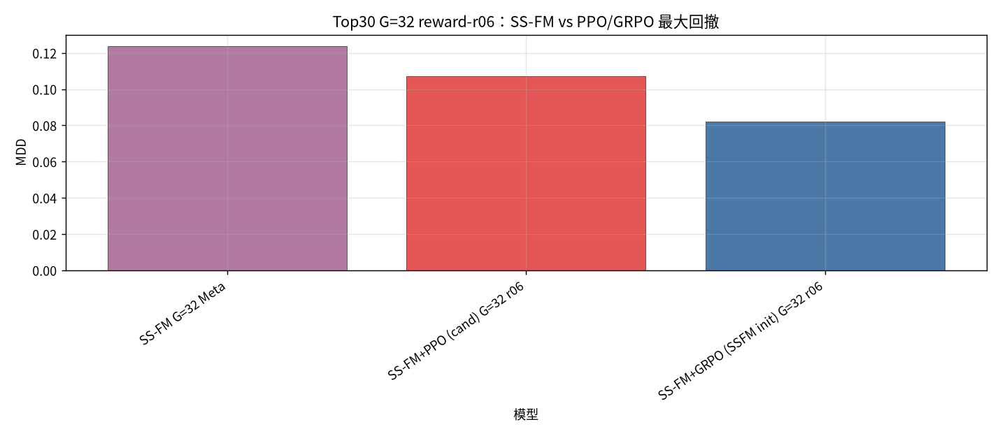
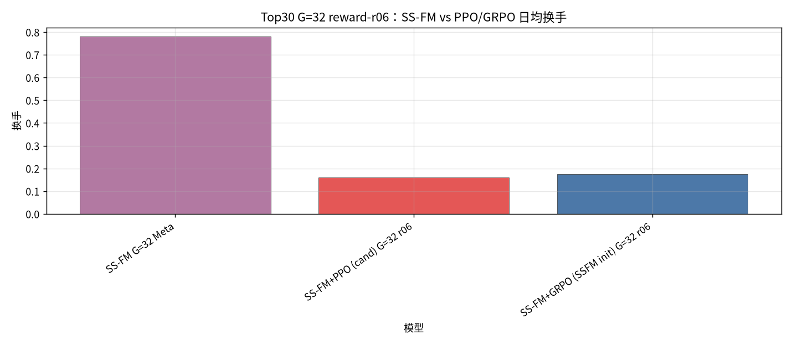
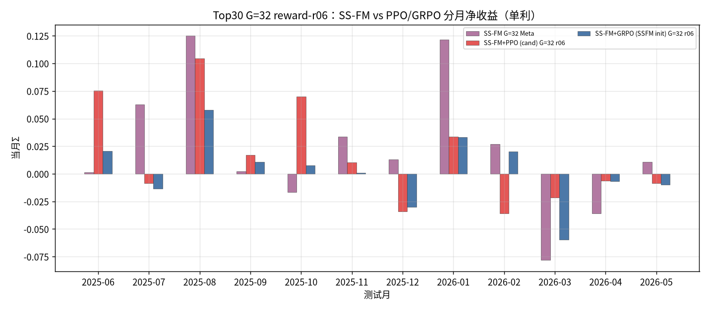

## Top30 G=32 RL reward-r06：SS-FM vs PPO / GRPO

设定：冻结 Top30 Alpha+SS-FM；配权 **Top30**；**G=32**。Pure SS-FM 为 Meta 选仓（样本 ∪ Teacher 闭式解 → `pred_utility`）。PPO=cand 特征；GRPO=SSFM init；`bc_coef=0`。

**Reward（composite，robust-z）**：`r = 0.6·z(net return) + 0.3·z(因果 Sharpe) − 0.01·z(换手) − 0.01·z(smooth MDD)`。

产物：`results/S&P500/strict_fixed_oos_top30_rl_r06/`。拼接约 **235** 日。**单利 Σ**。

| model | total_net_return（单利） | ann_return | sharpe | max_drawdown | mean_turnover | n_days |
| --- | --- | --- | --- | --- | --- | --- |
| SS-FM G=32 Meta | 0.2670 | 0.2863 | 1.5114 | 0.1238 | 0.7814 | 235 |
| SS-FM+PPO (cand) G=32 r06 | 0.1963 | 0.2105 | 1.2140 | 0.1070 | 0.1609 | 235 |
| SS-FM+GRPO (SSFM init) G=32 r06 | 0.0309 | 0.0331 | 0.2595 | 0.0820 | 0.1755 | 235 |

| month | SS-FM G=32 Meta | SS-FM+PPO (cand) G=32 r06 | SS-FM+GRPO (SSFM init) G=32 r06 |
| --- | --- | --- | --- |
| 2025-06 | 0.0013 | 0.0752 | 0.0207 |
| 2025-07 | 0.0630 | -0.0084 | -0.0134 |
| 2025-08 | 0.1250 | 0.1047 | 0.0578 |
| 2025-09 | 0.0021 | 0.0171 | 0.0105 |
| 2025-10 | -0.0164 | 0.0698 | 0.0075 |
| 2025-11 | 0.0334 | 0.0103 | 0.0008 |
| 2025-12 | 0.0131 | -0.0339 | -0.0300 |
| 2026-01 | 0.1214 | 0.0335 | 0.0333 |
| 2026-02 | 0.0271 | -0.0360 | 0.0201 |
| 2026-03 | -0.0782 | -0.0214 | -0.0596 |
| 2026-04 | -0.0357 | -0.0061 | -0.0069 |
| 2026-05 | 0.0108 | -0.0087 | -0.0099 |

#### Top30 G=32 reward-r06：SS-FM vs PPO/GRPO 累计净值（单利）

#### Top30 G=32 reward-r06：SS-FM vs PPO/GRPO 累计净收益柱（单利）

#### Top30 G=32 reward-r06：SS-FM vs PPO/GRPO Sharpe

#### Top30 G=32 reward-r06：SS-FM vs PPO/GRPO 最大回撤

#### Top30 G=32 reward-r06：SS-FM vs PPO/GRPO 日均换手

#### Top30 G=32 reward-r06：SS-FM vs PPO/GRPO 分月收益（单利）

### Top30 G=32 RL reward-r06 结论
- 单利：SS-FM Meta `0.2670`；cand-PPO `0.1963`（负）；GRPO-init `0.0309`（负）。
- 换手：SS-FM `0.7814` → PPO `0.1609` / GRPO `0.1755`。
- 相对默认 composite（0.4/0.4/−0.05/−0.05）：本设定加重 return、减轻摩擦，意在抬高 RL 进攻性。
