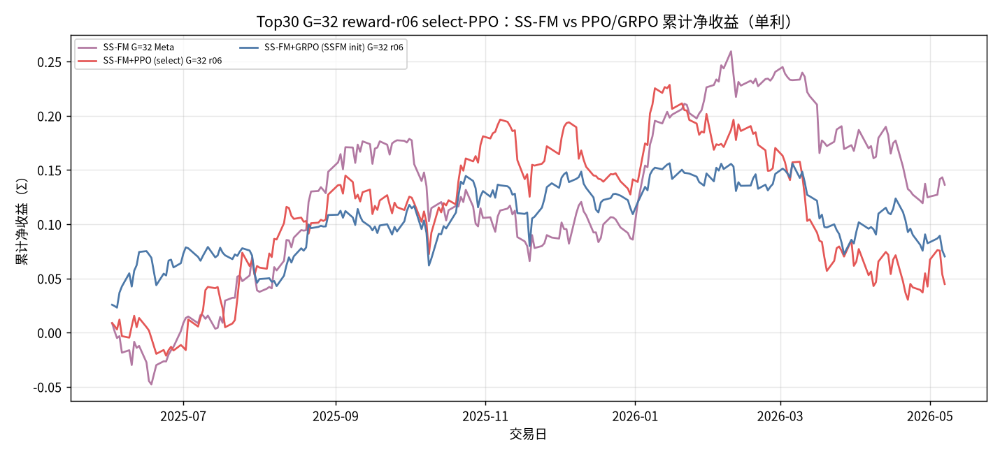
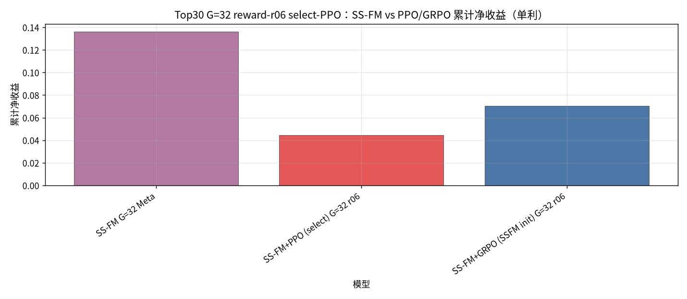
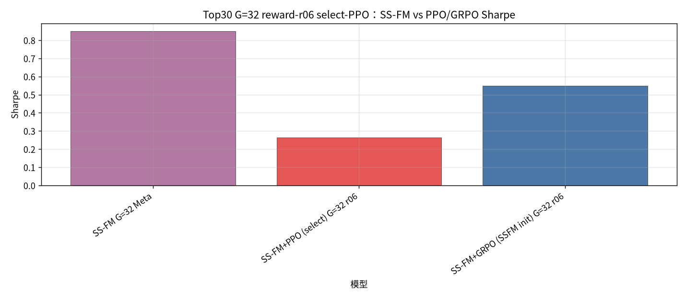
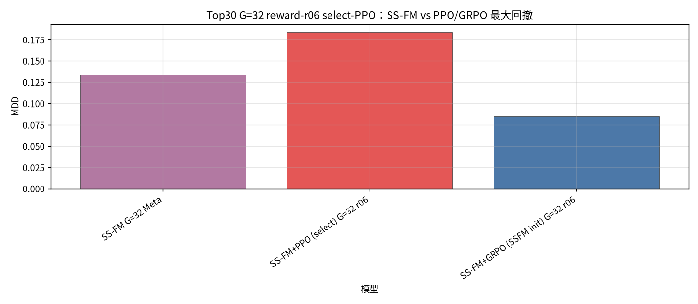
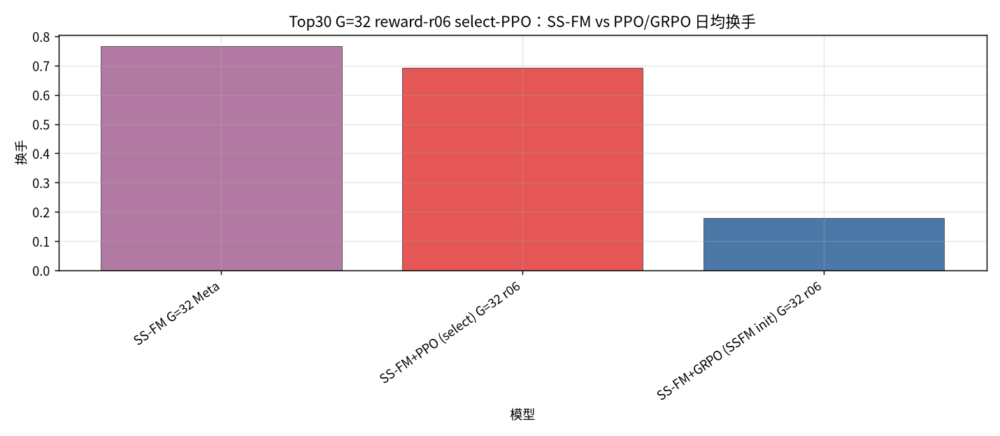
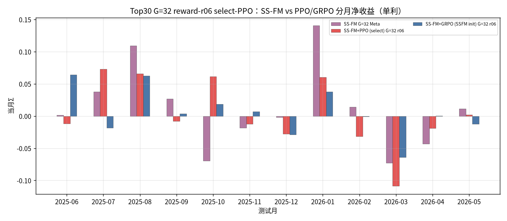

## Top30 G=32 RL reward-r06 select-PPO：SS-FM vs PPO / GRPO

设定：冻结 Top30 Alpha+SS-FM；配权 **Top30**；**G=32**。Pure SS-FM 为 Meta 选仓（样本 ∪ Teacher 闭式解 → `pred_utility`）。**PPO=离散 select**（同一 Meta 候选池上打分选一条，**不再生成新权重**）；GRPO=SSFM init；`bc_coef=0`。

**Reward（composite，robust-z）**：`r = 0.6·z(net return) + 0.3·z(因果 Sharpe) − 0.01·z(换手) − 0.01·z(smooth MDD)`。

产物：`results/S&P500/strict_fixed_oos_top30_rl_select_r06/`。拼接约 **235** 日。**单利 Σ**。

| model | total_net_return（单利） | ann_return | sharpe | max_drawdown | mean_turnover | n_days |
| --- | --- | --- | --- | --- | --- | --- |
| SS-FM G=32 Meta | 0.1363 | 0.1462 | 0.8487 | 0.1337 | 0.7674 | 235 |
| SS-FM+PPO (select) G=32 r06 | 0.0447 | 0.0479 | 0.2631 | 0.1839 | 0.6916 | 235 |
| SS-FM+GRPO (SSFM init) G=32 r06 | 0.0702 | 0.0753 | 0.5496 | 0.0846 | 0.1779 | 235 |

| month | SS-FM G=32 Meta | SS-FM+PPO (select) G=32 r06 | SS-FM+GRPO (SSFM init) G=32 r06 |
| --- | --- | --- | --- |
| 2025-06 | 0.0013 | -0.0115 | 0.0640 |
| 2025-07 | 0.0377 | 0.0728 | -0.0181 |
| 2025-08 | 0.1093 | 0.0660 | 0.0626 |
| 2025-09 | 0.0270 | -0.0079 | 0.0036 |
| 2025-10 | -0.0696 | 0.0616 | 0.0184 |
| 2025-11 | -0.0181 | -0.0121 | 0.0072 |
| 2025-12 | -0.0019 | -0.0275 | -0.0285 |
| 2026-01 | 0.1405 | 0.0603 | 0.0376 |
| 2026-02 | 0.0142 | -0.0313 | -0.0005 |
| 2026-03 | -0.0729 | -0.1087 | -0.0642 |
| 2026-04 | -0.0428 | -0.0191 | 0.0003 |
| 2026-05 | 0.0116 | 0.0023 | -0.0122 |

#### Top30 G=32 reward-r06 select-PPO：SS-FM vs PPO/GRPO 累计净值（单利）

#### Top30 G=32 reward-r06 select-PPO：SS-FM vs PPO/GRPO 累计净收益柱（单利）

#### Top30 G=32 reward-r06 select-PPO：SS-FM vs PPO/GRPO Sharpe

#### Top30 G=32 reward-r06 select-PPO：SS-FM vs PPO/GRPO 最大回撤

#### Top30 G=32 reward-r06 select-PPO：SS-FM vs PPO/GRPO 日均换手

#### Top30 G=32 reward-r06 select-PPO：SS-FM vs PPO/GRPO 分月收益（单利）

### Top30 G=32 RL reward-r06 select-PPO 结论
- 单利：SS-FM Meta `0.1363`；select-PPO `0.0447`（负）；GRPO-init `0.0702`（负）。
- 换手：SS-FM `0.7674` → PPO `0.6916` / GRPO `0.1779`。
- PPO 动作 = 在 Meta 候选池上离散选仓（argmax 推理），与自造权重的 cand-PPO 对照。
