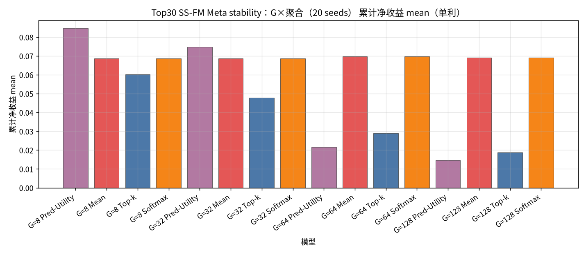
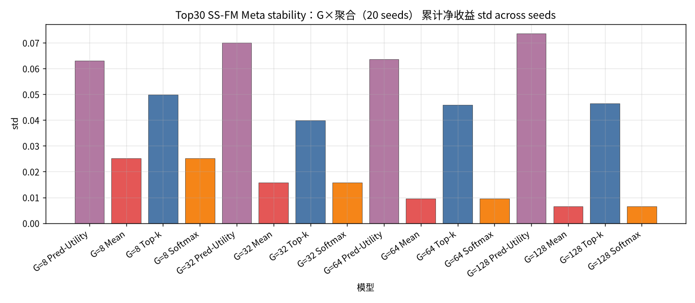
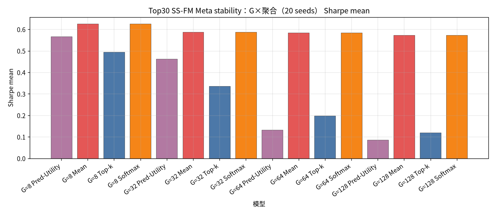
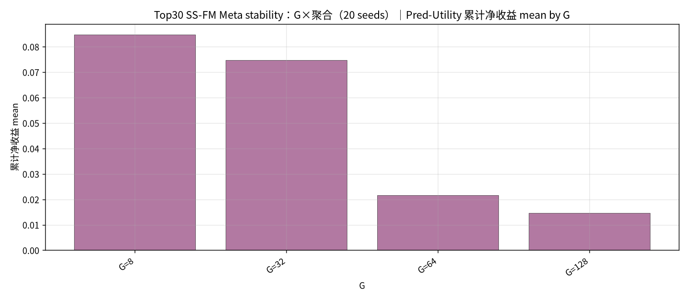
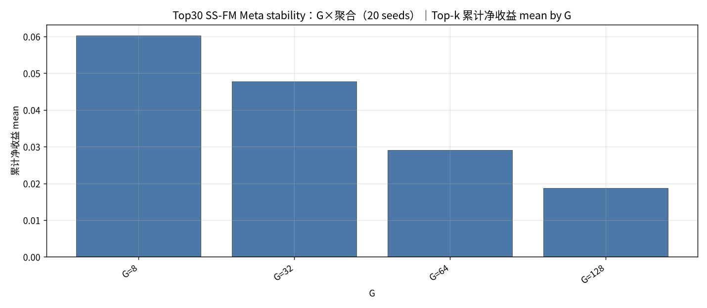
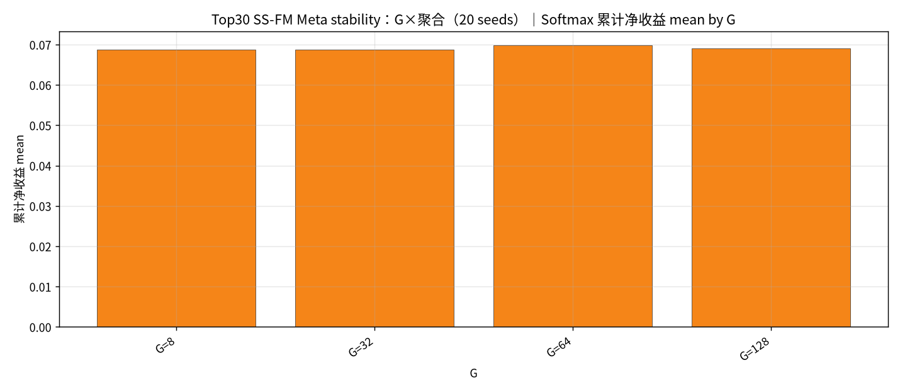
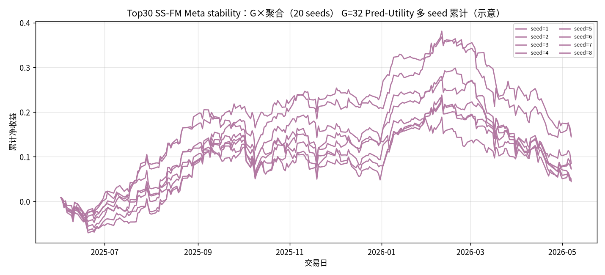

## Top30 SS-FM Meta stability：G×聚合（20 seeds）

设定：冻结 Top30 最新 Alpha+SS-FM（**不训练**）；配权 **Top30**；**Meta 候选 = G 条 SS-FM ∪ Teacher（MVO/MaxSharpe/RP）**；**G ∈ {8, 32, 64, 128}**；每组 G 使用 **seed ∈ {1..20}** 作初始化噪声；每日 `noise = hash(date, seed)`。同 (日,G,seed) 只建一次 Meta 池，四种聚合共享。

聚合：Pred-Utility / Mean / Top-k=3 / Softmax(τ=1.0)。下表为 **across seeds 的 mean±std（单利）**。

产物：`results/S&P500/strict_fixed_oos_top30_ssfm_stability_meta_seeds_rerun/`。约 **235** 日 × 20 seeds。

### 累计净收益 mean±std（单利）

| G | Pred-Utility | Mean | Top-k | Softmax |
| --- | --- | --- | --- | --- |
| G=8 | 0.0847±0.0630 | 0.0687±0.0252 | 0.0602±0.0499 | 0.0687±0.0252 |
| G=32 | 0.0747±0.0700 | 0.0687±0.0157 | 0.0478±0.0399 | 0.0687±0.0157 |
| G=64 | 0.0217±0.0636 | 0.0698±0.0096 | 0.0291±0.0458 | 0.0698±0.0096 |
| G=128 | 0.0146±0.0736 | 0.0691±0.0064 | 0.0187±0.0465 | 0.0691±0.0064 |

### Sharpe mean±std

| G | Pred-Utility | Mean | Top-k | Softmax |
| --- | --- | --- | --- | --- |
| G=8 | 0.5669±0.4275 | 0.6255±0.2297 | 0.4951±0.4168 | 0.6256±0.2297 |
| G=32 | 0.4617±0.4315 | 0.5874±0.1341 | 0.3365±0.2797 | 0.5873±0.1341 |
| G=64 | 0.1328±0.3819 | 0.5849±0.0797 | 0.1976±0.3102 | 0.5847±0.0796 |
| G=128 | 0.0858±0.4226 | 0.5726±0.0542 | 0.1190±0.3003 | 0.5725±0.0542 |

### 日均换手 mean±std

| G | Pred-Utility | Mean | Top-k | Softmax |
| --- | --- | --- | --- | --- |
| G=8 | 0.7895±0.0084 | 0.4981±0.0038 | 0.6178±0.0087 | 0.4981±0.0038 |
| G=32 | 0.7755±0.0091 | 0.4511±0.0026 | 0.6606±0.0082 | 0.4511±0.0026 |
| G=64 | 0.7466±0.0154 | 0.4447±0.0019 | 0.6561±0.0077 | 0.4446±0.0019 |
| G=128 | 0.7216±0.0130 | 0.4365±0.0020 | 0.6431±0.0094 | 0.4365±0.0020 |

#### Top30 SS-FM Meta stability：G×聚合（20 seeds） 累计净收益 mean

#### Top30 SS-FM Meta stability：G×聚合（20 seeds） 累计净收益 std

#### Top30 SS-FM Meta stability：G×聚合（20 seeds） Sharpe mean

#### Top30 SS-FM Meta stability：G×聚合（20 seeds）｜Pred-Utility by G

#### Top30 SS-FM Meta stability：G×聚合（20 seeds）｜Mean by G

#### Top30 SS-FM Meta stability：G×聚合（20 seeds）｜Top-k by G

#### Top30 SS-FM Meta stability：G×聚合（20 seeds）｜Softmax by G

#### Top30 SS-FM Meta stability：G×聚合（20 seeds） G=32 Pred-Utility 多 seed 累计（示意）

### Top30 SS-FM Meta stability（20 seeds）结论
- 最高 mean 单利：Meta G=8 Pred-Utility = `0.0847±0.0630`（Sharpe `0.5669±0.4275`）。
- 最大跨 seed 方差：G=128 Pred-Utility std=`0.0736`。
- seed ∈ {1..20}；daily `hash(date, seed)`；候选含 Teacher；不训练。
