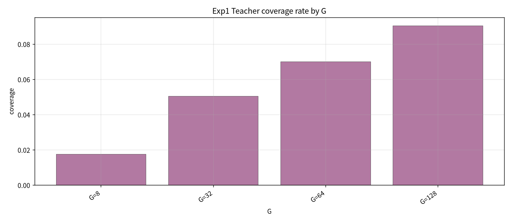
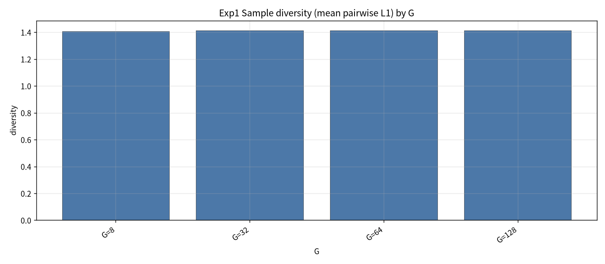
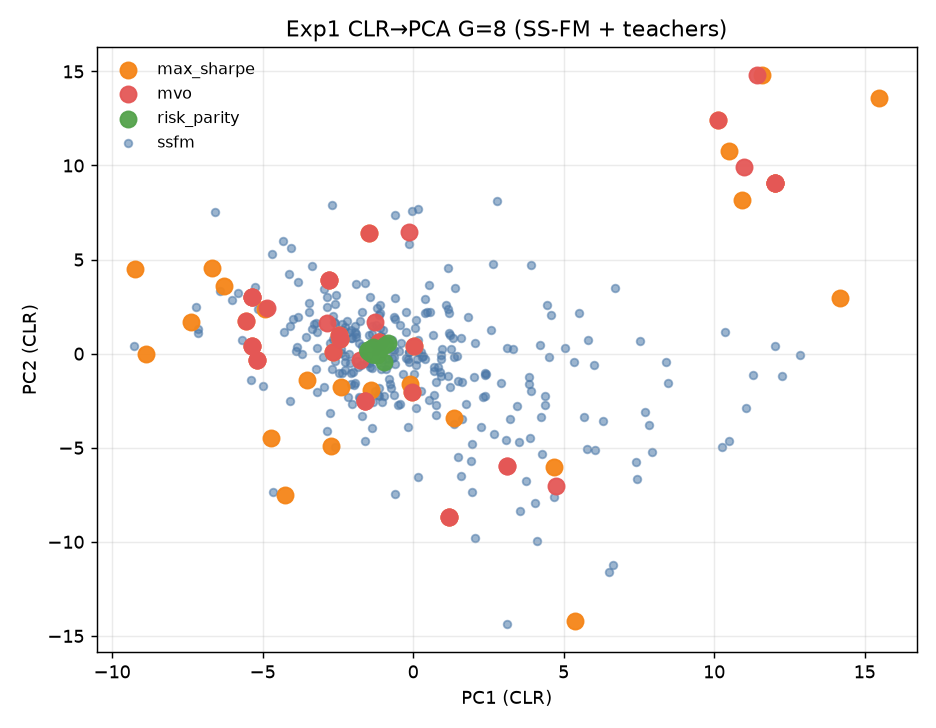
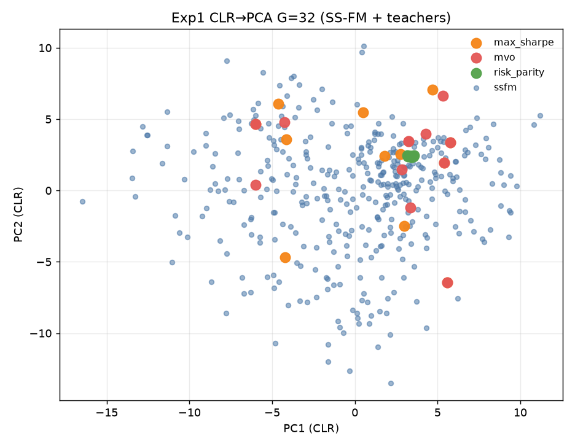
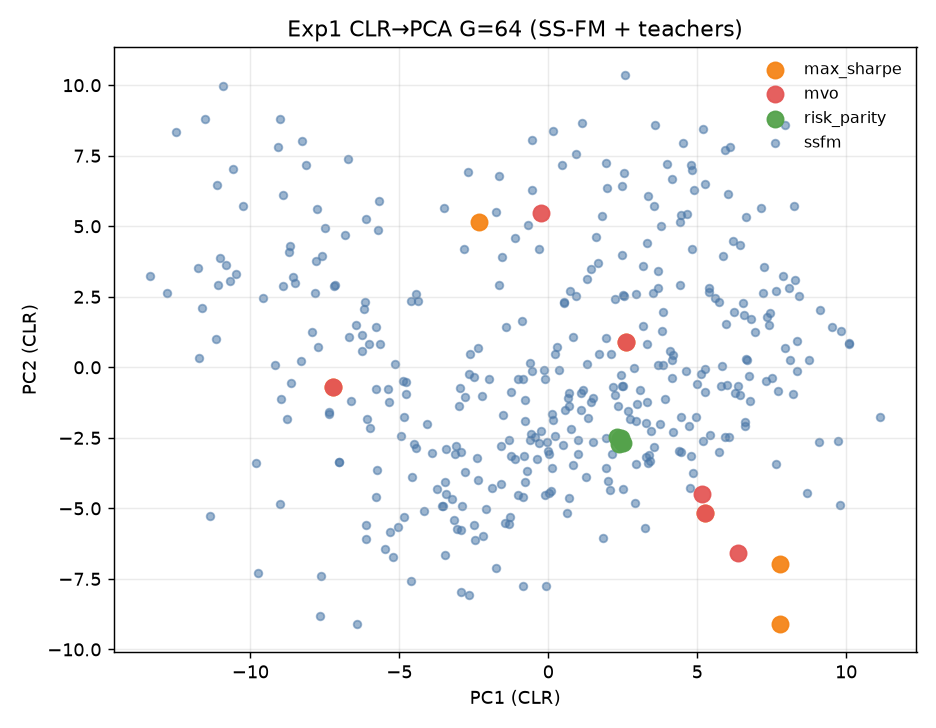
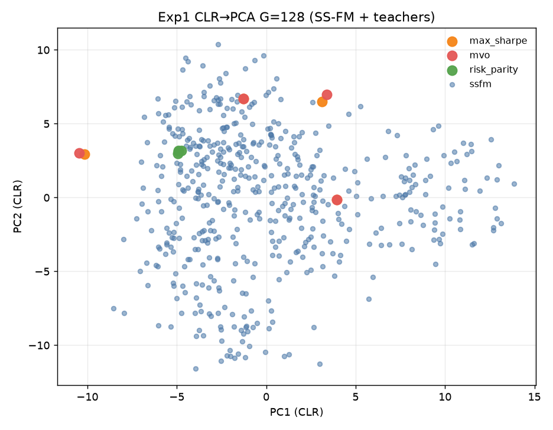

# Exp1：当前 SS-FM 分布诊断实验报告

- **市场 / 池子**：S&P500 Top30  
- **区间**：2025-06 … 2026-05（strict_fixed_oos，无未来泄漏）  
- **模型**：冻结各月 `gen_ssfm_top30.pt`（不训练）  
- **采样**：G ∈ {8, 32, 64, 128}；seed ∈ {1…20}；mixed SS-FM  
- **候选池**：$\mathcal C=\{w_1,\ldots,w_G,w^{MVO},w^{MS},w^{RP}\}$（诊断指标主要看 G 个 SS-FM 样本相对 3 teacher）  
- **Coverage 半径**：权重 L1 ≤ 0.35  
- **产物目录**：`exp1_diagnose/`

## 1. 实验目的

在不改训练的前提下，诊断当前 SS-FM 生成分布是否 **teacher-aligned**：能否覆盖 MVO / Max-Sharpe / Risk-Parity 附近，同时保持 diversity；并用 CLR→PCA 观察是否形成 teacher-centered clusters（**不预设**一定出现三个簇）。

## 2. 方法

1. 按月加载冻结 Alpha + SS-FM checkpoint，在 test day 上用 dated seed 采样 G 个组合。  
2. 计算：到各 teacher 的最小 L1、coverage rate、样本两两 L1 diversity、pred-utility（相对 teacher）。  
3. 将 G 个样本 + 3 teacher 映射到 CLR 空间后做 PCA 二维可视化。

## 3. 主结果（按 G 汇总，跨日×seed）

| G | coverage mean | diversity mean | util mean | frac beat best teacher | min_dist MVO | min_dist MaxSharpe | min_dist RP |
| --- | --- | --- | --- | --- | --- | --- | --- |
| 8 | 0.0177 | 1.4058 | 0.00309 | 0.247 | 1.664 | 1.573 | 0.751 |
| 32 | 0.0506 | 1.4127 | 0.00308 | 0.239 | 1.412 | 1.332 | 0.675 |
| 64 | 0.0701 | 1.4136 | 0.00308 | 0.236 | 1.287 | 1.228 | 0.646 |
| 128 | 0.0906 | 1.4119 | 0.00308 | 0.236 | 1.159 | 1.127 | 0.612 |

要点：

- Coverage 随 G 上升但仍很低（约 **1.8% → 9.1%**）。  
- Diversity 几乎不随 G 变（~**1.41**）。  
- 距 **Risk-Parity 最近**，距 **MVO / Max-Sharpe 明显更远**。  
- 约 **24%** 样本的 pred-utility 不低于当日最优 teacher（不等于 OOS 收益）。

## 4. 图

### Coverage / Diversity by G

### CLR→PCA（SS-FM + 3 teachers）

观察：SS-FM 样本呈弥散云；三个 teacher 更像参考锚点，**未见稳定的三簇结构**。增大 G 主要填满云团、略靠近 teacher，而非分裂成三个 teacher-centered clusters。

## 5. 结论

1. 当前冻结 SS-FM **teacher coverage 不足**，尤其对 MVO / Max-Sharpe。  
2. **Diversity 尚可且稳定**，分布并非塌缩到单点。  
3. 诊断支持后续两条路径：Exp2 在 sampling 阶段抬覆盖；Exp3 在训练阶段拉近 teacher（同时保 diversity）。

## 6. 数据文件

- `exp1_diagnose/tables/exp1_summary_by_G.csv`  
- `exp1_diagnose/tables/exp1_day_seed_metrics.csv`  
- `exp1_diagnose/figures/*.png`
