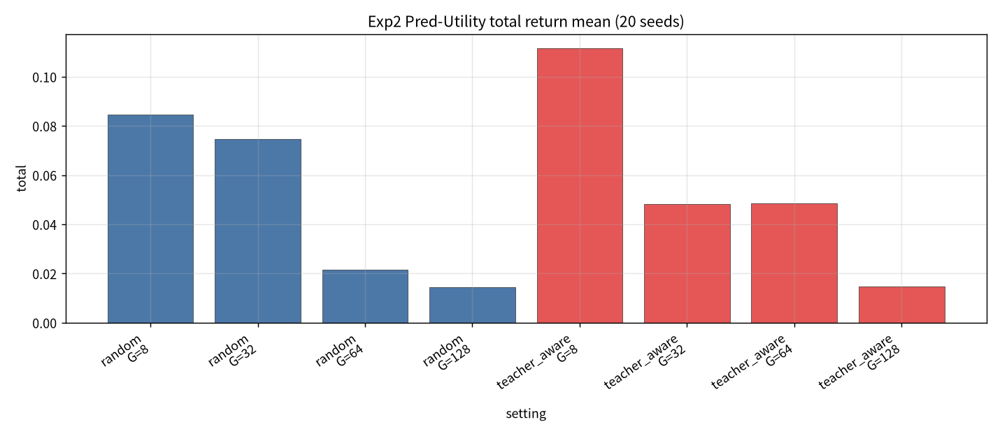
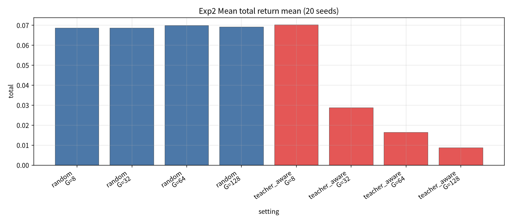
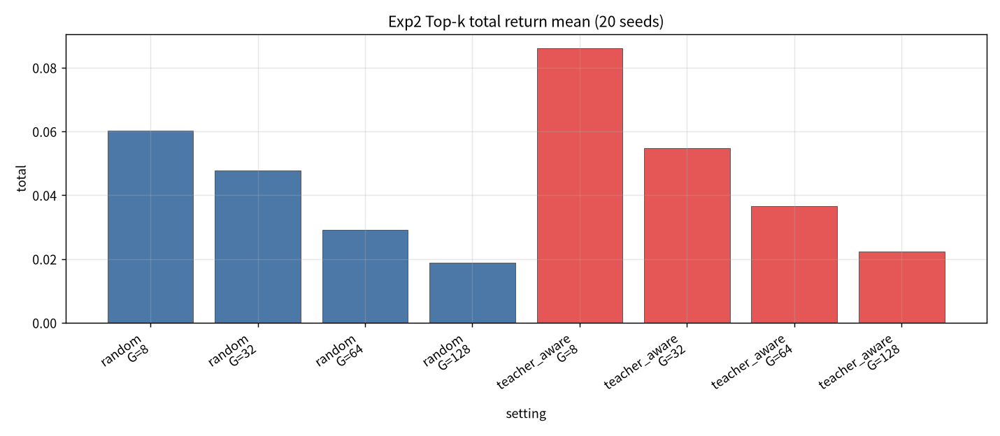
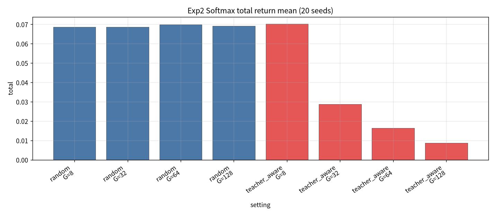
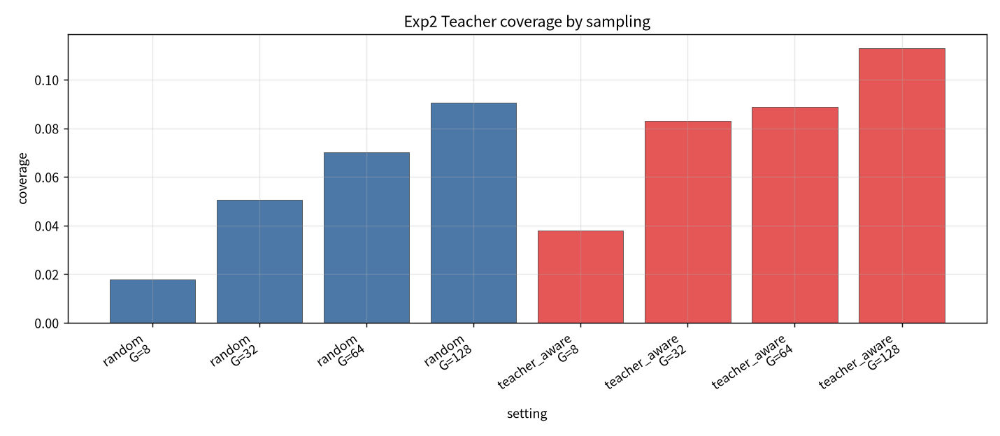

# Exp2：Sampling-stage Teacher Constraint 实验报告

- **市场 / 池子**：S&P500 Top30  
- **区间**：2025-06 … 2026-05（strict_fixed_oos）  
- **模型**：与 Exp1 相同，冻结 SS-FM（不重训）  
- **候选池**：始终 G SS-FM ∪ 3 teachers  
- **对比**：Random sampling vs Teacher-aware sampling  
- **聚合**：Pred-Utility / Mean / Top-k / Softmax  
- **G / seeds**：{8,32,64,128} × {1…20}  
- **Teacher-aware 规则**：oversample → 各 teacher 最近点各保留 1 个 → 其余 max-min diversity 填充  
- **产物目录**：`exp2_sampling/`

## 1. 实验目的

在 **不改生成模型** 的前提下，只在采样/选样阶段强制 teacher 附近有 SS-FM 候选，并比较对 OOS 收益、Sharpe、换手与 coverage 的影响。

## 2. 方法

对每个 test day、每个 (G, seed)：

1. Random：mixed SS-FM 直接取 G。  
2. Teacher-aware：更大候选池中选 G（覆盖 + 多样性）。  
3. 拼入 3 teachers 形成 Meta 池，再分别用四种聚合得到当日权重并回测。  
4. Coverage 仍只针对 **G 个 SS-FM 样本**（不含池中强制加入的 teacher 本身）。

## 3. Coverage（SS-FM 样本）

| sampling | G=8 | G=32 | G=64 | G=128 |
| --- | --- | --- | --- | --- |
| random | 0.0177 | 0.0506 | 0.0701 | 0.0906 |
| teacher_aware | 0.0378 | 0.0829 | 0.0888 | 0.1129 |

Teacher-aware 相对 Random **稳定抬高 coverage**，但绝对水平仍偏低。

## 4. 回测主表（20 seeds：mean±std）

### 4.1 Pred-Utility

| sampling | G | total | Sharpe | turnover | coverage |
| --- | --- | --- | --- | --- | --- |
| random | 8 | 0.0847±0.0630 | 0.567±0.428 | 0.789 | 0.018 |
| random | 32 | 0.0747±0.0700 | 0.462±0.431 | 0.775 | 0.051 |
| random | 64 | 0.0217±0.0636 | 0.133±0.382 | 0.747 | 0.070 |
| random | 128 | 0.0146±0.0736 | 0.086±0.423 | 0.722 | 0.091 |
| teacher_aware | 8 | **0.1116±0.1057** | **0.692±0.641** | 0.798 | 0.038 |
| teacher_aware | 32 | 0.0483±0.0808 | 0.289±0.480 | 0.744 | 0.083 |
| teacher_aware | 64 | 0.0484±0.0533 | 0.282±0.312 | 0.730 | 0.089 |
| teacher_aware | 128 | 0.0148±0.0769 | 0.084±0.435 | 0.691 | 0.113 |

### 4.2 Mean / Softmax（更稳、换手更低）

| sampling | G | Mean total | Softmax total | Mean Sharpe | Mean turnover |
| --- | --- | --- | --- | --- | --- |
| random | 8 | 0.0687±0.0252 | 0.0687±0.0252 | 0.626 | 0.498 |
| random | 32 | 0.0687±0.0157 | 0.0687±0.0157 | 0.587 | 0.451 |
| random | 64 | 0.0698±0.0096 | 0.0698±0.0096 | 0.585 | 0.445 |
| random | 128 | 0.0691±0.0064 | 0.0691±0.0064 | 0.573 | 0.437 |
| teacher_aware | 8 | 0.0703±0.0224 | 0.0703±0.0224 | 0.648 | 0.504 |
| teacher_aware | 32 | 0.0288±0.0143 | 0.0288±0.0143 | 0.259 | 0.356 |
| teacher_aware | 64 | 0.0164±0.0076 | 0.0164±0.0076 | 0.146 | 0.326 |
| teacher_aware | 128 | 0.0088±0.0048 | 0.0088±0.0048 | 0.078 | 0.301 |

### 4.3 Top-k

| sampling | G | total | Sharpe | turnover |
| --- | --- | --- | --- | --- |
| random | 8 | 0.0602±0.0499 | 0.495 | 0.618 |
| random | 32 | 0.0478±0.0399 | 0.336 | 0.661 |
| teacher_aware | 8 | 0.0861±0.0393 | 0.702 | 0.625 |
| teacher_aware | 32 | 0.0547±0.0447 | 0.399 | 0.618 |

## 5. 图

## 6. 结论

1. **最优点**：Pure SS-FM + **Teacher-aware** + **G=8 Pred-Utility** → total **0.112±0.106**，Sharpe **0.69**（相对 Random 同设定 0.085 / 0.57）。  
2. Teacher-aware **提高 coverage**，但对大 G 的 Mean/Softmax **有害**（多样性填充可能偏离高 utility 区域，均值聚合被“拉开”）。  
3. Random + Mean/Softmax 全年约 **0.069**，方差更小、换手更低，是稳健基线。  
4. Exp2 表明：**只改 sampling 就能带来可观增益（尤其小 G + Pred-Utility）**，但不是对所有聚合单调改进。

## 7. 数据文件

- `exp2_sampling/tables/exp2_summary.csv`  
- `exp2_sampling/tables/exp2_coverage_day_seed.csv`  
- `exp2_sampling/backtest_daily_year.csv`  
- `exp2_sampling/figures/*.png`
