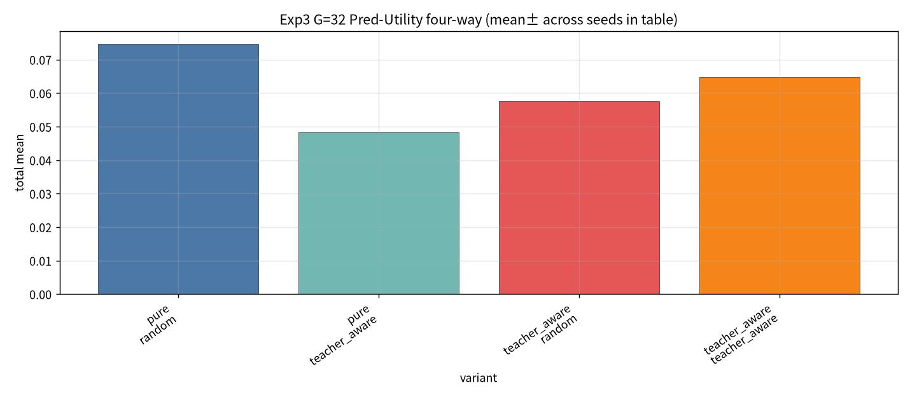

# Exp3：Teacher-aware SS-FM Retraining 实验报告

- **市场 / 池子**：S&P500 Top30  
- **区间**：2025-06 … 2026-05（strict_fixed_oos；按月 walk-forward，无未来泄漏）  
- **训练损失**：$L = L_{FM} + \lambda_T L_{coverage} + \lambda_D L_{div}$  
  - $\lambda_T=0.2$，$\lambda_D=0.05$  
  - 每月在 train split 上从零训练 200 steps（batch=16）  
- **候选池**：仍始终 = G SS-FM ∪ 3 teachers  
- **四组交叉**：  
  1. Pure SS-FM + Random  
  2. Pure SS-FM + Teacher-aware Sampling  
  3. Teacher-aware SS-FM + Random  
  4. Teacher-aware SS-FM + Teacher-aware Sampling  
- **G / seeds / 聚合**：同 Exp1/2  
- **产物目录**：`exp3_retrain/`（含按月 checkpoint）

## 1. 实验目的

在 Exp1 诊断“覆盖不足”、Exp2 验证“sampling 可补一点”之后，从 **训练阶段** 拉近三个 teacher，同时用 diversity 项防止塌缩；再与 Pure 模型 × 两种 sampling 做 2×2 比较。

## 2. 方法摘要

1. Pure：加载原 `gen_ssfm_top30.pt`。  
2. Teacher-aware 模型：每月 `train_ssfm_teacher_aware`（FM + coverage ODE + pairwise diversity）。  
3. Test 上用与 Exp1/2 相同 G、seeds、test states；池中强制含 3 teachers。  
4. 报告为 20 seeds 的全年 total / Sharpe 均值±标准差。

## 3. 四组核心对比（Pred-Utility）

| model | sampling | G=8 total | G=32 total | G=64 total | G=128 total |
| --- | --- | --- | --- | --- | --- |
| pure | random | 0.0847±0.0630 | 0.0747±0.0700 | 0.0217±0.0636 | 0.0146±0.0736 |
| pure | teacher_aware | **0.1116±0.1057** | 0.0483±0.0808 | 0.0484±0.0533 | 0.0148±0.0769 |
| teacher_aware | random | 0.0930±0.0591 | 0.0576±0.0707 | 0.0310±0.0818 | −0.0065±0.0709 |
| teacher_aware | teacher_aware | 0.0767±0.0755 | 0.0648±0.0924 | **0.0704±0.0811** | 0.0310±0.0634 |

对应 Sharpe（Pred-Utility）：

| model | sampling | G=8 | G=32 | G=64 | G=128 |
| --- | --- | --- | --- | --- | --- |
| pure | random | 0.57 | 0.46 | 0.13 | 0.09 |
| pure | teacher_aware | **0.69** | 0.29 | 0.28 | 0.08 |
| teacher_aware | random | 0.64 | 0.36 | 0.19 | −0.04 |
| teacher_aware | teacher_aware | 0.50 | 0.40 | 0.43 | 0.19 |

## 4. Mean / Softmax（重训后风险提示）

Teacher-aware **重训模型** 在 Mean/Softmax 上经常显著变差（大 G 可为负），例如：

| model | sampling | G | Mean total | Softmax total |
| --- | --- | --- | --- | --- |
| pure | random | 32 | 0.0687 | 0.0687 |
| pure | teacher_aware | 32 | 0.0288 | 0.0288 |
| teacher_aware | random | 32 | −0.0003 | −0.0003 |
| teacher_aware | teacher_aware | 32 | 0.0073 | 0.0073 |
| teacher_aware | random | 128 | −0.0110 | −0.0110 |
| teacher_aware | teacher_aware | 128 | −0.0165 | −0.0165 |

解读：coverage/div 辅助损失改变了生成几何；**均值类聚合**对分布形状更敏感，容易被拉向低 utility 区域。Pred-Utility / Top-k 相对更能挑出可用候选。

## 5. 图

### G=32 Pred-Utility 四组

（完整数值见 `exp3_retrain/tables/exp3_summary.csv`。）

## 6. 结论

1. **全局最优仍是 Exp2 设定**：Pure + Teacher-aware Sampling + G=8 Pred-Utility（0.112 / Sharpe 0.69）。  
2. 本轮从零重训的 Teacher-aware SS-FM：  
   - 在部分中等 G 的 Pred-Utility 上可超过 Pure+TA（如 G=64：0.070 vs 0.048）；  
   - 但 **未能稳定超过** Pure+TA G=8；  
   - Mean/Softmax **明显退化**。  
3. 逻辑链成立：**诊断（覆盖不足）→ sampling 约束（小 G 有效）→ 训练约束（需更好 init / λ / steps 才可能全面胜出）**。  
4. 实务建议（基于本轮）：优先 **冻结 Pure + Teacher-aware sampling**；重训作为后续改进项（例如从 Pure checkpoint fine-tune、调低 $\lambda_D$ 或加长 steps）。

## 7. 数据文件

- `exp3_retrain/tables/exp3_summary.csv`  
- `exp3_retrain/backtest_daily_year.csv`  
- `exp3_retrain/checkpoints/gen_ssfm_teacher_aware_top30_*.pt`  
- `exp3_retrain/figures/exp3_G32_pred_utility_four_way.png`  
- 超参：`exp3_retrain/meta.json`（λ_T=0.2, λ_D=0.05）
