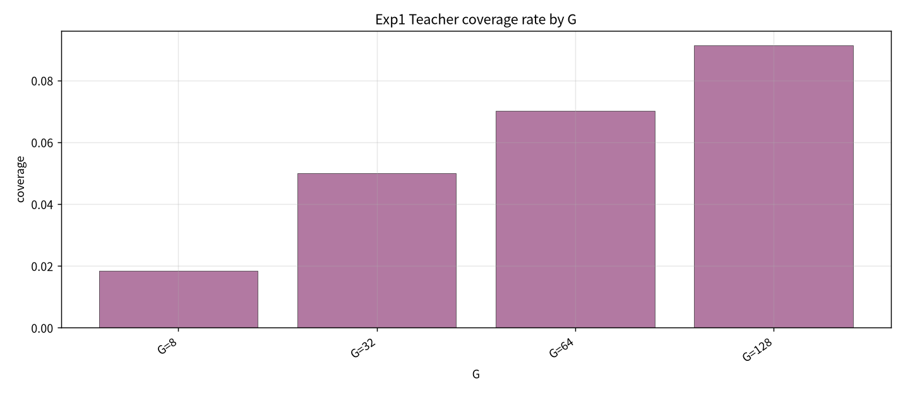
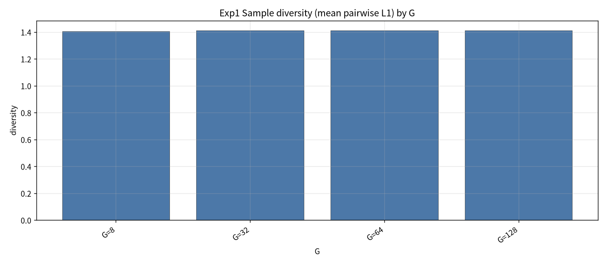

# Exp1：当前 SS-FM 分布诊断实验报告（50 seeds）

- **市场 / 池子**：S&P500 Top30  
- **区间**：2025-06 … 2026-05（strict_fixed_oos，无未来泄漏）  
- **模型**：冻结各月 `gen_ssfm_top30.pt`（不训练）  
- **采样**：G ∈ {8, 32, 64, 128}；**seed ∈ {1…50}**；mixed SS-FM  
- **候选池**：$\mathcal C=\{w_1,\ldots,w_G,w^{MVO},w^{MS},w^{RP}\}$  
- **Coverage 半径**：权重 L1 ≤ 0.35  
- **产物目录**：`exp1_diagnose/`（本目录相对 `strict_fixed_oos_top30_ssfm_teacher_exps_s50/`）

## 1. 目的

诊断冻结 SS-FM 是否 teacher-aligned（覆盖 MVO / Max-Sharpe / Risk-Parity 附近并保持 diversity）；CLR→PCA 观察是否形成 teacher-centered clusters（**不预设**三簇）。

## 2. 主结果（50 seeds × 全年 test days）

| G | coverage | diversity | util mean | frac beat best teacher | min_dist MVO | min_dist MS | min_dist RP |
| --- | --- | --- | --- | --- | --- | --- | --- |
| 8 | 0.0185 | 1.4053 | 0.0031 | 0.245 | 1.666 | 1.572 | 0.750 |
| 32 | 0.0500 | 1.4124 | 0.0031 | 0.238 | 1.413 | 1.333 | 0.675 |
| 64 | 0.0702 | 1.4128 | 0.0031 | 0.236 | 1.285 | 1.226 | 0.645 |
| 128 | 0.0914 | 1.4114 | 0.0031 | 0.236 | 1.160 | 1.127 | 0.612 |

与 20-seed 版一致：coverage 随 G 升但仍低（~1.9%→9.1%）；diversity ~1.41；距 RP 最近、距 MVO/MS 更远。

## 3. 图

注：PCA 上每个 teacher 色点是**多日** teacher 权重叠画（每日一个），不是单点重复。

## 4. 结论

当前冻结 SS-FM **teacher coverage 不足**、**未见稳定三簇**；diversity 尚可。支持后续 Exp2（sampling）与 Exp3（重训）。

## 5. 数据

- `exp1_diagnose/tables/exp1_summary_by_G.csv`  
- `exp1_diagnose/tables/exp1_day_seed_metrics.csv`
