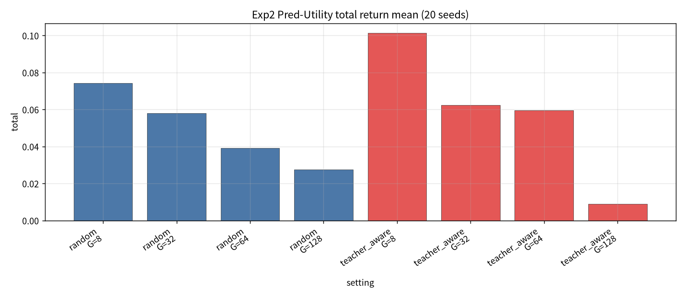
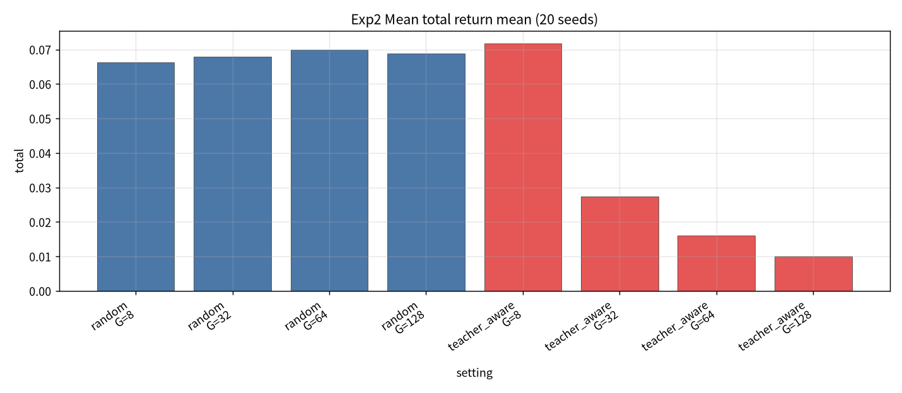
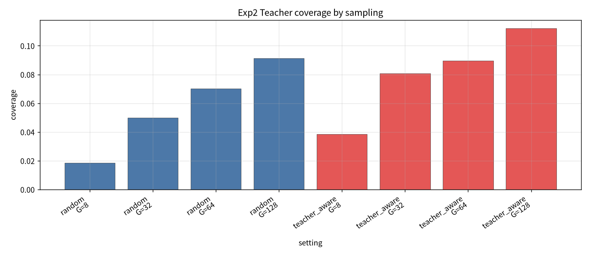

# Exp2：Sampling-stage Teacher Constraint 实验报告（50 seeds）

- **市场 / 池子**：S&P500 Top30  
- **区间**：2025-06 … 2026-05  
- **模型**：冻结 SS-FM（同 Exp1）  
- **候选池**：始终 G SS-FM ∪ 3 teachers  
- **对比**：Random vs Teacher-aware sampling  
- **聚合**：Pred-Utility / Mean / Top-k / Softmax  
- **G / seeds**：{8,32,64,128} × **{1…50}**  
- **产物**：`exp2_sampling/`

## 1. Coverage（SS-FM 样本，不含强制入池的 teacher）

| sampling | G=8 | G=32 | G=64 | G=128 |
| --- | --- | --- | --- | --- |
| random | 0.0185 | 0.0500 | 0.0702 | 0.0914 |
| teacher_aware | 0.0386 | 0.0807 | 0.0896 | 0.1121 |

## 2. Pred-Utility（50 seeds mean±std）

| sampling | G | total | Sharpe | turnover | coverage |
| --- | --- | --- | --- | --- | --- |
| random | 8 | 0.0743±0.0696 | 0.493 | 0.790 | 0.019 |
| random | 32 | 0.0579±0.0762 | 0.354 | 0.774 | 0.050 |
| random | 64 | 0.0392±0.0851 | 0.232 | 0.749 | 0.070 |
| random | 128 | 0.0276±0.0803 | 0.160 | 0.722 | 0.091 |
| teacher_aware | 8 | **0.1014±0.0858** | **0.628** | 0.800 | 0.039 |
| teacher_aware | 32 | 0.0623±0.0818 | 0.368 | 0.743 | 0.081 |
| teacher_aware | 64 | 0.0597±0.0693 | 0.349 | 0.726 | 0.090 |
| teacher_aware | 128 | 0.0091±0.0897 | 0.054 | 0.693 | 0.112 |

## 3. Mean（稳健基线）

| sampling | G | total | Sharpe | turnover |
| --- | --- | --- | --- | --- |
| random | 8 | 0.0663±0.0263 | 0.601 | 0.498 |
| random | 32 | 0.0679±0.0176 | 0.578 | 0.451 |
| random | 64 | 0.0699±0.0117 | 0.584 | 0.444 |
| random | 128 | 0.0689±0.0076 | 0.570 | 0.436 |
| teacher_aware | 8 | 0.0717±0.0233 | 0.660 | 0.504 |
| teacher_aware | 32 | 0.0273±0.0118 | 0.245 | 0.356 |
| teacher_aware | 64 | 0.0160±0.0089 | 0.142 | 0.327 |
| teacher_aware | 128 | 0.0100±0.0050 | 0.088 | 0.301 |

Softmax 与 Mean 数值几乎相同（见 `exp2_summary.csv`）。

## 4. 图

## 5. 结论

1. **最优点**（50 seeds）：Pure + **Teacher-aware** + **G=8 Pred-Utility** → **0.101±0.086** / Sharpe 0.63（Random 同设定 0.074）。  
2. Teacher-aware 抬高 coverage；G≥32 时损害 Mean/Softmax。  
3. Random + Mean 全年约 **0.067–0.070**，方差更小。  
4. 相对 20-seed：结论方向不变，G=8 Teacher-aware Pred-Utility 点估计略降（0.112→0.101），仍为最优。

## 6. 数据

- `exp2_sampling/tables/exp2_summary.csv`  
- `exp2_sampling/backtest_daily_year.csv`
