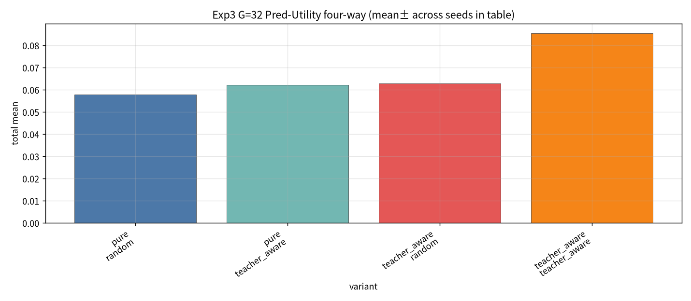

# Exp3：Teacher-aware SS-FM Retraining 实验报告（50 seeds）

- **市场 / 池子**：S&P500 Top30  
- **区间**：2025-06 … 2026-05（按月 walk-forward）  
- **损失**：$L=L_{FM}+\lambda_T L_{coverage}+\lambda_D L_{div}$（$\lambda_T=0.2$，$\lambda_D=0.05$）  
- **候选池**：始终 G SS-FM ∪ 3 teachers  
- **四组**：Pure/TA 模型 × Random/TA sampling  
- **G / seeds**：{8,32,64,128} × **{1…50}**（与 Exp1/2 相同）  
- **产物**：`exp3_retrain/`

## 1. Pred-Utility 四组（50 seeds）

| model | sampling | G=8 | G=32 | G=64 | G=128 |
| --- | --- | --- | --- | --- | --- |
| pure | random | 0.074±0.070 | 0.058±0.076 | 0.039±0.085 | 0.028±0.080 |
| pure | teacher_aware | **0.101±0.086** | 0.062±0.082 | 0.060±0.069 | 0.009±0.090 |
| teacher_aware | random | 0.043±0.055 | 0.063±0.067 | 0.069±0.069 | 0.050±0.075 |
| teacher_aware | teacher_aware | 0.055±0.068 | **0.086±0.079** | 0.068±0.072 | 0.056±0.059 |

Sharpe（Pred-Utility）：

| model | sampling | G=8 | G=32 | G=64 | G=128 |
| --- | --- | --- | --- | --- | --- |
| pure | random | 0.49 | 0.35 | 0.23 | 0.16 |
| pure | teacher_aware | **0.63** | 0.37 | 0.35 | 0.05 |
| teacher_aware | random | 0.30 | 0.41 | 0.43 | 0.31 |
| teacher_aware | teacher_aware | 0.36 | **0.54** | 0.43 | 0.34 |

## 2. 图

## 3. 结论

1. **全局最优仍是 Pure + Teacher-aware Sampling + G=8 Pred-Utility（0.101 / 0.63）**。  
2. 50 seeds 下，**Teacher-aware 模型 + Teacher-aware sampling 在 G=32** 达到 0.086 / Sharpe 0.54，明显强于 Pure+TA@G=32（0.062），但未超过 Pure+TA@G=8。  
3. Teacher-aware 重训在部分中等 G 的 Pred-Utility 上有增益；Mean/Softmax 仍易退化（详见 `exp3_summary.csv`）。  
4. 实务建议不变：优先冻结 Pure + Teacher-aware sampling（小 G）；重训需更好 init/λ 才能全面胜出。

## 4. 数据

- `exp3_retrain/tables/exp3_summary.csv`  
- `exp3_retrain/checkpoints/gen_ssfm_teacher_aware_top30_*.pt`  
- `exp3_retrain/meta.json`
