# SS-FM（默认 G=32）综合实验分析：Teacher 交叉、Diversity、生成对照、稳定性与 RL

> **论文可用稿（完整版）**。统一口径：除非另注，收益为 OOS **单利 Σ**（`Σ net_return`）；配权池 **Top30**；SS-FM 主设定 **G=32**。  
> 覆盖市场：**CSI500**（2025-05…2026-05，≈245 日）与 **S&P500**（2025-06…2026-05，≈235 日）。  
> Teacher：闭式解 **MVO / Max-Sharpe / Risk-Parity**。  
> 本报告整合：Teacher Exp1–3、diversity、生成/Teacher/RL 对照，以及**近两日** Meta / 无 Teacher 稳定性与 Softmax 全生成对照。  
> **图**：`paper_figures_en/`（英文标题/坐标轴；图例已去掉 G=32、Meta 等协议字样）。再生：`experiments/build_paper_figures_en.py`。

---

## 完整结论（先读）

下列 **C1–C8** 为可写入论文 Discussion / Conclusion 的完整主张；后文各节提供表证与图证。

| ID | 主张 | 主证据 |
| --- | --- | --- |
| **C1** | SS-FM 在默认 **G=32** 下是有竞争力的条件生成器 | CSI Pure G=32 **0.608**（领先默认生成族）；SP Softmax Meta **0.075**（生成族第一） |
| **C2** | 生成分布 **未对齐** 三 Teacher：coverage 低、无三簇；diversity 尚可 | Exp1：G=32 coverage≈**5%**，pairwise L1≈**1.41**，CLR–PCA 弥散云 |
| **C3** | Teacher 交叉：**sampling 约束**在小 G+Pred-Utility 有效；盲目 Meta+Pred-Utility 可伤害 SS-FM | Exp2：TA+G=8≈**0.10–0.11**；CSI SS-FM Meta Pred-Util **0.19** ≪ Pure **0.61** |
| **C4** | Teacher-aware **重训**本轮未全面胜出；Mean/Softmax 易退化 | Exp3：最优仍是 Pure+TA sampling；重训 Mean@G32≈0/负 |
| **C5** | **聚合器**决定结论形态：Pred-Utility=高收益高方差上界；Softmax/Mean=稳健主指标 | CSI Softmax 五家挤在 0.45–0.55；Pred-Util 下 Diff 可到 0.87–0.90 |
| **C6** | **跨市场翻转**：CSI 厚、SP 薄；Diff 在 CSI 常最优、在 SP 常最差 | Softmax Meta：CSI≈0.5 全正 vs SP≈0/负；SP Diff Pred-Util 随 G **恶化** |
| **C7** | **稳定性**：Diff 优势主要来自样本多样性+选仓（非 Teacher）；Mean 三家收敛 | CSI 无 Teacher@G128 Diff **0.90**≈Meta **0.88**；Mean 全程 ≈0.51–0.55 |
| **C8** | **RL（尤其 cand-PPO）** 是有效后段：CSI 大幅抬收益并降换手；SP 抬稳健性 | CSI PPO **1.05**；SP r06：PPO **0.179±0.035**（3/3 夺冠）≫ Meta **0.006±0.068** |

**实务默认（由 C1–C8 推出）**

1. **主榜**：G=32 + Softmax（或 Mean）Meta；Pred-Utility 作上界并报 seed std。  
2. **Teacher**：优先 Pure + Teacher-aware sampling（小 G）；G=32 慎用「强制覆盖 + 均值聚合」。  
3. **部署**：CSI → Pure SS-FM G=32 ± PPO；SP → Softmax Meta SS-FM + cand-PPO（多 seed）。  
4. **勿混谈「Meta」**：须标明 Pred-Utility Meta vs Softmax Meta vs Pure。

---

## 摘要（Abstract）

我们在冻结 Alpha 与生成器的前提下，系统评估 **SS-FM** 在截面组合生成中的作用。主线默认 **G=32**，证据链为：

1. **分布几何**：相对 Teacher 的 coverage / diversity；选中组合集中度；
2. **Teacher 交互**（Exp1→2→3）：诊断 → sampling → 重训 2×2；
3. **生成族对照**（含近两日 Softmax / Pure / Meta Pred-Utility）；
4. **多 seed 稳定性**（Meta vs 无 Teacher；G∈{8,32,64,128}×20 seeds）；
5. **RL 蒸馏**（CSI PPO/GRPO；SP r06 多 seed）。

结论见上表 **C1–C8**。

---

## 1. 问题设定与记号

### 1.1 流水线

每日 \(t\)：冻结 Alpha → Top30 → 采样 \(G\) 条权重（可选 Teacher-aware）→（可选）并入 3 Teacher → 聚合器 \(\mathcal A\) → 开盘成交。

\[
u(w)=\hat\alpha^\top w-\tfrac12\lambda\, w^\top \Sigma_{t-1} w.
\]

| 聚合 \(\mathcal A\) | 定义 |
| --- | --- |
| Pred-Utility | \(\arg\max_{w\in\mathcal C} u(w)\) |
| Mean | 候选等权平均 |
| Top-\(k\) | top-3（按 \(u\)）再平均 |
| Softmax | \(\sum_w \mathrm{softmax}(u/\tau)\,w\)，\(\tau=1\) |

**Meta** = 候选含 Teacher；**Pure / 无 Teacher** = 仅 \(G\) 条生成样本。

### 1.2 Coverage / Diversity（候选）

\[
\mathrm{Coverage}=\frac1{3G}\sum_{\tau}\sum_{g}\mathbf 1\{\lVert w^{(g)}-w^\tau\rVert_1\le 0.35\},
\quad
\mathrm{Diversity}=\frac{2}{G(G-1)}\sum_{i<j}\lVert w^{(i)}-w^{(j)}\rVert_1.
\]

### 1.3 市场协议速查（近两日统一）

| 项 | CSI500 | SP500 |
| --- | --- | --- |
| Alpha | `transformer_gated_residual_auction`（含竞价） | Minute Transformer + Cross-Stock Attention |
| OOS | 2025-05…2026-05（≈245 日） | 2025-06…2026-05（≈235 日） |
| 稳定性网格 | G∈{8,32,64,128}，seed∈{1…20}，`hash(date,seed)` | 同左（Meta）；无 Teacher 本轮未新跑 |
| Teacher Exp | — | Exp1–3；s50=50 seeds |

---

## 2. Diversity：两层证据

### 2.1 候选层：SS-FM vs Teacher（SP500 Exp1，50 seeds）→ **支撑 C2**

| G | coverage | diversity | min L1→MVO | →MS | →RP |
| --- | ---: | ---: | ---: | ---: | ---: |
| 8 | 0.0185 | 1.405 | 1.666 | 1.572 | 0.750 |
| **32** | **0.0500** | **1.412** | 1.413 | 1.333 | **0.675** |
| 64 | 0.0702 | 1.413 | 1.285 | 1.226 | 0.645 |
| 128 | 0.0914 | 1.411 | 1.160 | 1.127 | 0.612 |

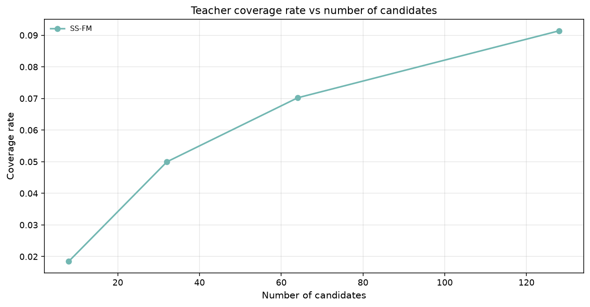

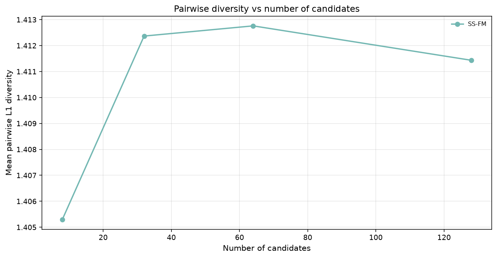

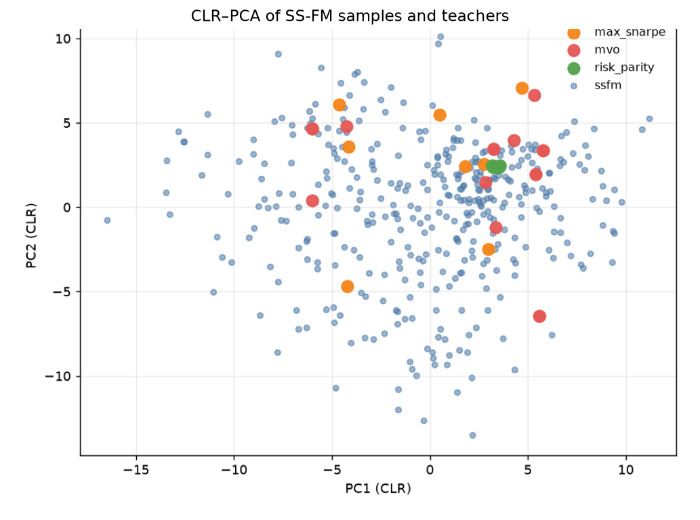

- Coverage 随 G 升但仍极低；Diversity≈1.41 几乎不变 → 增大 \(G\) **填满同一云团**。  
- 距 RP 最近、距 MVO/MS 更远；CLR–PCA **无稳定三簇**。约 24% 样本 \(u(w)\) 不低于最优 Teacher（≠ OOS 收益）。

### 2.2 组合层：选中权重集中度（全股池辅证）

| 模型 | 日均最大权重 | 有效持股 | >15% 天数 | 换手 |
| --- | ---: | ---: | ---: | ---: |
| FM | 0.031 | **174** | 0/240 | 0.52 |
| SS-FM | 0.127 | 114 | 55/240 | 0.51 |
| Diffusion | **0.343** | **10** | 206/240 | **0.91** |

持股多样性 **FM ≫ SS-FM（均）≫ Diffusion**。SS-FM 双模态（多数分散、少数尖峰）。**勿与 §2.1 的候选 diversity 混谈。**

---

## 3. Exp1–3：Teacher 交叉验证 → **支撑 C2–C4**

逻辑：**诊断 → 仅改采样 → 改训练×采样 2×2**。回测池始终 = \(G\) SS-FM ∪ 3 Teacher。

### 3.1 Exp2：Teacher-aware Sampling（冻结模型）

规则：oversample → 各 Teacher 最近点各 1 → max-min diversity 填满。

| sampling | G=8 cov | G=32 cov | G=128 cov |
| --- | ---: | ---: | ---: |
| random | 0.019 | 0.050 | 0.091 |
| teacher_aware | **0.039** | **0.081** | **0.112** |

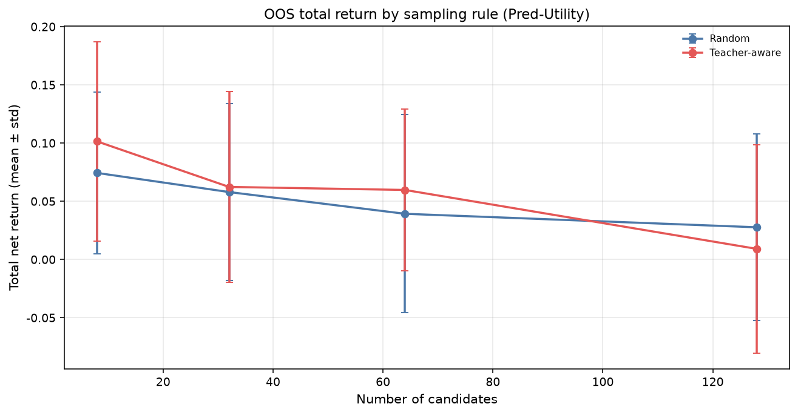

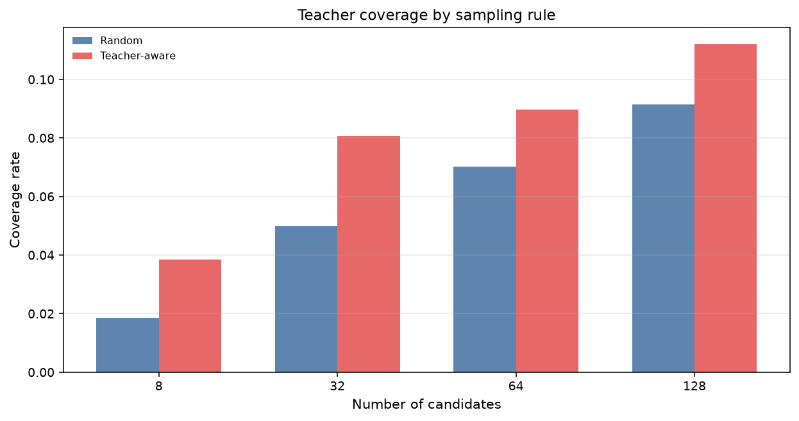

| sampling | G | Pred-Util total | 备注 |
| --- | --- | ---: | --- |
| **teacher_aware** | **8** | **0.101±0.086** | **全局优点** |
| random | 8 | 0.074±0.070 | |
| random | 32 | 0.058±0.076 | 默认 G |
| teacher_aware | 32 | 0.062±0.082 | 微弱改善 |
| random Mean@32 | 32 | ≈**0.068** | 稳健基线 |
| TA Mean@32 | 32 | ≈**0.027** | **受损** |

→ Coverage↑ **不单调**变收益；大 G + 均值聚合忌强制覆盖。

### 3.2 Exp3：Retrain × Sampling（2×2）

\(L=L_{\mathrm{FM}}+\lambda_T L_{\mathrm{cov}}+\lambda_D L_{\mathrm{div}}\)（\(\lambda_T=0.2,\lambda_D=0.05\)）。

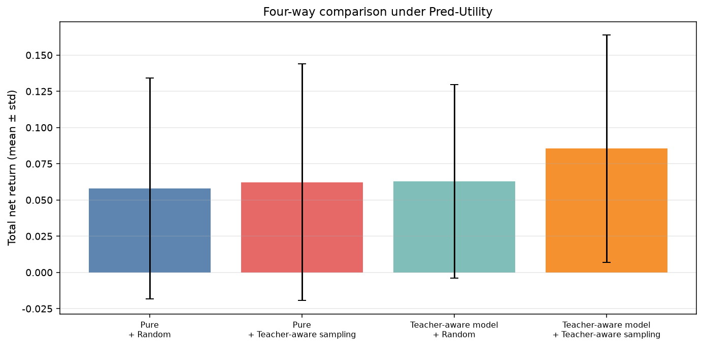

| model | sampling | G=8 | G=32 | G=64 |
| --- | --- | ---: | ---: | ---: |
| pure | random | 0.085 | 0.075 | 0.022 |
| **pure** | **teacher_aware** | **0.112** | 0.048 | 0.048 |
| teacher_aware | random | 0.093 | 0.058 | 0.031 |
| teacher_aware | teacher_aware | 0.077 | 0.065 | 0.070 |

重训 Mean@G32 常 ≈0/负。**实务最优仍是 Exp2（Pure+TA+小 G）**。

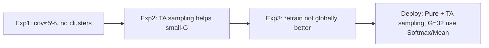
```mermaid
flowchart LR
  E1["Exp1: cov≈5%, no clusters"] --> E2["Exp2: TA sampling helps small-G"]
  E2 --> E3["Exp3: retrain not globally better"]
  E3 --> Rec["Deploy: Pure + TA sampling; G=32 use Softmax/Mean"]
```

---

## 4. SS-FM vs 生成模型（含近两日单点）→ **支撑 C1, C5, C6**

### 4.1 CSI：Pure SS-FM G=32 vs 默认生成族

| rank | model | total | Sharpe |
| --- | --- | ---: | ---: |
| 1 | **SS-FM G=32** | **0.608** | **2.30** |
| 2 | FM (default) | 0.490 | 2.15 |
| 3 | Gaussian (default) | 0.405 | 1.70 |
| 4 | MLP (default) | 0.366 | 1.85 |
| 5 | Diffusion (default) | 0.319 | 1.10 |

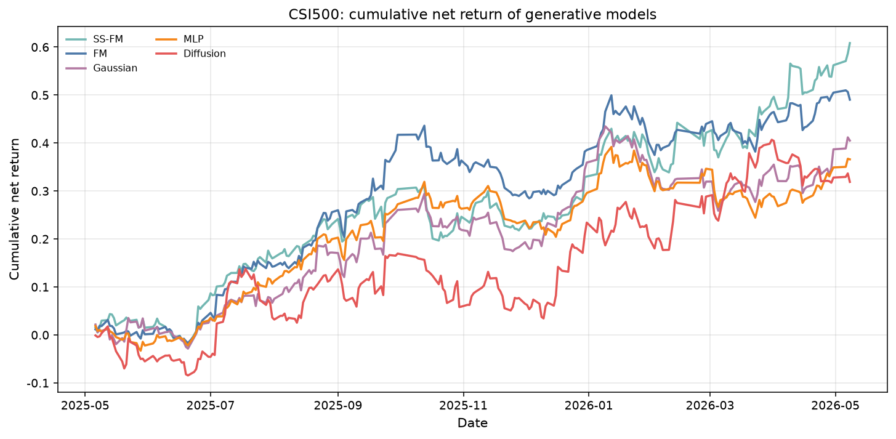

默认 G 下 SS-FM≈0.37 **弱于** FM(0.49)；**G=32 后跃至 0.61** → 优势来自候选规模+选仓。

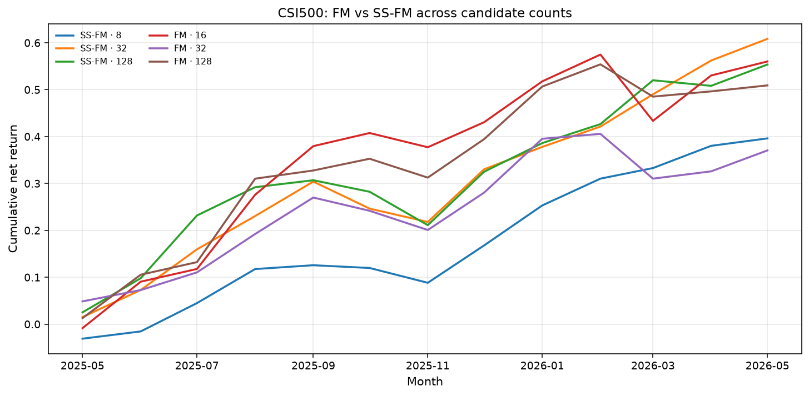

### 4.2 CSI：G=32 Meta Pred-Utility（近两日）— Meta 可伤害 SS-FM

| rank | model | total | Sharpe |
| --- | --- | ---: | ---: |
| 1 | Diffusion Meta | **0.870** | 1.83 |
| 2 | Gaussian Meta | 0.322 | 1.01 |
| 3 | FM Meta | 0.265 | 0.80 |
| 4 | SS-FM Meta | **0.186** | 0.52 |
| 5 | MLP Meta | 0.091 | 0.29 |

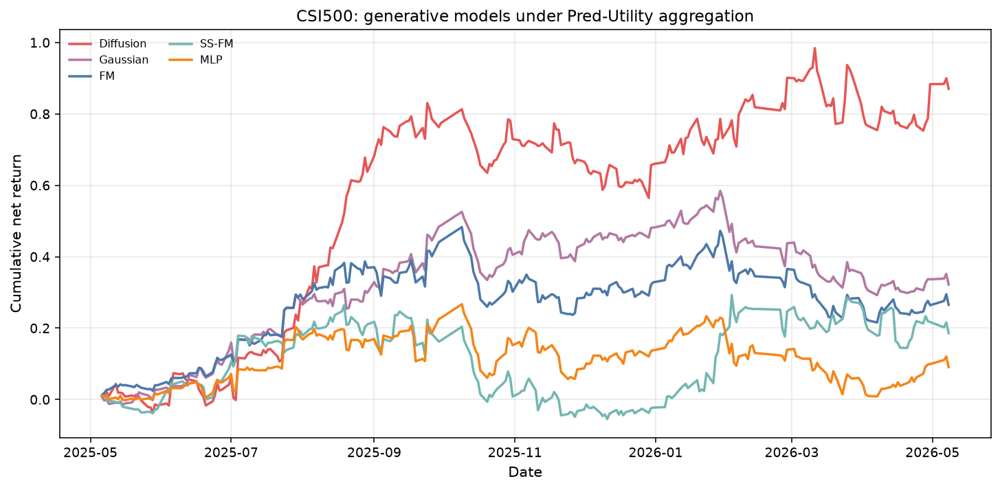

同设定下 SS-FM Meta vs 默认生成族：**Meta 垫底（0.19）**，默认 FM/Gauss/MLP/Diff 均更高：

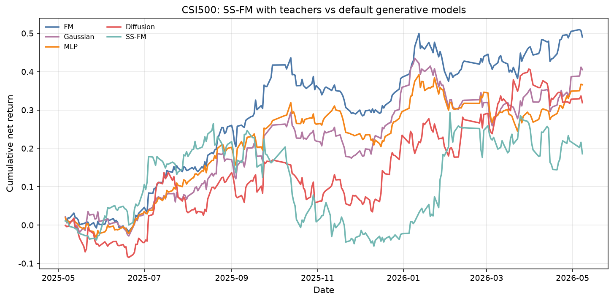

→ **C3**：勿把「加 Teacher」当成单调改进。

### 4.3 Softmax Meta G=32：双市场主榜（近两日）

**CSI**（五家挤在一起，Diff 断层消失）：

| model | total | Sharpe |
| --- | ---: | ---: |
| Diffusion | 0.554 | 2.52 |
| FM | 0.534 | 2.57 |
| **SS-FM** | **0.488** | **2.33** |
| MLP | 0.462 | 2.20 |
| Gaussian | 0.453 | 2.27 |

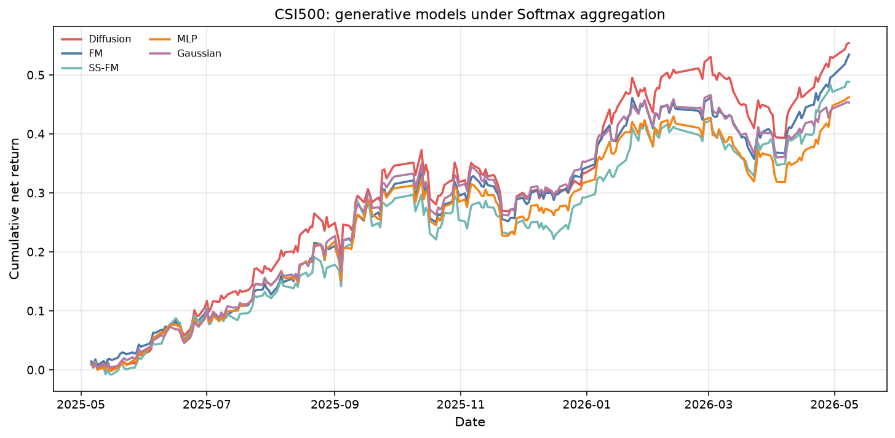

**SP**（仅 SS-FM 明显为正）：

| model | total | Sharpe |
| --- | ---: | ---: |
| **SS-FM** | **0.075** | **0.64** |
| FM | −0.005 | −0.04 |
| MLP | −0.016 | −0.14 |
| Gaussian | −0.024 | −0.22 |
| Diffusion | −0.046 | −0.41 |

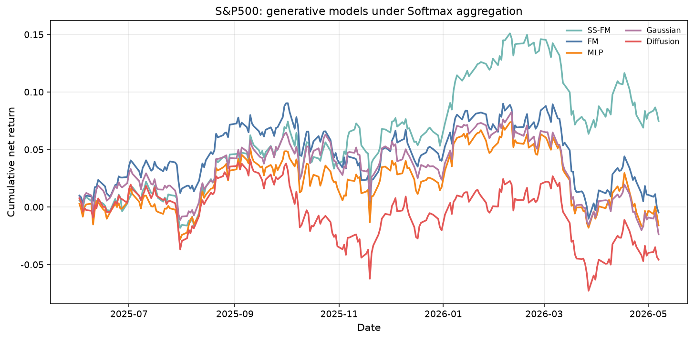

→ **C5–C6**：主指标用 Softmax；绝对水平 CSI≫SP；族内排序翻转。

### 4.4 口径提示（点估计噪声）

独立 `g32_gens` 复跑中 SS-FM 可为 0.24（同表 Diff=1.01）；正本 Pure G=32=0.61。**以稳定性均值（§5）与 Softmax 主榜为准**，单次 Pred-Utility 点估计仅作辅证。

---

## 5. 多 seed 稳定性（近两日核心新增）→ **支撑 C5–C7**

设定：冻结 ckpt；G∈{8,32,64,128}；seed∈{1…20}；同 (日,G,seed) 共享候选池；报 across-seed **mean±std**。

### 5.1 CSI Meta Pred-Utility

| G | Diffusion | SS-FM | FM |
| --- | ---: | ---: | ---: |
| 8 | 0.404±0.233 | 0.367±0.175 | 0.177±0.072 |
| 32 | 0.732±0.290 | 0.412±0.183 | 0.257±0.103 |
| 64 | 0.750±0.280 | 0.466±0.199 | 0.319±0.119 |
| 128 | **0.883±0.228** | 0.488±0.146 | 0.374±0.113 |

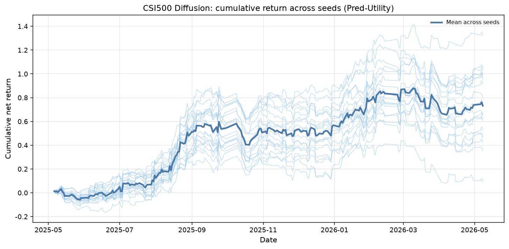

### 5.2 CSI 无 Teacher（本轮新跑）

**Pred-Utility**

| G | Diffusion | FM | SS-FM |
| --- | ---: | ---: | ---: |
| 8 | 0.573±0.221 | 0.507±0.096 | 0.475±0.155 |
| 32 | 0.793±0.298 | 0.545±0.083 | 0.416±0.155 |
| 64 | 0.829±0.269 | 0.592±0.107 | 0.548±0.186 |
| 128 | **0.902±0.256** | 0.608±0.130 | 0.563±0.143 |

**Mean**（三家收敛、方差小）

| G | Diffusion | FM | SS-FM |
| --- | ---: | ---: | ---: |
| 8 | 0.533±0.083 | 0.522±0.030 | 0.523±0.068 |
| 32 | 0.537±0.038 | 0.526±0.012 | 0.510±0.029 |
| 64 | 0.545±0.029 | 0.530±0.009 | 0.513±0.022 |
| 128 | 0.553±0.024 | 0.527±0.007 | 0.512±0.015 |

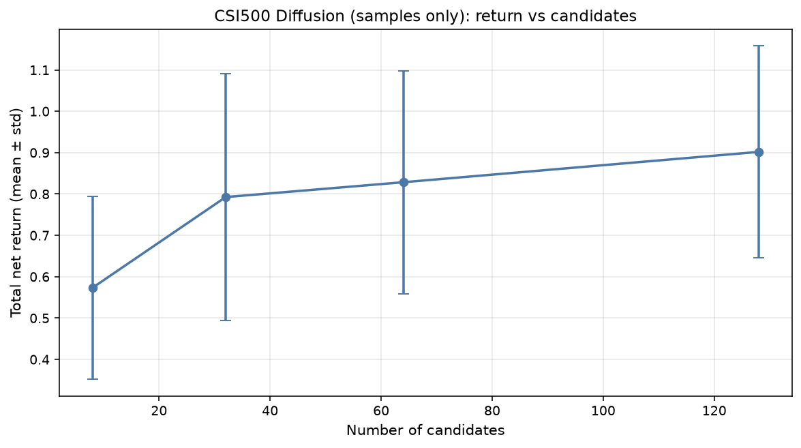

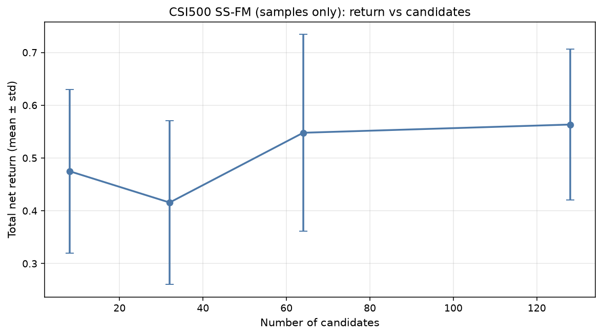

**稳定性结论（C7）**

1. 无 Teacher 时 Diff@G128 Pred-Util ≈**0.90**，与 Meta ≈**0.88** 接近 → **Diff 优势主要来自样本多样性+选仓，不是 Teacher**。  
2. SS-FM Pred-Util 在 G=32 无 Teacher 回落（≈0.42），G≥64 再升；**Mean 全程稳在 ≈0.51**。  
3. Mean/Softmax 抹平族间差异 → 与 Softmax 单点主榜一致。

### 5.3 SP Meta Pred-Utility（20 seeds）

| G | SS-FM | FM | Diffusion |
| --- | ---: | ---: | ---: |
| 8 | **0.085±0.063** | 0.080±0.039 | −0.024±0.113 |
| 32 | 0.075±0.070 | **0.084±0.066** | −0.088±0.115 |
| 64 | 0.022±0.064 | 0.078±0.049 | −0.107±0.079 |
| 128 | 0.015±0.074 | 0.065±0.064 | **−0.172±0.075** |

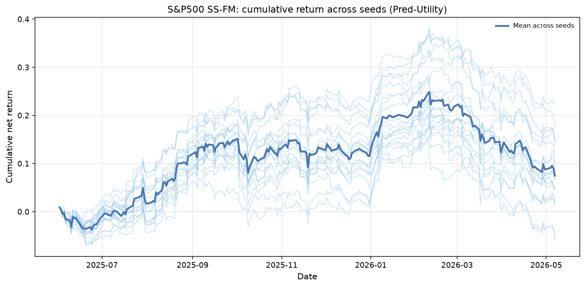

→ SP：**G↑ + Pred-Utility 对 Diff 有害**；SS-FM 宜小 G；与 CSI 符号相反（**C6**）。

---

## 6. SS-FM vs Teacher → **支撑 C1, C3**

### 6.1 CSI Pure SS-FM G=32

| model | total | Sharpe | MDD | turnover |
| --- | ---: | ---: | ---: | ---: |
| **SS-FM G=32** | **0.608** | 2.30 | **0.109** | 0.649 |
| RiskParity | 0.459 | **2.39** | 0.129 | **0.055** |
| MaxSharpe | 0.369 | 1.19 | 0.220 | 0.917 |
| MVO | 0.326 | 0.87 | 0.311 | 0.935 |

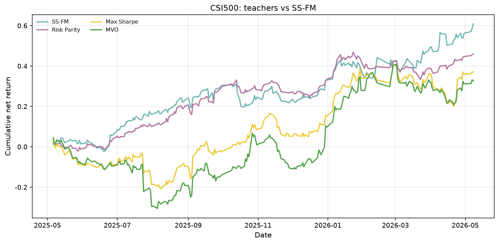

收益：SS-FM > RP > MS ≈ MVO；RP 换手/Sharpe 更稳。CSI Meta 点估计：MVO 0.55 / RP 0.53 / MS 0.20；SS-FM Meta 0.19（再次印证 Meta Pred-Util 伤害 SS-FM）。

### 6.2 SP G=32 Meta Pred-Utility（单点）

| model | total | Sharpe | turnover |
| --- | ---: | ---: | ---: |
| MVO | **0.245** | **1.44** | 0.940 |
| SS-FM Meta | 0.179 | 1.10 | 0.768 |
| MaxSharpe | 0.169 | 1.13 | 0.934 |
| FM Meta | 0.144 | 1.07 | 0.679 |
| Risk Parity | −0.025 | −0.23 | 0.065 |

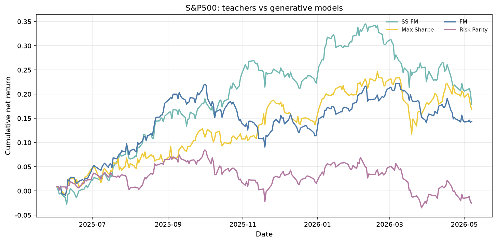

薄机会下闭式 MVO 可赢 Meta Pred-Util 单点；**不等于** Softmax 下生成器无用（§4.3 SS-FM 仍第一）。

---

## 7. SS-FM vs RL → **支撑 C8**

### 7.1 CSI：Pure G=32 → PPO / GRPO

| model | total | Sharpe | turnover |
| --- | ---: | ---: | ---: |
| Pure SS-FM G=32 | 0.608 | 2.30 | 0.649 |
| GRPO (init) | 0.678 | 2.36 | 0.274 |
| GRPO | 0.717 | 2.45 | 0.263 |
| PPO (cand) | 0.887 | 2.14 | 0.214 |
| **PPO** | **1.051** | **2.81** | **0.260** |

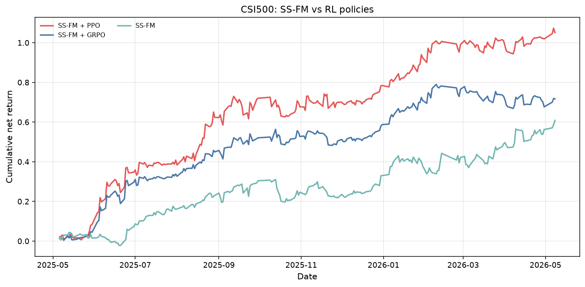

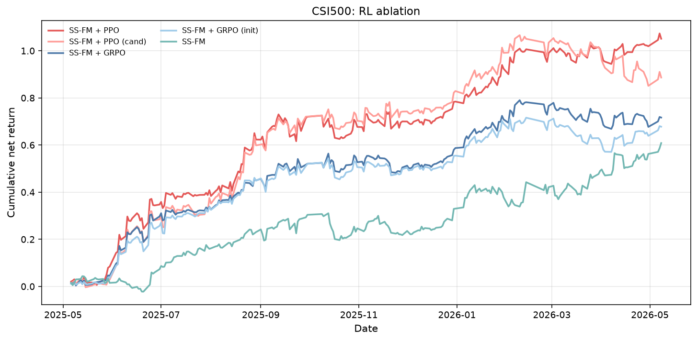

PPO 单利约 **+73%**，换手降至 ≈0.26；消融均优于 Pure。

### 7.2 SP：Meta vs cand-PPO / GRPO + r06 三 seed

| model | 单点 total | r06 mean±std | 夺冠 |
| --- | ---: | ---: | ---: |
| SS-FM Meta | 0.179 | 0.006±0.068 | 0/3 |
| GRPO (init) | 0.050 | 0.052±0.028 | 0/3 |
| **PPO (cand)** | **0.247** | **0.179±0.035** | **3/3** |

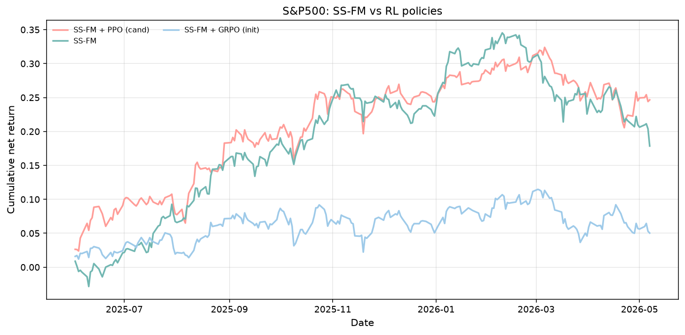

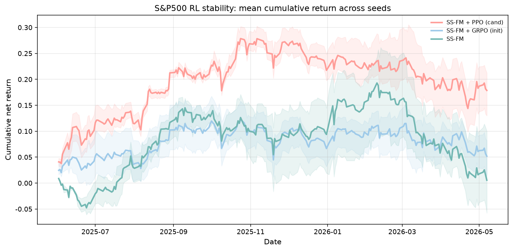

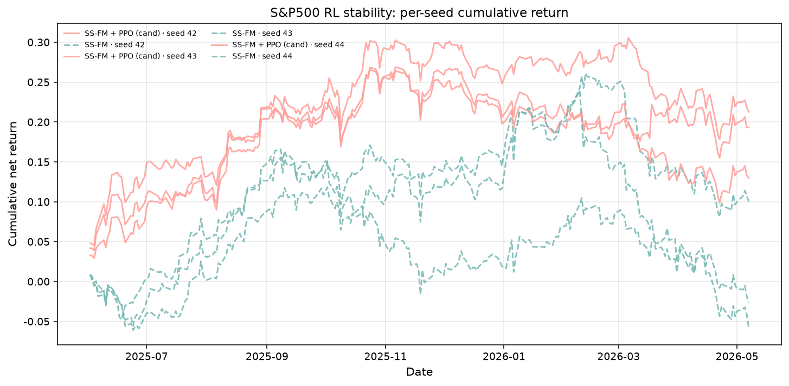

Meta seed 方差极大；**cand-PPO 均值更高、方差更小、换手≈1/4**。

**RL 角色**：SS-FM 提供候选/特征；PPO 学低换手策略。CSI=收益增益；SP=稳健性增益。

> CSI Diff+PPO/GRPO 全年对照未完成（约止于 2025-05/06 缓存），不纳入结论。

---

## 8. 跨市场综合机制

| 现象 | CSI500 | SP500 |
| --- | --- | --- |
| Softmax Meta 水平 | ≈0.45–0.55 全正 | ≈0 / 略负（SS-FM≈0.07） |
| Pure SS-FM G=32 | **0.61** 强 | Meta Pred-Util 噪声大 |
| vs Teacher | 收益 SS-FM>RP | MVO Meta 可>SS-FM Meta |
| vs 生成族 Softmax | 中游 | **第一** |
| Diff Pred-Util | G↑ → 升至 ~0.88–0.90 | G↑ → **恶化至负** |
| Meta 对 SS-FM | Pred-Util **伤害**；Softmax 恢复 | Softmax 仍最优生成器 |
| RL | PPO→**1.05** | PPO 稳赢 Meta |
| Teacher geometry | （主诊断在 SP） | cov≈5%，无三簇 |

**五条机制（对应 C1–C8）**

1. **可预测厚度** → 绝对收益量级（CSI 厚、SP 薄）。  
2. **生成先验** → 族内排序（CSI Diff 可挑；SP Diff 差）。  
3. **聚合器** → Pred-Utility 放大极端；Softmax/Mean 稳健。  
4. **Teacher 交叉** → 几何未对齐；sampling 小 G 有效；盲目 Meta Pred-Util 可伤 SS-FM。  
5. **RL** → 降换手；CSI 抬收益、SP 抬稳健。

---

## 9. 论文结构映射

| 论文小节 | 本报告 | 主图 |
| --- | --- | --- |
| Setup | §1 | — |
| Diversity & teacher geometry | §2–3.1 | coverage / diversity / CLR–PCA |
| Teacher-aware interventions | §3 | Exp2 Pred-Util；Exp3 four-way |
| Generative baselines + Softmax | §4 | Pure G32；双市场 Softmax |
| Multi-seed stability | §5 | Meta / no-Teacher mean±std 图 |
| vs Teachers | §6 | Teacher 累计曲线 |
| RL | §7 | CSI RL；SP r06 |
| Discussion / Conclusion | **完整结论 C1–C8** + §8 | 机制表 |

---

## 10. 局限与后续

**局限**

- CSI 未完整复刻 Exp1–3；coverage 结论以 SP 为主。  
- Pred-Utility 点估计种子敏感；主指标应用 Softmax/Mean 或多 seed。  
- Exp3 训练预算有限（200 steps/月）。  
- CSI Diff+RL 未完成。

**建议后续**

1. 标准化主榜：G=32 Softmax/Mean + Pred-Util 上界表。  
2. SP Diff：查 \(u(w)\) 与实现效用的 rank IC。  
3. 完成 CSI Diff+RL；可选 CSI Teacher Exp1–3。  
4. 论文写作严格区分 Pure / Meta Pred-Util / Softmax Meta。

---

## 11. 数据索引

| 主题 | 路径 |
| --- | --- |
| 英文论文图（本报告引用） | `paper_figures_en/` |
| 近两日汇总（本报告已并入） | `近两日实验汇总报告.md` |
| Meta 稳定性总表 | `CSI500_SP500_生成模型Meta稳定性汇总.md` |
| CSI 无 Teacher 稳定性 | `CSI500/CSI500_*_stability实验报告.md` |
| CSI Softmax / Pure / Meta | `CSI500/CSI500_G32_*`；`CSI500_SSFM_G32_*` |
| SP Softmax | `S&P500/SP500_G32_Meta_Softmax_生成模型对比.md` |
| Exp1–3 s50 | `S&P500/strict_fixed_oos_top30_ssfm_teacher_exps_s50/` |
| SP RL r06 | `S&P500/SP500_top30_rl_r06_stability实验报告.md` |
| 组合多样性 | `full_universe/analysis/生成组合多样性.md` |

---

*数值口径：单利 Σ。图表来自各 `analysis/figures`。完整结论以文首 **C1–C8** 为准。*
