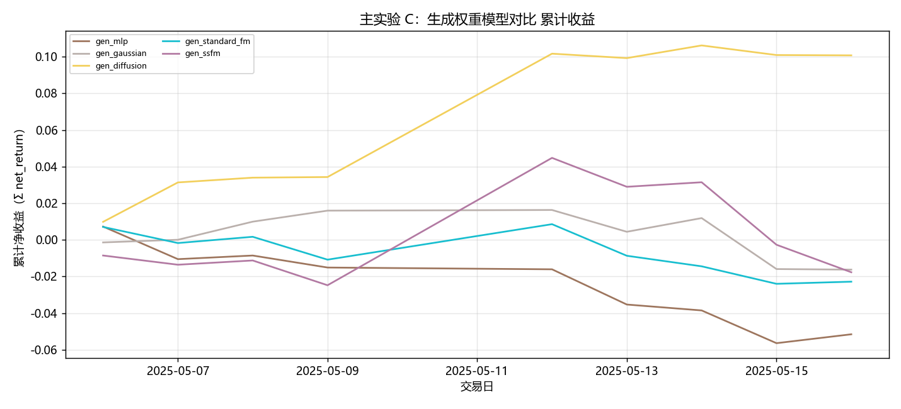

# 主实验 C：生成权重模型对比

- 状态: **进行中（1/13 月有数据）**
- 编号: `M03_generative`
- 类型: 主实验
- 说明: MLP / Gaussian / Diffusion / Standard FM / SS-FM 在 simplex 上生成候选权重。
- 缺测一律 `-`。曲线颜色见下表，中途不改色。

## 固定颜色

| 模型 | 颜色 |
| --- | --- |
| gen_mlp | #9D755D |
| gen_gaussian | #BAB0AC |
| gen_diffusion | #F2CF5B |
| gen_standard_fm | #17BECF |
| gen_ssfm | #B279A2 |

## 实验设定

- Walk-forward 测试月 2025-05 … 2026-05（2026-05 分钟数据只到 05-08）。
- TopK=30，cost_bps=3.0，primary=`gated_residual`。
- Sequential OOS：周五收盘重训，下周一生效。

## 13 个月进度

| month | status | n_pred_models_val | n_nav_models | leakage_audit |
| --- | --- | --- | --- | --- |
| 2025-05 | 已写入 | - | 5 | - |
| 2025-06 | - | - | - | - |
| 2025-07 | - | - | - | - |
| 2025-08 | - | - | - | - |
| 2025-09 | - | - | - | - |
| 2025-10 | - | - | - | - |
| 2025-11 | - | - | - | - |
| 2025-12 | - | - | - | - |
| 2026-01 | - | - | - | - |
| 2026-02 | - | - | - | - |
| 2026-03 | - | - | - | - |
| 2026-04 | - | - | - | - |
| 2026-05 | - | - | - | - |

## Validation BEST（按模型 Val MSE）

| model | MSE | MAE | IC | RankIC | topk_f1 | topk_precision | topk_recall | dir_acc | dir_f1 | dir_precision | dir_recall | top30_hit_rate | n |
| --- | --- | --- | --- | --- | --- | --- | --- | --- | --- | --- | --- | --- | --- |
| lstm | 0.000316 | 0.012497 | 0.063892 | 0.088574 | 0.045614 | 0.045614 | 0.045614 | 0.537139 | 0.274927 | 0.446150 | 0.222375 | 0.456140 | 19 |
| tcn | 0.000745 | 0.019256 | 0.014326 | -0.002244 | 0.134921 | 0.134921 | 0.134921 | 0.476777 | 0.014592 | 0.577381 | 0.003964 | 0.501587 | 21 |
| standard_transformer | 0.000680 | 0.017781 | 0.010090 | 0.009059 | 0.076190 | 0.076190 | 0.076190 | 0.485647 | 0.107089 | 0.583617 | 0.066213 | 0.526984 | 21 |
| patchtst | 0.000700 | 0.018135 | -0.005460 | -0.013853 | 0.061905 | 0.061905 | 0.061905 | 0.478033 | 0.016105 | 0.657576 | 0.003119 | 0.493651 | 21 |
| minute_only | 0.000680 | 0.017781 | 0.010090 | 0.009059 | 0.076190 | 0.076190 | 0.076190 | 0.485647 | 0.107089 | 0.583617 | 0.066213 | 0.526984 | 21 |
| concat | 0.000668 | 0.017356 | 0.021868 | 0.018742 | 0.092063 | 0.092063 | 0.092063 | 0.476470 | 0.022587 | 0.583941 | 0.009746 | 0.519048 | 21 |
| cross_attention | 0.000680 | 0.017730 | 0.027373 | -0.000337 | 0.120635 | 0.120635 | 0.120635 | 0.483799 | 0.195859 | 0.510568 | 0.136834 | 0.536508 | 21 |
| gated_residual | 0.000651 | 0.017177 | 0.000548 | -0.011180 | 0.114286 | 0.114286 | 0.114286 | 0.494875 | 0.508914 | 0.501673 | 0.579217 | 0.503175 | 21 |

## Validation BEST（分月，只列已有实验）

| month | model | MSE | MAE | IC | RankIC | topk_f1 | topk_precision | topk_recall | dir_acc | dir_f1 | dir_precision | dir_recall | top30_hit_rate | n |
| --- | --- | --- | --- | --- | --- | --- | --- | --- | --- | --- | --- | --- | --- | --- |
| 2025-05 | lstm | 0.000651 | 0.017021 | 0.032957 | 0.031855 | 0.080952 | 0.080952 | 0.080952 | 0.494012 | 0.313172 | 0.526624 | 0.260454 | 0.555556 | 21 |
| 2025-05 | tcn | 0.000745 | 0.019256 | 0.014326 | -0.002244 | 0.134921 | 0.134921 | 0.134921 | 0.476777 | 0.014592 | 0.577381 | 0.003964 | 0.501587 | 21 |
| 2025-05 | standard_transformer | 0.000680 | 0.017781 | 0.010090 | 0.009059 | 0.076190 | 0.076190 | 0.076190 | 0.485647 | 0.107089 | 0.583617 | 0.066213 | 0.526984 | 21 |
| 2025-05 | patchtst | 0.000700 | 0.018135 | -0.005460 | -0.013853 | 0.061905 | 0.061905 | 0.061905 | 0.478033 | 0.016105 | 0.657576 | 0.003119 | 0.493651 | 21 |
| 2025-05 | minute_only | 0.000680 | 0.017781 | 0.010090 | 0.009059 | 0.076190 | 0.076190 | 0.076190 | 0.485647 | 0.107089 | 0.583617 | 0.066213 | 0.526984 | 21 |
| 2025-05 | concat | 0.000668 | 0.017356 | 0.021868 | 0.018742 | 0.092063 | 0.092063 | 0.092063 | 0.476470 | 0.022587 | 0.583941 | 0.009746 | 0.519048 | 21 |
| 2025-05 | cross_attention | 0.000680 | 0.017730 | 0.027373 | -0.000337 | 0.120635 | 0.120635 | 0.120635 | 0.483799 | 0.195859 | 0.510568 | 0.136834 | 0.536508 | 21 |
| 2025-05 | gated_residual | 0.000651 | 0.017177 | 0.000548 | -0.011180 | 0.114286 | 0.114286 | 0.114286 | 0.494875 | 0.508914 | 0.501673 | 0.579217 | 0.503175 | 21 |
| 2025-06 | lstm | 0.083267 | 0.287868 | -0.034177 | -0.053056 | 0.105263 | 0.105263 | 0.105263 | 0.536441 | - | - | 0.000000 | 0.435088 | 19 |
| 2025-06 | tcn | 0.495676 | 0.696107 | -0.000402 | -0.036104 | 0.092982 | 0.092982 | 0.092982 | 0.464654 | 0.588750 | 0.447568 | 0.996862 | 0.438596 | 19 |
| 2025-06 | standard_transformer | 0.133345 | 0.300767 | -0.037475 | -0.066031 | 0.096491 | 0.096491 | 0.096491 | 0.488098 | 0.478227 | 0.453037 | 0.578131 | 0.426316 | 19 |

## 组合绩效（已完成月份拼接）

| model | total_net_return | ann_return | sharpe | max_drawdown | mean_turnover | mean_cost | n_days |
| --- | --- | --- | --- | --- | --- | --- | --- |
| gen_mlp | -0.0502 | -0.7637 | -9.3782 | 0.0617 | 0.4369 | 0.0001 | 9 |
| gen_gaussian | -0.0161 | -0.3652 | -2.6134 | 0.0320 | 0.7108 | 0.0002 | 9 |
| gen_diffusion | 0.1060 | 15.7900 | 8.3706 | 0.0054 | 0.6100 | 0.0002 | 9 |
| gen_standard_fm | -0.0225 | -0.4720 | -3.7510 | 0.0320 | 0.5234 | 0.0002 | 9 |
| gen_ssfm | -0.0175 | -0.3902 | -1.1395 | 0.0605 | 0.8537 | 0.0003 | 9 |

## 图（颜色已固定，无数据时只画轴）

### 累计收益

固定颜色: `gen_mlp` `#9D755D`；`gen_gaussian` `#BAB0AC`；`gen_diffusion` `#F2CF5B`；`gen_standard_fm` `#17BECF`；`gen_ssfm` `#B279A2`。

## 分析

以下只讨论**已经写入数字**的行；单元格为 `-` 的表示该实验尚未跑完，不编造。
来源: aggregated disk。OOS=`sequential_oos_weekly_retrain`，费用=3.0bps，TopK=30。

最近完成单元: `D-backtest-grpo-top30`。
已有数据的对象: `2025-05`。
- Val IC 目前最高: `lstm` = 0.0639。
- Val F1@Top30 目前最高: `tcn` = 0.1349（随机约 0.06）。
- Val MSE 目前最低（入选口径）: `lstm` = 0.000316。
- 已回测净值目前最高: `gen_diffusion_top30` 累计净收益 0.1110，Sharpe 4.9904。
