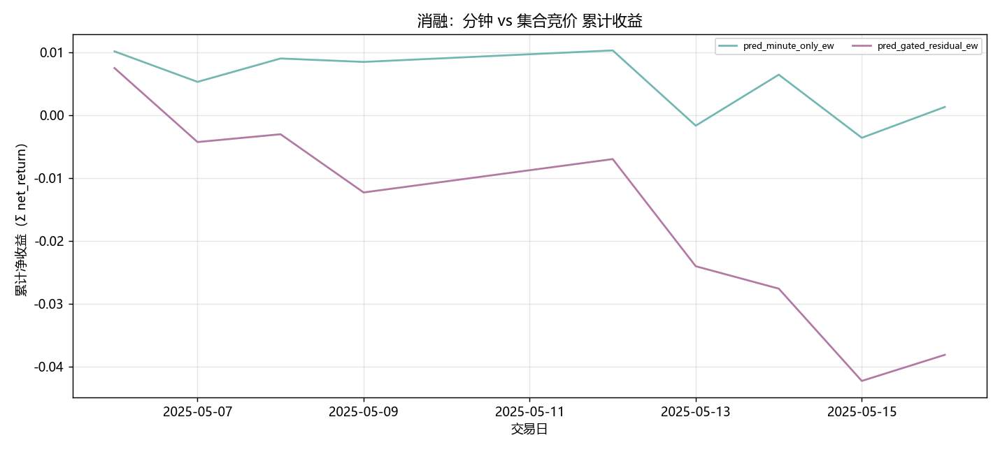
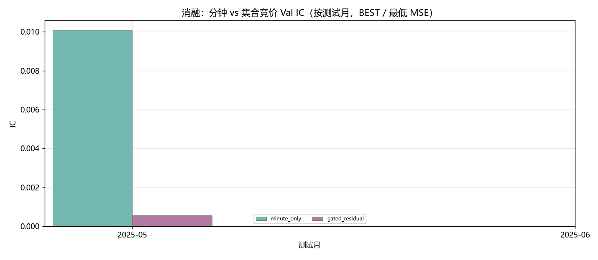
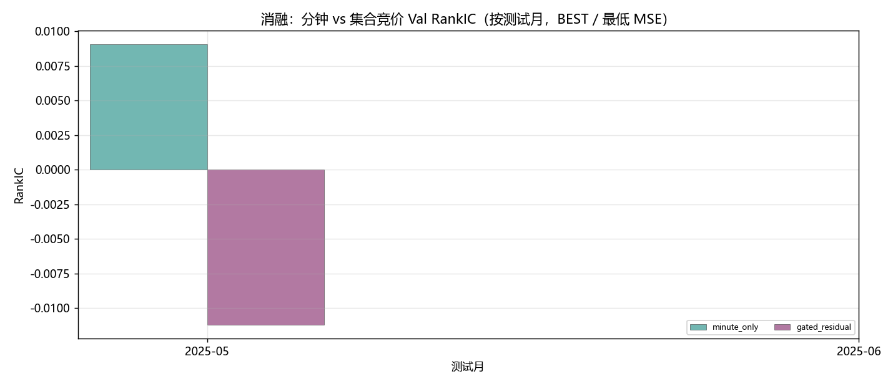
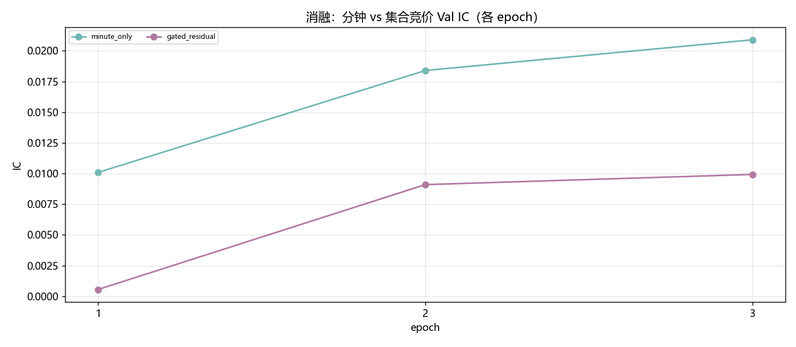
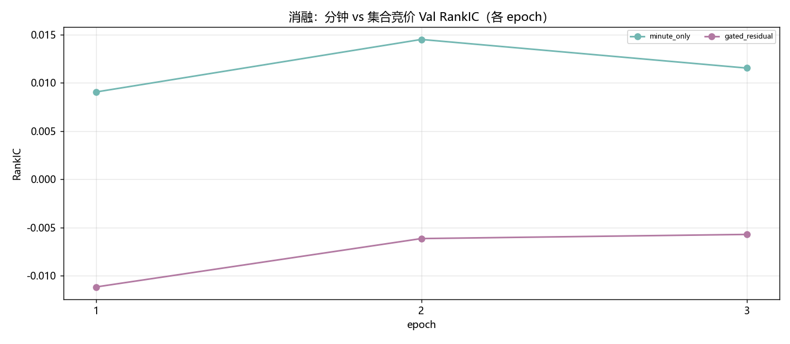
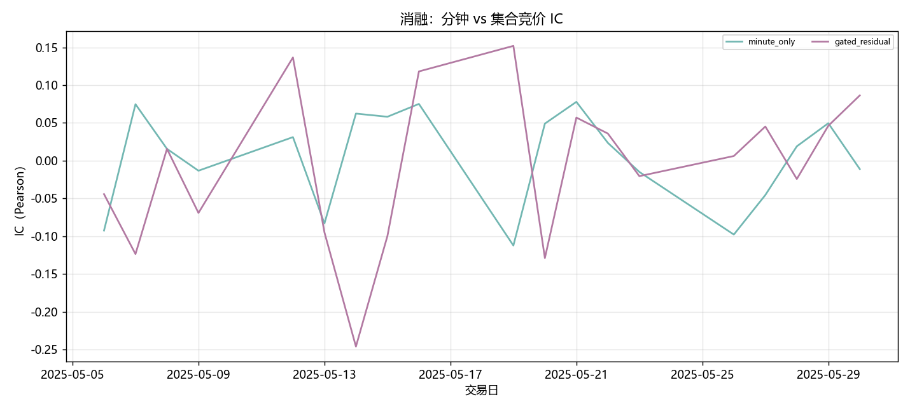
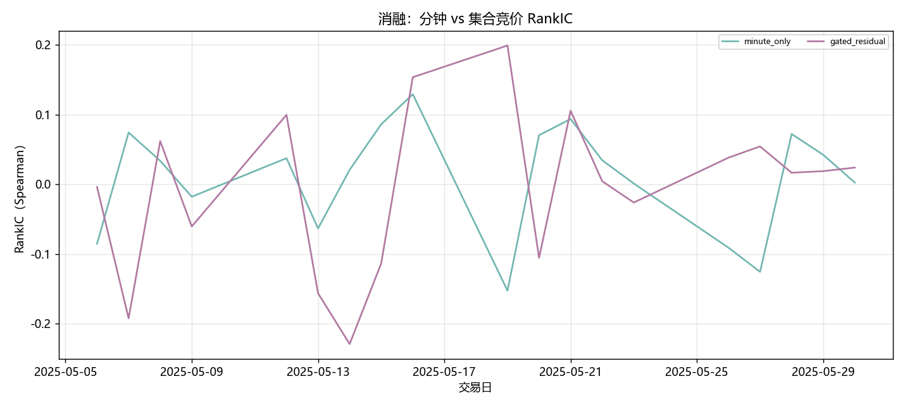
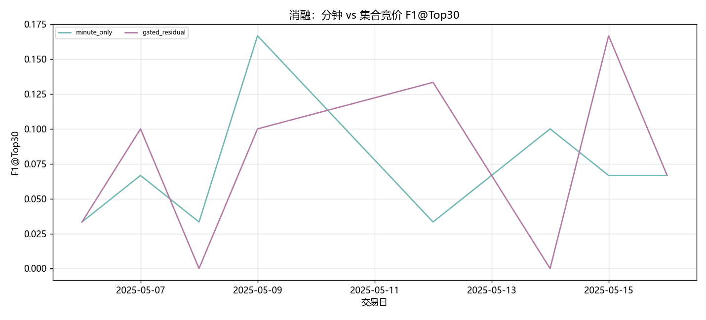
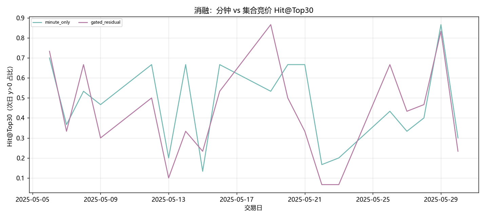

# 消融：分钟 vs 集合竞价

- 状态: **进行中（1/13 月有数据）**
- 编号: `X02_minute_vs_auction`
- 类型: 消融/系统
- 说明: 有无 A_D 竞价增量信息。
- 缺测一律 `-`。曲线颜色见下表，中途不改色。

## 固定颜色

| 模型 | 颜色 |
| --- | --- |
| minute_only | #72B7B2 |
| gated_residual | #B279A2 |

## 实验设定

- Walk-forward 测试月 2025-05 … 2026-05（2026-05 分钟数据只到 05-08）。
- TopK=30，cost_bps=3.0，primary=`gated_residual`。
- Sequential OOS：周五收盘重训，下周一生效。

## 13 个月进度

| month | status | n_pred_models_val | n_nav_models | leakage_audit |
| --- | --- | --- | --- | --- |
| 2025-05 | 已写入 | 2 | 2 | - |
| 2025-06 | - | 0.0000 | - | - |
| 2025-07 | - | - | - | - |
| 2025-08 | - | - | - | - |
| 2025-09 | - | - | - | - |
| 2025-10 | - | - | - | - |
| 2025-11 | - | - | - | - |
| 2025-12 | - | - | - | - |
| 2026-01 | - | - | - | - |
| 2026-02 | - | - | - | - |
| 2026-03 | - | - | - | - |
| 2026-04 | - | - | - | - |
| 2026-05 | - | - | - | - |

## Validation BEST（按模型 Val MSE）

| model | MSE | MAE | IC | RankIC | topk_f1 | topk_precision | topk_recall | dir_acc | dir_f1 | dir_precision | dir_recall | top30_hit_rate | n |
| --- | --- | --- | --- | --- | --- | --- | --- | --- | --- | --- | --- | --- | --- |
| minute_only | 0.000680 | 0.017781 | 0.010090 | 0.009059 | 0.076190 | 0.076190 | 0.076190 | 0.485647 | 0.107089 | 0.583617 | 0.066213 | 0.526984 | 21 |
| gated_residual | 0.000651 | 0.017177 | 0.000548 | -0.011180 | 0.114286 | 0.114286 | 0.114286 | 0.494875 | 0.508914 | 0.501673 | 0.579217 | 0.503175 | 21 |

## Validation BEST（分月，只列已有实验）

| month | model | MSE | MAE | IC | RankIC | topk_f1 | topk_precision | topk_recall | dir_acc | dir_f1 | dir_precision | dir_recall | top30_hit_rate | n |
| --- | --- | --- | --- | --- | --- | --- | --- | --- | --- | --- | --- | --- | --- | --- |
| 2025-05 | minute_only | 0.000680 | 0.017781 | 0.010090 | 0.009059 | 0.076190 | 0.076190 | 0.076190 | 0.485647 | 0.107089 | 0.583617 | 0.066213 | 0.526984 | 21 |
| 2025-05 | gated_residual | 0.000651 | 0.017177 | 0.000548 | -0.011180 | 0.114286 | 0.114286 | 0.114286 | 0.494875 | 0.508914 | 0.501673 | 0.579217 | 0.503175 | 21 |

## Test 预测指标（已完成月份的日均）

| model | MSE | MAE | IC | RankIC | topk_f1 | topk_precision | topk_recall | dir_acc | dir_f1 | dir_precision | dir_recall | top30_hit_rate | top30_excess | n |
| --- | --- | --- | --- | --- | --- | --- | --- | --- | --- | --- | --- | --- | --- | --- |
| minute_only | 0.000317 | 0.012644 | 0.003673 | 0.008710 | 0.070370 | 0.070370 | 0.070370 | 0.540029 | 0.161871 | 0.488291 | 0.099625 | 0.466667 | 0.000435 | 19 |
| gated_residual | 0.000306 | 0.012243 | -0.002386 | 0.002724 | 0.074074 | 0.074074 | 0.074074 | 0.544453 | 0.437689 | 0.365940 | 0.297848 | 0.418056 | -0.000720 | 19 |

## 组合绩效（已完成月份拼接）

| model | total_net_return | ann_return | sharpe | max_drawdown | mean_turnover | mean_cost | n_days |
| --- | --- | --- | --- | --- | --- | --- | --- |
| pred_minute_only_ew | 0.0013 | 0.0378 | 0.3202 | 0.0138 | 0.0556 | 0.0000 | 9 |
| pred_gated_residual_ew | -0.0374 | -0.6561 | -7.7049 | 0.0486 | 0.0556 | 0.0000 | 9 |

## 图（颜色已固定，无数据时只画轴）

### 累计收益

固定颜色: `pred_minute_only_ew` `#72B7B2`；`pred_gated_residual_ew` `#B279A2`。

### Val IC

固定颜色: `minute_only` `#72B7B2`；`gated_residual` `#B279A2`。

### Val RankIC

固定颜色: `minute_only` `#72B7B2`；`gated_residual` `#B279A2`。

### Val IC 各 epoch

固定颜色: `minute_only` `#72B7B2`；`gated_residual` `#B279A2`。

### Val RankIC 各 epoch

固定颜色: `minute_only` `#72B7B2`；`gated_residual` `#B279A2`。

### Test IC

固定颜色: `minute_only` `#72B7B2`；`gated_residual` `#B279A2`。

### Test RankIC

固定颜色: `minute_only` `#72B7B2`；`gated_residual` `#B279A2`。

### Test F1@Top30

固定颜色: `minute_only` `#72B7B2`；`gated_residual` `#B279A2`。

### Test Hit@Top30

固定颜色: `minute_only` `#72B7B2`；`gated_residual` `#B279A2`。

## 分析

以下只讨论**已经写入数字**的行；单元格为 `-` 的表示该实验尚未跑完，不编造。
来源: aggregated disk。OOS=`sequential_oos_weekly_retrain`，费用=3.0bps，TopK=30。

最近完成单元: `D-backtest-grpo-top30`。
已有数据的对象: `2025-05`。
- Val IC 目前最高: `minute_only` = 0.0101。
- Val F1@Top30 目前最高: `gated_residual` = 0.1143（随机约 0.06）。
- Val MSE 目前最低（入选口径）: `gated_residual` = 0.000651。
- Test 日均 IC 目前最高: `minute_only` = 0.0037。
- 已回测净值目前最高: `pred_minute_only_ew` 累计净收益 0.0013，Sharpe 0.3202。
