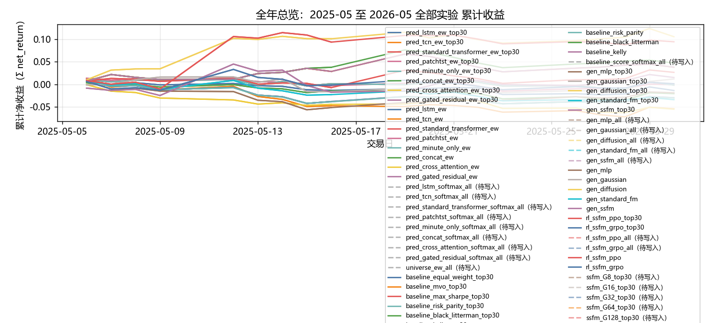
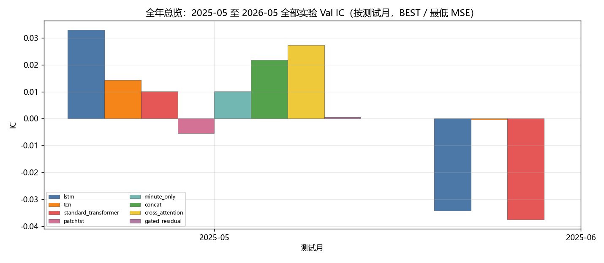
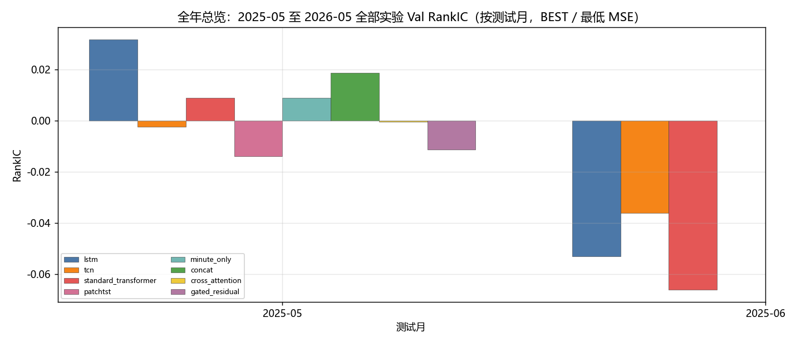
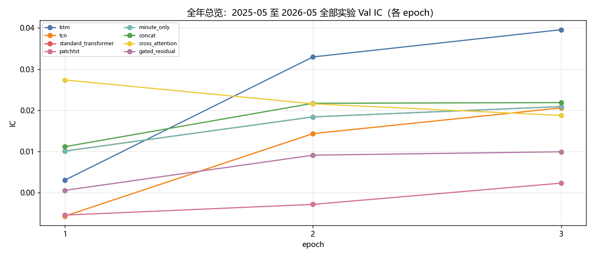
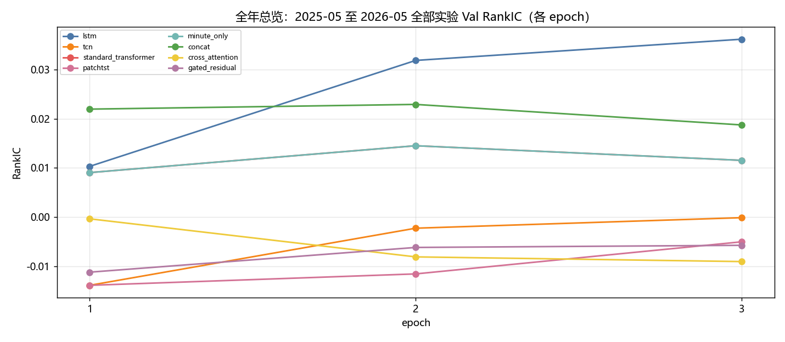
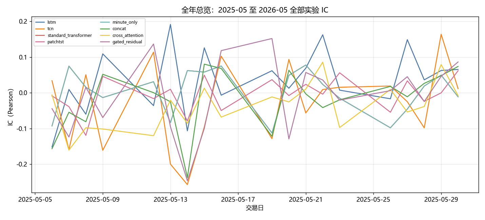
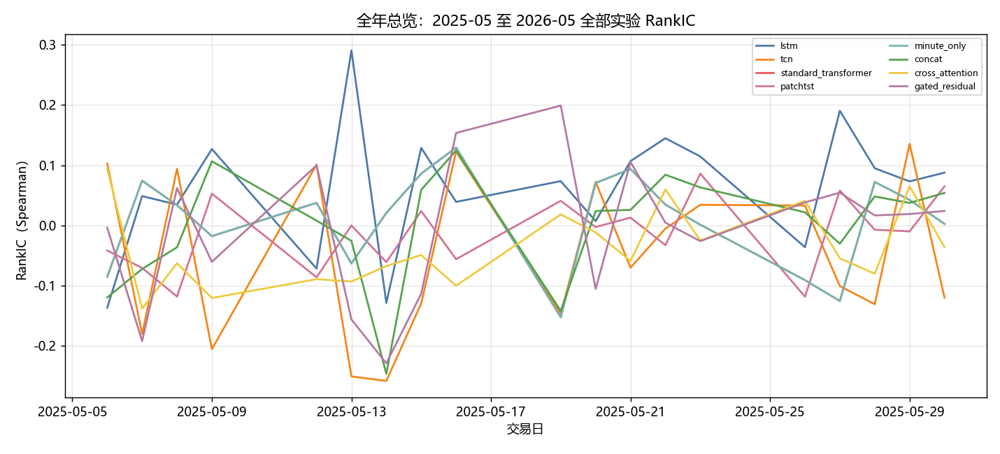
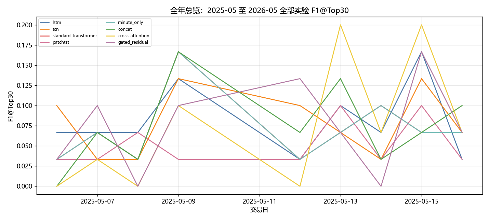
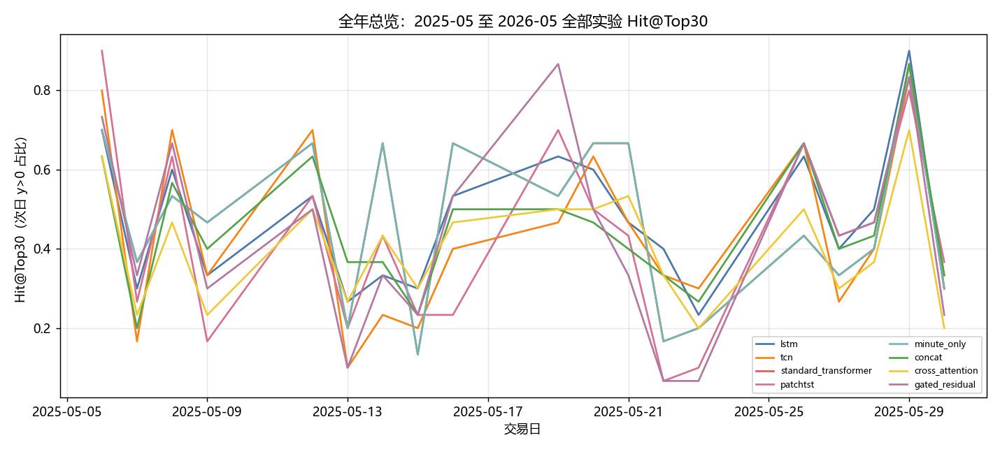

# 全年总览：2025-05 至 2026-05 全部实验

- 状态: **进行中（2/13 月有数据）**
- 编号: `全年总览`
- 类型: 全年总览
- 说明: 13 个测试月拼接后的全样本总分析：所有主实验 + 消融的指标表、图和结论。不是单月切片。
- 缺测一律 `-`。曲线颜色见下表，中途不改色。

## 固定颜色

| 模型 | 颜色 |
| --- | --- |
| pred_lstm_ew_top30 | #4C78A8 |
| pred_tcn_ew_top30 | #F58518 |
| pred_standard_transformer_ew_top30 | #E45756 |
| pred_patchtst_ew_top30 | #D37295 |
| pred_minute_only_ew_top30 | #72B7B2 |
| pred_concat_ew_top30 | #54A24B |
| pred_cross_attention_ew_top30 | #EECA3B |
| pred_gated_residual_ew_top30 | #B279A2 |
| pred_lstm_ew | #4C78A8 |
| pred_tcn_ew | #F58518 |
| pred_standard_transformer_ew | #E45756 |
| pred_patchtst_ew | #D37295 |
| pred_minute_only_ew | #72B7B2 |
| pred_concat_ew | #54A24B |
| pred_cross_attention_ew | #EECA3B |
| pred_gated_residual_ew | #B279A2 |
| pred_lstm_softmax_all | #7F7F7F |
| pred_tcn_softmax_all | #7F7F7F |
| pred_standard_transformer_softmax_all | #7F7F7F |
| pred_patchtst_softmax_all | #7F7F7F |
| pred_minute_only_softmax_all | #7F7F7F |
| pred_concat_softmax_all | #7F7F7F |
| pred_cross_attention_softmax_all | #7F7F7F |
| pred_gated_residual_softmax_all | #7F7F7F |
| universe_ew_all | #7F7F7F |
| baseline_equal_weight_top30 | #4C78A8 |
| baseline_mvo_top30 | #F58518 |
| baseline_max_sharpe_top30 | #E45756 |
| baseline_risk_parity_top30 | #72B7B2 |
| baseline_black_litterman_top30 | #54A24B |
| baseline_kelly_top30 | #B279A2 |
| baseline_equal_weight_all | #4C78A8 |
| baseline_mvo_all | #F58518 |
| baseline_max_sharpe_all | #E45756 |
| baseline_risk_parity_all | #72B7B2 |
| baseline_black_litterman_all | #54A24B |
| baseline_kelly_all | #B279A2 |
| baseline_equal_weight | #4C78A8 |
| baseline_mvo | #F58518 |
| baseline_max_sharpe | #E45756 |
| baseline_risk_parity | #72B7B2 |
| baseline_black_litterman | #54A24B |
| baseline_kelly | #B279A2 |
| baseline_score_softmax_all | #7F7F7F |
| gen_mlp_top30 | #9D755D |
| gen_gaussian_top30 | #BAB0AC |
| gen_diffusion_top30 | #F2CF5B |
| gen_standard_fm_top30 | #17BECF |
| gen_ssfm_top30 | #B279A2 |
| gen_mlp_all | #9D755D |
| gen_gaussian_all | #BAB0AC |
| gen_diffusion_all | #F2CF5B |
| gen_standard_fm_all | #17BECF |
| gen_ssfm_all | #B279A2 |
| gen_mlp | #9D755D |
| gen_gaussian | #BAB0AC |
| gen_diffusion | #F2CF5B |
| gen_standard_fm | #17BECF |
| gen_ssfm | #B279A2 |
| rl_ssfm_ppo_top30 | #E45756 |
| rl_ssfm_grpo_top30 | #4C78A8 |
| rl_ssfm_ppo_all | #E45756 |
| rl_ssfm_grpo_all | #4C78A8 |
| rl_ssfm_ppo | #E45756 |
| rl_ssfm_grpo | #4C78A8 |
| ssfm_G8_top30 | #9D755D |
| ssfm_G16_top30 | #BAB0AC |
| ssfm_G32_top30 | #4C78A8 |
| ssfm_G64_top30 | #F58518 |
| ssfm_G128_top30 | #E45756 |
| ssfm_G8_all | #9D755D |
| ssfm_G16_all | #BAB0AC |
| ssfm_G32_all | #4C78A8 |
| ssfm_G64_all | #F58518 |
| ssfm_G128_all | #E45756 |
| ssfm_G8 | #9D755D |
| ssfm_G16 | #BAB0AC |
| ssfm_G32 | #4C78A8 |
| ssfm_G64 | #F58518 |
| ssfm_G128 | #E45756 |

## 实验设定

- Walk-forward 测试月 2025-05 … 2026-05（2026-05 分钟数据只到 05-08）。
- TopK=30，cost_bps=3.0，primary=`gated_residual`。
- Sequential OOS：周五收盘重训，下周一生效。

## 13 个月进度

| month | status | n_pred_models_val | n_nav_models | leakage_audit |
| --- | --- | --- | --- | --- |
| 2025-05 | 已写入 | 8 | 42 | - |
| 2025-06 | 已写入 | 3 | - | - |
| 2025-07 | - | - | - | - |
| 2025-08 | - | - | - | - |
| 2025-09 | - | - | - | - |
| 2025-10 | - | - | - | - |
| 2025-11 | - | - | - | - |
| 2025-12 | - | - | - | - |
| 2026-01 | - | - | - | - |
| 2026-02 | - | - | - | - |
| 2026-03 | - | - | - | - |
| 2026-04 | - | - | - | - |
| 2026-05 | - | - | - | - |

## Validation BEST（按模型 Val MSE）

| model | MSE | MAE | IC | RankIC | topk_f1 | topk_precision | topk_recall | dir_acc | dir_f1 | dir_precision | dir_recall | top30_hit_rate | n |
| --- | --- | --- | --- | --- | --- | --- | --- | --- | --- | --- | --- | --- | --- |
| lstm | 0.000316 | 0.012497 | 0.063892 | 0.088574 | 0.045614 | 0.045614 | 0.045614 | 0.537139 | 0.274927 | 0.446150 | 0.222375 | 0.456140 | 19 |
| tcn | 0.000745 | 0.019256 | 0.014326 | -0.002244 | 0.134921 | 0.134921 | 0.134921 | 0.476777 | 0.014592 | 0.577381 | 0.003964 | 0.501587 | 21 |
| standard_transformer | 0.000680 | 0.017781 | 0.010090 | 0.009059 | 0.076190 | 0.076190 | 0.076190 | 0.485647 | 0.107089 | 0.583617 | 0.066213 | 0.526984 | 21 |
| patchtst | 0.000700 | 0.018135 | -0.005460 | -0.013853 | 0.061905 | 0.061905 | 0.061905 | 0.478033 | 0.016105 | 0.657576 | 0.003119 | 0.493651 | 21 |
| minute_only | 0.000680 | 0.017781 | 0.010090 | 0.009059 | 0.076190 | 0.076190 | 0.076190 | 0.485647 | 0.107089 | 0.583617 | 0.066213 | 0.526984 | 21 |
| concat | 0.000668 | 0.017356 | 0.021868 | 0.018742 | 0.092063 | 0.092063 | 0.092063 | 0.476470 | 0.022587 | 0.583941 | 0.009746 | 0.519048 | 21 |
| cross_attention | 0.000680 | 0.017730 | 0.027373 | -0.000337 | 0.120635 | 0.120635 | 0.120635 | 0.483799 | 0.195859 | 0.510568 | 0.136834 | 0.536508 | 21 |
| gated_residual | 0.000651 | 0.017177 | 0.000548 | -0.011180 | 0.114286 | 0.114286 | 0.114286 | 0.494875 | 0.508914 | 0.501673 | 0.579217 | 0.503175 | 21 |

## Validation BEST（分月，只列已有实验）

| month | model | MSE | MAE | IC | RankIC | topk_f1 | topk_precision | topk_recall | dir_acc | dir_f1 | dir_precision | dir_recall | top30_hit_rate | n |
| --- | --- | --- | --- | --- | --- | --- | --- | --- | --- | --- | --- | --- | --- | --- |
| 2025-05 | lstm | 0.000651 | 0.017021 | 0.032957 | 0.031855 | 0.080952 | 0.080952 | 0.080952 | 0.494012 | 0.313172 | 0.526624 | 0.260454 | 0.555556 | 21 |
| 2025-05 | tcn | 0.000745 | 0.019256 | 0.014326 | -0.002244 | 0.134921 | 0.134921 | 0.134921 | 0.476777 | 0.014592 | 0.577381 | 0.003964 | 0.501587 | 21 |
| 2025-05 | standard_transformer | 0.000680 | 0.017781 | 0.010090 | 0.009059 | 0.076190 | 0.076190 | 0.076190 | 0.485647 | 0.107089 | 0.583617 | 0.066213 | 0.526984 | 21 |
| 2025-05 | patchtst | 0.000700 | 0.018135 | -0.005460 | -0.013853 | 0.061905 | 0.061905 | 0.061905 | 0.478033 | 0.016105 | 0.657576 | 0.003119 | 0.493651 | 21 |
| 2025-05 | minute_only | 0.000680 | 0.017781 | 0.010090 | 0.009059 | 0.076190 | 0.076190 | 0.076190 | 0.485647 | 0.107089 | 0.583617 | 0.066213 | 0.526984 | 21 |
| 2025-05 | concat | 0.000668 | 0.017356 | 0.021868 | 0.018742 | 0.092063 | 0.092063 | 0.092063 | 0.476470 | 0.022587 | 0.583941 | 0.009746 | 0.519048 | 21 |
| 2025-05 | cross_attention | 0.000680 | 0.017730 | 0.027373 | -0.000337 | 0.120635 | 0.120635 | 0.120635 | 0.483799 | 0.195859 | 0.510568 | 0.136834 | 0.536508 | 21 |
| 2025-05 | gated_residual | 0.000651 | 0.017177 | 0.000548 | -0.011180 | 0.114286 | 0.114286 | 0.114286 | 0.494875 | 0.508914 | 0.501673 | 0.579217 | 0.503175 | 21 |
| 2025-06 | lstm | 0.083267 | 0.287868 | -0.034177 | -0.053056 | 0.105263 | 0.105263 | 0.105263 | 0.536441 | - | - | 0.000000 | 0.435088 | 19 |
| 2025-06 | tcn | 0.495676 | 0.696107 | -0.000402 | -0.036104 | 0.092982 | 0.092982 | 0.092982 | 0.464654 | 0.588750 | 0.447568 | 0.996862 | 0.438596 | 19 |
| 2025-06 | standard_transformer | 0.133345 | 0.300767 | -0.037475 | -0.066031 | 0.096491 | 0.096491 | 0.096491 | 0.488098 | 0.478227 | 0.453037 | 0.578131 | 0.426316 | 19 |

## Test 预测指标（已完成月份的日均）

| model | MSE | MAE | IC | RankIC | topk_f1 | topk_precision | topk_recall | dir_acc | dir_f1 | dir_precision | dir_recall | top30_hit_rate | top30_excess | n |
| --- | --- | --- | --- | --- | --- | --- | --- | --- | --- | --- | --- | --- | --- | --- |
| lstm | 0.000300 | 0.012113 | 0.041655 | 0.068092 | 0.081481 | 0.081481 | 0.081481 | 0.503425 | 0.233266 | 0.448341 | 0.206643 | 0.470833 | -0.000226 | 19 |
| tcn | 0.000356 | 0.013619 | -0.026281 | -0.042529 | 0.077778 | 0.077778 | 0.077778 | 0.534058 | 0.027211 | 0.296296 | 0.004799 | 0.438889 | -0.002116 | 19 |
| standard_transformer | 0.000317 | 0.012644 | 0.003673 | 0.008710 | 0.070370 | 0.070370 | 0.070370 | 0.540029 | 0.161871 | 0.488291 | 0.099625 | 0.466667 | 0.000435 | 19 |
| patchtst | 0.000325 | 0.012701 | 0.000970 | -0.006791 | 0.051852 | 0.051852 | 0.051852 | 0.536381 | 0.011223 | 0.833333 | 0.001889 | 0.413889 | 0.000187 | 19 |
| minute_only | 0.000317 | 0.012644 | 0.003673 | 0.008710 | 0.070370 | 0.070370 | 0.070370 | 0.540029 | 0.161871 | 0.488291 | 0.099625 | 0.466667 | 0.000435 | 19 |
| concat | 0.000305 | 0.012221 | -0.018413 | 0.001539 | 0.074074 | 0.074074 | 0.074074 | 0.533368 | 0.026481 | 0.409764 | 0.012407 | 0.438889 | -0.000868 | 19 |
| cross_attention | 0.000318 | 0.012616 | -0.030468 | -0.030386 | 0.074074 | 0.074074 | 0.074074 | 0.521447 | 0.216605 | 0.413327 | 0.161014 | 0.405556 | -0.001939 | 19 |
| gated_residual | 0.000306 | 0.012243 | -0.002386 | 0.002724 | 0.074074 | 0.074074 | 0.074074 | 0.544453 | 0.437689 | 0.365940 | 0.297848 | 0.418056 | -0.000720 | 19 |

## 组合绩效（已完成月份拼接）

| model | total_net_return | ann_return | sharpe | max_drawdown | mean_turnover | mean_cost | n_days |
| --- | --- | --- | --- | --- | --- | --- | --- |
| pred_lstm_ew_top30 | -0.0136 | -0.1666 | -1.7471 | 0.0311 | 0.0526 | 0.0000 | 19 |
| pred_tcn_ew_top30 | -0.0527 | -0.5126 | -4.3122 | 0.0816 | 0.0526 | 0.0000 | 19 |
| pred_standard_transformer_ew_top30 | -0.0019 | -0.0246 | -0.2131 | 0.0218 | 0.0526 | 0.0000 | 19 |
| pred_patchtst_ew_top30 | -0.0009 | -0.0115 | -0.1199 | 0.0280 | 0.0526 | 0.0000 | 19 |
| pred_minute_only_ew_top30 | -0.0019 | -0.0246 | -0.2131 | 0.0218 | 0.0526 | 0.0000 | 19 |
| pred_concat_ew_top30 | -0.0205 | -0.2398 | -2.7699 | 0.0376 | 0.0526 | 0.0000 | 19 |
| pred_cross_attention_ew_top30 | -0.0537 | -0.5189 | -6.6780 | 0.0601 | 0.0526 | 0.0000 | 19 |
| pred_gated_residual_ew_top30 | -0.0294 | -0.3268 | -3.1155 | 0.0493 | 0.0526 | 0.0000 | 19 |
| pred_lstm_ew | -0.0133 | -0.3128 | -4.3918 | 0.0216 | 0.0556 | 0.0000 | 9 |
| pred_tcn_ew | -0.0464 | -0.7355 | -7.0830 | 0.0602 | 0.0556 | 0.0000 | 9 |
| pred_standard_transformer_ew | 0.0013 | 0.0378 | 0.3202 | 0.0138 | 0.0556 | 0.0000 | 9 |
| pred_patchtst_ew | -0.0031 | -0.0820 | -0.8750 | 0.0161 | 0.0556 | 0.0000 | 9 |
| pred_minute_only_ew | 0.0013 | 0.0378 | 0.3202 | 0.0138 | 0.0556 | 0.0000 | 9 |
| pred_concat_ew | -0.0143 | -0.3322 | -4.7945 | 0.0215 | 0.0556 | 0.0000 | 9 |
| pred_cross_attention_ew | -0.0434 | -0.7116 | -13.7209 | 0.0449 | 0.0556 | 0.0000 | 9 |
| pred_gated_residual_ew | -0.0374 | -0.6561 | -7.7049 | 0.0486 | 0.0556 | 0.0000 | 9 |
| pred_lstm_softmax_all | - | - | - | - | - | - | - |
| pred_tcn_softmax_all | - | - | - | - | - | - | - |
| pred_standard_transformer_softmax_all | - | - | - | - | - | - | - |
| pred_patchtst_softmax_all | - | - | - | - | - | - | - |
| pred_minute_only_softmax_all | - | - | - | - | - | - | - |
| pred_concat_softmax_all | - | - | - | - | - | - | - |
| pred_cross_attention_softmax_all | - | - | - | - | - | - | - |
| pred_gated_residual_softmax_all | - | - | - | - | - | - | - |
| universe_ew_all | - | - | - | - | - | - | - |
| baseline_equal_weight_top30 | -0.0294 | -0.3268 | -3.1155 | 0.0493 | 0.0526 | 0.0000 | 19 |
| baseline_mvo_top30 | 0.0385 | 0.6512 | 2.7161 | 0.0384 | 0.9474 | 0.0003 | 19 |
| baseline_max_sharpe_top30 | 0.0268 | 0.4202 | 1.8839 | 0.0285 | 0.9211 | 0.0003 | 19 |
| baseline_risk_parity_top30 | -0.0299 | -0.3314 | -3.2757 | 0.0495 | 0.0711 | 0.0000 | 19 |
| baseline_black_litterman_top30 | 0.0481 | 0.8656 | 3.4347 | 0.0384 | 0.9474 | 0.0003 | 19 |
| baseline_kelly_top30 | 0.0385 | 0.6512 | 2.7161 | 0.0384 | 0.9474 | 0.0003 | 19 |
| baseline_equal_weight_all | - | - | - | - | - | - | - |
| baseline_mvo_all | - | - | - | - | - | - | - |
| baseline_max_sharpe_all | - | - | - | - | - | - | - |
| baseline_risk_parity_all | - | - | - | - | - | - | - |
| baseline_black_litterman_all | - | - | - | - | - | - | - |
| baseline_kelly_all | - | - | - | - | - | - | - |
| baseline_equal_weight | -0.0374 | -0.6561 | -7.7049 | 0.0486 | 0.0556 | 0.0000 | 9 |
| baseline_mvo | 0.0288 | 1.2157 | 6.5555 | 0.0109 | 0.9444 | 0.0003 | 9 |
| baseline_max_sharpe | -0.0073 | -0.1856 | -1.7630 | 0.0220 | 0.9444 | 0.0003 | 9 |
| baseline_risk_parity | -0.0379 | -0.6610 | -8.2497 | 0.0483 | 0.0783 | 0.0000 | 9 |
| baseline_black_litterman | 0.0383 | 1.8674 | 9.7744 | 0.0109 | 0.9444 | 0.0003 | 9 |
| baseline_kelly | 0.0288 | 1.2157 | 6.5555 | 0.0109 | 0.9444 | 0.0003 | 9 |
| baseline_score_softmax_all | - | - | - | - | - | - | - |
| gen_mlp_top30 | -0.0186 | -0.2209 | -1.7442 | 0.0617 | 0.4815 | 0.0001 | 19 |
| gen_gaussian_top30 | 0.0119 | 0.1698 | 1.0005 | 0.0354 | 0.6692 | 0.0002 | 19 |
| gen_diffusion_top30 | 0.1110 | 3.0417 | 4.9904 | 0.0236 | 0.6221 | 0.0002 | 19 |
| gen_standard_fm_top30 | -0.0335 | -0.3636 | -3.3033 | 0.0442 | 0.5321 | 0.0002 | 19 |
| gen_ssfm_top30 | 0.0152 | 0.2214 | 0.6353 | 0.0605 | 0.8388 | 0.0003 | 19 |
| gen_mlp_all | - | - | - | - | - | - | - |
| gen_gaussian_all | - | - | - | - | - | - | - |
| gen_diffusion_all | - | - | - | - | - | - | - |
| gen_standard_fm_all | - | - | - | - | - | - | - |
| gen_ssfm_all | - | - | - | - | - | - | - |
| gen_mlp | -0.0502 | -0.7637 | -9.3782 | 0.0617 | 0.4369 | 0.0001 | 9 |
| gen_gaussian | -0.0161 | -0.3652 | -2.6134 | 0.0320 | 0.7108 | 0.0002 | 9 |
| gen_diffusion | 0.1060 | 15.7900 | 8.3706 | 0.0054 | 0.6100 | 0.0002 | 9 |
| gen_standard_fm | -0.0225 | -0.4720 | -3.7510 | 0.0320 | 0.5234 | 0.0002 | 9 |
| gen_ssfm | -0.0175 | -0.3902 | -1.1395 | 0.0605 | 0.8537 | 0.0003 | 9 |
| rl_ssfm_ppo_top30 | 0.0986 | 2.4820 | 2.8531 | 0.0267 | 0.3173 | 0.0001 | 19 |
| rl_ssfm_grpo_top30 | 0.0013 | 0.0177 | 0.0818 | 0.0439 | 0.2880 | 0.0001 | 19 |
| rl_ssfm_ppo_all | - | - | - | - | - | - | - |
| rl_ssfm_grpo_all | - | - | - | - | - | - | - |
| rl_ssfm_ppo | 0.0978 | 12.6465 | 4.2783 | 0.0207 | 0.3209 | 0.0001 | 9 |
| rl_ssfm_grpo | -0.0017 | -0.0459 | -0.1619 | 0.0353 | 0.2981 | 0.0001 | 9 |
| ssfm_G8_top30 | - | - | - | - | - | - | - |
| ssfm_G16_top30 | - | - | - | - | - | - | - |
| ssfm_G32_top30 | - | - | - | - | - | - | - |
| ssfm_G64_top30 | - | - | - | - | - | - | - |
| ssfm_G128_top30 | - | - | - | - | - | - | - |
| ssfm_G8_all | - | - | - | - | - | - | - |
| ssfm_G16_all | - | - | - | - | - | - | - |
| ssfm_G32_all | - | - | - | - | - | - | - |
| ssfm_G64_all | - | - | - | - | - | - | - |
| ssfm_G128_all | - | - | - | - | - | - | - |
| ssfm_G8 | - | - | - | - | - | - | - |
| ssfm_G16 | - | - | - | - | - | - | - |
| ssfm_G32 | - | - | - | - | - | - | - |
| ssfm_G64 | - | - | - | - | - | - | - |
| ssfm_G128 | - | - | - | - | - | - | - |

## 图（颜色已固定，无数据时只画轴）

### 累计收益

固定颜色: `pred_lstm_ew_top30` `#4C78A8`；`pred_tcn_ew_top30` `#F58518`；`pred_standard_transformer_ew_top30` `#E45756`；`pred_patchtst_ew_top30` `#D37295`；`pred_minute_only_ew_top30` `#72B7B2`；`pred_concat_ew_top30` `#54A24B`；`pred_cross_attention_ew_top30` `#EECA3B`；`pred_gated_residual_ew_top30` `#B279A2`；`pred_lstm_ew` `#4C78A8`；`pred_tcn_ew` `#F58518`；`pred_standard_transformer_ew` `#E45756`；`pred_patchtst_ew` `#D37295`；`pred_minute_only_ew` `#72B7B2`；`pred_concat_ew` `#54A24B`；`pred_cross_attention_ew` `#EECA3B`；`pred_gated_residual_ew` `#B279A2`；`pred_lstm_softmax_all` `#7F7F7F`；`pred_tcn_softmax_all` `#7F7F7F`；`pred_standard_transformer_softmax_all` `#7F7F7F`；`pred_patchtst_softmax_all` `#7F7F7F`；`pred_minute_only_softmax_all` `#7F7F7F`；`pred_concat_softmax_all` `#7F7F7F`；`pred_cross_attention_softmax_all` `#7F7F7F`；`pred_gated_residual_softmax_all` `#7F7F7F`；`universe_ew_all` `#7F7F7F`；`baseline_equal_weight_top30` `#4C78A8`；`baseline_mvo_top30` `#F58518`；`baseline_max_sharpe_top30` `#E45756`；`baseline_risk_parity_top30` `#72B7B2`；`baseline_black_litterman_top30` `#54A24B`；`baseline_kelly_top30` `#B279A2`；`baseline_equal_weight_all` `#4C78A8`；`baseline_mvo_all` `#F58518`；`baseline_max_sharpe_all` `#E45756`；`baseline_risk_parity_all` `#72B7B2`；`baseline_black_litterman_all` `#54A24B`；`baseline_kelly_all` `#B279A2`；`baseline_equal_weight` `#4C78A8`；`baseline_mvo` `#F58518`；`baseline_max_sharpe` `#E45756`；`baseline_risk_parity` `#72B7B2`；`baseline_black_litterman` `#54A24B`；`baseline_kelly` `#B279A2`；`baseline_score_softmax_all` `#7F7F7F`；`gen_mlp_top30` `#9D755D`；`gen_gaussian_top30` `#BAB0AC`；`gen_diffusion_top30` `#F2CF5B`；`gen_standard_fm_top30` `#17BECF`；`gen_ssfm_top30` `#B279A2`；`gen_mlp_all` `#9D755D`；`gen_gaussian_all` `#BAB0AC`；`gen_diffusion_all` `#F2CF5B`；`gen_standard_fm_all` `#17BECF`；`gen_ssfm_all` `#B279A2`；`gen_mlp` `#9D755D`；`gen_gaussian` `#BAB0AC`；`gen_diffusion` `#F2CF5B`；`gen_standard_fm` `#17BECF`；`gen_ssfm` `#B279A2`；`rl_ssfm_ppo_top30` `#E45756`；`rl_ssfm_grpo_top30` `#4C78A8`；`rl_ssfm_ppo_all` `#E45756`；`rl_ssfm_grpo_all` `#4C78A8`；`rl_ssfm_ppo` `#E45756`；`rl_ssfm_grpo` `#4C78A8`；`ssfm_G8_top30` `#9D755D`；`ssfm_G16_top30` `#BAB0AC`；`ssfm_G32_top30` `#4C78A8`；`ssfm_G64_top30` `#F58518`；`ssfm_G128_top30` `#E45756`；`ssfm_G8_all` `#9D755D`；`ssfm_G16_all` `#BAB0AC`；`ssfm_G32_all` `#4C78A8`；`ssfm_G64_all` `#F58518`；`ssfm_G128_all` `#E45756`；`ssfm_G8` `#9D755D`；`ssfm_G16` `#BAB0AC`；`ssfm_G32` `#4C78A8`；`ssfm_G64` `#F58518`；`ssfm_G128` `#E45756`。

### Val IC

固定颜色: `lstm` `#4C78A8`；`tcn` `#F58518`；`standard_transformer` `#E45756`；`patchtst` `#D37295`；`minute_only` `#72B7B2`；`concat` `#54A24B`；`cross_attention` `#EECA3B`；`gated_residual` `#B279A2`。

### Val RankIC

固定颜色: `lstm` `#4C78A8`；`tcn` `#F58518`；`standard_transformer` `#E45756`；`patchtst` `#D37295`；`minute_only` `#72B7B2`；`concat` `#54A24B`；`cross_attention` `#EECA3B`；`gated_residual` `#B279A2`。

### Val IC 各 epoch

固定颜色: `lstm` `#4C78A8`；`tcn` `#F58518`；`standard_transformer` `#E45756`；`patchtst` `#D37295`；`minute_only` `#72B7B2`；`concat` `#54A24B`；`cross_attention` `#EECA3B`；`gated_residual` `#B279A2`。

### Val RankIC 各 epoch

固定颜色: `lstm` `#4C78A8`；`tcn` `#F58518`；`standard_transformer` `#E45756`；`patchtst` `#D37295`；`minute_only` `#72B7B2`；`concat` `#54A24B`；`cross_attention` `#EECA3B`；`gated_residual` `#B279A2`。

### Test IC

固定颜色: `lstm` `#4C78A8`；`tcn` `#F58518`；`standard_transformer` `#E45756`；`patchtst` `#D37295`；`minute_only` `#72B7B2`；`concat` `#54A24B`；`cross_attention` `#EECA3B`；`gated_residual` `#B279A2`。

### Test RankIC

固定颜色: `lstm` `#4C78A8`；`tcn` `#F58518`；`standard_transformer` `#E45756`；`patchtst` `#D37295`；`minute_only` `#72B7B2`；`concat` `#54A24B`；`cross_attention` `#EECA3B`；`gated_residual` `#B279A2`。

### Test F1@Top30

固定颜色: `lstm` `#4C78A8`；`tcn` `#F58518`；`standard_transformer` `#E45756`；`patchtst` `#D37295`；`minute_only` `#72B7B2`；`concat` `#54A24B`；`cross_attention` `#EECA3B`；`gated_residual` `#B279A2`。

### Test Hit@Top30

固定颜色: `lstm` `#4C78A8`；`tcn` `#F58518`；`standard_transformer` `#E45756`；`patchtst` `#D37295`；`minute_only` `#72B7B2`；`concat` `#54A24B`；`cross_attention` `#EECA3B`；`gated_residual` `#B279A2`。

## 分析

以下只讨论**已经写入数字**的行；单元格为 `-` 的表示该实验尚未跑完，不编造。
来源: aggregated disk。OOS=`sequential_oos_weekly_retrain`，费用=3.0bps，TopK=30。

最近完成单元: `D-backtest-grpo-top30`。
已有数据的对象: `2025-05`, `2025-06`。
- Val IC 目前最高: `lstm` = 0.0639。
- Val F1@Top30 目前最高: `tcn` = 0.1349（随机约 0.06）。
- Val MSE 目前最低（入选口径）: `lstm` = 0.000316。
- Test 日均 IC 目前最高: `lstm` = 0.0417。
- 已回测净值目前最高: `gen_diffusion_top30` 累计净收益 0.1110，Sharpe 4.9904。
