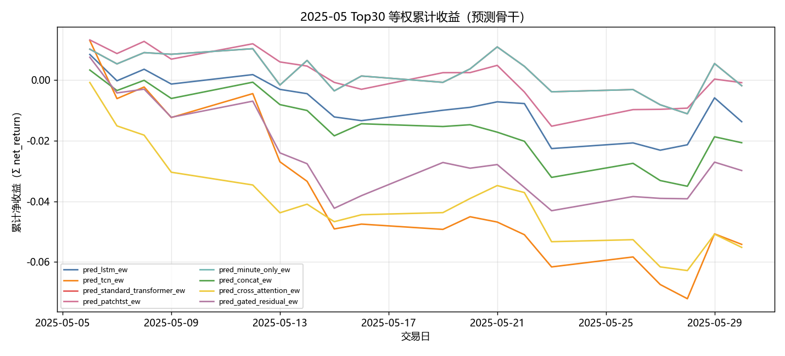
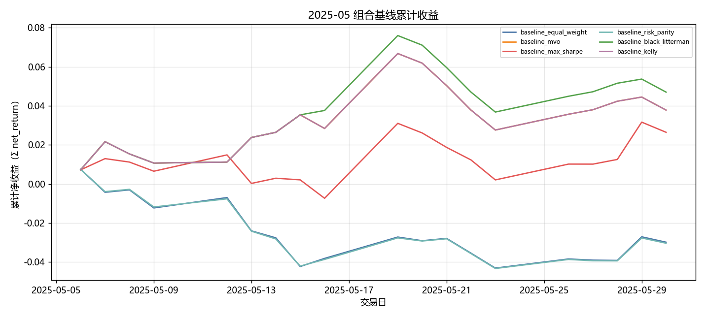
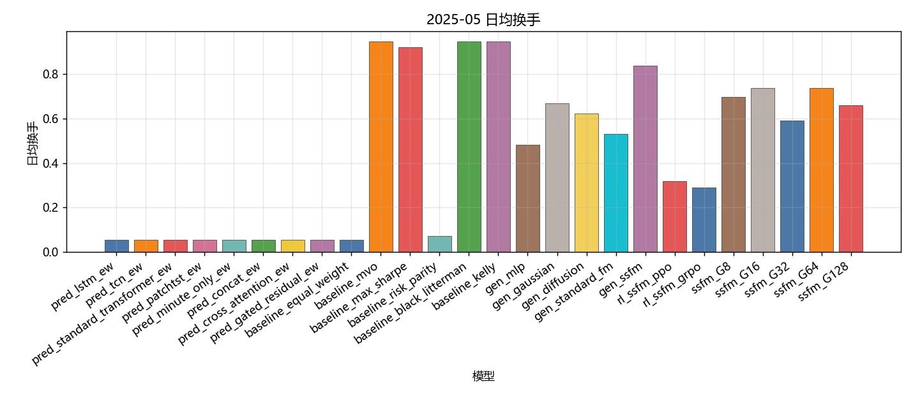
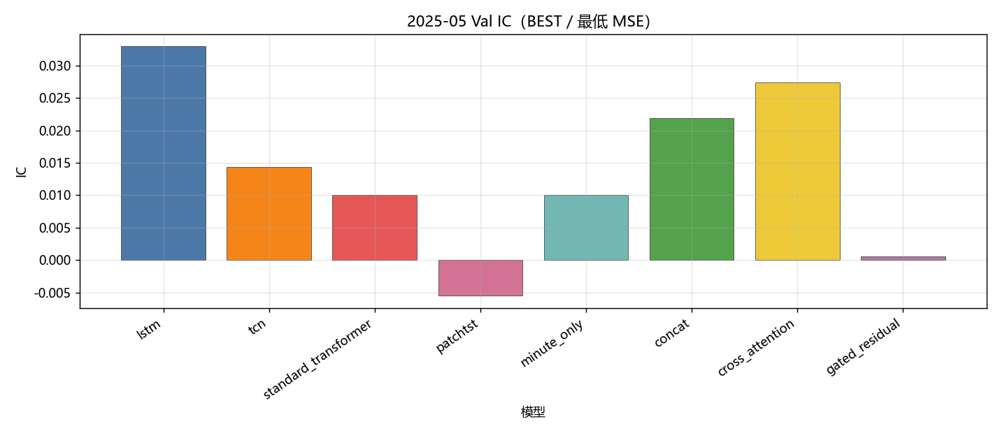
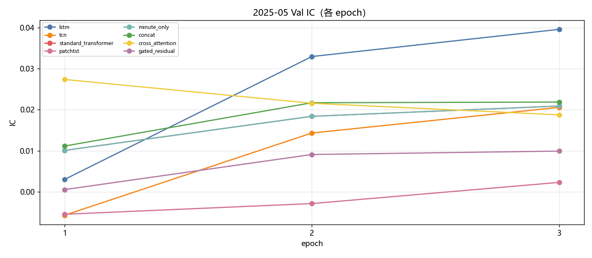
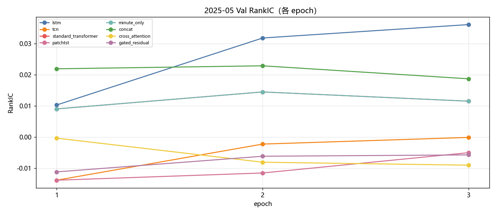
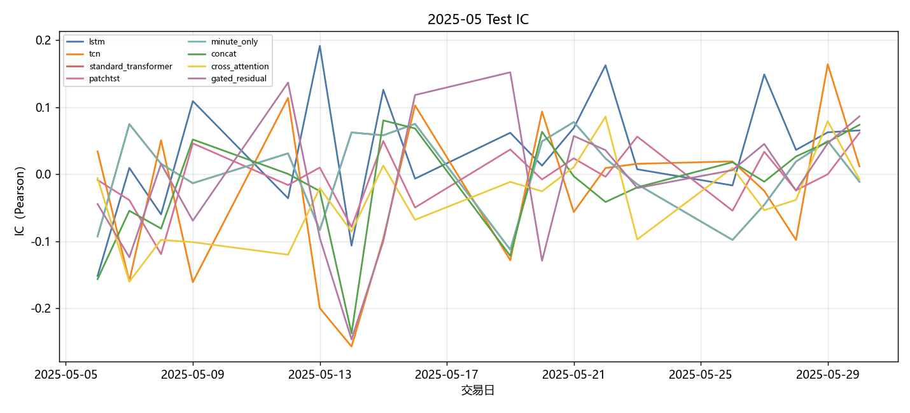
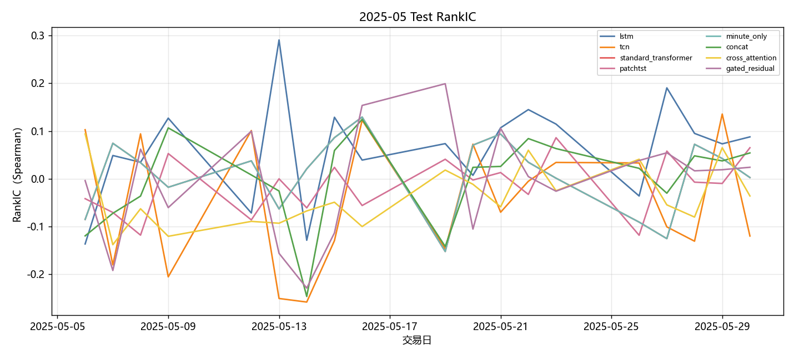
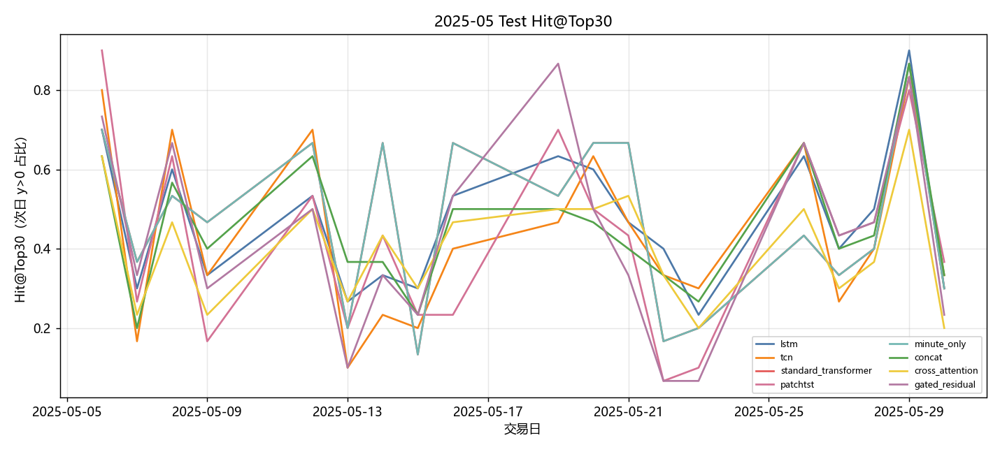

# 2025-05 Sequential OOS 当月实验分析

- 状态: **当月单元已全部写入**
- OOS: `sequential_oos_weekly_retrain`
- TopK=30，cost_bps=3.0，primary=`lstm`
- 缺测一律 `-`，不补 0、不编造。

## 固定颜色

| 模型 | 颜色 |
| --- | --- |
| lstm | #4C78A8 |
| tcn | #F58518 |
| standard_transformer | #E45756 |
| patchtst | #D37295 |
| minute_only | #72B7B2 |
| concat | #54A24B |
| cross_attention | #EECA3B |
| gated_residual | #B279A2 |

预测骨干日收益曲线用 `pred_<模型>_ew`，颜色与上表相同。

## 实验进度

| unit | model | status |
| --- | --- | --- |
| A 预测 | lstm | 已写入 |
| A 预测 | tcn | 已写入 |
| A 预测 | standard_transformer | 已写入 |
| A 预测 | patchtst | 已写入 |
| A 预测 | minute_only | 已写入 |
| A 预测 | concat | 已写入 |
| A 预测 | cross_attention | 已写入 |
| A 预测 | gated_residual | 已写入 |
| B 组合/top30 | equal_weight | 已写入 |
| B 组合/top30 | mvo | 已写入 |
| B 组合/top30 | max_sharpe | 已写入 |
| B 组合/top30 | risk_parity | 已写入 |
| B 组合/top30 | black_litterman | 已写入 |
| B 组合/top30 | kelly | 已写入 |
| C 生成/top30 | mlp | 已写入 |
| C 生成/top30 | gaussian | 已写入 |
| C 生成/top30 | diffusion | 已写入 |
| C 生成/top30 | standard_fm | 已写入 |
| C 生成/top30 | ssfm | 已写入 |
| D RL/top30 | ssfm_ppo | 已写入 |
| D RL/top30 | ssfm_grpo | 已写入 |
| E G/top30 | G=8 | 已写入 |
| E G/top30 | G=16 | 已写入 |
| E G/top30 | G=32 | 已写入 |
| E G/top30 | G=64 | 已写入 |
| E G/top30 | G=128 | 已写入 |

## 实验设定

- Walk-forward：Train=T-13..T-2，Val=T-1，Test=当月。
- Sequential OOS：周五收盘重训 primary + SS-FM + PPO/GRPO，下周一生效，不回写本周决策。
- 实验 E：SS-FM 候选数 G∈{8,16,32,64,128}。按周五生效窗口加载当时的 primary / SS-FM，当日采样后按 pred_utility 选 1 条；只跑 top30，不跑 500 只 all 池。
- 标签 y = log(Close_D / Open_D)。高严重泄漏 FAIL 的月份不进 final_summary。
- 本批次不跑 All 股池，进度表与绩效表均不含 `*_all`。
- 重点对比：SS-FM vs Flow Matching vs Diffusion；PPO vs GRPO（均挂在纯 SS-FM 上）。

## Validation（回归 / 排序）

### 各模型 BEST（按该模型 Val MSE 最低的 epoch）

| model | MSE | MAE | IC | RankIC | topk_f1 | topk_precision | topk_recall | dir_acc | dir_f1 | dir_precision | dir_recall | top30_hit_rate | n |
| --- | --- | --- | --- | --- | --- | --- | --- | --- | --- | --- | --- | --- | --- |
| lstm | 0.000651 | 0.017021 | 0.032957 | 0.031855 | 0.080952 | 0.080952 | 0.080952 | 0.494012 | 0.313172 | 0.526624 | 0.260454 | 0.555556 | 21 |
| tcn | 0.000745 | 0.019256 | 0.014326 | -0.002244 | 0.134921 | 0.134921 | 0.134921 | 0.476777 | 0.014592 | 0.577381 | 0.003964 | 0.501587 | 21 |
| standard_transformer | 0.000680 | 0.017781 | 0.010090 | 0.009059 | 0.076190 | 0.076190 | 0.076190 | 0.485647 | 0.107089 | 0.583617 | 0.066213 | 0.526984 | 21 |
| patchtst | 0.000700 | 0.018135 | -0.005460 | -0.013853 | 0.061905 | 0.061905 | 0.061905 | 0.478033 | 0.016105 | 0.657576 | 0.003119 | 0.493651 | 21 |
| minute_only | 0.000680 | 0.017781 | 0.010090 | 0.009059 | 0.076190 | 0.076190 | 0.076190 | 0.485647 | 0.107089 | 0.583617 | 0.066213 | 0.526984 | 21 |
| concat | 0.000668 | 0.017356 | 0.021868 | 0.018742 | 0.092063 | 0.092063 | 0.092063 | 0.476470 | 0.022587 | 0.583941 | 0.009746 | 0.519048 | 21 |
| cross_attention | 0.000680 | 0.017730 | 0.027373 | -0.000337 | 0.120635 | 0.120635 | 0.120635 | 0.483799 | 0.195859 | 0.510568 | 0.136834 | 0.536508 | 21 |
| gated_residual | 0.000651 | 0.017177 | 0.000548 | -0.011180 | 0.114286 | 0.114286 | 0.114286 | 0.494875 | 0.508914 | 0.501673 | 0.579217 | 0.503175 | 21 |

列含义: `MSE`/`MAE` 是 ŷ 对 y 的误差；`IC` 是 Pearson；`RankIC` 是 Spearman；`topk_f1` 是预测 Top30 ∩ 真实收益 Top30 / 30；`dir_acc` 是涨跌符号一致率；`top30_hit_rate` 是入选 30 只里 y>0 的比例。

### 各 epoch

| model | epoch | MSE | MAE | IC | RankIC | topk_f1 | topk_precision | topk_recall | dir_acc | dir_f1 | dir_precision | dir_recall | top30_hit_rate | n |
| --- | --- | --- | --- | --- | --- | --- | --- | --- | --- | --- | --- | --- | --- | --- |
| lstm | 1 | 0.000677 | 0.017907 | 0.003028 | 0.010324 | 0.047619 | 0.047619 | 0.047619 | 0.523436 | 0.649639 | 0.505577 | 1 | 0.533333 | 21 |
| lstm | 2 | 0.000651 | 0.017021 | 0.032957 | 0.031855 | 0.080952 | 0.080952 | 0.080952 | 0.494012 | 0.313172 | 0.526624 | 0.260454 | 0.555556 | 21 |
| lstm | 3 | 0.000655 | 0.017103 | 0.039575 | 0.036166 | 0.093651 | 0.093651 | 0.093651 | 0.480557 | 0.048175 | 0.580199 | 0.026124 | 0.557143 | 21 |
| tcn | 1 | 0.000793 | 0.020267 | -0.005697 | -0.013850 | 0.109524 | 0.109524 | 0.109524 | 0.475974 | 0.008461 | 0.370370 | 0.000811 | 0.495238 | 21 |
| tcn | 2 | 0.000745 | 0.019256 | 0.014326 | -0.002244 | 0.134921 | 0.134921 | 0.134921 | 0.476777 | 0.014592 | 0.577381 | 0.003964 | 0.501587 | 21 |
| tcn | 3 | 0.000759 | 0.019617 | 0.020580 | -0.000104 | 0.128571 | 0.128571 | 0.128571 | 0.476574 | 0.015612 | 0.550000 | 0.002316 | 0.504762 | 21 |
| standard_transformer | 1 | 0.000680 | 0.017781 | 0.010090 | 0.009059 | 0.076190 | 0.076190 | 0.076190 | 0.485647 | 0.107089 | 0.583617 | 0.066213 | 0.526984 | 21 |
| standard_transformer | 2 | 0.000715 | 0.018681 | 0.018397 | 0.014516 | 0.087302 | 0.087302 | 0.087302 | 0.477550 | 0.021498 | 0.590092 | 0.004721 | 0.519048 | 21 |
| standard_transformer | 3 | 0.000737 | 0.019219 | 0.020903 | 0.011545 | 0.096825 | 0.096825 | 0.096825 | 0.477262 | 0.017252 | 0.616883 | 0.003342 | 0.538095 | 21 |
| patchtst | 1 | 0.000700 | 0.018135 | -0.005460 | -0.013853 | 0.061905 | 0.061905 | 0.061905 | 0.478033 | 0.016105 | 0.657576 | 0.003119 | 0.493651 | 21 |
| patchtst | 2 | 0.000708 | 0.018367 | -0.002858 | -0.011532 | 0.058730 | 0.058730 | 0.058730 | 0.477741 | 0.017159 | 0.814815 | 0.002078 | 0.477778 | 21 |
| patchtst | 3 | 0.000712 | 0.018445 | 0.002304 | -0.005008 | 0.053968 | 0.053968 | 0.053968 | 0.477250 | 0.013737 | 0.766667 | 0.001324 | 0.490476 | 21 |
| minute_only | 1 | 0.000680 | 0.017781 | 0.010090 | 0.009059 | 0.076190 | 0.076190 | 0.076190 | 0.485647 | 0.107089 | 0.583617 | 0.066213 | 0.526984 | 21 |
| minute_only | 2 | 0.000715 | 0.018681 | 0.018397 | 0.014516 | 0.087302 | 0.087302 | 0.087302 | 0.477550 | 0.021498 | 0.590092 | 0.004721 | 0.519048 | 21 |
| minute_only | 3 | 0.000737 | 0.019219 | 0.020903 | 0.011545 | 0.096825 | 0.096825 | 0.096825 | 0.477262 | 0.017252 | 0.616883 | 0.003342 | 0.538095 | 21 |
| concat | 1 | 0.000789 | 0.020080 | 0.011153 | 0.021955 | 0.058730 | 0.058730 | 0.058730 | 0.476565 | 0.006024 | 0.500000 | 0.000144 | 0.517460 | 21 |
| concat | 2 | 0.000679 | 0.017592 | 0.021699 | 0.022914 | 0.087302 | 0.087302 | 0.087302 | 0.476773 | 0.016994 | 0.655873 | 0.005985 | 0.525397 | 21 |
| concat | 3 | 0.000668 | 0.017356 | 0.021868 | 0.018742 | 0.092063 | 0.092063 | 0.092063 | 0.476470 | 0.022587 | 0.583941 | 0.009746 | 0.519048 | 21 |
| cross_attention | 1 | 0.000680 | 0.017730 | 0.027373 | -0.000337 | 0.120635 | 0.120635 | 0.120635 | 0.483799 | 0.195859 | 0.510568 | 0.136834 | 0.536508 | 21 |
| cross_attention | 2 | 0.000707 | 0.018566 | 0.021573 | -0.008073 | 0.128571 | 0.128571 | 0.128571 | 0.478643 | 0.043026 | 0.518143 | 0.021910 | 0.512698 | 21 |
| cross_attention | 3 | 0.000728 | 0.019049 | 0.018755 | -0.009026 | 0.133333 | 0.133333 | 0.133333 | 0.477762 | 0.019049 | 0.584259 | 0.007897 | 0.515873 | 21 |
| gated_residual | 1 | 0.000651 | 0.017177 | 0.000548 | -0.011180 | 0.114286 | 0.114286 | 0.114286 | 0.494875 | 0.508914 | 0.501673 | 0.579217 | 0.503175 | 21 |
| gated_residual | 2 | 0.000666 | 0.017508 | 0.009096 | -0.006154 | 0.136508 | 0.136508 | 0.136508 | 0.485877 | 0.187724 | 0.484522 | 0.129502 | 0.488889 | 21 |
| gated_residual | 3 | 0.000659 | 0.017333 | 0.009927 | -0.005723 | 0.131746 | 0.131746 | 0.131746 | 0.484862 | 0.274033 | 0.495179 | 0.216012 | 0.500000 | 21 |

## Test 预测指标（日均）

| model | MSE | MAE | IC | RankIC | topk_f1 | topk_precision | topk_recall | dir_acc | dir_f1 | dir_precision | dir_recall | top30_hit_rate | top30_excess | n |
| --- | --- | --- | --- | --- | --- | --- | --- | --- | --- | --- | --- | --- | --- | --- |
| lstm | 0.000300 | 0.012113 | 0.041655 | 0.068092 | 0.081481 | 0.081481 | 0.081481 | 0.503425 | 0.233266 | 0.448341 | 0.206643 | 0.470833 | -0.000226 | 19 |
| tcn | 0.000356 | 0.013619 | -0.026281 | -0.042529 | 0.077778 | 0.077778 | 0.077778 | 0.534058 | 0.027211 | 0.296296 | 0.004799 | 0.438889 | -0.002116 | 19 |
| standard_transformer | 0.000317 | 0.012644 | 0.003673 | 0.008710 | 0.070370 | 0.070370 | 0.070370 | 0.540029 | 0.161871 | 0.488291 | 0.099625 | 0.466667 | 0.000435 | 19 |
| patchtst | 0.000325 | 0.012701 | 0.000970 | -0.006791 | 0.051852 | 0.051852 | 0.051852 | 0.536381 | 0.011223 | 0.833333 | 0.001889 | 0.413889 | 0.000187 | 19 |
| minute_only | 0.000317 | 0.012644 | 0.003673 | 0.008710 | 0.070370 | 0.070370 | 0.070370 | 0.540029 | 0.161871 | 0.488291 | 0.099625 | 0.466667 | 0.000435 | 19 |
| concat | 0.000305 | 0.012221 | -0.018413 | 0.001539 | 0.074074 | 0.074074 | 0.074074 | 0.533368 | 0.026481 | 0.409764 | 0.012407 | 0.438889 | -0.000868 | 19 |
| cross_attention | 0.000318 | 0.012616 | -0.030468 | -0.030386 | 0.074074 | 0.074074 | 0.074074 | 0.521447 | 0.216605 | 0.413327 | 0.161014 | 0.405556 | -0.001939 | 19 |
| gated_residual | 0.000306 | 0.012243 | -0.002386 | 0.002724 | 0.074074 | 0.074074 | 0.074074 | 0.544453 | 0.437689 | 0.365940 | 0.297848 | 0.418056 | -0.000720 | 19 |

## 组合绩效

| model | total_net_return | ann_return | sharpe | max_drawdown | mean_turnover | mean_cost | n_days |
| --- | --- | --- | --- | --- | --- | --- | --- |
| pred_lstm_ew_top30 | -0.0136 | -0.1666 | -1.7471 | 0.0311 | 0.0526 | 0.0000 | 19 |
| pred_tcn_ew_top30 | -0.0527 | -0.5126 | -4.3122 | 0.0816 | 0.0526 | 0.0000 | 19 |
| pred_standard_transformer_ew_top30 | -0.0019 | -0.0246 | -0.2131 | 0.0218 | 0.0526 | 0.0000 | 19 |
| pred_patchtst_ew_top30 | -0.0009 | -0.0115 | -0.1199 | 0.0280 | 0.0526 | 0.0000 | 19 |
| pred_minute_only_ew_top30 | -0.0019 | -0.0246 | -0.2131 | 0.0218 | 0.0526 | 0.0000 | 19 |
| pred_concat_ew_top30 | -0.0205 | -0.2398 | -2.7699 | 0.0376 | 0.0526 | 0.0000 | 19 |
| pred_cross_attention_ew_top30 | -0.0537 | -0.5189 | -6.6780 | 0.0601 | 0.0526 | 0.0000 | 19 |
| pred_gated_residual_ew_top30 | -0.0294 | -0.3268 | -3.1155 | 0.0493 | 0.0526 | 0.0000 | 19 |
| pred_lstm_ew | -0.0136 | -0.1666 | -1.7471 | 0.0311 | 0.0526 | 0.0000 | 19 |
| pred_tcn_ew | -0.0527 | -0.5126 | -4.3122 | 0.0816 | 0.0526 | 0.0000 | 19 |
| pred_standard_transformer_ew | -0.0019 | -0.0246 | -0.2131 | 0.0218 | 0.0526 | 0.0000 | 19 |
| pred_patchtst_ew | -0.0009 | -0.0115 | -0.1199 | 0.0280 | 0.0526 | 0.0000 | 19 |
| pred_minute_only_ew | -0.0019 | -0.0246 | -0.2131 | 0.0218 | 0.0526 | 0.0000 | 19 |
| pred_concat_ew | -0.0205 | -0.2398 | -2.7699 | 0.0376 | 0.0526 | 0.0000 | 19 |
| pred_cross_attention_ew | -0.0537 | -0.5189 | -6.6780 | 0.0601 | 0.0526 | 0.0000 | 19 |
| pred_gated_residual_ew | -0.0294 | -0.3268 | -3.1155 | 0.0493 | 0.0526 | 0.0000 | 19 |
| baseline_equal_weight_top30 | -0.0294 | -0.3268 | -3.1155 | 0.0493 | 0.0526 | 0.0000 | 19 |
| baseline_mvo_top30 | 0.0385 | 0.6512 | 2.7161 | 0.0384 | 0.9474 | 0.0003 | 19 |
| baseline_max_sharpe_top30 | 0.0268 | 0.4202 | 1.8839 | 0.0285 | 0.9211 | 0.0003 | 19 |
| baseline_risk_parity_top30 | -0.0299 | -0.3314 | -3.2757 | 0.0495 | 0.0711 | 0.0000 | 19 |
| baseline_black_litterman_top30 | 0.0481 | 0.8656 | 3.4347 | 0.0384 | 0.9474 | 0.0003 | 19 |
| baseline_kelly_top30 | 0.0385 | 0.6512 | 2.7161 | 0.0384 | 0.9474 | 0.0003 | 19 |
| baseline_equal_weight | -0.0294 | -0.3268 | -3.1155 | 0.0493 | 0.0526 | 0.0000 | 19 |
| baseline_mvo | 0.0385 | 0.6512 | 2.7161 | 0.0384 | 0.9474 | 0.0003 | 19 |
| baseline_max_sharpe | 0.0268 | 0.4202 | 1.8839 | 0.0285 | 0.9211 | 0.0003 | 19 |
| baseline_risk_parity | -0.0299 | -0.3314 | -3.2757 | 0.0495 | 0.0711 | 0.0000 | 19 |
| baseline_black_litterman | 0.0481 | 0.8656 | 3.4347 | 0.0384 | 0.9474 | 0.0003 | 19 |
| baseline_kelly | 0.0385 | 0.6512 | 2.7161 | 0.0384 | 0.9474 | 0.0003 | 19 |
| gen_mlp_top30 | -0.0186 | -0.2209 | -1.7442 | 0.0617 | 0.4815 | 0.0001 | 19 |
| gen_gaussian_top30 | 0.0119 | 0.1698 | 1.0005 | 0.0354 | 0.6692 | 0.0002 | 19 |
| gen_diffusion_top30 | 0.1110 | 3.0417 | 4.9904 | 0.0236 | 0.6221 | 0.0002 | 19 |
| gen_standard_fm_top30 | -0.0335 | -0.3636 | -3.3033 | 0.0442 | 0.5321 | 0.0002 | 19 |
| gen_ssfm_top30 | 0.0152 | 0.2214 | 0.6353 | 0.0605 | 0.8388 | 0.0003 | 19 |
| gen_mlp | -0.0186 | -0.2209 | -1.7442 | 0.0617 | 0.4815 | 0.0001 | 19 |
| gen_gaussian | 0.0119 | 0.1698 | 1.0005 | 0.0354 | 0.6692 | 0.0002 | 19 |
| gen_diffusion | 0.1110 | 3.0417 | 4.9904 | 0.0236 | 0.6221 | 0.0002 | 19 |
| gen_standard_fm | -0.0335 | -0.3636 | -3.3033 | 0.0442 | 0.5321 | 0.0002 | 19 |
| gen_ssfm | 0.0152 | 0.2214 | 0.6353 | 0.0605 | 0.8388 | 0.0003 | 19 |
| rl_ssfm_ppo_top30 | 0.0986 | 2.4820 | 2.8531 | 0.0267 | 0.3173 | 0.0001 | 19 |
| rl_ssfm_grpo_top30 | 0.0013 | 0.0177 | 0.0818 | 0.0439 | 0.2880 | 0.0001 | 19 |
| rl_ssfm_ppo | 0.0986 | 2.4820 | 2.8531 | 0.0267 | 0.3173 | 0.0001 | 19 |
| rl_ssfm_grpo | 0.0013 | 0.0177 | 0.0818 | 0.0439 | 0.2880 | 0.0001 | 19 |
| ssfm_G8_top30 | -0.0385 | -0.4062 | -4.3962 | 0.0431 | 0.6979 | 0.0002 | 19 |
| ssfm_G16_top30 | -0.0056 | -0.0721 | -0.6083 | 0.0408 | 0.7389 | 0.0002 | 19 |
| ssfm_G32_top30 | -0.0045 | -0.0581 | -0.3739 | 0.0406 | 0.5918 | 0.0002 | 19 |
| ssfm_G64_top30 | -0.0207 | -0.2420 | -1.4300 | 0.0684 | 0.7374 | 0.0002 | 19 |
| ssfm_G128_top30 | -0.0130 | -0.1589 | -1.0414 | 0.0526 | 0.6608 | 0.0002 | 19 |
| ssfm_G8 | -0.0385 | -0.4062 | -4.3962 | 0.0431 | 0.6979 | 0.0002 | 19 |
| ssfm_G16 | -0.0056 | -0.0721 | -0.6083 | 0.0408 | 0.7389 | 0.0002 | 19 |
| ssfm_G32 | -0.0045 | -0.0581 | -0.3739 | 0.0406 | 0.5918 | 0.0002 | 19 |
| ssfm_G64 | -0.0207 | -0.2420 | -1.4300 | 0.0684 | 0.7374 | 0.0002 | 19 |
| ssfm_G128 | -0.0130 | -0.1589 | -1.0414 | 0.0526 | 0.6608 | 0.0002 | 19 |

## 日均换手

| model | mean_turnover |
| --- | --- |
| pred_lstm_ew_top30 | 0.0526 |
| pred_tcn_ew_top30 | 0.0526 |
| pred_standard_transformer_ew_top30 | 0.0526 |
| pred_patchtst_ew_top30 | 0.0526 |
| pred_minute_only_ew_top30 | 0.0526 |
| pred_concat_ew_top30 | 0.0526 |
| pred_cross_attention_ew_top30 | 0.0526 |
| pred_gated_residual_ew_top30 | 0.0526 |
| pred_lstm_ew | 0.0526 |
| pred_tcn_ew | 0.0526 |
| pred_standard_transformer_ew | 0.0526 |
| pred_patchtst_ew | 0.0526 |
| pred_minute_only_ew | 0.0526 |
| pred_concat_ew | 0.0526 |
| pred_cross_attention_ew | 0.0526 |
| pred_gated_residual_ew | 0.0526 |
| baseline_equal_weight_top30 | 0.0526 |
| baseline_mvo_top30 | 0.9474 |
| baseline_max_sharpe_top30 | 0.9211 |
| baseline_risk_parity_top30 | 0.0711 |
| baseline_black_litterman_top30 | 0.9474 |
| baseline_kelly_top30 | 0.9474 |
| baseline_equal_weight | 0.0526 |
| baseline_mvo | 0.9474 |
| baseline_max_sharpe | 0.9211 |
| baseline_risk_parity | 0.0711 |
| baseline_black_litterman | 0.9474 |
| baseline_kelly | 0.9474 |
| gen_mlp_top30 | 0.4815 |
| gen_gaussian_top30 | 0.6692 |
| gen_diffusion_top30 | 0.6221 |
| gen_standard_fm_top30 | 0.5321 |
| gen_ssfm_top30 | 0.8388 |
| gen_mlp | 0.4815 |
| gen_gaussian | 0.6692 |
| gen_diffusion | 0.6221 |
| gen_standard_fm | 0.5321 |
| gen_ssfm | 0.8388 |
| rl_ssfm_ppo_top30 | 0.3173 |
| rl_ssfm_grpo_top30 | 0.2880 |
| rl_ssfm_ppo | 0.3173 |
| rl_ssfm_grpo | 0.2880 |
| ssfm_G8_top30 | 0.6979 |
| ssfm_G16_top30 | 0.7389 |
| ssfm_G32_top30 | 0.5918 |
| ssfm_G64_top30 | 0.7374 |
| ssfm_G128_top30 | 0.6608 |
| ssfm_G8 | 0.6979 |
| ssfm_G16 | 0.7389 |
| ssfm_G32 | 0.5918 |
| ssfm_G64 | 0.7374 |
| ssfm_G128 | 0.6608 |

## 图

曲线来自当月已写入的回测 / Val / Test；某条序列还没有数字时，该图只保留坐标轴和固定颜色。Markdown 预览有时会卡住训练中途的占位图，以 `figures/*.png` 为准。

### 预测骨干累计收益

固定颜色: `pred_lstm_ew` `#4C78A8`；`pred_tcn_ew` `#F58518`；`pred_standard_transformer_ew` `#E45756`；`pred_patchtst_ew` `#D37295`；`pred_minute_only_ew` `#72B7B2`；`pred_concat_ew` `#54A24B`；`pred_cross_attention_ew` `#EECA3B`；`pred_gated_residual_ew` `#B279A2`。

### 组合基线累计收益

固定颜色: `baseline_equal_weight` `#4C78A8`；`baseline_mvo` `#F58518`；`baseline_max_sharpe` `#E45756`；`baseline_risk_parity` `#72B7B2`；`baseline_black_litterman` `#54A24B`；`baseline_kelly` `#B279A2`。

### 生成模型累计收益

固定颜色: `gen_mlp` `#9D755D`；`gen_gaussian` `#BAB0AC`；`gen_diffusion` `#F2CF5B`；`gen_standard_fm` `#17BECF`；`gen_ssfm` `#B279A2`。

### RL 累计收益

固定颜色: `gen_ssfm` `#B279A2`；`rl_ssfm_ppo` `#E45756`；`rl_ssfm_grpo` `#4C78A8`。

### G 曲线累计收益

固定颜色: `ssfm_G8` `#9D755D`；`ssfm_G16` `#BAB0AC`；`ssfm_G32` `#4C78A8`；`ssfm_G64` `#F58518`；`ssfm_G128` `#E45756`。

### 日均换手

固定颜色: `pred_lstm_ew` `#4C78A8`；`pred_tcn_ew` `#F58518`；`pred_standard_transformer_ew` `#E45756`；`pred_patchtst_ew` `#D37295`；`pred_minute_only_ew` `#72B7B2`；`pred_concat_ew` `#54A24B`；`pred_cross_attention_ew` `#EECA3B`；`pred_gated_residual_ew` `#B279A2`；`baseline_equal_weight` `#4C78A8`；`baseline_mvo` `#F58518`；`baseline_max_sharpe` `#E45756`；`baseline_risk_parity` `#72B7B2`；`baseline_black_litterman` `#54A24B`；`baseline_kelly` `#B279A2`；`gen_mlp` `#9D755D`；`gen_gaussian` `#BAB0AC`；`gen_diffusion` `#F2CF5B`；`gen_standard_fm` `#17BECF`；`gen_ssfm` `#B279A2`；`rl_ssfm_ppo` `#E45756`；`rl_ssfm_grpo` `#4C78A8`；`ssfm_G8` `#9D755D`；`ssfm_G16` `#BAB0AC`；`ssfm_G32` `#4C78A8`；`ssfm_G64` `#F58518`；`ssfm_G128` `#E45756`。

### Val IC

固定颜色: `lstm` `#4C78A8`；`tcn` `#F58518`；`standard_transformer` `#E45756`；`patchtst` `#D37295`；`minute_only` `#72B7B2`；`concat` `#54A24B`；`cross_attention` `#EECA3B`；`gated_residual` `#B279A2`。

### Val RankIC

固定颜色: `lstm` `#4C78A8`；`tcn` `#F58518`；`standard_transformer` `#E45756`；`patchtst` `#D37295`；`minute_only` `#72B7B2`；`concat` `#54A24B`；`cross_attention` `#EECA3B`；`gated_residual` `#B279A2`。

### Val F1@Top30

固定颜色: `lstm` `#4C78A8`；`tcn` `#F58518`；`standard_transformer` `#E45756`；`patchtst` `#D37295`；`minute_only` `#72B7B2`；`concat` `#54A24B`；`cross_attention` `#EECA3B`；`gated_residual` `#B279A2`。

### Val MSE

固定颜色: `lstm` `#4C78A8`；`tcn` `#F58518`；`standard_transformer` `#E45756`；`patchtst` `#D37295`；`minute_only` `#72B7B2`；`concat` `#54A24B`；`cross_attention` `#EECA3B`；`gated_residual` `#B279A2`。

### Val IC 各 epoch

固定颜色: `lstm` `#4C78A8`；`tcn` `#F58518`；`standard_transformer` `#E45756`；`patchtst` `#D37295`；`minute_only` `#72B7B2`；`concat` `#54A24B`；`cross_attention` `#EECA3B`；`gated_residual` `#B279A2`。

### Val RankIC 各 epoch

固定颜色: `lstm` `#4C78A8`；`tcn` `#F58518`；`standard_transformer` `#E45756`；`patchtst` `#D37295`；`minute_only` `#72B7B2`；`concat` `#54A24B`；`cross_attention` `#EECA3B`；`gated_residual` `#B279A2`。

### Val F1@Top30 各 epoch

固定颜色: `lstm` `#4C78A8`；`tcn` `#F58518`；`standard_transformer` `#E45756`；`patchtst` `#D37295`；`minute_only` `#72B7B2`；`concat` `#54A24B`；`cross_attention` `#EECA3B`；`gated_residual` `#B279A2`。

### Val MSE 各 epoch

固定颜色: `lstm` `#4C78A8`；`tcn` `#F58518`；`standard_transformer` `#E45756`；`patchtst` `#D37295`；`minute_only` `#72B7B2`；`concat` `#54A24B`；`cross_attention` `#EECA3B`；`gated_residual` `#B279A2`。

### Test IC

固定颜色: `lstm` `#4C78A8`；`tcn` `#F58518`；`standard_transformer` `#E45756`；`patchtst` `#D37295`；`minute_only` `#72B7B2`；`concat` `#54A24B`；`cross_attention` `#EECA3B`；`gated_residual` `#B279A2`。

### Test RankIC

固定颜色: `lstm` `#4C78A8`；`tcn` `#F58518`；`standard_transformer` `#E45756`；`patchtst` `#D37295`；`minute_only` `#72B7B2`；`concat` `#54A24B`；`cross_attention` `#EECA3B`；`gated_residual` `#B279A2`。

### Test F1@Top30

固定颜色: `lstm` `#4C78A8`；`tcn` `#F58518`；`standard_transformer` `#E45756`；`patchtst` `#D37295`；`minute_only` `#72B7B2`；`concat` `#54A24B`；`cross_attention` `#EECA3B`；`gated_residual` `#B279A2`。

### Test Hit@Top30

固定颜色: `lstm` `#4C78A8`；`tcn` `#F58518`；`standard_transformer` `#E45756`；`patchtst` `#D37295`；`minute_only` `#72B7B2`；`concat` `#54A24B`；`cross_attention` `#EECA3B`；`gated_residual` `#B279A2`。

## 图对应数据表

- 累计收益 ← `tables/backtest_daily.csv` 的 `net_return` 累加。
- 绩效 / 换手 ← `tables/performance_summary.csv`。
- Val ← `tables/val_best.csv`、`tables/val_epochs.csv`。
- Test 预测 ← `tables/prediction_metrics_mean.csv`。

## 分析

以下只讨论**已经写入数字**的行；单元格为 `-` 的表示该实验尚未跑完，不编造。
来源: month 2025-05。OOS=`sequential_oos_weekly_retrain`，费用=3.0bps，TopK=30。

已有数据的对象: `lstm`, `tcn`, `standard_transformer`, `patchtst`, `minute_only`, `concat`, `cross_attention`, `gated_residual`, `equal_weight`, `mvo`, `max_sharpe`, `risk_parity`, `black_litterman`, `kelly`, `mlp`, `gaussian`, `diffusion`, `standard_fm`, `ssfm`, `ssfm_ppo`, `ssfm_grpo`, `G=8`, `G=16`, `G=32`, `G=64`, `G=128`。
- Val IC 目前最高: `lstm` = 0.0330。
- Val F1@Top30 目前最高: `tcn` = 0.1349（随机约 0.06）。
- Val MSE 目前最低（入选口径）: `lstm` = 0.000651。
- Test 日均 IC 目前最高: `lstm` = 0.0417。
- 已回测净值目前最高: `gen_diffusion` 累计净收益 0.1110，Sharpe 4.9904。
- 实验 E（G 候选数，top30）累计净收益最高: `ssfm_G32` = -0.0045（G=8 -0.0385；G=16 -0.0056；G=32 -0.0045；G=64 -0.0207；G=128 -0.0130）。

## 重点对比：生成方法与强化学习

生成式方法都把同一套 Alpha Prediction 分数映射成 Top30 组合权重，费用 3bps。**Gaussian + MLP** 是随机策略基线（MLP 输出高斯参数后采样）；**MLP** 是确定性映射；**Diffusion** 逐步去噪；**Flow Matching（`standard_fm`）** 是普通连续流匹配；**SS-FM** 在单纯形上做条件流匹配。下面只讨论已经写入的 Test 回测数字。

| 方法 | series | total_net_return | ann_return | sharpe | max_drawdown | mean_turnover | n_days |
| --- | --- | --- | --- | --- | --- | --- | --- |
| Gaussian + MLP | gen_gaussian | 0.0119 | 0.1698 | 1.0005 | 0.0354 | 0.6692 | 19 |
| MLP | gen_mlp | -0.0186 | -0.2209 | -1.7442 | 0.0617 | 0.4815 | 19 |
| SS-FM | gen_ssfm | 0.0152 | 0.2214 | 0.6353 | 0.0605 | 0.8388 | 19 |
| Flow Matching | gen_standard_fm | -0.0335 | -0.3636 | -3.3033 | 0.0442 | 0.5321 | 19 |
| Diffusion | gen_diffusion | 0.1110 | 3.0417 | 4.9904 | 0.0236 | 0.6221 | 19 |

累计净收益排序：`Diffusion`(0.1110) > `SS-FM`(0.0152) > `Gaussian + MLP`(0.0119) > `MLP`(-0.0186) > `Flow Matching`(-0.0335)。
Sharpe 排序：`Diffusion`(4.9904) > `Gaussian + MLP`(1.0005) > `SS-FM`(0.6353) > `MLP`(-1.7442) > `Flow Matching`(-3.3033)。
最大回撤（越小越好）：`Diffusion`(0.0236) > `Gaussian + MLP`(0.0354) > `Flow Matching`(0.0442) > `SS-FM`(0.0605) > `MLP`(0.0617)。
日均换手（越低交易成本压力越小）：`MLP`(0.4815) > `Flow Matching`(0.5321) > `Diffusion`(0.6221) > `Gaussian + MLP`(0.6692) > `SS-FM`(0.8388)。
- `Gaussian + MLP / gen_gaussian`：累计净收益 0.0119，年化 0.1698，Sharpe 1.0005，最大回撤 0.0354，日均换手 0.6692，n=19。
- `MLP / gen_mlp`：累计净收益 -0.0186，年化 -0.2209，Sharpe -1.7442，最大回撤 0.0617，日均换手 0.4815，n=19。
- `SS-FM / gen_ssfm`：累计净收益 0.0152，年化 0.2214，Sharpe 0.6353，最大回撤 0.0605，日均换手 0.8388，n=19。
- `Flow Matching / gen_standard_fm`：累计净收益 -0.0335，年化 -0.3636，Sharpe -3.3033，最大回撤 0.0442，日均换手 0.5321，n=19。
- `Diffusion / gen_diffusion`：累计净收益 0.1110，年化 3.0417，Sharpe 4.9904，最大回撤 0.0236，日均换手 0.6221，n=19。

本月生成方法里收益最好的是 **Diffusion**（0.1110），最差的是 **Flow Matching**（-0.0335）。
Diffusion 靠多步去噪在权重单纯形上探索，截面噪声大时往往比单步回归/流匹配更能避开过度集中的错误多头；若同时 Sharpe 更高、回撤更小，说明优势不只是赌对方向，而是路径更稳。
普通 FM 最差，和 SS-FM 的差距主要来自缺少分数条件：无条件流匹配更容易给出与次日收益无关的权重，换手若同时不低，成本会进一步拖累净值。
换手最高的是 SS-FM（0.8388）。生成式每天重采样权重，换手天然高于预测骨干 Top30 等权；比较三种生成方法时，应把换手和费用一起看，不能只看毛收益。

### PPO vs GRPO（纯 SS-FM）

两组强化学习都挂在 **同一套 SS-FM** 上：先冻结/蒸馏 SS-FM 生成器，再用策略梯度改采样。**PPO** 用 clipped surrogate 优化轨迹回报；**GRPO** 对同一状态采一组候选，用组内相对优势，不显式用 critic。对照是不加 RL 的 `gen_ssfm`。

| 方法 | series | total_net_return | ann_return | sharpe | max_drawdown | mean_turnover | n_days |
| --- | --- | --- | --- | --- | --- | --- | --- |
| SS-FM（无 RL） | gen_ssfm | 0.0152 | 0.2214 | 0.6353 | 0.0605 | 0.8388 | 19 |
| PPO + SS-FM | rl_ssfm_ppo | 0.0986 | 2.4820 | 2.8531 | 0.0267 | 0.3173 | 19 |
| GRPO + SS-FM | rl_ssfm_grpo | 0.0013 | 0.0177 | 0.0818 | 0.0439 | 0.2880 | 19 |

- `SS-FM 无 RL`：累计净收益 0.0152，年化 0.2214，Sharpe 0.6353，最大回撤 0.0605，日均换手 0.8388，n=19。
- `PPO + SS-FM`：累计净收益 0.0986，年化 2.4820，Sharpe 2.8531，最大回撤 0.0267，日均换手 0.3173，n=19。
- `GRPO + SS-FM`：累计净收益 0.0013，年化 0.0177，Sharpe 0.0818，最大回撤 0.0439，日均换手 0.2880，n=19。

本月 **PPO 明显优于 GRPO**（净收益 0.0986 vs 0.0013，Sharpe 2.8531 vs 0.0818）。PPO 直接优化绝对回报，在月频、高噪声的 CSI500 Top30 上更容易学到“少动、抓住少数有效信号”的策略；GRPO 依赖组内相对排序，组内候选若都差或方差被截面噪声淹没，相对优势接近随机，策略更新会抖。
PPO 相对纯 SS-FM 净收益提升 0.0834。RL 若同时把换手压下去（0.8388 → 0.3173），说明它主要是在惩罚无意义的每日重采样，而不是另学一套完全不同的选股。
GRPO 相对纯 SS-FM 净收益下降 0.0139。组相对优势在截面噪声大时容易把“没那么差”的候选当成正优势，更新方向不稳定。
换手：纯 SS-FM 0.8388，PPO 0.3173，GRPO 0.2880。RL 若换手明显低于生成采样，成本项会解释一部分超额；Top30 等权预测骨干的换手几乎只反映首日建仓，**不能**和生成/RL 的日均换手直接比。

### 收益表现、稳定性与风险成本

预测骨干 Test 日均 IC 最高 `lstm`=0.0417，最低 `cross_attention`=-0.0305。IC 一个月大约 20 个交易日，符号翻转很常见，不能单独用 IC 给方法排座次；组合净值、Sharpe、回撤要一起看。
核心序列里净值最好 `gen_diffusion`=0.1110（Sharpe 4.9904，MDD 0.0236），最差 `gen_standard_fm`=-0.0335。单月样本短，方法之间差几个百分点也可能是市场路径而不是模型能力；要和下个月对照是否同向。
稳定性：看 Val IC 与 Test IC 是否同向、生成/RL 是否跟预测骨干一起赚或一起亏。若预测 IC 为正但生成亏损，问题更可能在权重采样与换手，而不是分数本身；若预测 IC 已接近 0，生成和 RL 都很难稳定赚钱，这是市场环境而不是某一生成器独有的失败。

## 实验 E：G 候选数

只跑 top30。每个交易日加载当时周五生效的 primary / SS-FM，采 G 条权重后按 pred_utility 选 1 条。与默认 `gen_ssfm`（固定 default_g）不是同一条抽样路径。

| G | 累计净收益 | Sharpe | 最大回撤 | 日均换手 | 天数 |
| --- | --- | --- | --- | --- | --- |
| G=8 | -0.0385 | -4.3962 | 0.0431 | 0.6979 | 19 |
| G=16 | -0.0056 | -0.6083 | 0.0408 | 0.7389 | 19 |
| G=32 | -0.0045 | -0.3739 | 0.0406 | 0.5918 | 19 |
| G=64 | -0.0207 | -1.4300 | 0.0684 | 0.7374 | 19 |
| G=128 | -0.0130 | -1.0414 | 0.0526 | 0.6608 | 19 |

本月网格里累计净收益最好的是 `ssfm_G32`。更大的 G 没有单调变好。

## LSTM / Minute-only WeakAuction（StdNorm + LN + 0.1）

与 2025-05 弱融合协议相同：当天 9:25 的 `A_T` 只在 Train 做 z-score，hidden 两侧 LayerNorm，Auction hidden 固定乘 0.1 再 concat。无周五重训。只跑 LSTM 与 Minute-only 两条，不跑其它 Auction 消融，也不做特征标准化消融。

| model | label | auction_norm | auction_weight | MSE | IC | RankIC | total_net_return | sharpe | max_drawdown | mean_turnover | n |
| --- | --- | --- | --- | --- | --- | --- | --- | --- | --- | --- | --- |
| lstm | LSTM | — | — | 0.000300 | 0.041655 | 0.068092 | -0.013650 | -1.747082 | 0.031074 | 0.052632 | 19 |
| lstm_auc_weak | LSTM + Auction (StdNorm + LN + 0.1) | ✓ Train-only | 0.1 | 0.000328 | -0.010813 | 0.011460 | -0.000100 | -0.010582 | 0.033356 | 0.026316 | 19 |
| minute_only | Minute Transformer | — | — | 0.000317 | 0.003673 | 0.008710 | -0.001875 | -0.213073 | 0.021811 | 0.052632 | 19 |
| tr_auc_weak | Minute Transformer + Auction (MLP + StdNorm + LN + 0.1) | ✓ Train-only | 0.1 | 0.000346 | 0.000710 | 0.031963 | -0.015202 | -2.003684 | 0.031173 | 0.026316 | 19 |
| concat | Auction concat（主实验，等权 concat） | encoder LN on raw A_T | 1.0 | 0.000305 | -0.018413 | 0.001539 | -0.020458 | -2.769886 | 0.037591 | 0.052632 | 19 |

- LSTM WeakAuction 相对 LSTM：ΔIC=-0.0525，ΔReturn=+0.0135。
- 竞价弱融合仍伤害 LSTM 排序。A_T 更接近隔夜/开盘信息，而标签是 log(C/O) 的日内收益，方向并不对齐；0.1 缩放减轻了污染，但没有把竞价变成有效增量。
- Minute-only WeakAuction 相对 minute_only：ΔIC=-0.0030，ΔReturn=-0.0133。
- Transformer 骨干同样没有从 A_T 得到稳定排序增益。

## 特征标准化 SFT 对照（LSTM / gated_residual）

只在 **Train 日** 拟合每通道 mean/std，Val/Test 只 transform，clip 到 ±5。不改标签、不开 `sft_cs_zscore`。baseline 是当月已有纯 MSE 结果。

| model | split | variant | MSE | IC | RankIC | topk_f1 | n |
| --- | --- | --- | --- | --- | --- | --- | --- |
| lstm | val | baseline | 0.000651 | 0.032957 | 0.031855 | 0.080952 | 21 |
| lstm | val | featstd | 0.000707 | 0.046936 | 0.039367 | 0.098413 | 21 |
| lstm | test | baseline | 0.000300 | 0.041655 | 0.068092 | 0.081481 | 19 |
| lstm | test | featstd | 0.000337 | -0.004315 | -0.005940 | 0.078947 | 19 |
| gated_residual | val | baseline | 0.000651 | 0.000548 | -0.011180 | 0.114286 | 21 |
| gated_residual | val | featstd | 0.000697 | -0.027881 | -0.010213 | 0.047619 | 21 |
| gated_residual | test | baseline | 0.000306 | -0.002386 | 0.002724 | 0.074074 | 19 |
| gated_residual | test | featstd | 0.000331 | 0.038849 | 0.056826 | 0.047368 | 19 |

Test 为当月冻结权重推断（19 个交易日），无周五重训。Val 仍按 Val MSE 选 epoch。

- `lstm` val: MSE 0.000651→0.0007066 (降)；IC 0.03296→0.04694 (升)；RankIC 0.03185→0.03937 (升)；topk_f1 0.08095→0.09841 (升)
- `lstm` test: MSE 0.0002997→0.0003372 (降)；IC 0.04166→-0.004323 (降)；RankIC 0.06809→-0.005941 (降)；topk_f1 0.08148→0.07895 (降)
- `gated_residual` val: MSE 0.0006513→0.0006974 (降)；IC 0.0005477→-0.02788 (降)；RankIC -0.01118→-0.01021 (升)；topk_f1 0.1143→0.04762 (降)
- `gated_residual` test: MSE 0.0003062→0.0003311 (降)；IC -0.002386→0.03885 (升)；RankIC 0.002724→0.05683 (升)；topk_f1 0.07407→0.04737 (降)
- gated_residual Test 用的是初训冻结权重，不是周五滚动重训。

## 10 日竞价双通道对照（LSTM-only / 双通道 LSTM / concat Transformer）

`lstm_featstd` 只用标准化分钟 `N×2400×F`，**不重训**，直接当月 Test。`lstm_dual` 是分钟 LSTM + 过去 10 日竞价 `N×10×9` 的 10-step LSTM，再 concat。`concat_auc10` 是分钟 Transformer 与同一 10 日竞价 LSTM concat。竞价窗口与分钟相同，都是 **D-10:D-1**，不含当天 9:25 的 `A_D`。两侧都在 Train 日拟合通道 z-score。无周五重训。

| model | split | MSE | IC | RankIC | topk_f1 | n |
| --- | --- | --- | --- | --- | --- | --- |
| lstm_featstd | val | 0.000707 | 0.046936 | 0.039367 | 0.098413 | 21 |
| lstm_dual | val | 0.000669 | 0.024089 | 0.013291 | 0.125397 | 21 |
| concat_auc10 | val | 0.000686 | 0.007564 | 0.017350 | 0.088889 | 21 |
| lstm_featstd | test | 0.000337 | -0.004315 | -0.005940 | 0.078947 | 19 |
| lstm_dual | test | 0.000326 | -0.034796 | -0.060214 | 0.085965 | 19 |
| concat_auc10 | test | 0.000328 | 0.007049 | -0.000100 | 0.091228 | 19 |

三组对照：LSTM 分钟-only（已有 featstd 权重，不重训） / 双通道 LSTM（分钟 2400 + 10 日竞价 LSTM） / concat Transformer（分钟 Transformer concat 10 日竞价 LSTM）。
分钟与竞价都是 D-10:D-1，不含 A_D。Train 日通道 z-score，Val/Test 只 transform。不改标签，不开 sft_cs_zscore，无周五重训。

相对 `lstm_featstd`：
- `lstm_dual` val: MSE 0.0007066→0.0006686 (升)；IC 0.04694→0.02409 (降)；RankIC 0.03937→0.01329 (降)；topk_f1 0.09841→0.1254 (升)
- `lstm_dual` test: MSE 0.0003372→0.0003261 (升)；IC -0.004315→-0.0348 (降)；RankIC -0.00594→-0.06021 (降)；topk_f1 0.07895→0.08596 (升)
- `concat_auc10` val: MSE 0.0007066→0.0006863 (升)；IC 0.04694→0.007564 (降)；RankIC 0.03937→0.01735 (降)；topk_f1 0.09841→0.08889 (降)
- `concat_auc10` test: MSE 0.0003372→0.0003283 (升)；IC -0.004315→0.007049 (升)；RankIC -0.00594→-0.0001005 (升)；topk_f1 0.07895→0.09123 (升)

## Auction 融合消融（LSTM / Minute Transformer）

独立脚本 `experiments/run_auction_ablation_month.py`，**不调用** `run_month`，无周五重训。分钟输入一律 **D-10:D-1**，不含 T 日 K 线。`A_T` 是当天 9:25 集合竞价，开盘前可用；`A_{T-9:T}` 含当天 9:25。新训模型标签 **y = Close_T / Open_T − 1**（非 log）。回测只报 Top30 等权、3bps。`lstm`、`lstm_dual`、`minute_only` 从当月实验分析已有表读取、**不重训**，口径仍是主实验 log(C/O)。

- `lstm`：主实验 LSTM，不加竞价。
- `lstm_dual`：分钟 LSTM + `A_{D-10:D-1}` 竞价 LSTM，两侧 Train-only 通道 z-score。
- `lstm_auc_seq`：每日分钟 LSTM → Daily LSTM；`A_{T-9:T}` 另走 10-step LSTM，再 concat。
- `lstm_auc_mlp`：Daily LSTM 末状态 concat `A_T` MLP。
- `lstm_auc_last`：`A_T` 注入 Daily LSTM 最后一步。
- `tr_auc_seq`：分钟 patch tokens concat `A_{T-9:T}`，再 Transformer。
- `tr_auc_d`：分钟 tokens concat 当天 `A_T`。
- `minute_only`：Minute Transformer 文档基线，不重训。

| family | model | label | split | MSE | IC | RankIC | total_net_return | sharpe | max_drawdown | n | source |
| --- | --- | --- | --- | --- | --- | --- | --- | --- | --- | --- | --- |
| lstm | lstm | LSTM 不加竞价（文档，不重训） | val | 0.000651 | 0.032957 | 0.031855 | - | - | - | 21 | 实验分析主表 / 不重训 / 不加竞价 / log(C/O) |
| lstm | lstm | LSTM 不加竞价（文档，不重训） | test | 0.000300 | 0.041655 | 0.068092 | -0.013650 | -1.747082 | 0.031074 | 19 | 实验分析主表 / 不重训 / 不加竞价 / log(C/O) |
| lstm | lstm_dual | LSTM 双通道标准化（文档，不重训） | val | 0.000669 | 0.024089 | 0.013291 | - | - | - | 21 | 实验分析 10日竞价对照 / 不重训 / 双通道标准化 / log(C/O) |
| lstm | lstm_dual | LSTM 双通道标准化（文档，不重训） | test | 0.000326 | -0.034796 | -0.060214 | - | - | - | 19 | 实验分析 10日竞价对照 / 不重训 / 双通道标准化 / log(C/O) |
| transformer | minute_only | Minute-only Transformer（文档，不重训） | val | 0.000680 | 0.010090 | 0.009059 | - | - | - | 21 | 实验分析文档 / 不重训 / 原标签 log(C/O) |
| transformer | minute_only | Minute-only Transformer（文档，不重训） | test | 0.000317 | 0.003673 | 0.008710 | -0.001875 | -0.213073 | 0.021811 | 19 | 实验分析文档 / 不重训 / 原标签 log(C/O) |
| lstm | lstm_auc_seq | LSTM 双通道：Daily LSTM + A_{T-9:T} LSTM | val | 0.000658 | 0.002623 | 0.017274 | 0.049994 | 2.703092 | 0.044876 | 21 | SFT simple Close/Open-1 |
| lstm | lstm_auc_seq | LSTM 双通道：Daily LSTM + A_{T-9:T} LSTM | test | 0.000323 | 0.000676 | 0.024411 | -0.005223 | -0.534577 | 0.026080 | 19 | SFT simple Close/Open-1 |
| lstm | lstm_auc_mlp | LSTM：Daily LSTM + A_T MLP concat | val | 0.000698 | 0.026317 | 0.001962 | 0.110120 | 4.738937 | 0.039767 | 21 | SFT simple Close/Open-1 |
| lstm | lstm_auc_mlp | LSTM：Daily LSTM + A_T MLP concat | test | 0.000346 | -0.037983 | -0.050372 | -0.052742 | -5.660682 | 0.066288 | 19 | SFT simple Close/Open-1 |
| lstm | lstm_auc_last | LSTM：Daily LSTM 末步注入 A_T | val | 0.000689 | -0.034788 | -0.018157 | 0.038421 | 2.063405 | 0.046365 | 21 | SFT simple Close/Open-1 |
| lstm | lstm_auc_last | LSTM：Daily LSTM 末步注入 A_T | test | 0.000339 | 0.012673 | 0.004453 | -0.024805 | -1.784675 | 0.054628 | 19 | SFT simple Close/Open-1 |
| transformer | tr_auc_seq | Transformer：分钟 tokens concat A_{T-9:T} | val | 0.000685 | 0.008368 | -0.001128 | 0.112350 | 4.932279 | 0.034309 | 21 | SFT simple Close/Open-1 |
| transformer | tr_auc_seq | Transformer：分钟 tokens concat A_{T-9:T} | test | 0.000338 | -0.026232 | -0.059144 | -0.057989 | -6.435799 | 0.069044 | 19 | SFT simple Close/Open-1 |
| transformer | tr_auc_d | Transformer：分钟 tokens concat A_T | val | 0.000693 | 0.020826 | -0.003791 | 0.082149 | 2.922114 | 0.055846 | 21 | SFT simple Close/Open-1 |
| transformer | tr_auc_d | Transformer：分钟 tokens concat A_T | test | 0.000343 | -0.049908 | -0.068118 | -0.058349 | -5.115913 | 0.077125 | 19 | SFT simple Close/Open-1 |

预测目标（本消融新训模型）: y = Close_T / Open_T - 1。
分钟输入一律 D-10:D-1，不含 T 日 K 线。A_T 是当天 9:25，开盘前可用，不是未来数据。
无周五重训：Train=T-13..T-2，Val=T-1，Test=当月冻结权重。
`minute_only` 从当月实验分析表读取，不重训；其 MSE/IC/组合收益仍是主实验 log(C/O) 口径。
新训模型的 Return/Sharpe/MDD 是 Top30 等权、y=Close/Open-1、3bps。
独立 runner，不改 engine / run_month。
同口径新训 Test：MSE最低 lstm_auc_seq=0.000323；IC最高 lstm_auc_last=0.012673；RankIC最高 lstm_auc_seq=0.024411；净收益最高 lstm_auc_seq=-0.005223；Sharpe最高 lstm_auc_seq=-0.534577。
同口径新训模型（y=Close/Open−1）Test：MSE 最低 `lstm_auc_seq`=0.000323；IC 最高 `lstm_auc_last`=0.012673；RankIC 最高 `lstm_auc_seq`=0.024411；Top30 净收益最高 `lstm_auc_seq`=-0.005223；Sharpe 最高 `lstm_auc_seq`=-0.534577。`lstm` / `lstm_dual` / `minute_only` 从当月实验分析读取、不重训，标签仍是 log(C/O)，不参与该比较。

