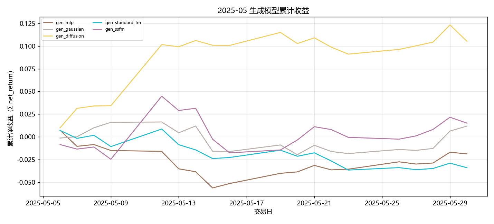
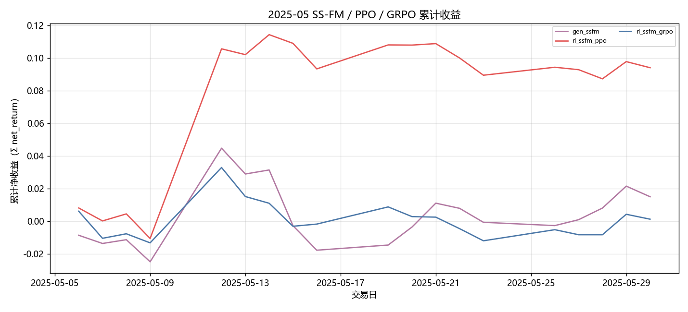
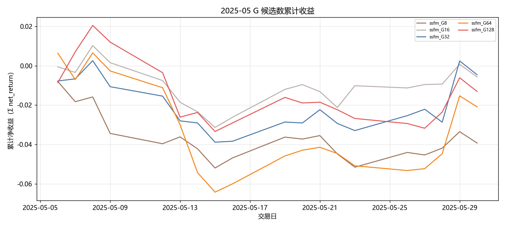
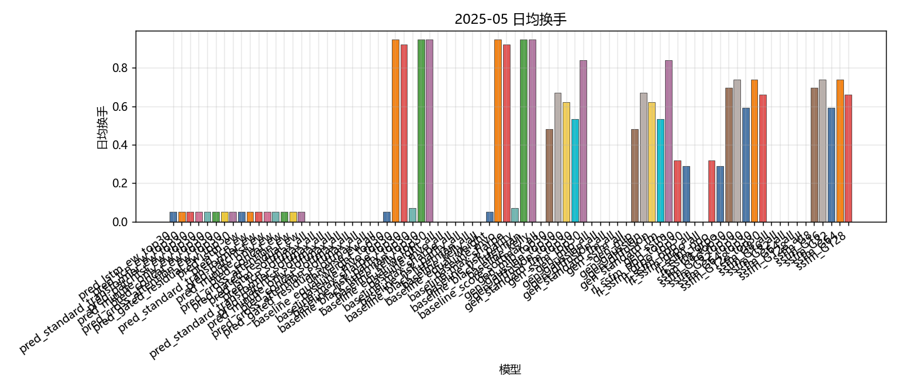
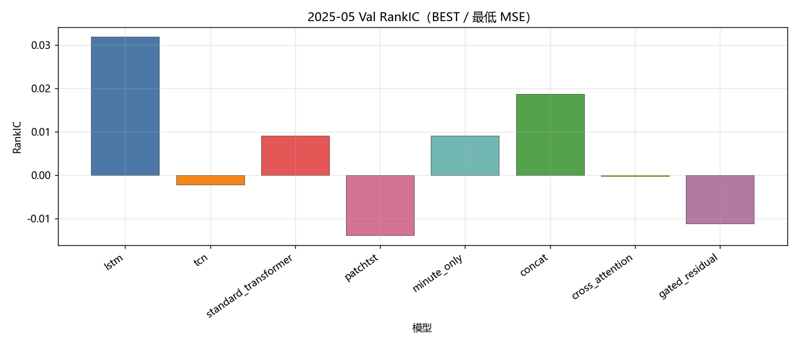
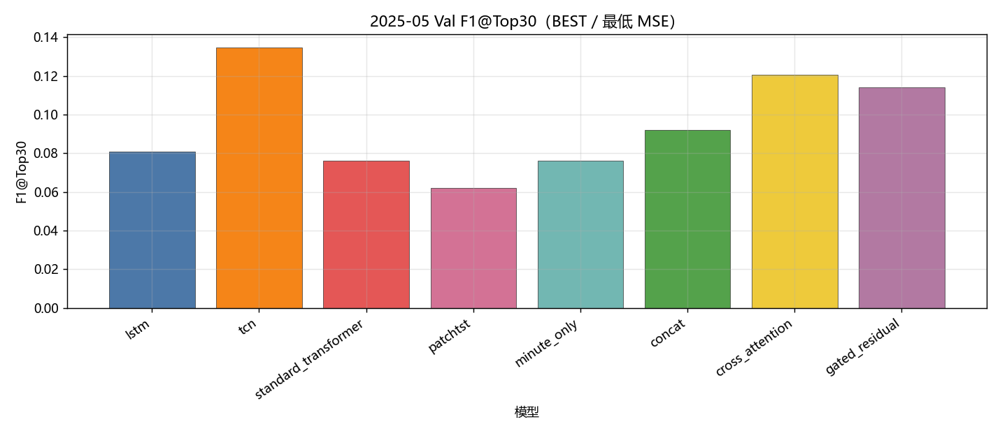
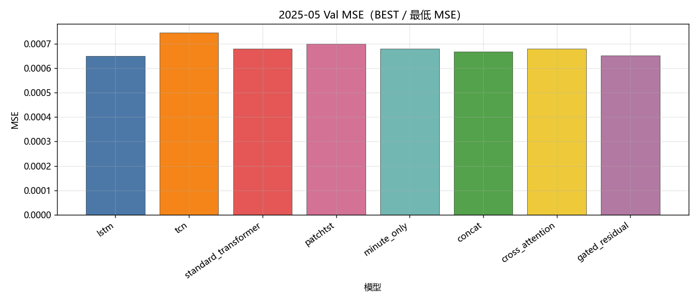
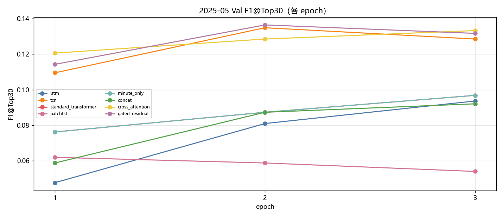
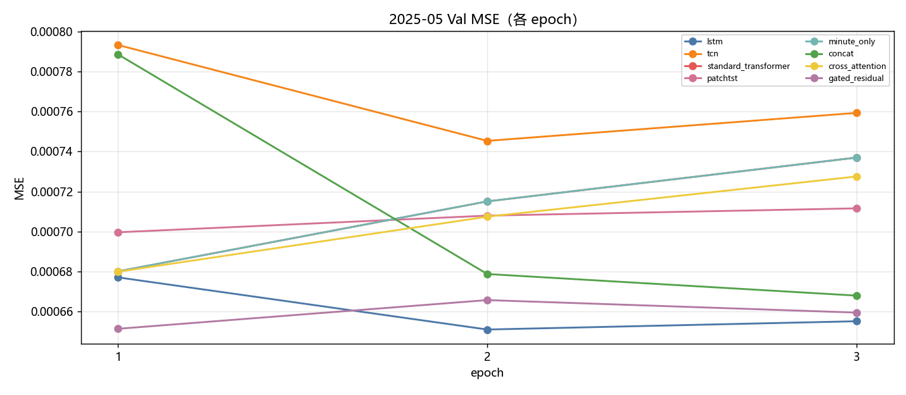
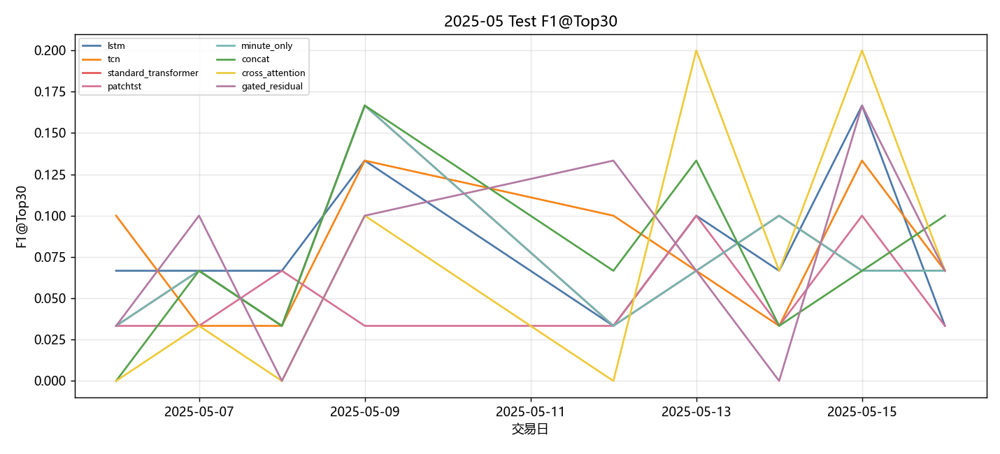

# 2025-05 Sequential OOS 当月实验分析

- 状态: **进行中（39/44 单元已写入）**
- OOS: `sequential_oos_weekly_retrain`
- TopK=30，cost_bps=3.0，primary=`gated_residual`
- 缺测一律 `-`，不补 0、不编造。

## 固定颜色

| 模型 | 颜色 |
| --- | --- |
| lstm | #4C78A8 |
| tcn | #F58518 |
| standard_transformer | #E45756 |
| patchtst | #D37295 |
| minute_only | #72B7B2 |
| concat | #54A24B |
| cross_attention | #EECA3B |
| gated_residual | #B279A2 |

预测骨干日收益曲线用 `pred_<模型>_ew`，颜色与上表相同。

## 实验进度

| unit | model | status |
| --- | --- | --- |
| A 预测 | lstm | 已写入 |
| A 预测 | tcn | 已写入 |
| A 预测 | standard_transformer | 已写入 |
| A 预测 | patchtst | 已写入 |
| A 预测 | minute_only | 已写入 |
| A 预测 | concat | 已写入 |
| A 预测 | cross_attention | 已写入 |
| A 预测 | gated_residual | 已写入 |
| B 组合/top30 | equal_weight | 已写入 |
| B 组合/top30 | mvo | 已写入 |
| B 组合/top30 | max_sharpe | 已写入 |
| B 组合/top30 | risk_parity | 已写入 |
| B 组合/top30 | black_litterman | 已写入 |
| B 组合/top30 | kelly | 已写入 |
| C 生成/top30 | mlp | 已写入 |
| C 生成/top30 | gaussian | 已写入 |
| C 生成/top30 | diffusion | 已写入 |
| C 生成/top30 | standard_fm | 已写入 |
| C 生成/top30 | ssfm | 已写入 |
| D RL/top30 | ssfm_ppo | 已写入 |
| D RL/top30 | ssfm_grpo | 已写入 |
| E G/top30 | G=8 | 已写入 |
| E G/top30 | G=16 | 已写入 |
| E G/top30 | G=32 | 已写入 |
| E G/top30 | G=64 | 已写入 |
| E G/top30 | G=128 | 已写入 |
| B 组合/all | equal_weight | 已写入 |
| B 组合/all | mvo | 已写入 |
| B 组合/all | max_sharpe | 已写入 |
| B 组合/all | risk_parity | 已写入 |
| B 组合/all | black_litterman | 已写入 |
| B 组合/all | kelly | 已写入 |
| C 生成/all | mlp | 已写入 |
| C 生成/all | gaussian | 已写入 |
| C 生成/all | diffusion | 已写入 |
| C 生成/all | standard_fm | 已写入 |
| C 生成/all | ssfm | 已写入 |
| D RL/all | ssfm_ppo | 已写入 |
| D RL/all | ssfm_grpo | 已写入 |
| E G/all | G=8 | - |
| E G/all | G=16 | - |
| E G/all | G=32 | - |
| E G/all | G=64 | - |
| E G/all | G=128 | - |

## 实验设定

- Walk-forward：Train=T-13..T-2，Val=T-1，Test=当月。
- Sequential OOS：周五收盘重训 primary + SS-FM + PPO/GRPO，下周一生效，不回写本周决策。
- 实验 E：SS-FM 候选数 G∈{8,16,32,64,128}。按周五生效窗口加载当时的 primary / SS-FM，当日采样后按 pred_utility 选 1 条；只跑 top30，不跑 500 只 all 池。
- 标签 y = log(Close_D / Open_D)。高严重泄漏 FAIL 的月份不进 final_summary。

## Validation（回归 / 排序）

### 各模型 BEST（按该模型 Val MSE 最低的 epoch）

| model | MSE | MAE | IC | RankIC | topk_f1 | topk_precision | topk_recall | dir_acc | dir_f1 | dir_precision | dir_recall | top30_hit_rate | n |
| --- | --- | --- | --- | --- | --- | --- | --- | --- | --- | --- | --- | --- | --- |
| lstm | 0.000651 | 0.017021 | 0.032957 | 0.031855 | 0.080952 | 0.080952 | 0.080952 | 0.494012 | 0.313172 | 0.526624 | 0.260454 | 0.555556 | 21 |
| tcn | 0.000745 | 0.019256 | 0.014326 | -0.002244 | 0.134921 | 0.134921 | 0.134921 | 0.476777 | 0.014592 | 0.577381 | 0.003964 | 0.501587 | 21 |
| standard_transformer | 0.000680 | 0.017781 | 0.010090 | 0.009059 | 0.076190 | 0.076190 | 0.076190 | 0.485647 | 0.107089 | 0.583617 | 0.066213 | 0.526984 | 21 |
| patchtst | 0.000700 | 0.018135 | -0.005460 | -0.013853 | 0.061905 | 0.061905 | 0.061905 | 0.478033 | 0.016105 | 0.657576 | 0.003119 | 0.493651 | 21 |
| minute_only | 0.000680 | 0.017781 | 0.010090 | 0.009059 | 0.076190 | 0.076190 | 0.076190 | 0.485647 | 0.107089 | 0.583617 | 0.066213 | 0.526984 | 21 |
| concat | 0.000668 | 0.017356 | 0.021868 | 0.018742 | 0.092063 | 0.092063 | 0.092063 | 0.476470 | 0.022587 | 0.583941 | 0.009746 | 0.519048 | 21 |
| cross_attention | 0.000680 | 0.017730 | 0.027373 | -0.000337 | 0.120635 | 0.120635 | 0.120635 | 0.483799 | 0.195859 | 0.510568 | 0.136834 | 0.536508 | 21 |
| gated_residual | 0.000651 | 0.017177 | 0.000548 | -0.011180 | 0.114286 | 0.114286 | 0.114286 | 0.494875 | 0.508914 | 0.501673 | 0.579217 | 0.503175 | 21 |

列含义: `MSE`/`MAE` 是 ŷ 对 y 的误差；`IC` 是 Pearson；`RankIC` 是 Spearman；`topk_f1` 是预测 Top30 ∩ 真实收益 Top30 / 30；`dir_acc` 是涨跌符号一致率；`top30_hit_rate` 是入选 30 只里 y>0 的比例。

### 各 epoch

| model | epoch | MSE | MAE | IC | RankIC | topk_f1 | topk_precision | topk_recall | dir_acc | dir_f1 | dir_precision | dir_recall | top30_hit_rate | n |
| --- | --- | --- | --- | --- | --- | --- | --- | --- | --- | --- | --- | --- | --- | --- |
| lstm | 1 | 0.000677 | 0.017907 | 0.003028 | 0.010324 | 0.047619 | 0.047619 | 0.047619 | 0.523436 | 0.649639 | 0.505577 | 1 | 0.533333 | 21 |
| lstm | 2 | 0.000651 | 0.017021 | 0.032957 | 0.031855 | 0.080952 | 0.080952 | 0.080952 | 0.494012 | 0.313172 | 0.526624 | 0.260454 | 0.555556 | 21 |
| lstm | 3 | 0.000655 | 0.017103 | 0.039575 | 0.036166 | 0.093651 | 0.093651 | 0.093651 | 0.480557 | 0.048175 | 0.580199 | 0.026124 | 0.557143 | 21 |
| tcn | 1 | 0.000793 | 0.020267 | -0.005697 | -0.013850 | 0.109524 | 0.109524 | 0.109524 | 0.475974 | 0.008461 | 0.370370 | 0.000811 | 0.495238 | 21 |
| tcn | 2 | 0.000745 | 0.019256 | 0.014326 | -0.002244 | 0.134921 | 0.134921 | 0.134921 | 0.476777 | 0.014592 | 0.577381 | 0.003964 | 0.501587 | 21 |
| tcn | 3 | 0.000759 | 0.019617 | 0.020580 | -0.000104 | 0.128571 | 0.128571 | 0.128571 | 0.476574 | 0.015612 | 0.550000 | 0.002316 | 0.504762 | 21 |
| standard_transformer | 1 | 0.000680 | 0.017781 | 0.010090 | 0.009059 | 0.076190 | 0.076190 | 0.076190 | 0.485647 | 0.107089 | 0.583617 | 0.066213 | 0.526984 | 21 |
| standard_transformer | 2 | 0.000715 | 0.018681 | 0.018397 | 0.014516 | 0.087302 | 0.087302 | 0.087302 | 0.477550 | 0.021498 | 0.590092 | 0.004721 | 0.519048 | 21 |
| standard_transformer | 3 | 0.000737 | 0.019219 | 0.020903 | 0.011545 | 0.096825 | 0.096825 | 0.096825 | 0.477262 | 0.017252 | 0.616883 | 0.003342 | 0.538095 | 21 |
| patchtst | 1 | 0.000700 | 0.018135 | -0.005460 | -0.013853 | 0.061905 | 0.061905 | 0.061905 | 0.478033 | 0.016105 | 0.657576 | 0.003119 | 0.493651 | 21 |
| patchtst | 2 | 0.000708 | 0.018367 | -0.002858 | -0.011532 | 0.058730 | 0.058730 | 0.058730 | 0.477741 | 0.017159 | 0.814815 | 0.002078 | 0.477778 | 21 |
| patchtst | 3 | 0.000712 | 0.018445 | 0.002304 | -0.005008 | 0.053968 | 0.053968 | 0.053968 | 0.477250 | 0.013737 | 0.766667 | 0.001324 | 0.490476 | 21 |
| minute_only | 1 | 0.000680 | 0.017781 | 0.010090 | 0.009059 | 0.076190 | 0.076190 | 0.076190 | 0.485647 | 0.107089 | 0.583617 | 0.066213 | 0.526984 | 21 |
| minute_only | 2 | 0.000715 | 0.018681 | 0.018397 | 0.014516 | 0.087302 | 0.087302 | 0.087302 | 0.477550 | 0.021498 | 0.590092 | 0.004721 | 0.519048 | 21 |
| minute_only | 3 | 0.000737 | 0.019219 | 0.020903 | 0.011545 | 0.096825 | 0.096825 | 0.096825 | 0.477262 | 0.017252 | 0.616883 | 0.003342 | 0.538095 | 21 |
| concat | 1 | 0.000789 | 0.020080 | 0.011153 | 0.021955 | 0.058730 | 0.058730 | 0.058730 | 0.476565 | 0.006024 | 0.500000 | 0.000144 | 0.517460 | 21 |
| concat | 2 | 0.000679 | 0.017592 | 0.021699 | 0.022914 | 0.087302 | 0.087302 | 0.087302 | 0.476773 | 0.016994 | 0.655873 | 0.005985 | 0.525397 | 21 |
| concat | 3 | 0.000668 | 0.017356 | 0.021868 | 0.018742 | 0.092063 | 0.092063 | 0.092063 | 0.476470 | 0.022587 | 0.583941 | 0.009746 | 0.519048 | 21 |
| cross_attention | 1 | 0.000680 | 0.017730 | 0.027373 | -0.000337 | 0.120635 | 0.120635 | 0.120635 | 0.483799 | 0.195859 | 0.510568 | 0.136834 | 0.536508 | 21 |
| cross_attention | 2 | 0.000707 | 0.018566 | 0.021573 | -0.008073 | 0.128571 | 0.128571 | 0.128571 | 0.478643 | 0.043026 | 0.518143 | 0.021910 | 0.512698 | 21 |
| cross_attention | 3 | 0.000728 | 0.019049 | 0.018755 | -0.009026 | 0.133333 | 0.133333 | 0.133333 | 0.477762 | 0.019049 | 0.584259 | 0.007897 | 0.515873 | 21 |
| gated_residual | 1 | 0.000651 | 0.017177 | 0.000548 | -0.011180 | 0.114286 | 0.114286 | 0.114286 | 0.494875 | 0.508914 | 0.501673 | 0.579217 | 0.503175 | 21 |
| gated_residual | 2 | 0.000666 | 0.017508 | 0.009096 | -0.006154 | 0.136508 | 0.136508 | 0.136508 | 0.485877 | 0.187724 | 0.484522 | 0.129502 | 0.488889 | 21 |
| gated_residual | 3 | 0.000659 | 0.017333 | 0.009927 | -0.005723 | 0.131746 | 0.131746 | 0.131746 | 0.484862 | 0.274033 | 0.495179 | 0.216012 | 0.500000 | 21 |

## Test 预测指标（日均）

| model | MSE | MAE | IC | RankIC | topk_f1 | topk_precision | topk_recall | dir_acc | dir_f1 | dir_precision | dir_recall | top30_hit_rate | top30_excess | n |
| --- | --- | --- | --- | --- | --- | --- | --- | --- | --- | --- | --- | --- | --- | --- |
| lstm | 0.000300 | 0.012113 | 0.041655 | 0.068092 | 0.081481 | 0.081481 | 0.081481 | 0.503425 | 0.233266 | 0.448341 | 0.206643 | 0.470833 | -0.000226 | 19 |
| tcn | 0.000356 | 0.013619 | -0.026281 | -0.042529 | 0.077778 | 0.077778 | 0.077778 | 0.534058 | 0.027211 | 0.296296 | 0.004799 | 0.438889 | -0.002116 | 19 |
| standard_transformer | 0.000317 | 0.012644 | 0.003673 | 0.008710 | 0.070370 | 0.070370 | 0.070370 | 0.540029 | 0.161871 | 0.488291 | 0.099625 | 0.466667 | 0.000435 | 19 |
| patchtst | 0.000325 | 0.012701 | 0.000970 | -0.006791 | 0.051852 | 0.051852 | 0.051852 | 0.536381 | 0.011223 | 0.833333 | 0.001889 | 0.413889 | 0.000187 | 19 |
| minute_only | 0.000317 | 0.012644 | 0.003673 | 0.008710 | 0.070370 | 0.070370 | 0.070370 | 0.540029 | 0.161871 | 0.488291 | 0.099625 | 0.466667 | 0.000435 | 19 |
| concat | 0.000305 | 0.012221 | -0.018413 | 0.001539 | 0.074074 | 0.074074 | 0.074074 | 0.533368 | 0.026481 | 0.409764 | 0.012407 | 0.438889 | -0.000868 | 19 |
| cross_attention | 0.000318 | 0.012616 | -0.030468 | -0.030386 | 0.074074 | 0.074074 | 0.074074 | 0.521447 | 0.216605 | 0.413327 | 0.161014 | 0.405556 | -0.001939 | 19 |
| gated_residual | 0.000306 | 0.012243 | -0.002386 | 0.002724 | 0.074074 | 0.074074 | 0.074074 | 0.544453 | 0.437689 | 0.365940 | 0.297848 | 0.418056 | -0.000720 | 19 |

## 组合绩效

| model | total_net_return | ann_return | sharpe | max_drawdown | mean_turnover | mean_cost | n_days |
| --- | --- | --- | --- | --- | --- | --- | --- |
| pred_lstm_ew_top30 | -0.0136 | -0.1666 | -1.7471 | 0.0311 | 0.0526 | 0.0000 | 19 |
| pred_tcn_ew_top30 | -0.0527 | -0.5126 | -4.3122 | 0.0816 | 0.0526 | 0.0000 | 19 |
| pred_standard_transformer_ew_top30 | -0.0019 | -0.0246 | -0.2131 | 0.0218 | 0.0526 | 0.0000 | 19 |
| pred_patchtst_ew_top30 | -0.0009 | -0.0115 | -0.1199 | 0.0280 | 0.0526 | 0.0000 | 19 |
| pred_minute_only_ew_top30 | -0.0019 | -0.0246 | -0.2131 | 0.0218 | 0.0526 | 0.0000 | 19 |
| pred_concat_ew_top30 | -0.0205 | -0.2398 | -2.7699 | 0.0376 | 0.0526 | 0.0000 | 19 |
| pred_cross_attention_ew_top30 | -0.0537 | -0.5189 | -6.6780 | 0.0601 | 0.0526 | 0.0000 | 19 |
| pred_gated_residual_ew_top30 | -0.0294 | -0.3268 | -3.1155 | 0.0493 | 0.0526 | 0.0000 | 19 |
| pred_lstm_ew | -0.0136 | -0.1666 | -1.7471 | 0.0311 | 0.0526 | 0.0000 | 19 |
| pred_tcn_ew | -0.0527 | -0.5126 | -4.3122 | 0.0816 | 0.0526 | 0.0000 | 19 |
| pred_standard_transformer_ew | -0.0019 | -0.0246 | -0.2131 | 0.0218 | 0.0526 | 0.0000 | 19 |
| pred_patchtst_ew | -0.0009 | -0.0115 | -0.1199 | 0.0280 | 0.0526 | 0.0000 | 19 |
| pred_minute_only_ew | -0.0019 | -0.0246 | -0.2131 | 0.0218 | 0.0526 | 0.0000 | 19 |
| pred_concat_ew | -0.0205 | -0.2398 | -2.7699 | 0.0376 | 0.0526 | 0.0000 | 19 |
| pred_cross_attention_ew | -0.0537 | -0.5189 | -6.6780 | 0.0601 | 0.0526 | 0.0000 | 19 |
| pred_gated_residual_ew | -0.0294 | -0.3268 | -3.1155 | 0.0493 | 0.0526 | 0.0000 | 19 |
| pred_lstm_softmax_all | - | - | - | - | - | - | - |
| pred_tcn_softmax_all | - | - | - | - | - | - | - |
| pred_standard_transformer_softmax_all | - | - | - | - | - | - | - |
| pred_patchtst_softmax_all | - | - | - | - | - | - | - |
| pred_minute_only_softmax_all | - | - | - | - | - | - | - |
| pred_concat_softmax_all | - | - | - | - | - | - | - |
| pred_cross_attention_softmax_all | - | - | - | - | - | - | - |
| pred_gated_residual_softmax_all | - | - | - | - | - | - | - |
| universe_ew_all | - | - | - | - | - | - | - |
| baseline_equal_weight_top30 | -0.0294 | -0.3268 | -3.1155 | 0.0493 | 0.0526 | 0.0000 | 19 |
| baseline_mvo_top30 | 0.0385 | 0.6512 | 2.7161 | 0.0384 | 0.9474 | 0.0003 | 19 |
| baseline_max_sharpe_top30 | 0.0268 | 0.4202 | 1.8839 | 0.0285 | 0.9211 | 0.0003 | 19 |
| baseline_risk_parity_top30 | -0.0299 | -0.3314 | -3.2757 | 0.0495 | 0.0711 | 0.0000 | 19 |
| baseline_black_litterman_top30 | 0.0481 | 0.8656 | 3.4347 | 0.0384 | 0.9474 | 0.0003 | 19 |
| baseline_kelly_top30 | 0.0385 | 0.6512 | 2.7161 | 0.0384 | 0.9474 | 0.0003 | 19 |
| baseline_equal_weight_all | - | - | - | - | - | - | - |
| baseline_mvo_all | - | - | - | - | - | - | - |
| baseline_max_sharpe_all | - | - | - | - | - | - | - |
| baseline_risk_parity_all | - | - | - | - | - | - | - |
| baseline_black_litterman_all | - | - | - | - | - | - | - |
| baseline_kelly_all | - | - | - | - | - | - | - |
| baseline_equal_weight | -0.0294 | -0.3268 | -3.1155 | 0.0493 | 0.0526 | 0.0000 | 19 |
| baseline_mvo | 0.0385 | 0.6512 | 2.7161 | 0.0384 | 0.9474 | 0.0003 | 19 |
| baseline_max_sharpe | 0.0268 | 0.4202 | 1.8839 | 0.0285 | 0.9211 | 0.0003 | 19 |
| baseline_risk_parity | -0.0299 | -0.3314 | -3.2757 | 0.0495 | 0.0711 | 0.0000 | 19 |
| baseline_black_litterman | 0.0481 | 0.8656 | 3.4347 | 0.0384 | 0.9474 | 0.0003 | 19 |
| baseline_kelly | 0.0385 | 0.6512 | 2.7161 | 0.0384 | 0.9474 | 0.0003 | 19 |
| baseline_score_softmax_all | - | - | - | - | - | - | - |
| gen_mlp_top30 | -0.0186 | -0.2209 | -1.7442 | 0.0617 | 0.4815 | 0.0001 | 19 |
| gen_gaussian_top30 | 0.0119 | 0.1698 | 1.0005 | 0.0354 | 0.6692 | 0.0002 | 19 |
| gen_diffusion_top30 | 0.1110 | 3.0417 | 4.9904 | 0.0236 | 0.6221 | 0.0002 | 19 |
| gen_standard_fm_top30 | -0.0335 | -0.3636 | -3.3033 | 0.0442 | 0.5321 | 0.0002 | 19 |
| gen_ssfm_top30 | 0.0152 | 0.2214 | 0.6353 | 0.0605 | 0.8388 | 0.0003 | 19 |
| gen_mlp_all | - | - | - | - | - | - | - |
| gen_gaussian_all | - | - | - | - | - | - | - |
| gen_diffusion_all | - | - | - | - | - | - | - |
| gen_standard_fm_all | - | - | - | - | - | - | - |
| gen_ssfm_all | - | - | - | - | - | - | - |
| gen_mlp | -0.0186 | -0.2209 | -1.7442 | 0.0617 | 0.4815 | 0.0001 | 19 |
| gen_gaussian | 0.0119 | 0.1698 | 1.0005 | 0.0354 | 0.6692 | 0.0002 | 19 |
| gen_diffusion | 0.1110 | 3.0417 | 4.9904 | 0.0236 | 0.6221 | 0.0002 | 19 |
| gen_standard_fm | -0.0335 | -0.3636 | -3.3033 | 0.0442 | 0.5321 | 0.0002 | 19 |
| gen_ssfm | 0.0152 | 0.2214 | 0.6353 | 0.0605 | 0.8388 | 0.0003 | 19 |
| rl_ssfm_ppo_top30 | 0.0986 | 2.4820 | 2.8531 | 0.0267 | 0.3173 | 0.0001 | 19 |
| rl_ssfm_grpo_top30 | 0.0013 | 0.0177 | 0.0818 | 0.0439 | 0.2880 | 0.0001 | 19 |
| rl_ssfm_ppo_all | - | - | - | - | - | - | - |
| rl_ssfm_grpo_all | - | - | - | - | - | - | - |
| rl_ssfm_ppo | 0.0986 | 2.4820 | 2.8531 | 0.0267 | 0.3173 | 0.0001 | 19 |
| rl_ssfm_grpo | 0.0013 | 0.0177 | 0.0818 | 0.0439 | 0.2880 | 0.0001 | 19 |
| ssfm_G8_top30 | -0.0385 | -0.4062 | -4.3962 | 0.0431 | 0.6979 | 0.0002 | 19 |
| ssfm_G16_top30 | -0.0056 | -0.0721 | -0.6083 | 0.0408 | 0.7389 | 0.0002 | 19 |
| ssfm_G32_top30 | -0.0045 | -0.0581 | -0.3739 | 0.0406 | 0.5918 | 0.0002 | 19 |
| ssfm_G64_top30 | -0.0207 | -0.2420 | -1.4300 | 0.0684 | 0.7374 | 0.0002 | 19 |
| ssfm_G128_top30 | -0.0130 | -0.1589 | -1.0414 | 0.0526 | 0.6608 | 0.0002 | 19 |
| ssfm_G8_all | - | - | - | - | - | - | - |
| ssfm_G16_all | - | - | - | - | - | - | - |
| ssfm_G32_all | - | - | - | - | - | - | - |
| ssfm_G64_all | - | - | - | - | - | - | - |
| ssfm_G128_all | - | - | - | - | - | - | - |
| ssfm_G8 | -0.0385 | -0.4062 | -4.3962 | 0.0431 | 0.6979 | 0.0002 | 19 |
| ssfm_G16 | -0.0056 | -0.0721 | -0.6083 | 0.0408 | 0.7389 | 0.0002 | 19 |
| ssfm_G32 | -0.0045 | -0.0581 | -0.3739 | 0.0406 | 0.5918 | 0.0002 | 19 |
| ssfm_G64 | -0.0207 | -0.2420 | -1.4300 | 0.0684 | 0.7374 | 0.0002 | 19 |
| ssfm_G128 | -0.0130 | -0.1589 | -1.0414 | 0.0526 | 0.6608 | 0.0002 | 19 |

## 日均换手

| model | mean_turnover |
| --- | --- |
| pred_lstm_ew_top30 | 0.0526 |
| pred_tcn_ew_top30 | 0.0526 |
| pred_standard_transformer_ew_top30 | 0.0526 |
| pred_patchtst_ew_top30 | 0.0526 |
| pred_minute_only_ew_top30 | 0.0526 |
| pred_concat_ew_top30 | 0.0526 |
| pred_cross_attention_ew_top30 | 0.0526 |
| pred_gated_residual_ew_top30 | 0.0526 |
| pred_lstm_ew | 0.0526 |
| pred_tcn_ew | 0.0526 |
| pred_standard_transformer_ew | 0.0526 |
| pred_patchtst_ew | 0.0526 |
| pred_minute_only_ew | 0.0526 |
| pred_concat_ew | 0.0526 |
| pred_cross_attention_ew | 0.0526 |
| pred_gated_residual_ew | 0.0526 |
| pred_lstm_softmax_all | - |
| pred_tcn_softmax_all | - |
| pred_standard_transformer_softmax_all | - |
| pred_patchtst_softmax_all | - |
| pred_minute_only_softmax_all | - |
| pred_concat_softmax_all | - |
| pred_cross_attention_softmax_all | - |
| pred_gated_residual_softmax_all | - |
| universe_ew_all | - |
| baseline_equal_weight_top30 | 0.0526 |
| baseline_mvo_top30 | 0.9474 |
| baseline_max_sharpe_top30 | 0.9211 |
| baseline_risk_parity_top30 | 0.0711 |
| baseline_black_litterman_top30 | 0.9474 |
| baseline_kelly_top30 | 0.9474 |
| baseline_equal_weight_all | - |
| baseline_mvo_all | - |
| baseline_max_sharpe_all | - |
| baseline_risk_parity_all | - |
| baseline_black_litterman_all | - |
| baseline_kelly_all | - |
| baseline_equal_weight | 0.0526 |
| baseline_mvo | 0.9474 |
| baseline_max_sharpe | 0.9211 |
| baseline_risk_parity | 0.0711 |
| baseline_black_litterman | 0.9474 |
| baseline_kelly | 0.9474 |
| baseline_score_softmax_all | - |
| gen_mlp_top30 | 0.4815 |
| gen_gaussian_top30 | 0.6692 |
| gen_diffusion_top30 | 0.6221 |
| gen_standard_fm_top30 | 0.5321 |
| gen_ssfm_top30 | 0.8388 |
| gen_mlp_all | - |
| gen_gaussian_all | - |
| gen_diffusion_all | - |
| gen_standard_fm_all | - |
| gen_ssfm_all | - |
| gen_mlp | 0.4815 |
| gen_gaussian | 0.6692 |
| gen_diffusion | 0.6221 |
| gen_standard_fm | 0.5321 |
| gen_ssfm | 0.8388 |
| rl_ssfm_ppo_top30 | 0.3173 |
| rl_ssfm_grpo_top30 | 0.2880 |
| rl_ssfm_ppo_all | - |
| rl_ssfm_grpo_all | - |
| rl_ssfm_ppo | 0.3173 |
| rl_ssfm_grpo | 0.2880 |
| ssfm_G8_top30 | 0.6979 |
| ssfm_G16_top30 | 0.7389 |
| ssfm_G32_top30 | 0.5918 |
| ssfm_G64_top30 | 0.7374 |
| ssfm_G128_top30 | 0.6608 |
| ssfm_G8_all | - |
| ssfm_G16_all | - |
| ssfm_G32_all | - |
| ssfm_G64_all | - |
| ssfm_G128_all | - |
| ssfm_G8 | 0.6979 |
| ssfm_G16 | 0.7389 |
| ssfm_G32 | 0.5918 |
| ssfm_G64 | 0.7374 |
| ssfm_G128 | 0.6608 |

## 图（颜色已固定，无数据时只画轴）

### 预测骨干累计收益

固定颜色: `pred_lstm_ew` `#4C78A8`；`pred_tcn_ew` `#F58518`；`pred_standard_transformer_ew` `#E45756`；`pred_patchtst_ew` `#D37295`；`pred_minute_only_ew` `#72B7B2`；`pred_concat_ew` `#54A24B`；`pred_cross_attention_ew` `#EECA3B`；`pred_gated_residual_ew` `#B279A2`。

### 组合基线累计收益

固定颜色: `baseline_equal_weight` `#4C78A8`；`baseline_mvo` `#F58518`；`baseline_max_sharpe` `#E45756`；`baseline_risk_parity` `#72B7B2`；`baseline_black_litterman` `#54A24B`；`baseline_kelly` `#B279A2`。

### 生成模型累计收益

固定颜色: `gen_mlp` `#9D755D`；`gen_gaussian` `#BAB0AC`；`gen_diffusion` `#F2CF5B`；`gen_standard_fm` `#17BECF`；`gen_ssfm` `#B279A2`。

### RL 累计收益

固定颜色: `gen_ssfm` `#B279A2`；`rl_ssfm_ppo` `#E45756`；`rl_ssfm_grpo` `#4C78A8`。

### G 曲线累计收益

固定颜色: `ssfm_G8` `#9D755D`；`ssfm_G16` `#BAB0AC`；`ssfm_G32` `#4C78A8`；`ssfm_G64` `#F58518`；`ssfm_G128` `#E45756`。

### 日均换手

固定颜色: `pred_lstm_ew_top30` `#4C78A8`；`pred_tcn_ew_top30` `#F58518`；`pred_standard_transformer_ew_top30` `#E45756`；`pred_patchtst_ew_top30` `#D37295`；`pred_minute_only_ew_top30` `#72B7B2`；`pred_concat_ew_top30` `#54A24B`；`pred_cross_attention_ew_top30` `#EECA3B`；`pred_gated_residual_ew_top30` `#B279A2`；`pred_lstm_ew` `#4C78A8`；`pred_tcn_ew` `#F58518`；`pred_standard_transformer_ew` `#E45756`；`pred_patchtst_ew` `#D37295`；`pred_minute_only_ew` `#72B7B2`；`pred_concat_ew` `#54A24B`；`pred_cross_attention_ew` `#EECA3B`；`pred_gated_residual_ew` `#B279A2`；`pred_lstm_softmax_all` `#7F7F7F`；`pred_tcn_softmax_all` `#7F7F7F`；`pred_standard_transformer_softmax_all` `#7F7F7F`；`pred_patchtst_softmax_all` `#7F7F7F`；`pred_minute_only_softmax_all` `#7F7F7F`；`pred_concat_softmax_all` `#7F7F7F`；`pred_cross_attention_softmax_all` `#7F7F7F`；`pred_gated_residual_softmax_all` `#7F7F7F`；`universe_ew_all` `#7F7F7F`；`baseline_equal_weight_top30` `#4C78A8`；`baseline_mvo_top30` `#F58518`；`baseline_max_sharpe_top30` `#E45756`；`baseline_risk_parity_top30` `#72B7B2`；`baseline_black_litterman_top30` `#54A24B`；`baseline_kelly_top30` `#B279A2`；`baseline_equal_weight_all` `#4C78A8`；`baseline_mvo_all` `#F58518`；`baseline_max_sharpe_all` `#E45756`；`baseline_risk_parity_all` `#72B7B2`；`baseline_black_litterman_all` `#54A24B`；`baseline_kelly_all` `#B279A2`；`baseline_equal_weight` `#4C78A8`；`baseline_mvo` `#F58518`；`baseline_max_sharpe` `#E45756`；`baseline_risk_parity` `#72B7B2`；`baseline_black_litterman` `#54A24B`；`baseline_kelly` `#B279A2`；`baseline_score_softmax_all` `#7F7F7F`；`gen_mlp_top30` `#9D755D`；`gen_gaussian_top30` `#BAB0AC`；`gen_diffusion_top30` `#F2CF5B`；`gen_standard_fm_top30` `#17BECF`；`gen_ssfm_top30` `#B279A2`；`gen_mlp_all` `#9D755D`；`gen_gaussian_all` `#BAB0AC`；`gen_diffusion_all` `#F2CF5B`；`gen_standard_fm_all` `#17BECF`；`gen_ssfm_all` `#B279A2`；`gen_mlp` `#9D755D`；`gen_gaussian` `#BAB0AC`；`gen_diffusion` `#F2CF5B`；`gen_standard_fm` `#17BECF`；`gen_ssfm` `#B279A2`；`rl_ssfm_ppo_top30` `#E45756`；`rl_ssfm_grpo_top30` `#4C78A8`；`rl_ssfm_ppo_all` `#E45756`；`rl_ssfm_grpo_all` `#4C78A8`；`rl_ssfm_ppo` `#E45756`；`rl_ssfm_grpo` `#4C78A8`；`ssfm_G8_top30` `#9D755D`；`ssfm_G16_top30` `#BAB0AC`；`ssfm_G32_top30` `#4C78A8`；`ssfm_G64_top30` `#F58518`；`ssfm_G128_top30` `#E45756`；`ssfm_G8_all` `#9D755D`；`ssfm_G16_all` `#BAB0AC`；`ssfm_G32_all` `#4C78A8`；`ssfm_G64_all` `#F58518`；`ssfm_G128_all` `#E45756`；`ssfm_G8` `#9D755D`；`ssfm_G16` `#BAB0AC`；`ssfm_G32` `#4C78A8`；`ssfm_G64` `#F58518`；`ssfm_G128` `#E45756`。

### Val IC

固定颜色: `lstm` `#4C78A8`；`tcn` `#F58518`；`standard_transformer` `#E45756`；`patchtst` `#D37295`；`minute_only` `#72B7B2`；`concat` `#54A24B`；`cross_attention` `#EECA3B`；`gated_residual` `#B279A2`。

### Val RankIC

固定颜色: `lstm` `#4C78A8`；`tcn` `#F58518`；`standard_transformer` `#E45756`；`patchtst` `#D37295`；`minute_only` `#72B7B2`；`concat` `#54A24B`；`cross_attention` `#EECA3B`；`gated_residual` `#B279A2`。

### Val F1@Top30

固定颜色: `lstm` `#4C78A8`；`tcn` `#F58518`；`standard_transformer` `#E45756`；`patchtst` `#D37295`；`minute_only` `#72B7B2`；`concat` `#54A24B`；`cross_attention` `#EECA3B`；`gated_residual` `#B279A2`。

### Val MSE

固定颜色: `lstm` `#4C78A8`；`tcn` `#F58518`；`standard_transformer` `#E45756`；`patchtst` `#D37295`；`minute_only` `#72B7B2`；`concat` `#54A24B`；`cross_attention` `#EECA3B`；`gated_residual` `#B279A2`。

### Val IC 各 epoch

固定颜色: `lstm` `#4C78A8`；`tcn` `#F58518`；`standard_transformer` `#E45756`；`patchtst` `#D37295`；`minute_only` `#72B7B2`；`concat` `#54A24B`；`cross_attention` `#EECA3B`；`gated_residual` `#B279A2`。

### Val RankIC 各 epoch

固定颜色: `lstm` `#4C78A8`；`tcn` `#F58518`；`standard_transformer` `#E45756`；`patchtst` `#D37295`；`minute_only` `#72B7B2`；`concat` `#54A24B`；`cross_attention` `#EECA3B`；`gated_residual` `#B279A2`。

### Val F1@Top30 各 epoch

固定颜色: `lstm` `#4C78A8`；`tcn` `#F58518`；`standard_transformer` `#E45756`；`patchtst` `#D37295`；`minute_only` `#72B7B2`；`concat` `#54A24B`；`cross_attention` `#EECA3B`；`gated_residual` `#B279A2`。

### Val MSE 各 epoch

固定颜色: `lstm` `#4C78A8`；`tcn` `#F58518`；`standard_transformer` `#E45756`；`patchtst` `#D37295`；`minute_only` `#72B7B2`；`concat` `#54A24B`；`cross_attention` `#EECA3B`；`gated_residual` `#B279A2`。

### Test IC

固定颜色: `lstm` `#4C78A8`；`tcn` `#F58518`；`standard_transformer` `#E45756`；`patchtst` `#D37295`；`minute_only` `#72B7B2`；`concat` `#54A24B`；`cross_attention` `#EECA3B`；`gated_residual` `#B279A2`。

### Test RankIC

固定颜色: `lstm` `#4C78A8`；`tcn` `#F58518`；`standard_transformer` `#E45756`；`patchtst` `#D37295`；`minute_only` `#72B7B2`；`concat` `#54A24B`；`cross_attention` `#EECA3B`；`gated_residual` `#B279A2`。

### Test F1@Top30

固定颜色: `lstm` `#4C78A8`；`tcn` `#F58518`；`standard_transformer` `#E45756`；`patchtst` `#D37295`；`minute_only` `#72B7B2`；`concat` `#54A24B`；`cross_attention` `#EECA3B`；`gated_residual` `#B279A2`。

### Test Hit@Top30

固定颜色: `lstm` `#4C78A8`；`tcn` `#F58518`；`standard_transformer` `#E45756`；`patchtst` `#D37295`；`minute_only` `#72B7B2`；`concat` `#54A24B`；`cross_attention` `#EECA3B`；`gated_residual` `#B279A2`。

## 图对应数据表

- 累计收益 ← `tables/backtest_daily.csv` 的 `net_return` 累加。
- 绩效 / 换手 ← `tables/performance_summary.csv`。
- Val ← `tables/val_best.csv`、`tables/val_epochs.csv`。
- Test 预测 ← `tables/prediction_metrics_mean.csv`。

## 分析

以下只讨论**已经写入数字**的行；单元格为 `-` 的表示该实验尚未跑完，不编造。
来源: run_g_grid_month 2025-05 weekly SS-FM。OOS=`sequential_oos_weekly_retrain`，费用=3.0bps，TopK=30。

最近完成单元: `E-G top30`。
已有数据的对象: `lstm`, `tcn`, `standard_transformer`, `patchtst`, `minute_only`, `concat`, `cross_attention`, `gated_residual`, `equal_weight`, `mvo`, `max_sharpe`, `risk_parity`, `black_litterman`, `kelly`, `mlp`, `gaussian`, `diffusion`, `standard_fm`, `ssfm`, `ssfm_ppo`, `ssfm_grpo`, `G=8`, `G=16`, `G=32`, `G=64`, `G=128`, `equal_weight`, `mvo`, `max_sharpe`, `risk_parity`, `black_litterman`, `kelly`, `mlp`, `gaussian`, `diffusion`, `standard_fm`, `ssfm`, `ssfm_ppo`, `ssfm_grpo`。
- Val IC 目前最高: `lstm` = 0.0330。
- Val F1@Top30 目前最高: `tcn` = 0.1349（随机约 0.06）。
- Val MSE 目前最低（入选口径）: `lstm` = 0.000651。
- Test 日均 IC 目前最高: `lstm` = 0.0417。
- 已回测净值目前最高: `gen_diffusion` 累计净收益 0.1110，Sharpe 4.9904。
- 实验 E（G 候选数，top30）累计净收益最高: `ssfm_G32` = -0.0045（G=8 -0.0385；G=16 -0.0056；G=32 -0.0045；G=64 -0.0207；G=128 -0.0130）。

## 实验 E：G 候选数

只跑 top30。每个交易日加载当时周五生效的 primary / SS-FM，采 G 条权重后按 pred_utility 选 1 条。与默认 `gen_ssfm`（固定 default_g）不是同一条抽样路径。

| G | 累计净收益 | Sharpe | 最大回撤 | 日均换手 | 天数 |
| --- | --- | --- | --- | --- | --- |
| G=8 | -0.0385 | -4.3962 | 0.0431 | 0.6979 | 19 |
| G=16 | -0.0056 | -0.6083 | 0.0408 | 0.7389 | 19 |
| G=32 | -0.0045 | -0.3739 | 0.0406 | 0.5918 | 19 |
| G=64 | -0.0207 | -1.4300 | 0.0684 | 0.7374 | 19 |
| G=128 | -0.0130 | -1.0414 | 0.0526 | 0.6608 | 19 |

本月网格里累计净收益最好的是 `ssfm_G32`。更大的 G 没有单调变好。
