> 本文档记录**不选 Top30、全股池 long-only simplex 配权**实验（预测 `lstm` minute-only，生成 MLP / Gaussian / FM / Diffusion / SS-FM，强化学习 PPO/GRPO）。
> 与同月 Top30 选股实验的 `实验分析.md` 分开；缺测一律 `-`，不补 0、不编造。

# 2025-05 全股池配权 Sequential OOS 实验分析

- 状态: **进行中（13/15 单元已写入）**
- OOS: `sequential_oos_weekly_retrain`
- 配权=全股池 long-only simplex（不做 Top30 截断），cost_bps=3.0，primary=`lstm`
- 缺测一律 `-`，不补 0、不编造。

## 固定颜色

| 模型 | 颜色 |
| --- | --- |
| lstm | #4C78A8 |

预测骨干日收益曲线用 `pred_<模型>_softmax_all`，颜色与上表相同。

## 实验进度

| unit | model | status |
| --- | --- | --- |
| A 预测 | lstm | 已写入 |
| B 组合/all | equal_weight | 已写入 |
| B 组合/all | mvo | 已写入 |
| B 组合/all | max_sharpe | 已写入 |
| B 组合/all | risk_parity | 已写入 |
| B 组合/all | kelly | 已写入 |
| C 生成/all | mlp | - |
| C 生成/all | gaussian | - |
| C 生成/all | standard_fm | 已写入 |
| C 生成/all | diffusion | 已写入 |
| C 生成/all | ssfm | 已写入 |
| D RL/all | ssfm_ppo | 已写入 |
| D RL/all | ssfm_grpo | 已写入 |
| E G/all | G=8 | 已写入 |
| E G/all | G=16 | 已写入 |

## 实验设定

- Walk-forward：Train=T-13..T-2，Val=T-1，Test=当月。
- Sequential OOS：周五收盘重训 primary + MLP / Gaussian / FM / Diffusion / SS-FM + PPO/GRPO，下周一生效，不回写本周决策。
- 配权在当日有效中证500全股池上完成，不再做 Top30 截断。
- 实验 E：SS-FM 候选数 G∈{8,16}。按周五生效窗口加载当时的 primary / SS-FM，当日采样后按 pred_utility 选 1 条。
- 标签 y = Close_{t+1}/Close_t - 1（下一日 close-to-close）。高严重泄漏 FAIL 的月份不进 final_summary。

## Validation（回归 / 排序）

### 各模型 BEST（按该模型 Val MSE 最低的 epoch）

| model | MSE | MAE | IC | RankIC | topk_f1 | topk_precision | topk_recall | dir_acc | dir_f1 | dir_precision | dir_recall | top30_hit_rate | n |
| --- | --- | --- | --- | --- | --- | --- | --- | --- | --- | --- | --- | --- | --- |
| lstm | 0.001141 | 0.020724 | 0.007530 | -0.000268 | 0.061667 | 0.061667 | 0.061667 | 0.490392 | - | 0.000000 | 0.000000 | 0.486667 | 20 |

列含义: `MSE`/`MAE` 是 ŷ 对 y 的误差；`IC` 是 Pearson；`RankIC` 是 Spearman；`topk_f1` 是预测 Top30 ∩ 真实收益 Top30 / 30；`dir_acc` 是涨跌符号一致率；`top30_hit_rate` 是入选 30 只里 y>0 的比例。

### 各 epoch

| model | epoch | MSE | MAE | IC | RankIC | topk_f1 | topk_precision | topk_recall | dir_acc | dir_f1 | dir_precision | dir_recall | top30_hit_rate | n |
| --- | --- | --- | --- | --- | --- | --- | --- | --- | --- | --- | --- | --- | --- | --- |
| lstm | 1 | 0.001155 | 0.021454 | 0.014361 | 0.016532 | 0.048333 | 0.048333 | 0.048333 | 0.490493 | - | - | 0.000000 | 0.501667 | 20 |
| lstm | 2 | 0.001141 | 0.020839 | 0.007571 | 0.004833 | 0.056667 | 0.056667 | 0.056667 | 0.490493 | - | - | 0.000000 | 0.505000 | 20 |
| lstm | 3 | 0.001141 | 0.020724 | 0.007530 | -0.000268 | 0.061667 | 0.061667 | 0.061667 | 0.490392 | - | 0.000000 | 0.000000 | 0.486667 | 20 |

## Test 预测指标（日均）

| model | MSE | MAE | IC | RankIC | topk_f1 | topk_precision | topk_recall | dir_acc | dir_f1 | dir_precision | dir_recall | top30_hit_rate | top30_excess | n |
| --- | --- | --- | --- | --- | --- | --- | --- | --- | --- | --- | --- | --- | --- | --- |
| lstm | 0.000470 | 0.013839 | 0.028815 | 0.006534 | - | - | - | - | - | - | - | 0.446667 | 0.000786 | 15 |

## 组合绩效

| model | total_net_return | ann_return | sharpe | max_drawdown | mean_turnover | mean_cost | n_days |
| --- | --- | --- | --- | --- | --- | --- | --- |
| pred_lstm_softmax_all | 0.4223 | - | 6.2263 | 0.0174 | 0.4519 | 0.0001 | 15 |
| universe_ew_all | -0.0188 | -0.2734 | -2.7791 | 0.0288 | 0.0364 | 0.0000 | 15 |
| baseline_equal_weight_all | -0.0188 | -0.2734 | -2.7791 | 0.0288 | 0.0364 | 0.0000 | 15 |
| baseline_mvo_all | -0.4295 | -0.9999 | -7.3818 | 0.4314 | 0.3000 | 0.0001 | 15 |
| baseline_max_sharpe_all | -0.4295 | -0.9999 | -7.3818 | 0.4314 | 0.3000 | 0.0001 | 15 |
| baseline_risk_parity_all | -0.0186 | -0.2703 | -2.7489 | 0.0286 | 0.0364 | 0.0000 | 15 |
| baseline_kelly_all | -0.4295 | -0.9999 | -7.3818 | 0.4314 | 0.3000 | 0.0001 | 15 |
| baseline_equal_weight | -0.0188 | -0.2734 | -2.7791 | 0.0288 | 0.0364 | 0.0000 | 15 |
| baseline_mvo | -0.4295 | -0.9999 | -7.3818 | 0.4314 | 0.3000 | 0.0001 | 15 |
| baseline_max_sharpe | -0.4295 | -0.9999 | -7.3818 | 0.4314 | 0.3000 | 0.0001 | 15 |
| baseline_risk_parity | -0.0186 | -0.2703 | -2.7489 | 0.0286 | 0.0364 | 0.0000 | 15 |
| baseline_kelly | -0.4295 | -0.9999 | -7.3818 | 0.4314 | 0.3000 | 0.0001 | 15 |
| baseline_score_softmax_all | 0.4223 | - | 6.2263 | 0.0174 | 0.4519 | 0.0001 | 15 |
| gen_mlp_all | - | - | - | - | - | - | - |
| gen_gaussian_all | - | - | - | - | - | - | - |
| gen_standard_fm_all | -0.0232 | -0.3261 | -3.4841 | 0.0332 | 0.5168 | 0.0002 | 15 |
| gen_diffusion_all | -0.0067 | -0.1067 | -0.6876 | 0.0452 | 0.9041 | 0.0003 | 15 |
| gen_ssfm_all | -0.0194 | -0.2802 | -2.6946 | 0.0266 | 0.5272 | 0.0002 | 15 |
| gen_mlp | - | - | - | - | - | - | - |
| gen_gaussian | - | - | - | - | - | - | - |
| gen_standard_fm | -0.0232 | -0.3261 | -3.4841 | 0.0332 | 0.5168 | 0.0002 | 15 |
| gen_diffusion | -0.0067 | -0.1067 | -0.6876 | 0.0452 | 0.9041 | 0.0003 | 15 |
| gen_ssfm | -0.0194 | -0.2802 | -2.6946 | 0.0266 | 0.5272 | 0.0002 | 15 |
| rl_ssfm_ppo_all | -0.0169 | -0.2487 | -2.4434 | 0.0286 | 0.2932 | 0.0001 | 15 |
| rl_ssfm_grpo_all | -0.0203 | -0.2916 | -3.0985 | 0.0286 | 0.2944 | 0.0001 | 15 |
| rl_ssfm_ppo | -0.0169 | -0.2487 | -2.4434 | 0.0286 | 0.2932 | 0.0001 | 15 |
| rl_ssfm_grpo | -0.0203 | -0.2916 | -3.0985 | 0.0286 | 0.2944 | 0.0001 | 15 |
| ssfm_G8_all | -0.0232 | -0.3256 | -3.0484 | 0.0346 | 0.5260 | 0.0002 | 15 |
| ssfm_G16_all | -0.0202 | -0.2903 | -2.9373 | 0.0290 | 0.5332 | 0.0002 | 15 |
| ssfm_G8 | -0.0232 | -0.3256 | -3.0484 | 0.0346 | 0.5260 | 0.0002 | 15 |
| ssfm_G16 | -0.0202 | -0.2903 | -2.9373 | 0.0290 | 0.5332 | 0.0002 | 15 |

## 日均换手

| model | mean_turnover |
| --- | --- |
| pred_lstm_softmax_all | 0.4519 |
| universe_ew_all | 0.0364 |
| baseline_equal_weight_all | 0.0364 |
| baseline_mvo_all | 0.3000 |
| baseline_max_sharpe_all | 0.3000 |
| baseline_risk_parity_all | 0.0364 |
| baseline_kelly_all | 0.3000 |
| baseline_equal_weight | 0.0364 |
| baseline_mvo | 0.3000 |
| baseline_max_sharpe | 0.3000 |
| baseline_risk_parity | 0.0364 |
| baseline_kelly | 0.3000 |
| baseline_score_softmax_all | 0.4519 |
| gen_mlp_all | - |
| gen_gaussian_all | - |
| gen_standard_fm_all | 0.5168 |
| gen_diffusion_all | 0.9041 |
| gen_ssfm_all | 0.5272 |
| gen_mlp | - |
| gen_gaussian | - |
| gen_standard_fm | 0.5168 |
| gen_diffusion | 0.9041 |
| gen_ssfm | 0.5272 |
| rl_ssfm_ppo_all | 0.2932 |
| rl_ssfm_grpo_all | 0.2944 |
| rl_ssfm_ppo | 0.2932 |
| rl_ssfm_grpo | 0.2944 |
| ssfm_G8_all | 0.5260 |
| ssfm_G16_all | 0.5332 |
| ssfm_G8 | 0.5260 |
| ssfm_G16 | 0.5332 |

## 图（颜色已固定，无数据时只画轴）

### 预测骨干累计收益

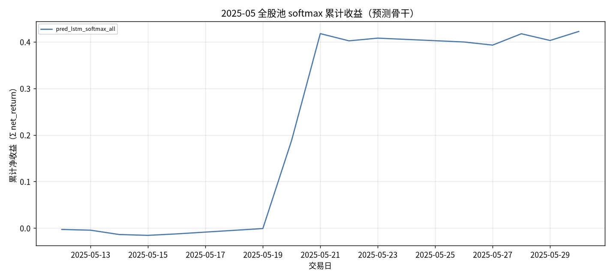

固定颜色: `pred_lstm_ew` `#4C78A8`。

### 组合基线累计收益

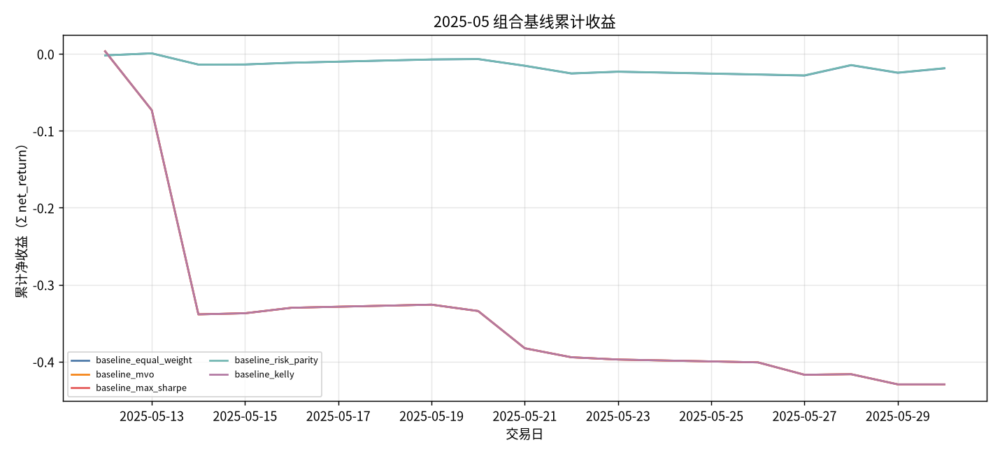

固定颜色: `baseline_equal_weight` `#4C78A8`；`baseline_mvo` `#F58518`；`baseline_max_sharpe` `#E45756`；`baseline_risk_parity` `#72B7B2`；`baseline_kelly` `#B279A2`。

### 生成模型累计收益

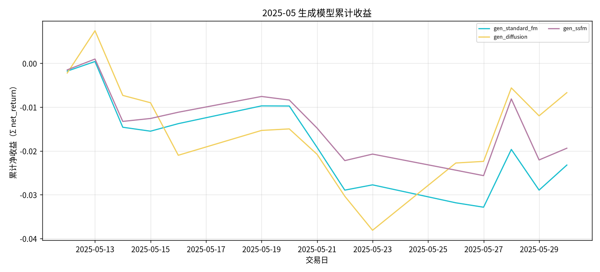

固定颜色: `gen_mlp` `#9D755D`；`gen_gaussian` `#BAB0AC`；`gen_standard_fm` `#17BECF`；`gen_diffusion` `#F2CF5B`；`gen_ssfm` `#B279A2`。

### RL 累计收益

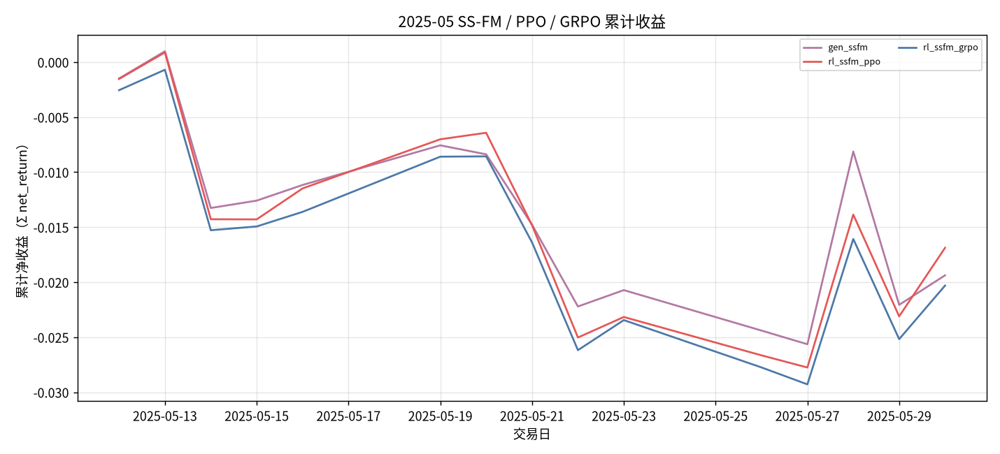

固定颜色: `gen_ssfm` `#B279A2`；`rl_ssfm_ppo` `#E45756`；`rl_ssfm_grpo` `#4C78A8`。

### G 曲线累计收益

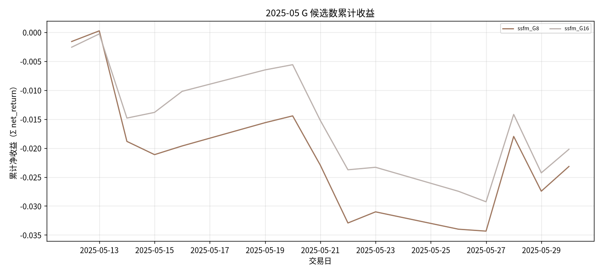

固定颜色: `ssfm_G8` `#9D755D`；`ssfm_G16` `#BAB0AC`。

### 日均换手

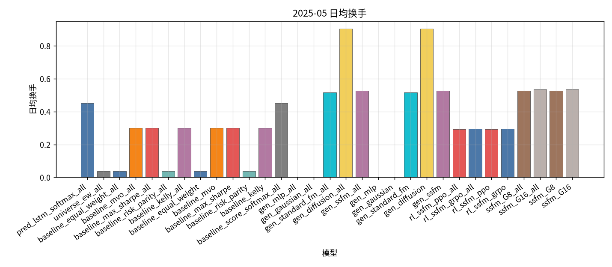

固定颜色: `pred_lstm_softmax_all` `#4C78A8`；`universe_ew_all` `#7F7F7F`；`baseline_equal_weight_all` `#4C78A8`；`baseline_mvo_all` `#F58518`；`baseline_max_sharpe_all` `#E45756`；`baseline_risk_parity_all` `#72B7B2`；`baseline_kelly_all` `#B279A2`；`baseline_equal_weight` `#4C78A8`；`baseline_mvo` `#F58518`；`baseline_max_sharpe` `#E45756`；`baseline_risk_parity` `#72B7B2`；`baseline_kelly` `#B279A2`；`baseline_score_softmax_all` `#7F7F7F`；`gen_mlp_all` `#9D755D`；`gen_gaussian_all` `#BAB0AC`；`gen_standard_fm_all` `#17BECF`；`gen_diffusion_all` `#F2CF5B`；`gen_ssfm_all` `#B279A2`；`gen_mlp` `#9D755D`；`gen_gaussian` `#BAB0AC`；`gen_standard_fm` `#17BECF`；`gen_diffusion` `#F2CF5B`；`gen_ssfm` `#B279A2`；`rl_ssfm_ppo_all` `#E45756`；`rl_ssfm_grpo_all` `#4C78A8`；`rl_ssfm_ppo` `#E45756`；`rl_ssfm_grpo` `#4C78A8`；`ssfm_G8_all` `#9D755D`；`ssfm_G16_all` `#BAB0AC`；`ssfm_G8` `#9D755D`；`ssfm_G16` `#BAB0AC`。

### Val IC

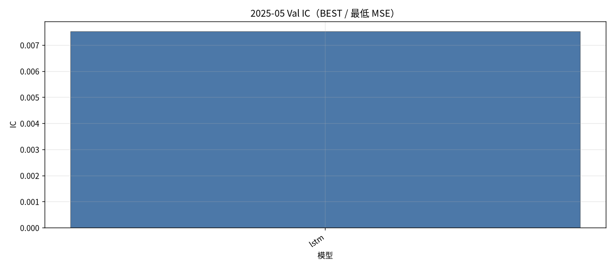

固定颜色: `lstm` `#4C78A8`。

### Val RankIC

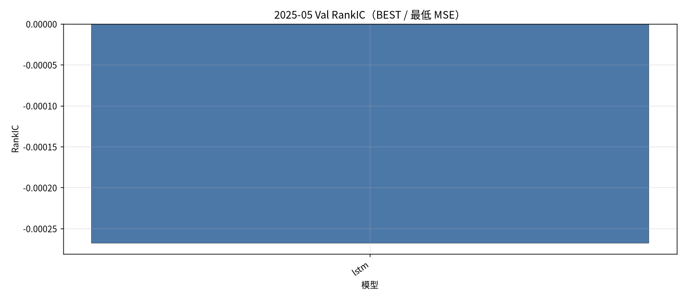

固定颜色: `lstm` `#4C78A8`。

### Val F1@Top30

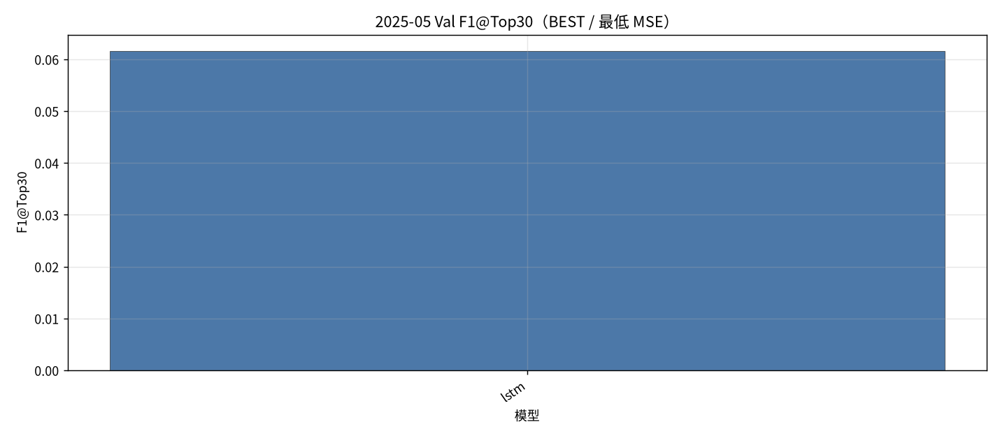

固定颜色: `lstm` `#4C78A8`。

### Val MSE

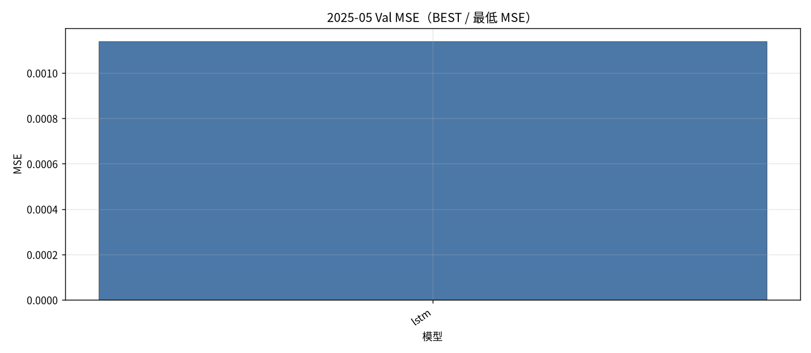

固定颜色: `lstm` `#4C78A8`。

### Val IC 各 epoch

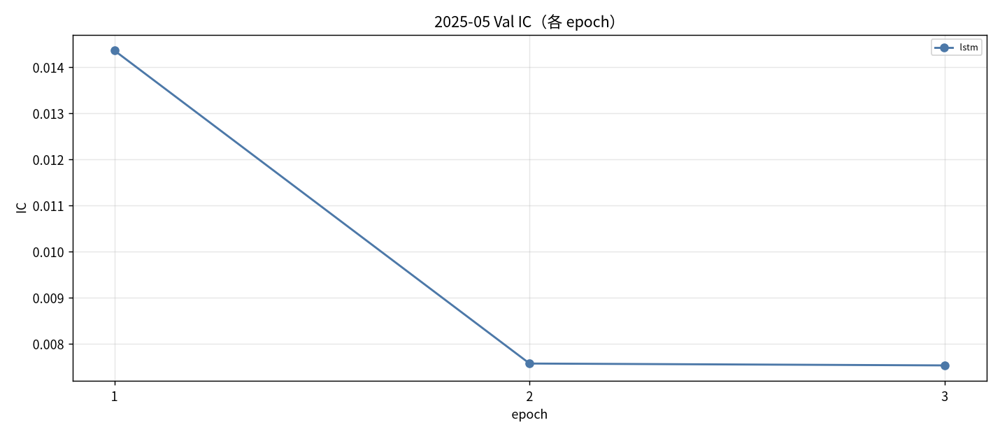

固定颜色: `lstm` `#4C78A8`。

### Val RankIC 各 epoch

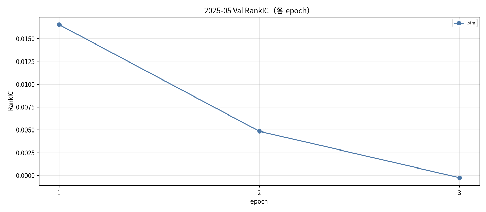

固定颜色: `lstm` `#4C78A8`。

### Val F1@Top30 各 epoch

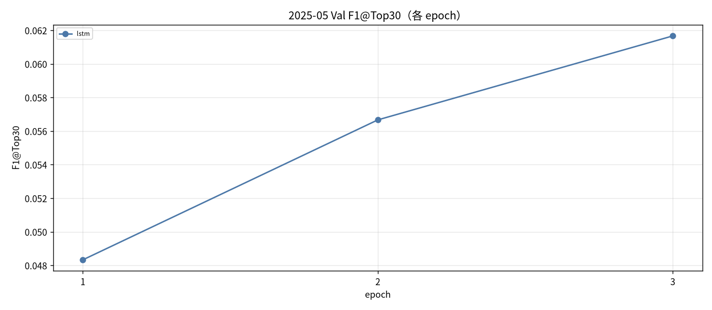

固定颜色: `lstm` `#4C78A8`。

### Val MSE 各 epoch

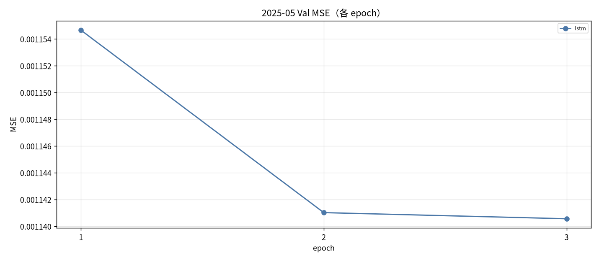

固定颜色: `lstm` `#4C78A8`。

### Test IC

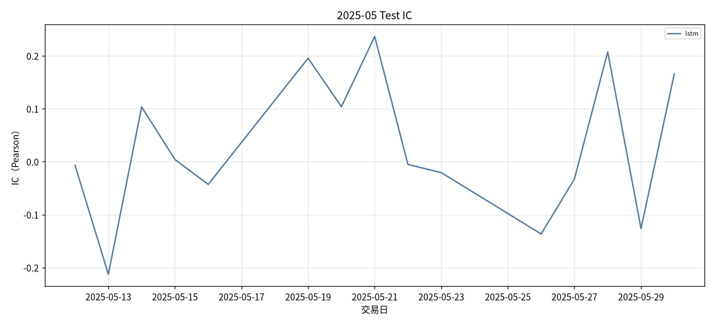

固定颜色: `lstm` `#4C78A8`。

### Test RankIC

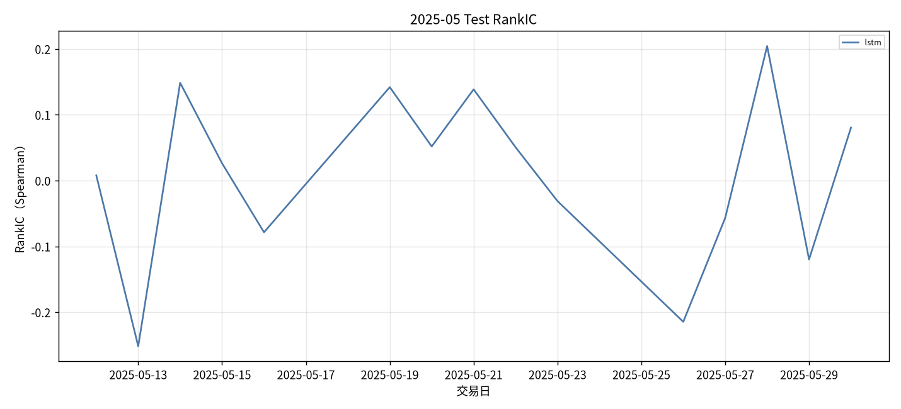

固定颜色: `lstm` `#4C78A8`。

### Test F1@Top30

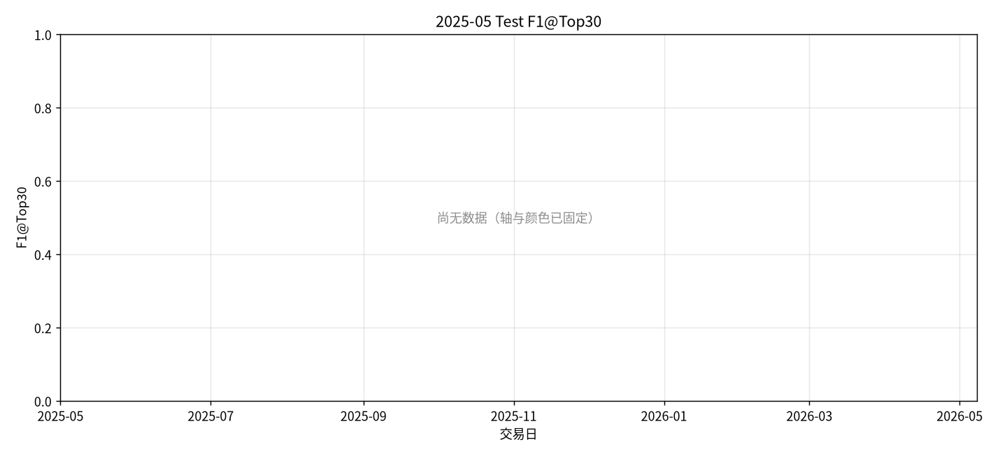

固定颜色: `lstm` `#4C78A8`。

### Test Hit@Top30

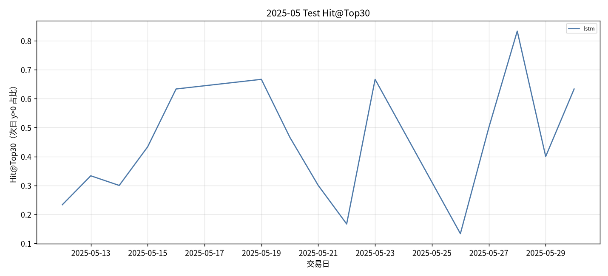

固定颜色: `lstm` `#4C78A8`。

## 图对应数据表

- 累计收益 ← `tables/backtest_daily.csv` 的 `net_return` 累加。
- 绩效 / 换手 ← `tables/performance_summary.csv`。
- Val ← `tables/val_best.csv`、`tables/val_epochs.csv`。
- Test 预测 ← `tables/prediction_metrics_mean.csv`。

## 分析

以下只讨论**已经写入数字**的行；单元格为 `-` 的表示该实验尚未跑完，不编造。
来源: month 2025-05。OOS=`sequential_oos_weekly_retrain`，费用=3.0bps，配权池=全股池（无 Top30）。

已有数据的对象: `lstm`, `equal_weight`, `mvo`, `max_sharpe`, `risk_parity`, `kelly`, `standard_fm`, `diffusion`, `ssfm`, `ssfm_ppo`, `ssfm_grpo`, `G=8`, `G=16`。
- Val IC 目前最高: `lstm` = 0.0075。
- Val F1@Top30 目前最高: `lstm` = 0.0617（随机约 0.06）。
- Val MSE 目前最低（入选口径）: `lstm` = 0.001141。
- Test 日均 IC 目前最高: `lstm` = 0.0288。
- 已回测净值目前最高: `baseline_score_softmax` 累计净收益 0.4223，Sharpe 6.2263。
- 实验 E（G 候选数，top30）累计净收益最高: `ssfm_G16` = -0.0202（G=8 -0.0232；G=16 -0.0202）。

## 实验 E：G 候选数

全股池。每个交易日加载当时周五生效的 primary / SS-FM，采 G 条权重后按 pred_utility 选 1 条。与默认 `gen_ssfm`（固定 default_g）不是同一条抽样路径。

| G | 累计净收益 | Sharpe | 最大回撤 | 日均换手 | 天数 |
| --- | --- | --- | --- | --- | --- |
| G=8 | -0.0232 | -3.0484 | 0.0346 | 0.5260 | 15 |
| G=16 | -0.0202 | -2.9373 | 0.0290 | 0.5332 | 15 |

本月网格里累计净收益最好的是 `ssfm_G16`。更大的 G 没有单调变好。
